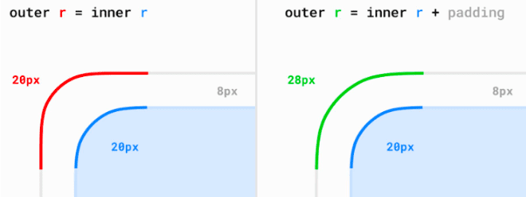
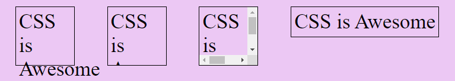
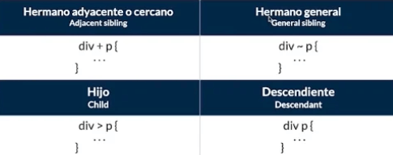
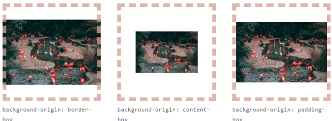
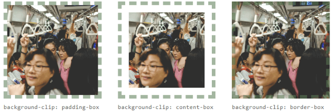
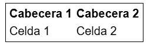
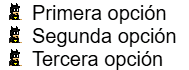
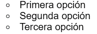
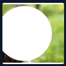
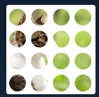

Grid areasAlineacion de elementos (items)Celdas irregularesElementos flexibles# CSS

CSS (Cascading Style Sheetes) en español "Hoja de estilo en cascada" es un lenguaje de diseño de estilado declartivo. Se usa para describir la presentación de un documento HTML.

## Contenido

- [Formas de aplicar estilos](#formas-de-aplicar-estilos)
  - [Archivo CSS externo](#archivo-css-externo)
  - [Bloque de estilos](#bloque-de-estilos)
  - [Estilos en línea](#estilos-en-linea)
- [Estructura CSS](#estructura-css)
- [Flujo CSS](#flujo-css)
- [Cascada en CSS](#cascada-en-css)
  - [Herencia](#herencia)
  - [Estructura](#estructura)
  - [Especificidad](#especificidad)
- [Unidades CSS](#unidades-css)
  - [Unidades absolutas](#unidades-absolutas)
  - [Unidades relativas](#unidades-relativas)
  - [Unidades del viewport](#unidades-del-viewport)
- [Modelo de caja](#modelo-de-caja)
  - [Tipos de elementos](#tipos-de-elementos)
  - [Propiedad border](#propiedad-border)
  - [Propiedad border-radius](#propiedad-border-radius)
  - [Bordes con gradientes](#bordes-con-gradientes)
  - [Propiedad margin](#propiedad-margin)
  - [Propiedad padding](#propiedad-padding)
  - [Propiedad box-sizing](#propiedad-box-sizing)
  - [Desbordamiento overflow](#desbordamiento-overflow)
- [Colores](#colores)
- [Variables](#variables)
- [Selectores](#selectores)
- [Selectores combinados](#selectores-combinados)
  - [Hermano adyacente o cercano +](#hermano-adyacente-o-cercano)
  - [Hermano general ~](#hermano-general)
  - [Hijo directo >](#hijo-directo)
  - [Descendiente](#descendiente)
  - [Combinadores lógicos](#combinadores-logicos)
- [Imágenes y fondos](#imagenes-y-fondos)
  - [Propiedad background-image](#propiedad-background-image)
  - [Opciones de imagen de fondo](#opciones-de-imagen-de-fondo)
  - [Fondos múltiples con background-image](#fondos-múltiples-con-background-image)
- [Visibilidad de elementos](#visibilidad-de-elementos)
- [Objetos en CSS](#objetos-en-css)
- [Gradientes o degradados](#gradientes-o-degradados)
- [Pseudoclases](#pseudoclases)
  - [Tipos de pseudoclases CSS](#tipos-de-pseudoclases-css)
  - [Pseudoclases de interaccion](#pseudoclases-de-interaccion)
  - [Pseudoclases de ubicacion](#pseudoclases-de-ubicacion)
  - [Pseudoclases de idiomas](#pseudoclases-de-idiomas)
  - [Pseudoclases de estructura](#pseudoclases-de-estructura)
  - [El primer y ultimo hijo](#el-primer-y-ultimo-hijo)
  - [Hijos específicos](#hijos-especificos)
  - [Hijos (del mismo tipo)](#hijos-del-mismo-tipo)
  - [Hijos específicos (del mismo tipo)](#hijos-específicos-del-mismo-tipo)
  - [Elementos unicos o sin hijos](#elementos-unicos-o-sin-hijos)
  - [Pseudoclases de formularios](#pseudoclases-de-formularios)
  - [pseudoclase :modal](#pseudoclase-modal)
  - [Pseudoclases para buscar o excluir elementos](#pseudoclases-para-buscar-o-excluir-elementos)
- [Pseudoelementos](#pseudoelementos)
  - [Pseudoelemento ::marker](#pseudoelemento-marker)
  - [Pseudoelemento ::backdrop](#pseudoelemento-backdrop)
  - [Pseudoelemento ::placeholder](#pseudoelemento-placeholder)
  - [Pseudoelemento ::file-selector-button](#pseudoelemento-file-selector-button)
  - [Contenido generado en CSS](#contenido-generado-en-css)
  - [Pseudoelementos tipograficos](#pseudoelementos-tipograficos)
  - [Pseudoelementos de resaltado](#pseudoelementos-de-resaltado)
- [Nesting](#nesting)
- [Fuentes y tipografias](#fuentes-y-tipografias)
  - [Bases de fuentes y tipografias](#bases-de-fuentes-y-tipografias)
  - [Decoraciones de texto](#decoraciones-de-texto)
  - [Distancia del trazo de decoración](#distancia-del-trazo-de-decoracion)
  - [Transformaciones de texto](#transformaciones-de-texto)
  - [Enfasis de texto](#enfasis-de-texto)
  - [Contorno en tipografias](#contorno-en-tipografias)
  - [Textos y alineaciones](#textos-y-alineaciones)
  - [Espaciado de texto](#espaciado-de-texto)
- [Representacion de datos](#representacion-de-datos)
  - [Tablas](#tablas)
  - [Listas](#listas)
- [Alinear y centrar con CSS](#alinear-y-centrar-con-css)
  - [Centrar horizontalmente](#centrar-horizontalmente)
  - [Centrar verticalmente](#centrar-verticalmente)
  - [Multicolumnas CSS](#multicolumnas-css)
  - [Separacion de columnas](#separacion-de-columnas)
  - [Distribucion entre columnas](#distribucion-entre-columnas)
- [Position](#position)
  - [Coordenadas de posicion](#coordenadas-de-posicion)
  - [Profundidad](#profundidad)
  - [Contexto de apilamiento](#contexto-de-apilamiento)
  - [Tipos de position](#tipos-de-position)
    - [Propiedad position: static](#propiedad-position-static)
    - [Propiedad position: relative](#propiedad-position-relative)
    - [Propiedad position: absolute](#propiedad-position-absolute)
    - [Propiedad position: fixed](#propiedad-position-fixed)
    - [Propiedad position: sticky](#propiedad-position-sticky)
- [Flex](#flex)
    - [Propiedad flex](#propiedad-flex)
    - [Propiedad flex-direction](#propiedad-flex-direction)
    - [Contenedor flex multilinea](#contenedor-flex-multilinea)
    - [Gap](#gap)
    - [Elementos flexibles](#elementos-flexibles)
    - [Alinear y centrar con Flex CSS](#alinear-y-centrar-con-flex-css)
    - [Alineacion multilinea](#alineacion-multilinea)
    - [Alineaciones especificas](#alineaciones-especificas)
- [Grid](#grid)
    - [Definir filas y columnas fijas](#definir-filas-y-columnas-fijas)
    - [Unidad fracción restante fr](#unidad-fraccion-restante-fr)
    - [Filas y columnas repetitivas](#filas-y-columnas-repetitivas)
    - [Celdas irregulares](#celdas-irregulares)
    - [Alinear con grid](#alinear-con-grid)
    - [Alineacion de elementos (items)](#alineacion-de-elementos-items)
    - [Alineacion de contenido (todo la cuadricula)](#alineacion-de-contenido-todo-la-cuadricula)
    - [Alineaciones especificas](#alineaciones-especificas)
    - [Grid areas](#grid-areas)
- [Interacciones](#interacciones)
    - [Cursor del raton](#cursor-del-raton)
    - [Barras de desplazamiento](#barras-de-desplazamiento)
    - [Scroll suave](#scroll-suave)
    - [Snap Scroll](#snap-scroll)
- [Sombras](#sombras)
    - [Sombras de texto](#sombras-de-texto)
    - [Sombras de caja](#sombras-de-caja)
    - [Sombas multiples](#sombas-multiples)
    - [Sombras identicas](#sombras-identicas)
- [Filtros](#filtros)
    - [Funciones de filtros](#funciones-de-filtros)
- [Mascaras y recortes](#mascaras-y-recortes)
  - [Propiedad clip-path](#propiedad-clip-path)
  - [Propiedad float](#propiedad-float)
  - [Propiedad shape-outside](#propiedad-shape-outside)
  - [Mascaras en css](#mascaras-en-css)
- [Funciones](#funciones)
  - [Funciones de tamaño y unidades](#funciones-de-tamaño-y-unidades)
- [Responsive Web Design](#responsive-web-design)
  - [Conceptos basicos](#conceptos-basicos)
  - [Bases del Responsive Design](#bases-del-responsive-design)
  - [Media Queries](#media-queries)
  - [Container Queries](#container-queries)
  - [Media querys mas usadas](#Media-querys-mas-usadas)
- [Transformaciones](#transformaciones)
  - [Translaciones 2D](#translaciones-2d)
  - [Rotaciones 2D](#rotaciones-2d)
  - [Escalado 2D](#escalado-2d)
  - [Transformaciones 3D](#transformaciones-3d)
  - [Perspectivas CSS](#perspectivas-css)
- [Animaciones](#animaciones)
  - [Transiciones](#transiciones)
  - [Animaciones](#animacion)
  - [Trayectos animados](#trayectos-animados)
  - [Animaciones dirigidas por scroll](#animaciones-dirigidas-por-scroll)
  - [View Transition](#view-transition)


---

## Formas de aplicar estilos

### Archivo CSS externo

En la cabecera de nuestro documento HTML, más concretamente en el bloque `<head>`, podemos incluir la etiqueta `<link>`.

```html
<!DOCTYPE html>
<html>
  <head>
    <title>CSS</title>
    <link rel="stylesheet" href="style.css">
  </head>
  ...
</html>
```

### Bloque de estilos

Otra de las formas que existen para incluir estilos CSS en nuestra página es añadirlos directamente en el documento HTML a través de una etiqueta `<style>` que contendrá el código CSS:

```html
<!DOCTYPE html>
<html>
  <head>
    <title>CSS</title>
    <style>
      div {
        background: hotpink;
        color: white;
      }
    </style>
  </head>
  ...
</html>
```

### Estilos en linea

La tercera forma de aplicar estilos en un documento HTML es el conocido como estilos en línea. Se trata de hacerlo directamente, a través del atributo `style` de la propia etiqueta donde queramos aplicar el estilo, colocando ahí las propiedades CSS.

```html
<h2 style="color: rebeccapurple;">Hola</h2>
```

---

## Estructura CSS

| Concepto | Descripción |
|----------|-------------|
|Selector|Elemento o elementos del documento que vamos a seleccionar para aplicarle un estilo concreto.|
|Propiedad|Característica principal que vamos a definir con el valor indicado a continuación.|
|Valor|Cada propiedad tiene una serie de valores concretos asignables, con los que tendrá uno u otro comportamiento..|
|Regla|Par de propiedad y su respectivo valor asociado.|


---

## Flujo CSS

### Flujo de bloque

El flujo de bloques es la dirección en la que se colocan los bloques de contenido. Por ejemplo, si hay dos `<div>`, el flujo de bloque irá desde arriba hacia abajo en el segundo `<div>`. Piensa en esto en el contexto de cajas una después de otra, de arriba hacia abajo.


### Flujo intercalado

El flujo intercalado es la forma en que fluye el texto en una oración. En un documento en inglés, el flujo intercalado es de izquierda a derecha. Si cambiaras el idioma del documento de tu página web al árabe `<html lang="ar">`, el flujo intercalado sería de derecha a izquierda.


---

## Cascada en CSS

### ¿Qué es la Cascada CSS?

Cuando hablamos de la Cascada CSS nos referimos al algoritmo (conjunto de reglas y normas) que tiene el navegador para aplicar estilos CSS a un elemento HTML. No es tan sencillo como se creee la mayoría cree, ya que pueden existir ambigüedades, y el navegador debe resolverlas para saber que estilo debe aplicar primero y cuál después.

En otras palabras la cascada es el orden como vamos a ver los estilos y como el navegador los aplica.


Unos de los confictos más comunes que nos encontraremos cuando apliquemos estilos es el siguiente:

```html
<p>Hola</p>
```

```css
p {
  color: #09f;
}

p {
  color: red; /* <- Al final este es el estilo que se aplica */
}
```

Para entender toda esta cantidad de información lo separaremos en varias categorías:

- **Herencia:** Los estilos CSS se pueden heredar y resetear.
- **Estructura:** Si hay un conflicto de estilos, depende mucho de la estructura CSS.
- **Especificidad:** Cuanto más específico un selector, mayor prioridad de aplicar estilos.
- **Alcance**: Podemos definir hasta donde queremos que se apliquen los estilos.

### Herencia

En CSS, el código que escribes y sus propiedades CSS se aplican al elemento que haces referencia en su selector. Sin embargo, existe un mecanismo denominado **Herencia** que permite que ciertas propiedades se puedan heredar de un elemento HTML hacia sus elementos HTML hijos.


Ten en cuenta la estructura del DOM (HTML) de la página. En CSS, si nosotros damos estilo a un elemento HTML, su hijo directo hereda el estilo del padre, salvo que le hayas indicado explícitamente otro estilo diferente. A continuación, ocurre lo mismo con el hijo del hijo, que hereda los estilos de su padre directo. Y así sucesivamente.

```html
html
  |
  +--- body
        |
        +--- .parent
                |
                +--- .child
```

#### Propiedades heredables

|Propiedad heredables|Descripción|
|--------------------|-----------|
|`color`|Establece el color de texto.|
|`font-family` `font-size` `font-style` `font-variant` `font-weight`|Establece el color de texto.|
|`text-align` `text-shadow` `text-overflow` `text-indent` `text-transform`|Propiedades relacionadas con el texto.|
|`word-spacing` `letter-spacing` `direction` `line-height` `white-space`|Propiedades especiales de texto.|
|`visibility`|Propiedad de visibilidad de un elemento.|
|`list-style-type`|Propiedad para viñetas de una lista.|


#### Forzar herencia

Por defecto algunas propiedades no se heredan como el border.

```html
<div class="container">
  Este el container
  <div class="child">Hola mundo</div>
</div>
```

```css
.container {
  color: #09f;
  font-size: 32px;
  border: 3px solid #09f;
}
```


Podemos forzar la herencia del elemento hijo con las siguientes valores:

|Valor |Descripción|
|--------------------|-----------|
|`initial`| Propiedad inicial, hereda todo.|
|`unset`| Resetea los valores, quita las propiedades heredables.|
|`revert`| Invierte los valores de la herencia.|
|`inherit`| Fuerza la herencia.|


```css
.container {
  color: #09f;
  font-size: 32px;
  border: 3px solid #09f;
}

.child {
  border: inherit;
  font-size: initial; /* unset, revert, inherit */
}
```


### Estructura

A la hora de escribir nuestro código CSS debemos tener claro que dicho código tiene una cierta estructura. Dependiendo de varios detalles de esa estructura, el código puede contener conflictos donde 2 o más elementos tienen estilos que se contradicen y el navegador debe saber resolver ese conflicto.


#### Conflictos de nombres CSS

#### Caso 1: Desde diferentes fuentes

Veamos el siguiente ejemplo. En él, podrás ver que se aplican estilos CSS al mismo elemento:

- 1️⃣ Aplicamos color azul desde el `<link>`
- 2️⃣ Aplicamos color rojo desde el `<style>`
- 3️⃣ Aplicamos color verde desde la propia etiqueta HTML mediante `style`.

```html
<html>
<head>
  <link rel="stylesheet" href="index.css">
  <!-- contiene un .text { background-color: blue; } -->
  <style>
    .text { background-color: red } /* estilo por el elemento style */
  </style>
</head>
<body>
  <div class="text" style="background-color: green"> <!-- estilo por el atributo style -->
    ¡Desde Manz.dev puedes ver mis streams!
  </div>
</body>
</html>
```

En este caso, tendría prioridad el estilo definido en la propia etiqueta HTML (estilo en línea), ya que el orden de prioridad es el siguiente:

1. 🟥 El atributo `style=""` del HTML (mayor prioridad).
2. 🟧 Bloque de estilos `<style>` en el HTML (prioridad intermedia).
3. 🟨 Archivo .css externo vía `<link rel="stylesheet">` (menor prioridad).

#### Caso 2: De fuentes del mismo tipo

Vamos con otro ejemplo. Supongamos ahora que nos encontramos en la misma fuente (por ejemplo, una hoja de estilos externa). Vamos a aplicar estilos a exactamente el mismo selector, en este caso, al elemento `.text`.

**Duda:** ¿Cuál de las dos propiedades `background-color` prevalece? Se refieren al mismo elemento por exactamente el mismo selector y están en la misma fuente de datos:

```html
<div class="text">Texto del elemento</div>
```

```css
.text {
  padding: 8px;
  background-color: red;
}

.text {
  background-color: grey;
  color: white;
}
```

**Respuesta:** Prevalece siempre la última regla definida (orden). Como el selector es exactamente el mismo, entonces el navegador mezcla los estilos de ambos bloques y se fusionan. El resultado final interpretado por el navegador (valor computado) sería el siguiente:

```css
.text {
  padding: 8px;             /* No hay conflicto, se añade */
  background-color: grey;   /* Hay conflicto: se sobreescribe la última */
  color: white;             /* No hay conflicto, se añade */
}
```

#### Caso 3: Diferente selector

Sin embargo, puede ocurrir que en determinados casos no esté tan claro cuál es el estilo que debería sobreescribir a los anteriores, porque tenemos selectores diferentes que se refieren al mismo elemento.

Por ejemplo, en este caso tenemos un elemento HTML con un `class` y con un `id`. Si a este código HTML le aplicamos el código CSS del bloque `<style>`, aunque los selectores sean diferentes, nos estamos refiriendo al mismo elemento, por lo que no resulta tan intuitivo como vimos al principio de este artículo:

```html
<div class="text" id="element">¡Hello from Manz.dev!</div>

<style>
#element {
  background: blue;
}

.text {
  background: red;
}
</style>
```

Aquí es cuando entra en juego el concepto de Especificidad CSS, en el que profundizaremos más adelante. Este concepto se encarga de eliminar la ambigüedad determinando cuál es el selector más específico que debería «vencer».

Para entenderlo mejor, veamos otro fragmento de CSS aplicado a la etiqueta HTML `<div>` anterior:

```html
<div id="element" class="text">Texto del elemento</div>

<style>
  div { background-color: red; }
  #element { background-color: steelblue; }
  .text { background-color: green; }
</style>
```

Si nos fijamos en el HTML, nuestro único `<div>` encaja con los tres selectores del CSS:

- 1️⃣ Es un `<div>` por lo que se le aplica el color rojo.
- 2️⃣ Tiene el `id` con valor `element`, por lo que se le aplica el color azul.
- 3️⃣ Tiene la `clase` con valor `text`, por lo que se le aplica el color verde.

Aunque puede que lo que nos resulte más natural es pensar que el estilo vencedor es el último definido, no funciona así.

El navegador analiza cuál es el selector más específico, para descubrir cuál es el vencedor:

- El selector `div` tiene especificidad **0,0,1** (es un elemento)
- El selector `#element` tiene especificidad **1,0,0** (es un id)
- El selector `.text` tiene especificidad **0,1,0** (es una class)

De estos tres selectores, el vencedor es el segundo (número más alto): el selector `#element`, ya que los elementos con `id` no se pueden repetir en un mismo documento, y son más específicos.

### Especificidad

La Especificidad CSS es una de las partes más importantes de la Cascada de CSS, y también de las más desconocidas. Aprender como el navegador calcula la especificidad y resuelve estos conflictos, te da la capacidad de entender como funciona CSS.


Además, estos conflictos son muy comunes en CSS, y existen formas mucho más limpias de resolverlos sin tener que recurrir a un `!important`, donde potencialmente añadimos problemas adicionales.

#### ¿Cómo se calcula la Especificidad?

Claro, aquí tienes un resumen del párrafo:

El navegador utiliza un sistema llamado **Especificidad CSS** para resolver conflictos entre reglas. Este sistema asigna un **valor numérico** a cada selector, siguiendo ciertas normas, y se representa con tres cifras: **A, B, C**. Cuanto mayor sea la especificidad, más prioridad tiene la regla.


|Valor|Descripción|
|-----|-----------|
|Valor **A** |Número de veces que aparece un `#id` en el selector.|
|Valor **B** |Número de veces que aparece una `.clase`, `[atributo]` o `:pseudoclase` en el selector.|
|Valor **C** |Número de veces que aparece un elemento o un `::pseudoelemento` en el selector.|


```code
!important          | 1, 0, 0, 0, 0
#ID                 | 0, 1, 0, 0, 0
Estilos en línea    | 0, 0, 1, 0, 0
.clases             | 0, 0, 0, 1, 0
Elementos           | 0, 0, 0, 0, 1
*Selector universal | 0, 0, 0, 0, 0
```

Al final, el selector con especificidad más alta es el que gana los selectores en conflicto que compite:

```css
div { ... }                   /* 0,0,1 (1 elemento HTML) */
div div { ... }               /* 0,0,2 (2 elementos HTML) */
#pagina div { ... }           /* 1,0,1 (1 id y 1 elemento HTML) */
#pagina div:hover { ... }     /* 1,1,1 (1 id, 1 pseudoclase y 1 elemento HTML) */
#pagina div:hover a { ... }   /* 1,1,2 (1 id, 1 pseudoclase y 2 elementos HTML) */
#pagina .sel:hover>a { ... }  /* 1,2,1 (1 id, 1 clase, 1 pseudoclase y 1 elemento HTML) */
```

> **Nota:** Si queremos saber más sobre que elemento o selector tiene mayor especificidad sobre otro podemos revisar la siguiente [Url](https://specificity.keegan.st/).


#### Excepciones de Especificidad CSS


|Excepción|Cómo se modifica la especificidad de su interior|
|---------|------------------------|
|Combinador **:is()**|Se suma la especificidad del selector más específico de la lista.|
|Combinador **:not()**|Usa la misma especificidad del selector que contiene.|
| Combinador **:has()**|Usa la especificidad base (10) más la del selector que contiene.|
|Combinador **:where()**|No importa el selector interno. Su especificidad siempre es 0.|

Veamos un fragmento de código para afianzar los conceptos de estos combinadores CSS :is(), :not(), :has() y :where() con los siguientes ejemplos:

```css
.container { }                       /* Especificidad: 0,1,0 */
.container .item { }                 /* Especificidad: 0,2,0 */

.container :is(.item, #unique) { }   /* 1,1,0 (#unique es el más específico) */
.container :not(.item) { }           /* 0,2,0 */
.container:has(.item) { }            /* 0,2,0 */
.container :where(.item) { }         /* 0,1,0 (solo cuenta el de fuera) */
```

### Ejemplo de especificidad

Aplicamos estilos al elemento `<p>` con diferentes selectores y como podemos ver, que existen elementos tachados cuyo estilos no se estan aplicando por la regla de la especificidad.


---

## Unidades CSS

En CSS necesitaremos utilizar tamaños. Para indicarlo de una forma apropiada, necesitaremos conocer las unidades que podemos utilizar en CSS para definir dichos tamaños. Existen multitud de unidades. Quizás las más populares son unidades como px (píxels) o % (porcentajes), entre muchas otras.

### Tipos de unidades

|Tipo de unidad|Unidades|Descripción|
|--------------|--------|-----------|
|Unidades absolutas|px, cm, mm, Q, in, pt, pc|Unidades estáticas o de tamaño fijo.|
|Unidades relativas|%|Unidades basadas en el tamaño del padre inmediato.|
||em, rem|Unidades basadas en el tamaño de una tipografía.|
||lh, rlh|Unidades basadas en en el interlineado.|
|Relativas al viewport|vw, vh, vmin, vmax, vi, vb|Unidades basadas en la región visible del navegador.|
||	svw, svh, svmin, svmax, svi, svb|Idem, en pantallas pequeñas (small viewport)|
||	lvw, lvh, lvmin, lvmax, lvi, lvb|Idem, en pantallas grandes (large viewport).|
||dvw, dvh, dvmin, dvmax, dvi, dvb|	Idem, en pantallas dinámicas (dynamic viewport).|
|Relativas al grid|fr|Unidad basada en la fracción restante (sólo para grids).|
|Unidades de dirección|deg, grad, rad, turn|Unidades para indicar una dirección.|
|Unidades de duración|s, ms|Unidades para indicar un tiempo concreto.|
|Unidades de frecuencia|hz, khz|Unidades para indicar una frecuencia.|
|Unidades de resolución|dpi, dpcm, dppx|Unidades para indicar resoluciones.|

### Unidades absolutas

Las unidades absolutas son un tipo de medida fija que no cambia, que no depende de ningún otro factor. Son ideales en contextos donde las medidas no varían como pueden ser en medios impresos (documentos, impresiones, etc...), pero son unidades poco adecuadas para la web moderna, donde necesitamos adaptarnos a diferentes resoluciones o pantallas.


### Unidades relativas

Las unidades relativas en CSS son más potentes y comunes que las absolutas, ya que se adaptan a factores como el tamaño del elemento padre o la tipografía. Aunque requieren más aprendizaje, son ideales para diseños flexibles en distintos dispositivos.


#### Em

Es una unidad relativa que depende del tamaño de fuente del elemento actual. Si usas `em` para definir una propiedad, se basa en el tamaño de la fuente del elemento en el que se encuentra.

```css
body {
  font-size: 16px;
}

p {
  font-size: 2em; /* El tamaño de fuente será 32px (16px * 2) */
}

.child {
  font-size: 1.5em; /* El tamaño será 48px (32px * 1.5) */
}
```


#### Rem

`rem` significa **root em**, y está basado en el tamaño de fuente de la raíz `<html>`. Es más predecible y consistente porque siempre se calcula en función del tamaño de fuente del html, sin importar el contexto del elemento donde se usa.

```css
html {
  font-size: 16px;
}

body {
  font-size: 1rem; /* 1rem será 16px (el tamaño de fuente en <html>) */
}

p {
  font-size: 2rem; /* El tamaño de fuente será 32px (16px * 2) */
}
```

Tabla de valores comunes de `rem`:


| Propiedad                    | Valor en `rem` | Equivalente en `px` (con base 16px) |
|------------------------------|----------------|-------------------------------------|
| **Fuente base**               | 1rem           | 16px                                |
| **Título 1 (h1)**             | 2rem           | 32px                                |
| **Título 2 (h2)**             | 1.5rem         | 24px                                |
| **Título 3 (h3)**             | 1.25rem        | 20px                                |
| **Título 4 (h4)**             | 1.125rem       | 18px                                |
| **Párrafo (p)**               | 1rem           | 16px                                |
| **Márgenes pequeños**         | 0.5rem         | 8px                                 |
| **Márgenes medianos**         | 1rem           | 16px                                |
| **Márgenes grandes**          | 2rem           | 32px                                |
| **Espaciado pequeño (padding)** | 0.25rem       | 4px                                 |
| **Espaciado medio (padding)**  | 0.75rem        | 12px                                |
| **Espaciado grande (padding)** | 1.5rem         | 24px                                |
| **Botón pequeño**             | 0.875rem       | 14px                                |
| **Botón grande**              | 1.25rem        | 20px                                |
| **Espaciado entre líneas (line-height)** | 1.5rem | 24px                                |
| **Bordes pequeños**           | 0.125rem       | 2px                                 |
| **Bordes gruesos**            | 0.375rem       | 6px                                 |


```css
/* variables para font-size */
:root {
  --fs-3xs: 0.5rem;     /*  8px */
  --fs-2xs: 0.625rem;   /* 10px */
  --fs-xs: 0.75rem;     /* 12px */
  --fs-sm: 0.875rem;    /* 14px */
  --fs-md: 1rem;        /* 16px */
  --fs-lg: 1.125rem;    /* 18px */
  --fs-xl: 1.25rem;     /* 20px */
  --fs-2xl: 1.375rem;   /* 22px */
  --fs-3xl: 1.5rem;     /* 24px */
}
```


#### Diferencias clave entre em y rem:

`em`: Se basa en el tamaño de fuente del elemento padre.

`rem`: Se basa en el tamaño de fuente de la raíz del documento `<html>`.

#### ¿Cuándo usar em y rem?

`em`: Es útil cuando deseas que el tamaño de los elementos se ajuste de manera jerárquica o relativa al contenedor donde se encuentran (por ejemplo, dentro de un componente específico).

`rem`: Es útil cuando quieres mantener una relación constante con el tamaño base del documento, lo cual es ideal para diseños más consistentes y accesibles.


### Unidades del viewport

Las unidades de nueva generación en CSS, basadas en el viewport, permiten asignar valores proporcionales al tamaño visible de la ventana del navegador. Al usar unidades precedidas por `v`, se hace referencia a un porcentaje del ancho o alto del viewport, facilitando diseños adaptables.

|Unidad|Significado|Medida aproximada|
|------|-----------|-----------------|
|`vw`|viewport width|1vw = 1% del ancho del navegador|
|`vh`|	viewport height|	1vh = 1% del alto del navegador|
|`vmin`|viewport minimum|1vmin = 1% del alto o ancho (el mínimo)|
|`vmax`|viewport maximum|1vmax = 1% del alto o ancho (el máximo)|


#### Uso de medidas relativas `%` `vw, wh`

En los proximos ejemplos veremos como ajustar elementos con respecto al tamaño de la pantalla del navegador. 

#### Caso 1

Por si solo los elementos en bloques (veremos este tema más adelante) no tienen medidas de ancho o alto definimos más allá del que traen por defecto que suele ser el 100% de su ancho.

```html
<body> <!-- contenedor padre -->
  <main> <!-- contenedor hijo -->
    <p>hola</p>
  </main>
</body>
```

```css
body {
  background: violet;
}

main {
  color: whitesmoke;
  background: slateblue;
  /* width: 100%; */
  height: 50%;
}
```

Si comentamos el `width` del elemento `<main>` su ancho sigue siendo el mismo, es decir el `100%`. 


Pero si cambiamos el porcentaje del `width` su tamaño cambiará. 

```css
main {
  color: whitesmoke;
  background: slateblue;
  width: 50%; /* Tamaño de ancho de un elemento. */
  height: 50%; /* Tamaño del alto de un elemento. */
}
```

Ahora el `width` ocupa el `50%` de su contenedor padre `<body>`.


Por otra parte el `height` aunque tiene el `50%` y el pongamos otro porcentaje su tamaño **NO** cambia.

Esto se debe a que el `%` es una medida relativa al contenedor padre en este caso es el `<body>` el cual no tiene definido un `height`.

Para arreglar esto podemos usar la medida relativa del viewport: `vw` o `vh` que representa el ancho y el alto de la vista de la pantalla.

```css
main {
  color: whitesmoke;
  background: slateblue;
  width: 50vw; /* 50% del ancho de la vista de la pantalla */
  height: 50vh; /* 50% del alto de la vista de la pantalla */
}
```


Si ponemos que el `height` tenga `100vh` notamos que nos genera scroll, esto se debe a que los elementos tienen ciertos estilos por defecto como el margen. 

Entonces `100vh` + `margin` = scroll.

Para solucionar esto tenemos que resetear algunos estilos que vienen por defecto.

```css
* {
  box-sizing: border-box;
  margin: 0;
  padding: 0;
  outline: 1px solid red; /* esta propiedad nos permite hacer debugging; es opcional */
}
```

#### Caso 2

Podemos limitar el crecimiento de los elementos respecto al viewport tanto en su `width` y su `height`.

Para esto usamos las medidas de `max-width`, `min-width` / `max-height`, `min-height`.

```css
main {
  width: 70%;/*poner siempre un valor en % sí vamos a trabajar con mi-max widht/height */
  min-width: 300px; /* establece un min de anchura */
  max-width: 450px; /* establece un máximo de anchura */
  min-height: 500px; /* establece un min de altura, al altura puede crecer */
  margin: 0% auto; /* centra el contenedor */
  background-color: slateblue;
  color: whitesmoke;
}
```


---

## Modelo de caja

Cuando hablamos del modelo de cajas en CSS, estamos haciendo referencia a un sistema que tiene el navegador de interpretar las diferentes partes de lo que solemos denominar **caja**: un elemento HTML con unas ciertas dimensiones.

### Propiedades del modelo de cajas

- **borde:** en negro, es el límite que separa el interior del exterior del elemento.
- **márgen:** naranja, es la parte exterior del elemento, por fuera del borde.
- **relleno o padding:** en verde, es la parte interior del elemento, entre el contenido y el borde.
- **contenido:** en azul, es la parte interior del elemento, excluyendo el relleno.


### Zonas de un elemento

En CSS existen ciertas palabras clave para hacer referencia a una zona u orientación concreta sobre un elemento.


### Tipos de elementos


### Propiedad `border`

En CSS es posible especificar el aspecto que tendrán los bordes de cualquier elemento HTML, pudiendo incluso, dar diferentes características a zonas particulares del borde, como por ejemplo, el borde superior, el borde izquierdo, el borde derecho o el borde inferior.

|Propiedad|Valor|Significado|
|---------|-----|-----------|
|`border-width`|thin / medium / thick|Especifica un tamaño predefinido para el grosor del borde.|
|`border-width`|`size`|Especifica un tamaño específico para el grosor del borde.|
|`border-style`|none `style`|	Define el estilo para el borde a utilizar (ver más adelante).|
|`border-color`|black `color`|Especifica el color que se utilizará en el borde.|
|`border`|`size` `style` `color`|Propiedad de atajo para simplificar valores.|

#### Atajo: Propiedad `border`

```css
.element {
  border-width: 1px;
  border-style: solid;
  border-color: #000000;

  /* Equivalente a... */
  border: 1px solid #000;
}
```

### Propiedad `border-radius`

Para agregar esquinas redondeadas a un cuadro, usa la propiedad `border-radius`.

|Propiedad|Valor|Significado|
|---------|-----|-----------|
|`border-radius`|`size`|1 parámetro. Aplica el radio a todas y cada una de las esquinas.|
||`size` `size`|2 parámetros: top-left + bottom-right y a top-right + bottom-left.|
||`size` `size` `size`|3 parámetros: top-left, a top-right y bottom-left y a bottom-right.|
||`size` `size` `size` `size`|	4 parámetros. Orden de las agujas del reloj, empezando por top-left.|

```css
.element {
  border-radius: 25px;              /* 1 parámetro */
  border-radius: 25% 50%;           /* 2 parámetros */
  border-radius: 50px 25px 10px;    /* 3 parámetros */
  border-radius: 25px 0 15px 50px;  /* 4 parámetros */
}
```


#### Esquinas redondeadas específicas

Al igual que con las otras propiedades del borde, puedes definir el radio del borde de cada lado con:

- `border-top-left-radius`
- `border-top-right-radius` 
- `border-bottom-right-radius`
- `border-bottom-left-radius`


#### Esquinas perfectas




#### Borde vs Outline

- `border`: Es el border del contenido, da salto porque modifica el contenido de la caja.
- `outline`: Dibuja un contorno encima del contenido, no da salto.

```css
a:hover {
  outline: 3px solid red;
}
```


>**Nota:** Si queremos usar un efecto `:hover` podemos usar `outline` en vez del border.

### Bordes con gradientes

Eliminamos el fondo con none y establecemos el color de texto a blanco. Ahora, vamos a añadir las propiedades de la técnica 9-slice, que es con las que podremos darle un gradiente:

- Con `border-image-source` se suele dar una imagen. Como CSS puede usar gradientes en donde se pueden usar imágenes, añadimos un gradiente lineal, con tres colores.
- Con `border-image-slice` se indica que el borde usará el gradiente completo. Se puede abreviar a 1.
- Con `border-image-width` se indica el tamaño del gradiente.

```html
<button>Texto del botón</button>
<button class="fill">Texto del botón (relleno)</button>
```

```css
body {
  background: #111;
}

button {
  font-family: Jost, sans-serif;
  font-size: 1rem;

  padding: 1rem 2rem;
  background: none;
  color: #fff;

  border-image-source: linear-gradient(indigo, purple, hotpink);
  border-image-slice: 1 1 1 1;
  border-image-width: 0.25rem;

  &.fill {
    border-image-slice: 1 1 1 1 fill;
  }
}
```


Observa que el segundo botón le hemos establecido un valor 1 1 1 1 fill, esto se comporta exactamente igual que 1 1 1 1, pero sin descartar el relleno, por lo que pinta también el interior.

>**Nota:** La propiedad `border-image-source` sólo soporta una imagen. No se le pueden establecer múltiples imágenes.

### Propiedad `margin`

El tamaño de dichos márgenes se puede alterar en conjunto (de forma general) o de forma específica a cada una de las zonas del elemento (izquierda, derecha, arriba o abajo). Veamos primero las propiedades específicas para cada zona:

|Propiedad|Valor|Significado|
|---------|-----|-----------|
|`margin-top`|auto / `size`|Establece un tamaño de margen superior.|
|`margin-left`|auto / `size`|Establece un tamaño de margen a la izquierda.|
|`margin-right`|auto / `size`|Establece un tamaño de margen a la derecha.|
|`margin-bottom`|auto / `size`|Establece un tamaño de margen inferior.|

Podemos aplicar diferentes márgenes a cada zona de un elemento utilizando cada una de estas propiedades, o dejando al nevegador que lo haga de forma automática indicando el valor auto.

>**Nota:** Hay que recordar diferenciar bien un `margin` de un `padding`, puesto que no son la misma cosa. Los rellenos (`padding`) son los espacios que hay entre los bordes del elemento en cuestión y el contenido del elemento (por la parte interior). Mientras que los márgenes (`margin`) son los espacios que hay entre los bordes del elemento en cuestión y los bordes de otros elementos (parte exterior).

#### El Margin Collapse

CSS tiene varios mecanismos de maquetación. Los más básicos son `inline` y `block`, y en ellos, ocurre la siguiente situación. Imaginemos que tenemos dos elementos adyacentes, y cada uno de ellos, tiene un margen de 20px definido.

Quizás, lo más intuitivo es pensar que que el elemento de la izquierda tiene 20px de margen derecho, mientras que el elemento de la derecha tiene 20px de margen izquierdo, que al sumarse, predecimos que resultará un tamaño de 40px. Sin embargo, la realidad es distinta:


### Propiedad `padding`

Al igual que con los márgenes, los padding tienen varias propiedades para indicar el relleno de cada zona:

|Propiedad|Valor|Significado|
|---------|-----|-----------|
|`padding-top`|0 / `size`|Aplica un relleno interior en el espacio superior de un elemento.|
|`padding-left`|0 / `size`|Aplica un relleno interior en el espacio izquierdo de un elemento.|
|`padding-right`|0 / `size`|Aplica un relleno interior en el espacio derecho de un elemento.|
|`padding-bottom`|0 / `size`|Aplica un relleno interior en el espacio inferior de un elemento.|

#### ¿Cómo usar el atajo en margin y padding?

Al igual que en otras propiedades de CSS, también existe una propiedad de atajo denominada `margin` y `padding`. Con estas propiedades evitamos tener que escribir los valores de cada parte (izquierda, derecha, arriba, abajo...), especialmente importante si es el mismo valor en las cuatro.

```css
.examples {
  margin: 15px;
  /* 
  1 parámetro. Aplica el mismo margen a todos los lados.
  Equivalente a margin: 15px 15px 15px 15px; 
  */

  margin: 20px 10px;
  /*
  2 parámetros. Aplica margen top/bottom y left/right.
  Equivalente a margin: 20px 10px 20px 10px; 
  */

  margin: 20px 10px 5px;
  /* 
  3 parámetros. Aplica margen top, left/right y bottom.
  Equivalente a margin: 20px 10px 5px 10px; 
  */

  margin: 20px 10px 5px 10px;
  /* 
  4 parámetros. Aplica margen top, right, bottom e left.
  Equivalente a margin: 20px 10px 5px 10px; 
  */
}
```

#### Ejemplo de padding y border

Veamos un ejemplo de como funciona el `padding` y `border` y como influye en el tamaño real de la caja.

```html
<section class="container">
  <p>hola</p>
</section>
```

```css
.container {
  width: 100px;
  height: 100px;
  background: white;
  padding: 20px 10px 5px;
  border: 10px solid;
}
```
El `padding` corresponde al color verde en la imágen:


Si vemos en las herramientas de desarrollo del navegador e inspeccionamos el elemento podemos ver como se aplican los valores del `padding` y el `border`.


Por último, del mismo modo podemos saber el tamaño real del elemento (caja) donde se suman el `padding` y el `border`.


>**Nota:** Si le colocamos valores al `margin` este **NO** influye en el tamaño de la caja.

### Propiedad `box-sizing`

Por defecto, el modelo de cajas de CSS sigue un esquema donde al dar un tamaño a un elemento, concretamente se le da tamaño a su contenido (rosa, en la imagen). Sin embargo, si además le añadimos un borde (border) y/o un relleno (padding), se sumará al tamaño del contenido.


En CSS, existe una propiedad denominada `box-sizing` que permite alterar esta versión del modelo de cajas. Lo explicado en el ejemplo anterior es el funcionamiento por defecto del modelo de cajas de CSS, donde la propiedad box-sizing tiene el valor content-box.

|Valor|Descripción|
|-----|-----------|
|`content-box`|Las propiedades width y height no incluyen borde, relleno y/o margen. Valor por defecto.|
|`border-box`|Las propiedades width y height incluyen el borde y relleno.|


>**Nota:** Se recomientda usar `box-sizing: border-box` para nuestra página web.

### Desbordamiento `overflow`

Cuando se fija un tamaño específico a un elemento que es más pequeño que su contenido, se produce un **desbordamiento en CSS**, ya que el contenido no tiene suficiente espacio para mostrarse por completo.


Para controlar estos casos, tenemos a nuestra disposición la propiedad overflow en CSS, donde podremos definir el comportamiento adecuado.

#### Valores de overflow

|Valor|Descripción|
|-----|-----------|
|`visible`|Se muestra el contenido que sobresale (comportamiento por defecto).|
|`hidden`|Se oculta el contenido que sobresale..|
|`scroll`|Se colocan barras de desplazamiento (horizontales y verticales).|
|`auto`|Se colocan barras de desplazamiento (sólo las necesarias).|
|`width/height: max-content`|Aajusta el ancho y el alto al tamaño del contenido.|

```css
.awesome {
  width: 100px;
  height: 100px;
  font-size: 35px;
  border: 1px solid;
  padding: 5px;
}

.awesome:nth-child(2){
  overflow: hidden; /* oculta el contenido */
}
.awesome:nth-child(3){
  overflow: scroll; /* crea scroll para ver el contenido */
}
.awesome:last-child{
  width: max-content; /* ajusta el ancho y el alto al tamaño del contenido */
  height: max-content; /* ajusta el ancho y el alto al tamaño del contenido */
}
```



Si tenemos contenido de solo texto como los anteriores ejemplos podemos usar la propiedad `text-overflow: ellipsis`

```css
.container {
  overflow: hidden;
  text-overflow: ellipsis;
}
```

Esta propiedad no corta de golpe el texto, si no que le da unos puntos suspensivo.


---

## Colores

Uno de los primeros cambios de estilo que hacemos cuando aprendemos CSS es hacer variaciones en los colores de primer plano y de fondo de un documento HTML

### Propiedades de color

|Propiedad|Valor|Significado|
|---------|-----|-----------|
|`color`|color|Cambia el color del texto que está en el interior de un elemento.|
|`background-color`|color|	Cambia el color de fondo de un elemento.|

```html
<p class="element">hola</p>
```

```css
.element {
  width: 100px;
  height: 100px;
  background-color: indigo; /* Color de fondo */
  color: white; /* Color de texto */
}
```


### Formas de aplicar colores

```css
h1 {
  color: rgba(red, green, blue, alpha);
  color: rgb(red, green, blue);
  color: hsl(hue, saturation, lightness);
  color: oklch(lightness chroma hue);
  color: #09f; /*hexadecimal*/
}
```

### Palabras clave de color

Otra forma de aplicar colores es usando la herencia con el valor `currentColor` que toma el color del contenedor padre.

```css
h2 {
  border: 3px solid currentColor;
}
```

Otro valor que podemos usar como palabra clave es la de `transparent` que establece un color completamente transparente (valor por defecto de `background-color`).

---

## Variables

Las variables nos permiten guardar valores para usarlas en diferentes partes y reducir el exceso de código en css.

### Definir o crear variables CSS

Para crear una custom property haremos uso de los dos guiones -- como prefijo al nombre que vamos a utilizar. En este caso, hemos creado una variable CSS llamada --background-color, al que le hemos asignado el valor black, que es un color:

```css
:root {
  --background-color: black; /* valor del color */
}
```

Observa que en este caso, hemos establecido la variable dentro del selector con pseudoclase **:root**. Esta pseudoclase **:root** hace referencia al elemento raíz del documento, es decir, al elemento `<html>`. La diferencia entre utilizar html o **:root** como selector es que este último tiene algo más de especificidad CSS. Mientras el selector html tiene **(0,0,1)**, **:root** tendría **(0,1,0)**.

### Utilizar una variable CSS

```css
:root {
  --background-color: indigo;
}

body {
  background: var(--background-color);
}
```

Otro ejemplo de como usar las variables:

```css
:root {
    --primary-color: #003476;
    --secundary-color: #b4d2f7;
    --header-size: 4rem;
    --font: 1.8rem;
}
```

---

## Selectores

En CSS tenemos varias formas de seleccionar elementos:


### Selector directo por elemento `<p>`

Selecciona el elemento usando directamente la etiqueta HTML.

```html
<p>Hola</p>
```

```css
p {
  color: red;
}
```

### Selector por clases `.`

Usamos el atributo `class` en las etiquetas HTML, esta clase se puede repetir en los elementos que queramos y los estilos se aplicarán a todos los elementos que tengan esa clase.

```html
<p class="parrafo">Hola</p>
```

```css
.parrafo {
  color: blue;
}
```

### Selector por id `#`

Este selector se usa para identificar elementos únicos, es decir el atributo `id` del elemento NO puede repetirse en otro elemento HTML.

```html
<p id="texto">Hola</p>
```

```css
#texto {
    color: green;
}
```

### Selector por atributos `type`

Podemos buscar elementos que tengan un determinado atributo HTML. Puede indicarle a CSS que busque atributos si encierra el selector entre corchetes cuadrados ([ ]).

```html
<div data-type="primary"></div>
```

```css
[data-type='primary'] {
color: red;
}
```

También en lugar de buscar un valor específico de `data-type`, podemos buscar elementos que presenten el atributo, independientemente de su valor.

```html
<div data-type="primary"></div>
<div data-type="secondary"></div>
```

```css
[data-type] {
color: red;
}
```

Junto con los operadores de casos, tiene acceso a los operadores que buscan porciones coincidentes de cadenas dentro de los valores de los atributos.

```css
/* Un href que contiene "example.com" */
[href*='example.com'] {
  color: red;
}
/* Un href que comienza con https */
[href^='https'] {
  color: green;
}
/* Un href que termina con .com */
[href$='.com'] {
  color: blue;
}
```

### Selector universal `*`

El selector universal puede ser muy útil en algunos casos para resetear ciertas propiedades de todo un documento, como en el siguiente ejemplo, donde se eliminan los márgenes de todos los elementos del documento HTML, puesto que algunos navegadores ponen márgenes diferentes y esto puede producir ciertas inconsistencias en los diseños:

```css
/* Elimina márgenes y rellenos de todos los elementos de un documento HTML */
* {
  margin: 0;
  padding: 0;
  box-sizing: border-box;
}
```

---

## Selectores combinados 

Los selectores combinados nos permiten usar múltiples selectores y crear una mayor especificidad.



### Hermano adyacente o cercano

Aplica estilos solo a los elementos `<span>` que esten inmediatamente despúes del elemento `<p>`.

```html
<span>span</span>

<p>p</p>

<span>span</span> <!-- rojo -->

<p>p</p>

<footer>
  <p>p</p>
  <span>span</span> <!-- rojo -->
  <span>span</span>
  <p>p</p>
</footer>

<p>p</p>
```

```css
p + span {
  color: red;
}
```


```css
div.post span + span {
  background-color: gold;
}
```


### Hermano general

Aplica estilos a todos los elementos `<span>` que este despúes del elemento `<p>`.

```html
<span>span</span>

<p>p</p>

<span>span</span> <!-- azul -->

<p>p</p>

<footer>
  <p>p</p>
  <span>span</span> <!-- azul -->
  <span>span</span> <!-- azul -->
  <p>p</p>
</footer>

<span>span</span> <!-- azul -->

<p>p</p>
```

```css
p ~ span {
  color: blue;
}
```


```css
div.post strong ~ strong {
  background-color: gold;
}
```


### Hijo directo

Aplica estilos a todos elementos `<p>` que son hijos directo del elemento `<article>`.

```html
<article>

  <span>span</span>

  <p>p</p> <!-- verde -->

  <span>span</span>

  <p>p</p> <!-- verde -->

  <footer>
    <p>p</p>
    <span>span</span>
    <span>span</span>
    <p>p</p>
  </footer>

  <span>span</span>

  <p>p</p> <!-- verde -->

</article>
```

```css
article > p {
  color: green;
}
```


```css
#page > div {
  background-color: gold;
}
```


### Descendiente

Aplica estilos a todos los elementos `<p>` que esten dentro del elemento `<article>`.

```html
<article>

  <span>span</span>

  <p>p</p> <!-- naranja -->

  <span>span</span>

  <p>p</p> <!-- naranja -->

  <footer>
    <p>p</p> <!-- naranja -->
    <span>span</span>
    <span>span</span>
    <p>p</p> <!-- naranja -->
  </footer>

  <span>span</span>

  <p>p</p> <!-- naranja -->

</article>
```

```css
article p {
  color: orangered;
}
```


```css
div#page div {
  background-color: gold;
}
```


### Combinadores logicos

En ciertas situaciones, es posible que queramos crear grupos con diferentes selectores con el objetivo de escribir menos código, o reutilizar bloques de código CSS en más situaciones, de forma que sean más potentes y flexibles.

La forma más sencilla de conseguir esto, es crear agrupaciones con diferentes selectores separando por **comas**.

#### Agrupación de selectores

Imagina una situación en la que varios bloques de código CSS contienen las mismas propiedades con los mismos valores. Generalmente, escribir cada bloque de forma individual no es apropiado, ya que duplica un código que es exactamente igual:

```css
.container-logo {
  border-color: red;
  background: white;
}

.container-alert {
  border-color: red;
  background: white;
}

.container-warning {
  border-color: red;
  background: white;
}
```

Si esto ocurre a menudo, el tamaño del documento CSS será más grande y tardará más en descargarse. Una buena práctica para evitarlo es ahorrar texto y simplificar nuestro documento CSS lo máximo posible, por lo que podemos hacer uso de la agrupación CSS utilizando el símbolo de la coma.

```css
.container-logo, .container-alert, .container-warning {
  border-color: white;
  background: red;
}
```


>**Nota:** Existen más tipos de combinadores lógicos, pero estos entra en la categoría de `:pseudoclases` que veremos más adelante.


### Resumen de los selectores combinados


---

## Imagenes y fondos

### Propiedad `background-image`

En el caso de querer utilizar imágenes de fondo, como ya hemos dicho, utilizaremos la propiedad background-image y en el valor, el nombre de la imagen (o la dirección URL donde está alojada), siempre rodeada del texto url().

|Valor|Significado|
|-----|-----------|
|`none`|No utiliza ninguna imagen de fondo.|
|url("imagen.jpg")|Usa la imagen indicada como fondo.|
|image-set(...)|Indica una imagen con fallbacks.|
|`gradient`|	Utiliza un gradiente de tipo lineal, radial o cónico.|

Para usar la propiedad de `background-image` tenemos usar un contenedor, ya que como su nombre indica estas imágenes se usan como fondos.

```html
<section class="box-img">
  ...
</section>
```

El contenedor tiene que tener medidas definidas.

```css
.box-img {
  width: 300px;
  height: 300px;
  background-image: url(img/asuka-img.webp);
  border: 5px solid red;
}
```


Podemos usar varias imágenes, siendo la primera la imágen que sale al frente y la la segunda la imágen de fondo.

```css
.box-img {
  background-image:
    url("/shared-assets/images/examples/lizard.png"), /* 1ra: imágen del frente */
    url("/shared-assets/images/examples/star.png");   /* 2da: imágen del fondo  */
}
```


Por último tambien podemos usar esta propiedad con gradientes.

```css
.box-img {
  background-image:
  linear-gradient(rgba(0, 0, 255, 0.5), rgba(255, 255, 0, 0.5)),
  url("/shared-assets/images/examples/lizard.png");
}
```


#### Diferencia entre usar la etiqueta `` en HTML y la propiedad `background-image` en CSS


| **Característica**              | **`` (HTML)**                                    | **`background-image` (CSS)**                        |
|----------------------------------|-------------------------------------------------------|----------------------------------------------------|
| **Propósito**                    | Incluir imágenes como parte del contenido.            | Usar imágenes como fondos decorativos.             |
| **Accesibilidad**                | Permite el atributo `alt`, importante para SEO y accesibilidad. | No es accesible a través de texto alternativo.      |
| **Impacto en el flujo del contenido** | Ocupa espacio en el diseño, afectando el layout.      | No afecta directamente el flujo del contenido.     |
| **Interactividad**               | Se puede hacer interactiva (ej. imágenes clicables).  | No es interactiva (solo decorativa).               |
| **Control de la imagen**         | Control de tamaño y visualización mediante atributos como `width`, `height`. | Control de visualización mediante `background-size`, `background-position`. |
| **Uso típico**                   | Imágenes que deben ser vistas y tener contexto.       | Fondos, patrones de fondo, imágenes de diseño.      |


#### ¿Cuándo usar cada uno?

- Usar ``: Cuando la imagen es parte del contenido principal, por ejemplo, en una galería, foto de perfil, logo o cualquier otra imagen que debe ser indexada o accesible.

- Usar `background-image`: Para imágenes que se usan como decorativas o para el fondo de un contenedor, como en el caso de un banner de fondo, patrones o efectos visuales.

### Opciones de imagen de fondo

Una vez establecida una imagen de fondo con `background-image`, se puede personalizar la forma en la que se mostrará dicha imagen mediante las siguientes propiedades:

|Propiedad|Descripción|
|---------|-----------|
|`background-repeat`|Establece el modo en el que se repite la imagen de fondo de ser muy pequeña.|
|`background-attachment`|Indica si la imagen de fondo permanece fija o se desplaza al hacer scroll.|
|`background-position`|Establece una posición para la imagen de fondo, de modo que podemos moverla de sitio.|
|`background-clip`|Modo de recorte de la imagen de fondo. (Ver modelo de cajas).|
|`background-origin`|	Modo de posicionamiento de la imagen de fondo.|
|`background-size`|Establece un tamaño diferente a la imagen de fondo.|


#### Propiedad `background-repeat`

La propiedad `background-repeat` especifica si la imagen se repetirá horizontalmente **(repeat-x)**, si se repetirá verticalmente **(repeat-y)**, si lo hará en ambas direcciones (repeat) o en ninguna (no-repeat). Por defecto, si no se indica nada, esta propiedad está ajustada en `repeat`.

|Valor|Significado|
|-----|-----------|
|`inherit` `initial` `unset`| Estos son valores iniciales, no hay cambio alguno entre ellos.|
|`repeat`|Repite la imagen de fondo horizontal y verticalmente.|
|`repeat-x`|Repite la imagen de fondo sólo horizontalmente (eje x).|
|`repeat-y`|Repite la imagen de fondo sólo verticalmente (eje y).|
|`space`|Repite la imagen y rellena con espacio los huecos.|
|`round`|Repite la imagen y amplia cada repetición para ajustar su tamaño al contenedor.|
|`no-repeat`|La imagen de fondo no se repite.|

Valores iniciales y por defecto:
- Si usamos valores iniciales (`inherit` `initial` `unset`) 
- Si no colocamos la propiedad `background-repeat` 
- Si usamos el valor `repeat`, obetenemos el siguiente resultado:

```css
.box-img {
  /* tamaño del contenedor */
  width: 400px;
  height: 400px;

  /* opciones de background */
  background-image: url(img/asuka-img.webp); /* agregamos la imágen */
  background-size: 40%; /* ajustamos el tamaño de la imágen al 40% */
  background-repeat: initial; /* inherit, initial, unset, repeat */

  border: 5px solid red;
}
```


#### Propiedad `background-attachment`

La propiedad background-attachment especificará si la imagen de fondo seguirá el desplazamiento del usuario al hacer scroll por la página, es decir, si el usuario al hacer scroll y bajar para ver el contenido de la página, la imagen de fondo de desplazará hacia arriba siguiendo el flujo normal de una página.

|Valor|Significado|
|-----|-----------|
|`scroll`|Cuando hacemos scroll la imagen de fondo se desplaza.|
|`fixed`|Cuando hacemos scroll, la imagen de fondo permanece fija.|

Veamos como funciona valor `fixed`.

```css
.box-img {
  background-image: url(img/asuka-img.webp);
  background-repeat: round;
  background-attachment: fixed;
}
```


#### Propiedad `background-position`

La propiedad background-position permite desplazar la imagen en la zona especificada por `posx` y por `posy`. 

Por defecto, esos valores son 0% 0%, y pueden especificarse tanto con unidades (porcentajes, píxels, etc...) como mediante palabras clave que representan zonas predefinidas (top, left, right, bottom y center).

|Valor|Significado|
|-----|-----------|
|`posx`|1 parámetro. Desplaza la imagen de fondo al punto (x, 50%).|
|`posx` `posy`|2 parámetros. Desplaza la imagen de fondo al punto (x, y).|

Veamos como aplicar los valores (x, y). 

- `background-position: top left`


- `background-position: top 20px left 20px`.


Todos los valores que nos proporciana la propiedad de `background-position`.


```css
/* Recomendaciones */
.element {
  /* OKAY */
  background-position: left 50%;
  background-position: top left;
  background-position: left top;

  /* NO RECOMENDADO */
  background-position: 50% left;
  background-position: left right;
}
```

#### Propiedad `background-size`

La propiedad `background-size` nos permite dar un tamaño a la imagen de fondo. Podemos ajustar tanto el tamaño de ancho como el de alto, e incluso tenemos algunas palabras clave predefinidas para obtener un resultado específico.

|Valor|Significado|
|-----|-----------|
|`size`|1 parámetro. Aplica un `size` de (ancho × auto) a la imagen de fondo. Mantiene la proporción.|
|`size` `size`|2 parámetros. Aplica un `size` de (ancho × alto) a la imagen de fondo. Hay que vigilar la proporción.|

Por defecto, una imagen de fondo toma **automáticamente el tamaño de la imagen** (que podría ser demasiado grande, por ejemplo). Para no tener que modificar la imagen original de forma manual con un editor de imágenes, podemos utilizar esta propiedad y ajustarla a nuestro agrado mediante CSS:

```css
.box-img {
  width: 350px;
  height: 400px;

  background-image: url(img/asuka-img.webp);
  background-size: 160px 160px; /* tamaño de la imágen */

  border: 5px solid red;
}
```


Con `background-size` puedomes utilizar los siguientes valores:

|Valor|Significado|
|-----|-----------|
|auto|No escala la imagen. Utiliza el tamaño original. Es el valor por defecto.|
|`size` unidad |Indicamos el tamaño específico que queremos usar (píxels o porcentaje, por ej.).|
|`cover`|Escala el ancho de la imagen de fondo al ancho del elemento.|
|`contain`|Escala el alto de la imagen de fondo al alto del elemento.|

Recomendaciones:

```css
.container {
  /* NO RECOMENDADO */
  background-size: 25px;
  background-size: 50%;
  background-size: auto 50px;
  background-size: auto 50%;

  /* OKAY */
  background-size: 25px 50px;
  background-size: 50% 50%;
}
```

>**Nota:** Los dos últimos valores, `cover` y `contain`, sólo pueden indicarse en el caso de que se especifique un sólo parámetro como valor en la propiedad `background-size`.

Ahora veamos como se aplican los diferentes valores de `background-size`:


#### La propiedad `background-clip` / `background-origin`

En CSS existen unas propiedades para indicar **como afectará** la imagen de fondo al elemento según su modelo de cajas. Es importantísimo que conozcas como funciona el **modelo de cajas** y concretamente la propiedad box-sizing para entender bien estas propiedades.

|Propiedad|Valor|Significado|
|---------|-----|-----------|
|`background-clip`|	`border-box` `padding-box` `content-box`|	Área externa afectada por el fondo|
|`background-origin`|`border-box` `padding-box` `content-box`|Área interna afectada por el fondo|

Ambas propiedades pueden tomar uno de los siguientes valores:

|Valor|Significado|
|-----|-----------|
|`padding-box`|La imagen o color de fondo cubrirá la zona del espaciado y contenido.|
|`border-box`|La imagen o color de fondo cubrirá la zona del borde, espaciado y contenido.|
|`content-box`|La imagen o color de fondo cubrirá sólo la zona del contenido.|

La propiedad `background-origin` te permite modificar el área de fondos asociados con un cuadro en particular.



La propiedad `background-clip` controla lo que se ve visualmente desde una capa en segundo plano, sin importar los límites que cree la propiedad background-origin.



La propiedad `background-clip` también acepta una palabra clave `text` que recorta el fondo para que no se extienda más allá del texto dentro del cuadro de contenido. Para que este efecto sea evidente en el texto real dentro de un cuadro de CSS, el texto debe ser parcialmente o completamente transparente.

Es una propiedad relativamente nueva. En el momento de escribir este artículo, Chrome y la mayoría de los navegadores requieren el prefijo `-webkit-` para usarla.

```html
<div class="text">Manz.dev</div>
```

```css
body {
  background: #111;
}

.text {
  font-family: Jost, sans-serif;
  font-weight: bold;
  font-size: 8rem;
  background-image: url("gato.jpg");
  background-size: 50%;
  background-position: 25% 15%;
  background-clip: text;
  -webkit-text-fill-color: transparent;
}
```


### Atajo: Propiedad `background`

Es posible establecer todas estas propiedades anteriores en una sola regla de CSS a modo de atajo, y así ahorrar mucho espacio en escribir las propiedades anteriores por separado. Si alguno de los valores no necesitamos indicarlo, simplemente lo omitimos.

Sin embargo es muy importante que se escriban en el siguiente orden:

|Atajo|Orden|
|-----|-----|
|`background`|`color` `image` `position` / `size` `repeat` `attachment` `origin` `clip`|

Ten en cuenta que el parámetro / `size` es opcional. De indicar el carácter /, la propiedad background se esperará el valor `background-size` a continuación.

```css
.element {
  /* Atajo simple */
  background: #fff url("imagen.jpg") top center repeat-x;

  /* Atajo completo */
  background: deeppink url("imagen.jpg") 0 0 / 150px space scroll padding-box padding-box;

  /* Atajo múltiple */
  background:
    url("primer-plano.jpg") center center / cover,
    deeppink url("imagen.jpg") 0 0 / 150px space scroll padding-box padding-box;
}
```


>**Nota:** Si quieres aprender más sobre como usar el atajo `background` revisar el siguiente [Link](https://ishadeed.com/article/css-multiple-backgrounds/).

### Fondos múltiples con `background-image`

La forma de añadir múltiples fondos a un mismo elemento mediante background-image es tan fácil como vemos en la tabla siguiente:

|Propiedad|Descripción|
|---------|-----------|
|`background-image:` `img1` `img2`...|Establece imágenes de fondo en un elemento.|

```css
.element {
  width: 800px;
  height: 400px;
  background-image: url("manzdev.png"), url("beach.jpg");
}
```


Ambas imágenes de fondo ocupan exactamente lo mismo, por lo que no tenemos problema. Pero vamos a utilizar ahora dos imágenes con diferentes tamaños:

```css
.element {
  width: 800px;
  height: 400px;
  background-image: url("manzdev-large.png"), url("beach.jpg");
  background-repeat: repeat;
}
```


Como puedes ver, el **manzdev-large.png** ahora es menos ancho y más alto y se repite múltiples veces. Esto ocurre porque tenemos el `background-repeat: repeat` y se aplica a ambos fondos. Vamos a modificar el ejemplo para añadir varias propiedades separadas cor coma y darle un valor a cada fondo:

```css
.element {
  width: 800px;
  height: 400px;
  background-image:
    url("manzdev-large.png"),
    url("beach.jpg");
  background-repeat: no-repeat;
  background-size: contain, cover;
}
```


Observa que en este caso hemos indicado dos fondos: **manzdev-large.png** y **beach.jpg**.

- El `background-repeat` solo tiene un valor, por lo que se aplica a todos los fondos.
- El `background-size` tiene dos valores, por lo que se aplica contain a manzdev-large.png y cover a beach.jpg.

Recuerda que `background-image` permite indicar todo lo que corresponda con una imagen, por lo tanto, puedes utilizar tanto imágenes como `gradient`, e incluso combinarlos, ya que ambos se identifican como imágenes.

```css
.element {
  width: 800px;
  height: 400px;
  background-image:
    url("manzdev-large.png"),
    radial-gradient(transparent, #000),
    url("beach.jpg");
  background-repeat: no-repeat;
  background-size: contain, contain, cover;
}
```


Observa el último ejemplo de la playa, utilizando la propiedad de atajo:

```css
.element {
  width: 800px;
  height: 400px;
  background:
    url("manzdev-large.png") no-repeat 0 0 / contain,
    radial-gradient(transparent, #000) no-repeat 0 0 / contain,
    url("beach.jpg") no-repeat 0 0 / cover;
}
```


Ejemplo 1 usando el atajo de `background` con múltiples imágenes:

```html
<section class="hero"></section>
```

```css
.hero {
  border: 5px solid red;
  height: 150px;
  width: 150px;
  
  background:
    url(img/background\ ejemplo\ 1.png) center/50px no-repeat,
    url(img/background\ ejemplo\ 2.png) center/cover no-repeat;
}
```


Ejemplo 2 usando el atajo de `background` con múltiples imágenes:

```html
<section class="grad">
  <h2>Asuka</h2>
</section>
```

```css
.grad {
  display: grid;
  place-content: center;

  width: 300px;
  height: 150px;
  border-radius: 10px;

  background:
    linear-gradient(rgba(0, 0, 0, 0.096), rgba(0, 0, 0, 0.123)),
    url(https://zerojustice315.wordpress.com/wp-content/uploads/2016/02/310510.png) center / cover;
}

.grad > h2 {
  font-size: 2em;
  color: whitesmoke;
  text-align: center;
  border: transparent;
}
```


---

## Visibilidad de elementos

Existen múltiples formas de modificar la visibilidad de ciertos elementos de una página, donde hay 3 formas principales que destacan sobre otras. Vamos a analizar dichas formas, atendiendo a ciertos matices importantes:

|Propiedad|Descripción|
|---------|-----------|
|`display`|Modifica como se muestra un elemento. Con `none`, lo oculta.|
|`visibility`|Modifica como se muestra un elemento. Con `hidden`, lo oculta, pero mantiene su espacio visual.|
|`opacity`|Modifica el nivel de transparencia del elemento con un valor de 0% a 100%.|

### Propiedad `display`

Quizás, la forma más habitual y conocida de ocultar un elemento es utilizar la propiedad display con el valor `none`. Esto hace que el navegador ignore por completo ese elemento, dejándolo de mostrar visualmente.

```html
<div class="container">
  <div class="item item-1">1</div>
  <div class="item item-2">2</div>
  <div class="item item-3">3</div>
</div>
```

```css
.container {
  display: flex;
}

.item {
  width: 150px;
  height: 150px;
  background: indigo;
  margin: 10px;
  font-size: 4rem;
  display: grid;
  place-items: center;
  color: white;
}

.item-2 {
  display: none;
}
```


### Propiedad `visibility`

Existe una propiedad CSS llamada `visibility`, mediante la cuál podemos establecer el valor `hidden`. Esto realizará una acción muy similar a `display: none`, con la diferencia que en este caso, se mantiene el «hueco» que ocupaba el elemento cuando se mostraba, pero manteniendo dicho espacio vacío (elemento oculto).

Dicha propiedad visibility tiene los siguientes valores posibles:

|Valor|Significado|
|---------|-----------|
|`visible`|El elemento es visible. Valor por defecto.|
|`hidden`|El elemento no es visible (pero sigue ocupando su espacio y posición).|
|`collapse`|Sólo utilizado en tablas. El elemento se contrae para no ocupar espacio.|

```html
<div class="container">
  <div class="item item-1">1</div>
  <div class="item item-2">2</div>
  <div class="item item-3">3</div>
</div>
```

```css
.container {
  display: flex;
}

.item {
  width: 150px;
  height: 150px;
  background: indigo;
  margin: 10px;
  font-size: 4rem;
  display: grid;
  place-items: center;
  color: white;
}

.item-2 {
  visibility: hidden;
}
```


### Propiedad `opacity`

Por otro lado, otra opción interesante y relacionada podría ser la posibilidad de utilizar la propiedad `opacity`, especialmente útil si se utiliza junto a transiciones o animaciones.

La sintaxis de la propiedad opacity es la siguiente:

|Propiedad|Valor|Significado|
|---------|---------|-----------|
|`opacity`|`number`|Establece una transparencia con un valor del 0 al 1 (permite decimales).|
|`opacity`|`porcent`|Establece una transparencia con un valor del 0% al 100%.|

```html
<div class="container">
  <div class="item item-1">1</div>
  <div class="item item-2">2</div>
  <div class="item item-3">3</div>
</div>
```

```css
.container {
  display: flex;
}

.item {
  width: 150px;
  height: 150px;
  background: indigo;
  margin: 10px;
  font-size: 4rem;
  display: grid;
  place-items: center;
  color: white;
}

.item-2 {
  opacity: 50%;
}
```


Como se puede ver en la demo, el efecto de la propiedad opacity al 50% hace que parezca que ese elemento está con un color más claro, sin embargo, lo que ocurre es que está semitransparente, porque hemos reducido la opacidad a la mitad.

>**Nota:** Recuerda que la propiedad `opacity` afecta al elemento indicado y a todos sus hijos.


---

## Objetos en CSS

En CSS, se denominan objetos a imágenes a través de la etiqueta ``, elementos multimedia a través de `<video>` u otros elementos como `<textarea>` o `<input>`, por ejemplo. Dichos elementos tienen su propia forma de mostrarse en pantalla ya que tienen características ajenas a CSS.

### Propiedades para objetos

Existen algunas propiedades en CSS que nos permiten modificar ciertos aspectos de muchos de estos elementos, pudiendo darle estilo y adaptarlos.

|Propiedad|Valor|Significado|
|---------|---------|-----------|
|`object-fit`|`fill`  `contain`  `cover`  `none`  `scale-down`|Modo en que se adapta el elemento.|
|`object-position`|`percent` `percent`|Posición (x,y) del elemento.|
|`object-view-box`|`shape`|Región del elemento se visualizará.|

### Propiedad `object-fit`

La propiedad object-fit nos va a permitir cambiar el modo en el que se rellena o adapta una imagen `` (o cualquier otro objeto de representación externa a CSS) en su contenedor padre o en si mismo. Los valores que puede tomar dicha propiedad son los siguientes:

|Valor|Descripción|
|-----|-----------|
|`fill`|«Rellena» la imagen ocupando todo el espacio. Habitualmente, se produce un estiramiento de la imagen.|
|`cover`|Mantiene proporción, cubriendo lo máximo posible, sin que queden huecos sin cubrir. Suele ocultar partes.|
|`contain`|Mantiene proporción, conteniendo el máximo posible de la imagen. Suelen sobrar partes.|
|`none`|Mantiene el aspecto natural.|
|`scale-down`|Similar a contain, pero si la imagen es más pequeña, no la amplía.|

```html
<div class="parent">
  
  
  
  
  
</div>
```

```css
.parent {
  display: flex;
}
.item {
  margin: 10px;
  width: 150px;
  height: 150px;
  background: lightgrey;
}

.item-1 { object-fit: fill; } /* por defecto */
.item-2 { object-fit: cover; }
.item-3 { object-fit: contain; }
.item-4 { object-fit: scale-down; }
.item-5 { object-fit: none; }
```


Ejemplo rápido de una imágen responsive usando `aspect-ratio: 4 / 3;` con `object-fit: cover`.

```html
<div class="contenedor">
  
</div>
```

```css
.contenedor {
  width: 100%;
  max-width: 600px;
  margin: 0 auto;
}

.imagen-responsiva {
  width: 100%;
  /* 
  Proporciones más usadas:
    1:1 (aspect-ratio: 1 / 1): Cuadrados, avatares, tarjetas de productos, Instagram.

    4:3 (aspect-ratio: 4 / 3): Fotos tradicionales, TV antiguas, presentaciones.

    16:9 (aspect-ratio: 16 / 9): Videos HD, pantallas modernas, banners hero.
  */
  aspect-ratio: 4 / 3;
  object-fit: cover;
}
```

#### Tipos de `aspect-ratio`


### Propiedad `object-position`

Además, tenemos la propiedad `object-position` que nos sirve para utilizar junto a la propiedad `object-fit` y cambiar la posición donde aparece la imagen, especialmente cuando está recortada y sólo aparece un fragmento o parte de la imagen. La propiedad funciona de forma muy parecida a como lo hace la propiedad `background-position`:

|Valor|Descripción|
|-----|-----------|
|50% 50%|Por defecto, la imagen está centrada tanto en X como en Y.|
|`percent` `percent`|	Se puede indicar un porcentaje para colocarlo en el eje correspondiente.|

También se pueden indicar palabras clave como `top`, `left`, `righ`t, `bottom` o `center` para indicar en que zona quieres centrar la imagen, incluso, añadiendo un porcentaje tras ellos para ajustar más concretamente:

```html
<div class="container">
  
  
</div>
```

```css
.container {
  --size: 256px;

  display: flex;
  gap: 1rem;
}

img {
  width: var(--size);
  height: var(--size);
  object-fit: none;
}

.normal { object-position: 50% 50%; }
.positioned { object-position: left 50% top 0%; }
```


### Propiedad `object-view-box`

La propiedad `object-view-box` nos permite indicar al navegador la región visible de un elemento a visualizar, es decir, su `viewbox` (caja de visualización). Con esta herramienta a nuestra disposición, podremos mostrar sólo una parte de una imagen o video, o incluso hacer zoom con animaciones si activamos las transiciones.

Para ello, utilizaremos por ejemplo, la función `inset()` para determinar la región que recortaremos. Esta función trabaja exactamente de la misma forma que explicamos en el apartado recortes con clip-path.

```html
<div class="container">
  
</div>
```

```css
.container img {
  width: 256px;
  height: 256px;
  transition: all 0.5s;
  object-view-box: inset(0% 0% 0% 0%);
}

/* Al mover el ratón por encima... */
.container img:hover {
  object-view-box: inset(20% 20% 20% 20%);
}
```

Al pasar el puntero del ratón por encima hace zoom a la imágen.


---

## Gradientes o degradados

La propiedad `background-image` además de imágenes mediante la función **url()**, posee un mecanismo interesantísimo que permite establecer **gradientes o degradados** a partir de código. Hace muchos años, la única forma para crear gradientes era mediante un editor de imágenes y establecerlo como una imagen de fondo. Por suerte, ya podemos hacerlo mediante código.

### ¿Qué es un gradiente o degradado?

Un gradiente o degradado es básicamente un color que cambia a otro color de forma gradual o brusca. El gradiente puede cambiar a múltiples colores, formas o incluso direcciones.

Esencialmente, existen 3 funciones de gradientes: 
- `linear-gradient()`: Define un gradiente lineal, o sea, en una dirección específica.
- `radial-gradient()`: Define un gradiente radial, o sea, en forma de círculo o elipse.
- `conic-gradient()`: Define un gradiente cónico, o sea, un cono visto superiormente.


---

## Pseudoclases

Las pseudoclases se utilizan para hacer referencia a elementos HTML que tengan un cierto comportamiento concreto. Volvamos a recordar el esquema general de sintaxis de CSS, donde ahora añadiremos las pseudoclases, que se definen añadiendo dos puntos antes del nombre de la pseudoclase concreta, de la siguiente forma:


### Tipos de pseudoclases CSS

| **Pseudoclase**           | **Significado**                                                   |
|---------------------------|-------------------------------------------------------------------|
| **Interacción**            | Pseudoclases relacionadas con acciones de usuario.               |
| :hover, :active, :focus, :focus-within, :focus-visible |                                      |
| **Ubicación**              | Pseudoclases relacionadas con enlaces o ubicaciones.             |
| :any-link, :link, :visited, :target |                                                         |
| **Idioma**                 | Pseudoclases relacionadas con idiomas.                           |
| :lang(), :dir()            |                                                                  |
| **Estructura**             | Pseudoclases de estructura de documentos HTML.                   |
| :root, :host, :defined, :empty |                                                              |
| :first-child, :last-child, :only-child |                                                      |
| :first-of-type, :last-of-type, :only-of-type |                                                |
| :nth-child(), :nth-last-child(), :nth-of-type(), :nth-last-of-type() |                        |
| **Formulario**             | Pseudoclases de formularios HTML.                                |
| :checked, :indeterminate    |                                                                 |
| :enabled, :disabled, :read-only, :read-write, :placeholder-shown, :default |                  |
| :required, :optional, :valid, :invalid, :user-valid, :user-invalid |                          |
| :in-range, :out-of-range   |                                                                  |
| **Estado**                 | Pseudoclases relacionadas con el estado de modales o similares.  |
| :fullscreen, :modal        |                                                                  |
| **Paginado**               | Pseudoclases de paginado de documentos HTML.                     |
| :first, :left, :right, :blank |                                                               |

### Pseudoclases de interaccion

Las pseudoclases de interacción se pueden utilizar en cualquier elemento, aunque lo más frecuente es usarlo en elementos interactivos como enlaces, botones o similares, y pueden seleccionar elementos cuando ocurre una cierta interacción por parte del usuario en ellos. ¿Qué tipo de interacción es esa? Pueden ser varias:

| Pseudoclase         | Descripción                                                                 |
|---------------------|-----------------------------------------------------------------------------|
| `:hover`              | Selecciona el elemento si el usuario pasa el ratón sobre dicho elemento.     |
| `:active`             | Selecciona el elemento si el usuario se encuentra pulsando dicho elemento.  |
| `:focus`              | Selecciona el elemento cuando tiene el foco (está en primer plano).         |
| `:focus-within`       | Selecciona el elemento si uno de sus miembros hijos ha ganado el foco.      |
| `:focus-visible`      | Selecciona el elemento cuando tiene el foco sólo de forma visible.          |


#### Pseudoclase `:hover`

`:hover` es muy útil e interesante, ya que permite aplicar estilos a un elemento justo cuando el usuario pasa el ratón (o más concretamente, un dispositivo apuntador) sobre él. Es una de las pseudoclases más utilizadas:

```css
/* Usuario mueve el ratón sobre un enlace, cambia su color */
a:hover {
  background-color: cyan;
  padding: 2px
}

/* Usuario mueve el ratón sobre un div y resalta todos los enlaces que contiene */
div:hover a {
  background-color: steelblue;
  color: white;
}
```

Observese que podemos realizar acciones un poco más específicas, como el segundo ejemplo anterior, donde al movernos sobre un elemento div (div:hover), aplicaremos los estilos a los enlaces (a) que están dentro del mencionado div.


#### Pseudoclase `:active`

Por otro lado, la segunda pseudoclase, :active, permite resaltar los elementos que se encuentran activos, o lo que es lo mismo, elementos que están siendo pulsados en ese instante con el ratón por el usuario:

```css
a:active {
  border: 2px solid #FF0000;
  padding: 2px
}
```

Ejemplo aplicando :active

```html
<div class="wrapper">
  <button class="button">Click and hold to see the active state</button>
</div>
```

```css
/* Cuando el usuario mantiene presionado el click el tamaño del botón se hace más pequeño */
.button:active {
  transform: scale(0.99);
  box-shadow: none;
}
```

> **Nota:** Aunque estas pseudoclases se inventaron para interactuar con un ratón en un sistema de escritorio, pueden llegar a funcionar en dispositivos táctiles. Aún así, ten en cuenta que el :hover no tiene demasiado sentido en el contexto de dispositivos móviles, ya que un usuario no navega por móvil arrastrando el dedo por la pantalla continuamente.

#### Pseudoclase `:focus`

Cuando estamos escribiendo en un campo de texto de un formulario de una página web, generalmente pulsamos `TAB` para cambiar al siguiente campo y `SHIFT` + `TAB` para volver al anterior. Cuando estamos posicionados en un elemento, se dice que ese elemento **tiene el foco**, mientras que al pulsar `TAB` y saltar a otro, solemos decir que **pierde el foco**. También es posible ganar o perder el foco pulsando con el ratón en un elemento.

```css
/* El campo ha ganado el foco */
input:focus {
  border: 2px dotted #444
}
```

Estas pseudoclases suelen utilizarse con elementos de formularios como `<input>`, `<textarea>` o similares, pero también pueden utilizarse con otros elementos, como por ejemplo enlaces `<a>`. Esta es una excelente oportunidad para personalizar el estilo de los campos de texto de un formulario (`<input>` y `<textarea>`) para que cambien cuando el usuario escribe y se mueve por ellos.

La pseudoclase :focus tiene dos variaciones concretas, las explicaremos a continuación.

#### Pseudoclase `:focus-within`

La pseudoclase `:focus-within` permite darle estilo no sólo al elemento que tiene el foco, sino también a los elementos contenedores relacionados con el elemento que gana el foco. En este ejemplo, `:focus-within` permite que cuando uno de los campos `<input>` del formulario gane el foco, podamos iluminar también el elemento label, que es su contenedor:

```html
<form>
  <label>Name: <input type="text"></label>
  <label>Email: <input type="text"></label>
</form>
```

```css
form :focus-within {
  background: yellow;
}
```


#### Pseudoclase `:focus-visible`

En el caso de la pseudoclase `:focus-visible` es prácticamente idéntico a `:focus`, solo que podemos aplicar estilos al elemento que gana el foco, pero sólo cuando se ha ganado el foco exclusivamente de forma visible, como por ejemplo, pulsando la tecla `TAB` y accediendo al elemento. Esto puede resultar muy útil cuando quieres que el foco coincida con un tema visual para la página.

### Pseudoclases de ubicacion

Existen algunas pseudoclases orientadas a los enlaces o hipervínculos. En este caso, permiten cambiar los estilos dependiendo del comportamiento del enlace. Entre ellas, se encuentran las siguientes:

| Pseudoclase  | Descripción                                                              |
|--------------|--------------------------------------------------------------------------|
| `:any-link`    | Selecciona un elemento que es un enlace.                                 |
| `:link`        | Selecciona un elemento que es un enlace no visitado aún.                 |
| `:visited`     | Selecciona un elemento que es un enlace visitado anteriormente.         |
| `:target`      | Selecciona un elemento que coincide con el ancla de la URL actual.      |

#### Pseudoclase `:any-link`

Con la pseudoclase `:any-link` se puede hacer referencia, como dice su nombre, a elementos que sean cualquier tipo de enlaces. En este caso, y si no se delimitan de alguna forma, incluye etiquetas `<a>` y `<area>`, ya que ambas se consideran enlaces.

```css
:any-link {
  background: indigo;
  color: white;
  padding: 5px;
}
```

#### La pseudoclase `:link`
Por otro lado, la pseudoclase `:link` permite seleccionar enlaces a páginas que aún no han sido visitadas por el navegador del usuario, lo que puede ser interesante para personalizar el color de este tipo de enlaces. Por defecto, estos enlaces sin visitar suelen ser de color **azul**.

Veamos un ejemplo donde los cambiamos:

```css
a:link {
  color: green;
  font-weight: bold
}
```

#### La pseudoclase `:visited`
También tenemos la pseudoclase `:visited`, que se utiliza para seleccionar y dar estilo a los enlaces que **hayan sido visitados previamente** en el navegador del usuario. Por defecto, estos enlaces suelen ser de color **violeta**.

```css
a:visited {
  color: purple;
  font-weight: bold;
}
```

#### La pseudoclase `:target`
Con la pseudoclase `:target` podemos seleccionar un elemento HTML donde su `id` (ancla) coincida con el ancla que tenemos actualmente en la URL de navegación. Es decir, si en nuestra URL tenemos el ancla `#section1`, entonces se seleccionará el elemento con `id="section1"`:

```css
:target {
  background: gold;
  color: #333;
  padding: 5px;
}
```

> **Nota:** El orden es importante.
Si defines un estilo :visited, una pseudoclase de vínculo con al menos la misma especificidad puede anularlo. Por este motivo, se recomienda que uses la regla LVHA para aplicar diseño a los vínculos con pseudoclases en un orden particular: `:link`, `:visited`, `:hover`, `:active`.

### Pseudoclases de idiomas

En CSS podemos encontrarnos con varias pseudoclases relacionadas con el idioma utilizado en la página o en los elementos HTML en cuestión.

| Pseudoclase    | Significado                                                          |
|----------------|----------------------------------------------------------------------|
| `:lang(es)`      | Selecciona elementos con el idioma español, es decir, atributo lang="es". |
| `:dir(value)`    | Selecciona elementos con la dirección indicada (ltr o rtl).           |

#### La pseudoclase `:lang()`

El atributo HTML **lang** permite indicar en una etiqueta HTML el idioma en el que está el contenido de sus elementos hijos. De esta forma, un atributo `lang="es"` indica que el contenido de esa etiqueta se encuentra generalmente en español.

La pseudoclase `:lang()` acepta por parámetro un idioma (o una lista de ellos separados por comas) para seleccionar el elemento HTML que coincida con uno de ellos:

```css
/* Selecciona el elemento que tenga el idioma español */
:lang(es) {
  /* ... */
}

/* Selecciona elementos que estén en español o inglés (*y relacionados*) */
:lang(es, es-*, en, en-*) {
  /* ... */
}
```

### Pseudoclases de estructura

Existe una amplia gama de pseudoclases que permiten seleccionar elementos de un documento HTML según su posición y/o estructura en el documento. Vamos a dividirlas en varias categorías y analizarlas detalladamente.

#### La pseudoclase `:root`

La pseudoclase `:root` hace referencia al elemento raíz del documento HTML, o lo que es lo mismo, la etiqueta `<html>`. Sin embargo, en muchas ocasiones veremos que en lugar de utilizar directamente la etiqueta, se utiliza la pseudoclase `:root`. Al ser una pseudoclase, tiene una especificidad CSS más alta (0,1,0) que el elemento html, el cuál, al ser una etiqueta HTML, tiene una especificidad más baja (0,0,1):

```css
:root {
  background: black;
}

html {
  background: red;
}
```

### El primer y ultimo hijo

#### Pseudoclase `:first-child`

Con la pseudoclase `:first-child` podemos seleccionar el primer elemento (o primeros elementos) de un grupo de elementos al mismo nivel.

```html
<ul>
  <li>Primero</li> /* elemento color rojo */
  <li>Segundo</li>
  <li>Tercero</li>
</ul>
```

```css
li:first-child {
  color: red;
}
```

#### Pseudoclase `:last-child`

De la misma forma, con la pseudoclase `:last-child` podemos seleccionar el último elemento (o últimos elementos). Funciona exactamente igual que :first-child pero haciendo referencia al último elemento en lugar del primero.

```html
<ul>
  <li>Primero</li>
  <li>Segundo</li>
  <li>Tercero</li> /* elemento color azúl */
</ul> 
```

```css
li:last-child {
  color: blue;
}
```

Veamos esto con un gráfico en forma de árbol que hará que el ejemplo sea más visual:

```css
strong:first-child {
  background-color: cyan;
}

strong:last-child {
  background-color: green;
}
```


### Hijos especificos

Sin embargo, con las pseudoclases anteriores sólo podemos seleccionar los primeros y últimos elementos, y podríamos necesitar un elemento específico, como el tercero o el quinto, por ejemplo. Para ello, podemos utilizar pseudoclases funcionales como `:nth-child()` o `:nth-last-child()`.

#### Pseudoclase `:nth-child()`

La pseudoclase `:nth-child(A)` permite especificar el elemento hijo deseado, simplemente estableciendo su número en el parámetro **A**.

```html
<ul>
  <li>Primero</li>
  <li>Segundo</li> /* elemento color verde */
  <li>Último</li> 
</ul>
```

```css
li:nth-child(2) {
  color: green;
}
```

Veamos además un ejemplo gráfico:


#### Pseudoclase `:nth-last-child()`

La pseudoclase funcional `:nth-last-child(A)` funciona de forma muy similar a la anterior, permitiendo también indicarle un parámetro A donde específicar una expresión o número para indicar el hijo concreto.

La diferencia respecto a la anterior, es que comenzamos a contar desde el final, de modo que el elemento número 2, sería el segundo empezando a contar desde el final.

### Hijos (del mismo tipo)

En los casos anteriores, seleccionamos elementos independientemente de que tipo de elemento sea. Simplemente, hacemos caso a la posición donde está ubicado. Y en algún caso, si no coincide la posición con el tipo de elemento especificado en el selector, simplemente no lo selecciona.

Una forma de actuar, quizás, más predecible para nosotros, es que queramos hacer referencia sólo a elementos del mismo tipo, ignorando el resto. Para ello, utilizaremos los selectores siguientes, análogos a los que ya hemos visto, pero haciendo referencia sólo a elementos del mismo tipo:

#### Pseudoclase `:first-of-type`

Por ejemplo, la pseudoclase `:first-of-type` es la análoga a :first-child, sólo que tendrá en cuenta sólo elementos de su mismo tipo. Observa el siguiente ejemplo donde no sólo tenemos `<div>`, sino que también tenemos un `<p>`:

```html
<div class="container">
  <div class="element">Element 1</div>
  <div class="element">Element 2</div>
  <p class="element">Element 3</p>
  <div class="element">Element 4</div>
</div>
```

```css
/* Selecciona "Element 1" */
.container div:first-of-type {
  background: gold;
}

/* Selecciona "Element 3" */
.container p:first-of-type {
  background: lime;
}

/* Selecciona los dos anteriores */
.container :first-of-type {
  border: 2px solid black;
}
```


#### Pseudoclase `:last-of-type`

De la misma forma, la pseudoclase `:last-of-type` es la análoga a :last-child, que selecciona el último elemento, pero igual que :first-of-type sólo teniendo en cuenta elementos del mismo tipo.

```html
<div>
  <p>Primer párrafo</p>
  <p>Segundo párrafo</p>
  <span>Un span</span>
  <p>Último párrafo</p> <!-- Este es el elemento modificado -->
</div>
```

```css
p:last-of-type {
  color: orange;
}
```

### Hijos específicos (del mismo tipo)

Ahora que estamos en la categoría en la que queremos seleccionar elementos del mismo tipo, también nos puede interesar seleccionar elementos específicos. Para ello, tenemos también dos pseudoclases análogas a las anteriores:

#### Pseudoclase `:nth-of-type()`

La pseudoclase `:nth-of-type(A)` es la análoga a :nth-child(A). Se trata de una pseudoclase funcional que admite pasar parámetros, donde le podemos indicar un número (o cierta expresión) para ser mucho más específicos a la hora de seleccionar elementos del mismo tipo.

```html
<div class="container">
  <div class="element">Element 1</div>
  <div class="element">Element 2</div>
  <p class="element">Element 3</p>
  <div class="element">Element 4</div>
</div>
```

```css
/* Seleccionamos sólo el "Element 2", ya que no hay un segundo <p> */
.container :nth-of-type(2) {
  background: gold;
}
```

.png)


#### Pseudoclase `:nth-last-of-type()`

La pseudoclase `:nth-last-of-type(A)` es la análoga a :nth-last-child(A). Veamos un nuevo ejemplo sobre el ejercicio anterior, utilizando ahora estas últimas pseudoclases que hemos visto:


En este gráfico, se puede ver como strong:nth-of-type(2) selecciona el segundo elemento strong en ambos casos, a pesar de que en el primero ocupa la tercera posición. En este caso se selecciona porque es el segundo elemento de su mismo tipo `<strong>`.

Por otro lado, strong:nth-last-of-type(1) hace una selección de forma inversa, empezando por el último elemento, por lo que elige el último elemento.

### Elementos unicos o sin hijos

Existen también varias pseudoclases para la gestión de hijos únicos. Son las siguientes:

#### Pseudoclase `:only-child`

La propiedad :only-child nos proporciona una forma de seleccionar los elementos que sean el único hijo de su elemento padre. Por lo tanto, si un contenedor tiene en su interior un sólo elemento hijo, podremos seleccionar y aplicar estilos.

```html
<div>
  <p>Un solo párrafo</p> <!-- Este es el elemento modificado -->
</div>
```

```css
p:only-child {
  color: blue;
}
```

En este caso, la pseudoclase :only-child selecciona el `<p>` solo si es el único hijo de su elemento padre.

El estilo color: blue; se aplica al `<p>` porque es el único hijo dentro del `<div>`. Si hubiera más elementos dentro de `<div>`, como otro `<p>` o cualquier otro tipo de elemento, la pseudoclase :only-child no aplicaría.

#### Pseudoclase `:only-of-type`

Además, como ha ocurrido anteriormente, también existe la pseudoclase `:only-of-type ` que es la análoga a la anterior, pero sólo para elementos del mismo tipo. En este caso, podríamos tener un contenedor que contiene varios elementos, pero todos son únicos en su tipo, por lo tanto podrían ser seleccionados.

```html
<div>
  <span>Un span</span>
  <p>Último párrafo</p> <!-- Este es el elemento modificado -->
</div>
```

```css
p:only-of-type {
  color: red;
}
```

#### Pseudoclase `:empty`

Selecciona los elementos que no tienen hijos, ni texto, ni otros nodos.

```html
<div>
  <p>Texto dentro del párrafo</p>
  <p></p> <!-- Este es el elemento modificado -->
</div>
```

```css
p:empty {
  background-color: yellow;
}
```

### Pseudoclases de formularios

Existe una serie de pseudoclases en CSS que pueden ser utilizadas para usar en formularios de una página web. Estas pseudoclases permiten seleccionar elementos para darle estilo dependiendo de temas relacionados con los formularios o los campos que están en el interior de un formulario.

- De **interacción en formularios**: Seleccionar elementos cuando cambia el estado de un elemento.
- De **estado en formularios**: Seleccionar elementos cuando se encuentran en un estado concreto.
- De **validación**: Seleccionar elementos si cumplen o no un cierto criterio de validación.

#### Pseudoclases de interacción

Las siguientes pseudoclases están orientadas a un estado específico de ciertos campos de un formulario que el usuario puede modificar. Estos campos pueden ser los siguientes elementos:

- Elementos de tipo radio `<input type="radio">`.
- Elementos de casilla de verificación `<input type="checkbox">`.

#### Pseudoclase `:checked`

La pseudoclase `:checked` permite seleccionar un elemento que ha sido marcado o seleccionado y entonces aplicarle estilo CSS. Por ejemplo, se podría utilizar el siguiente fragmento de código:

```html
<input type="checkbox" checked> <span>First option</span>
<input type="checkbox"> <span>Second option</span>
<input type="checkbox"> <span>Third option</span>
```

```css
input:checked + span {
  color: green;
}
```


Este ejemplo está utilizando el combinador hermano adyacente + para darle formato al `<span>` que se encuentra a continuación de la casilla `<input>` seleccionada, ya sea de tipo radio o de tipo checkbox. De esta forma, los textos que acompañan al campo del formulario que hayan sido seleccionados, se mostrarán en verde.

Como detalle adicional, también pueden seleccionar los elementos de opción `<option>` de una lista seleccionable `<select>` que se encuentren seleccionados.

#### Pseudoclase `:indeterminate`

La pseudoclase :indeterminate se utiliza para seleccionar elementos que tienen un estado indeterminado donde no se sabe exactamente su estado. Hay tres situaciones donde esto puede ocurrir:

- Un `<input type="checkbox">` donde mediante Javascript se marca la propiedad .indeterminate a true.
- Varios `<input type="radio">` con el mismo atributo name y sin definir el atributo checked en ninguno de ellos.
- Un elemento `<progress>` donde no se define su valor y generalmente se muestra moviéndose de un lado a otro.

```html
<input type="checkbox"> <span>First option (Indeterminated)</span>
<input type="checkbox"> <span>Second option</span>
<input type="checkbox"> <span>Third option</span>
```

```css
:indeterminate + span {
  background: black;
  color: white;
  padding: 5px;
}
```

```javascript
const inputs = document.querySelectorAll("input");
inputs[0].indeterminate = true;
```

#### Pseudoclases de estado

Por norma general, los elementos de un formulario HTML están por defecto activados, aunque se pueden desactivar añadiendo el atributo disabled (es un atributo booleano, no lleva valor específico). Esto es una práctica muy utilizada para impedir al usuario escribir en cierta parte de un formulario porque, por ejemplo, no es aplicable.

| Pseudoclase          | Descripción                                                        |
|----------------------|--------------------------------------------------------------------|
| `:enabled`             | Selecciona cuando el campo del formulario está activado.           |
| `:disabled`            | Selecciona cuando el campo del formulario está desactivado.       |
| `:read-only`           | Selecciona cuando el campo es de sólo lectura.                     |
| `:read-write`          | Selecciona cuando el campo es editable por el usuario.            |
| `:placeholder-shown`   | Selecciona cuando el campo está mostrando un placeholder.         |
| `:default`             | Selecciona cuando el elemento tiene el valor por defecto.         |

#### Pseudoclase `:enabled`

Utilizando la autoexplicativa pseudoclase :enabled, podemos seleccionar elementos que se encuentren activados (comportamiento por defecto):

```html
<button>Botón activado</button>
<button disabled>Botón desactivado</button>
```

```css
button:enabled {
  background-color: green;
}
```


#### Pseudoclase `:disabled`

Sin embargo, lo más interesante de este tema viene al poder darle estilo a elementos desactivados con la pseudoclase `:disabled,` donde se seleccionan los elementos a los que se le ha añadido el atributo disabled:

```html
<button>Botón activado</button>
<button disabled>Botón desactivado</button>
```

```css
button:disabled {
  background-color: grey;
  cursor: not-allowed;
}
```


#### Pseudoclase `:read-only`

La pseudoclase `:read-only` selecciona aquellos elementos `<input>` de un formulario que están marcados con el atributo de sólo lectura **readonly**. La diferencia entre un campo con atributo **disabled** y un campo con atributo **readonly** es que la información del campo con **readonly** se enviará a través del formulario, mientras que la del campo con **disabled** no se enviará. Lo que tienen en común es que ambas están bloqueadas y no permiten modificar su valor, por lo que se suelen percibir como algo equivalente.

```css
input:read-only {
  background-color: darkred;
  color: white
}
```

#### Pseudoclase `:read-write`

Por otro lado, la pseudoclase :read-write es muy útil para dar estilos a todos aquellos elementos que son editables por el usuario, sean campos de texto `<input>` o `<textarea>`.

```css
input:read-write {
  background-color: green;
  color: white
}
```

De esta forma, todos los elementos `<input>` que sean de lectura y escritura (editables) se seleccionarán y será posible aplicarles estilo. Recuerda que la pseudoclase **read-write** también da estilos a elementos HTML que contengan el atributo **contenteditable**, como por ejemplo un párrafo editable por el usuario con dicho atributo:


```html
<p contenteditable>Mensaje editable</p>
```

```css
:read-write {
  background-color: cyan;
  color: black;
  padding: 5px;
}
```


#### Pseudoclase `:placeholder-shown`

Con la pseudoclase `:placeholder-shown` se nos permite seleccionar y dar estilo a los elementos que están actualmente mostrando un **placeholder**. Si no lo conoces, el término **placeholder** es un texto o imagen de muestra que se suele colocar para que el usuario conozca un ejemplo de la información que debe ir en esa zona.

En nuestro caso, se puede hacer con el atributo **placeholder** en elementos `<input>`:


```html
<input type="text" placeholder="usuario@gmail.com">
```

```css
input:placeholder-shown {
  background: #555;
  padding: 5px;
  border: 2px solid #000;
  color: white;
}
```


#### Pseudoclase `:default`

Con la pseudoclase `:default` podemos seleccionar los elementos de un formulario que se consideran que tienen, de alguna forma, un valor por defecto. Es decir:

- Elementos `<input type="checkbox">` o `<input type="radio">` que tienen el atributo checked.
- Elementos `<selected>` donde una de sus opciones tiene el atributo selected.
- Elementos `<button>` o `<input type="submit">` que son el botón por defecto del `<form>`.

Los elementos que coincidan con uno de estos casos, se podrían seleccionar con el siguiente código:

```css
:default {
  background: red;
  color: white;
  border: 3px solid red;
  accent-color: red;
}
```

#### Pseudoclases de validación

En HTML5 es posible dotar de capacidades de validación a los campos de un formulario, pudiendo interactuar con ellos desde Javascript o incluso desde CSS. Con estas validaciones podemos asegurarnos de que el usuario escribe en un campo de un formulario el valor esperado.

Existen algunas pseudoclases útiles para las validaciones, como por ejemplo las siguientes:

| Pseudoclase       | ¿Cuándo aplica estilos?                                              |
|-------------------|----------------------------------------------------------------------|
| `:required`         | Cuando el campo es obligatorio, o sea, tiene el atributo `required`. |
| `:optional`         | Cuando el campo es opcional (por defecto, todos los campos).        |
| `:valid`            | Cuando los campos cumplen la validación HTML5.                       |
| `:invalid`          | Cuando los campos no cumplen la validación HTML5.                    |
| `:user-valid`       | Idem a `:valid`, pero cuando el usuario ha interactuado.             |
| `:user-invalid`     | Idem a `:invalid`, pero cuando el usuario ha interactuado.           |
| `:in-range`         | Cuando los campos numéricos están dentro del rango.                  |
| `:out-of-range`     | Cuando los campos numéricos están fuera del rango.                  |


#### Pseudoclase `:required`

En un formulario HTML es posible establecer un campo obligatorio que será necesario rellenar para enviarlo. Por ejemplo, el DNI de una persona que va a matricularse en un curso, o el nombre de usuario de alta en una plataforma web para identificarse. Campos que son absolutamente necesarios.

Por lo general, los campos de un formulario son siempre opcionales. Para hacer obligatorio un campo, tenemos que indicar en el elemento HTML el atributo **required**, al cuál será posible darle estilo mediante la pseudoclase `:required`:


```html
Nombre: <input type="text" required>
Apellidos: <input type="text">
Nickname: <input type="text" required>
```

```css
input:required {
  border: 2px solid red;
}
```


#### Pseudoclase `:optional`

Por otra parte, los campos opcionales son todos aquellos que no tienen el atributo required. Pueden seleccionarse con la pseudoclase `:optional`:


```html
Nombre: <input type="text" required>
Apellidos: <input type="text">
Nickname: <input type="text" required>
```

```css
input:optional {
  border: 2px solid blue;
}
```


#### Pseudoclase `:invalid`

De forma opuesta, se pueden seleccionar elementos y aplicar ciertos estilos si no se cumple el patrón de validación, utilizando la pseudoclase `:invalid`:

```css
input:invalid {
  background-color: darkred;
  color: white;
}
```

#### Pseudoclase `:user-valid`

La pseudoclase :user-valid es una versión particular de :valid, donde el elemento se selecciona si, además de comprobar que la validación es correcta y se cumple, el usuario ha interactuado con anterioridad con el campo en cuestión.

#### Pseudoclase `:user-invalid`

De la misma forma, :user-invalid es una versión particular correspondiente a la pseudoclase :invalid. Mientras que :invalid permite seleccionar los elementos que no cumplen la restricción de la validación, :user-invalid permite seleccionar los elementos que no cumplen la validación pero que además el usuario ha interactuado anteriormente con ellos.


#### Pseudoclase `:in-range`

Pero ten en cuenta que en una validación numérica, donde un usuario podría escribir **500** en el campo de edad, sería un resultado que no nos gustaría aceptar. En el patrón de validación del atributo **pattern** indicamos «una o más cifras del 0 al 9», pero no establecemos unos límites.

Lo ideal sería establecer un rango, algo que se suele hacer muy a menudo si tenemos campos numéricos de formulario mediante los atributos **min** y **max**:

```html
<input type="number" name="age" min="18" max="100" />
```

Este campo permite al usuario especificar su edad, utilizando los atributos de validación min y max, que sólo permiten valores entre 18 y 100 años. De esta forma, si escribimos la pseudoclase :in-range podremos seleccionar los elementos que indican un valor y cumplen la validación:

```css
input:in-range {
  background-color: green;
  color: white;
}
```

#### Pseudoclase `:out-of-range`
La pseudoclase `:out-of-range`, por otro lado, permite seleccionar y dar estilo a los elementos que tienen valores fuera del rango definido, y por lo tanto, no son válidos.

De la misma forma que antes, es posible aplicar estilos para los valores fuera de rango:

```css
input:out-of-range {
  background-color: darkred;
  color: white;
}
```

#### Pseudoclases de estado

Existen una serie de pseudoclases para comprobar el estado visual de un elemento que se considera modal, es decir, que «centran» la interacción del usuario en un elemento principal (y sus hijos) y no permiten la interacción con otros elementos hasta que se cierre ese elemento principal.

#### Pseudoclase `:fullscreen`

Mediante la pseudoclase :fullscreen podemos seleccionar elementos que se encuentren en modo pantalla completa, lo que habitualmente se realiza mediante la API FullScreen de Javascript.


```html
<div class="screen" open>
  <p>Has colocado esta ventana en pantalla completa.</p>
  <button class="close">Cerrar</button>
</div>

<button class="open">Abrir en FullScreen</button>
```

```css
.screen {
  display: none;
}

:fullscreen {
  display: block;
  background: linear-gradient(120deg, black, indigo);
  border: 3px solid red;
  color: white;
  padding: 1rem;
}
```

```javascript
const button = document.querySelector(".open");
const close = document.querySelector(".close");
const screen = document.querySelector(".screen");

button.addEventListener("click", () => screen.requestFullscreen());
close.addEventListener("click", () => document.exitFullscreen());
```

### Pseudoclase `:modal`

Mediante la pseudoclase `:modal` se puede seleccionar un elemento que está actuando como una ventana o elemento modal, o lo que es lo mismo, un elemento que centra la atención del usuario y no permite interacción con otros elementos que no son sus hijos.

En el ejemplo anterior, modificando `:fullscreen` por `:modal` continuaría siendo válido y funcionando porque un elemento a pantalla completa con `.requestFullscreen()` también es un elemento modal, ya que no permite interacción con otros elementos fuera de él hasta que se cierre el modo pantalla completa.

```html
<dialog class="screen">
  <p>Has abierto este diálogo.</p>
  <button class="close">Cerrar</button>
</dialog>

<button class="open">Abrir modal</button>
```

```css
:modal {
  display: block;
  background: linear-gradient(120deg, black, indigo);
  border: 3px solid red;
  color: white;
  padding: 1rem;
}
```

```javascript
const button = document.querySelector(".open");
const close = document.querySelector(".close");
const modal = document.querySelector(".screen");

button.addEventListener("click", () => modal.showModal());
close.addEventListener("click", () => modal.close());
```


>**Nota:** En este ejemplo, hemos utilizado una etiqueta `<dialog>` para crear ventanas de diálogo, en este caso, una ventana modal. 


### Pseudoclases para buscar o excluir elementos

Esta pseudoclases vienen juntas con el concepto de combinadores lógicos que vimos anteriormente.

| Selector        | Descripción                                                                 |
|-----------------|-----------------------------------------------------------------------------|
| `div, button, p` | Agrupaciones. Seleccionamos varios elementos separándolos por comas.       |
| `:is()`         | Agrupaciones. Idem al anterior, pero permite combinar con otros selectores. | 
| `:where()`      | Agrupaciones. Idem al anterior, pero con menor especificidad CSS.           |
| `:not()`        | Permite seleccionar elementos que no cumplan ciertas características.       |
| `:has()`        | Permite seleccionar elementos padre que tengan ciertas características en sus hijos. | 


#### El combinador `:is()`

La pseudoclase funcional `:is()` es un reemplazo práctico de la agrupación de selectores mediante comas, que permite reescribir selectores complejos de una forma mucho más práctica y compacta, ya que permite combinar y acumular otros selectores con los pasados por parámetro a `:is()`.

Vamos con el primer ejemplo. El siguiente selector agrupa 3 partes diferentes:

```css
.container .list,
.container .menu,
.container ul {
  /* ... */
}
```

Si nos fijamos bien, la clase `.container` siempre aparece en cada uno de los tres casos, sin embargo, no hay forma de abreviarla, aunque sólo cambie la última parte.

Con la pseudoclase `:is() ` si que podemos abreviar la información repetida del ejemplo anterior, reescribiéndolo de la siguiente forma:

```css
.container :is(.list, .menu, ul) {
  /* ... */
}
```
Observa que hemos indicado los 3 casos iniciales en un sólo selector (que añade 3 posibilidades diferentes por parámetro). Esto nos permite crear código mucho más compacto y sencillo de leer y escribir.

Veamos un ejemplo simple del uso de `:is`.

Si deseas encontrar todos los elementos secundarios `h2`, `li` y `img` en un elemento `.post`, podrías escribir una lista de selectores como esta:

```css
.post h2,
.post li,
.post img {
    …
}
```

Con la seudoclase `:is()`, puedes escribir una versión más compacta:

```css
.post :is(h2, li, img) {
    …
}
```

Otro ejemplo:


```html
<div class="container">
  <p>Texto en un párrafo</p>
  <button>Botón 1</button>
  <button>Botón 2</button>
</div>
```

Si quieres aplicar estilos a los elementos `<p>` y `<button>`, puedes escribir lo siguiente:

```css
:is(p, button) {
  color: red;
  font-weight: bold;
}
```

#### Ventajas de usar la pseudoclase `:is`

- **Menor redundancia:** Puedes agrupar varios selectores, lo que reduce la necesidad de escribir múltiples reglas.

- **Mayor legibilidad:** Si tienes varios selectores que comparten estilos, el código se vuelve más limpio y fácil de entender.

- **Eficiencia:** En lugar de escribir reglas por separado para cada selector, :is() simplifica tu CSS.

#### ¿Qué pasa con la especificidad?

Una característica importante de `:is()` es que la especificidad de la regla CSS no se ve incrementada por el uso de `:is()`. La especificidad del selector más específico dentro de `:is()` prevalecerá.

Por ejemplo, si tienes un selector como este:

```css
div:is(.class1, .class2) {
  color: blue;
}
```

La especificidad de este selector será la misma que la de `div.class1` o `div.class2`, no la de `div:is(.class1, .class2)`.


#### El combinador `:where()`

El combinador lógico `:where()`, funciona exactamente igual que el combinador `:is()`. La única diferencia que tiene es en cuanto a la especificidad CSS. 

Mientras que con el combinador `:is()`, la especificidad es el valor más alto de la lista de parámetros de `:is()`, en el caso de `:where()` la especificidad CSS es siempre cero.

Veamos un ejemplo para clarificarlo:

```css
.container :is(.list, .element, .menu) {  /* Especificidad (0,2,0) */
  /* ... */
}

.container :where(.list, .element, .menu) {  /* Especificidad (0,1,0) */
  /* ... */
}
```


#### El combinador `:not()`

El combinador, selector o pseudoclase de negación `:not()` es muy útil, ya que permite seleccionar todos los elementos que no cumplan los criterios indicados en sus parámetros entre paréntesis.

Veamos un sencillo ejemplo:

```html
<p class="first">Hello, my first paragraph.</p>
<p class="main">Again, my main paragraph.</p>
<p class="last">Bye, my last paragraph.</p>
```

```css
p:not(.main) {
  border: 2px solid black;
  padding: 8px;
  color: white;
  background: indigo;
}
```


#### Selectores complejos en `:not()`

Antiguamente, sólo se permitían selectores simples en el combinador `:not()`. Sin embargo, actualmente los navegadores permiten indicar listas de selectores o selectores complejos.

Observa el siguiente ejemplo. Aunque no tiene demasiado sentido, se puede ver como los selectores complejos son aceptados por parámetro del combinador `:not()`:


```html
<p class="first">Hello, my first paragraph.</p>
<p class="main">Again, my main paragraph.</p>
<p class="last">Bye, my last paragraph.</p>
```

```css
p:not(:is(.first, .last)) {
  border: 2px solid black;
  padding: 8px;
  color: white;
  background: indigo;
}
```


En este caso, tenemos tres elementos y le hemos dicho que le de estilo a los elementos que:

- Sean párrafos `<p>`
- No tengan la clase `.first`
- No tengan la clase `.last`

Como resultado, se le da estilo sólo al elemento `<p>` con clase .main, que es la única que cumple la restricción.

### Selectores `:not()` encadenados

Otra forma de escribir selectores complejos utilizando combinadores `:not()` es encadenando uno con otro. De esta forma, podemos conseguir cosas similares a los casos anteriores. Veamos el ejemplo anterior, reescribiéndolo con `:not()` encadenados:


```html
<p class="first">Hello, my first paragraph.</p>
<p class="main">Again, my main paragraph.</p>
<p class="last">Bye, my last paragraph.</p>
```

```css
p:not(.first):not(.last) {
  border: 2px solid black;
  padding: 8px;
  color: white;
  background: indigo;
}
```

En este caso, estamos dando estilo a los elementos que:

- Sean párrafos `<p>`
- No tengan la clase `.first`
- No tengan la clase `.last`

Como puedes ver, equivalente al caso anterior.


#### Detalles importantes sobre `:not()`

Algunos detalles adicionales (e importantes) sobre la pseudoclase funcional `:not()`:

-  El combinador `:not()` se puede anidar dentro de otro `:not()`.
-  El combinador `:not()` no acepta pseudoelementos, como `::before` o `::after`, por parámetro.
-  Al igual que con :is(), la especificidad de `:not()` es el valor más alto de sus parámetros.


#### El combinador `:has()`

Probablemente, uno de los combinadores o selectores más potentes es `:has()`. En CSS, cuando damos estilo, el elemento objetivo al que se le aplica el estilo es siempre el último que se escribe en el selector.

Por ejemplo, en este caso el elemento a quién se le da estilo es a .element, siempre y cuando cumpla el resto de restricciones, que en este caso es que se encuentre dentro de un elemento .container:

```css
.container .element {
  background: red;
}
```

Sin embargo, con el combinador :has() esto se puede cambiar.

#### El combinador `:has()`

El combinador o pseudoclase `:has()` permite seleccionar un elemento contenedor, siempre y cuando sus elementos hijos (descendientes) cumplan los criterios indicados por los parámetros de `:has()`, lo que comunmente siempre se ha denominado el selector padre.


```css
a {
  /* ... */
}

a:has(> img) {
  /* ... */
}
```

1. En el primer caso, aplicamos estilos a TODOS los enlaces `<a>`.
2. En el segundo caso, aplicamos estilos a todos los enlaces `<a>` que contengan una imagen ``.

#### Selector padre con `:has()`

Veamos un ejemplo real: tenemos 3 enlaces: los dos primeros contienen una imagen y el tercero y último, contiene un texto:

```html
<div class="container">
  <a href="https://manz.dev/"></a>
  <a href="https://manz.dev/"></a>
  <a href="https://manz.dev/">https://manz.dev/</a>
</div>
```

```css
img {
  width: 64px;
  height: 64px;
}

a {
  border: 3px solid black;
  padding: 5px;
}

a:hover {
  border-color: blue;
  color: blue;
}

a:hover:has(> img) {
  border-color: red;
}
```


Si nos fijamos en el CSS, en `a:hover` indicamos que cuando se mueva el ratón sobre el enlace:

- Se aplique un color azul en el borde.
- Se aplique color de texto azul.

Sin embargo, en el selector `a:hover:has(> img)` indicamos que cuando se mueva el ratón sobre un enlace que contenga una imagen:

- Se aplique un color rojo en el borde.

#### Selector de estados `:has()`

Quizás el detalle más interesante del combinador o selector `:has()` es que lo podemos utilizar para controlar estados de ciertos elementos de la página. Para ello, podemos utilizar pseudoclases como :checked o :hover, por ejemplo.

El siguiente ejemplo permite cambiar el diseño de un elemento, dependiendo de una casilla `<input>` que no tiene relación directa:


```html
<label>
  <input type="checkbox"> Marca esta casilla
</label>

<div class="container">
  <div class="item"></div>
</div>
```


```css
.item {
  width: 50px;
  height: 50px;
  background: grey;
}

html:has(input:checked) .item {
  background: indigo;
}
```


#### Detalles importantes sobre `:has()`
Algunos detalles interesantes sobre la pseudoclase funcional `:has()`:

- La pseudoclase `:has()` no se puede anidar dentro de otra `:has()`.
- Los pseudoelementos, como ::before o ::after, no funcionan dentro de `:has()`.
- La especificidad de `:has()` es el valor más alto de los selectores indicados por parámetro.

---

## Pseudoelementos

Los pseudoelementos son una característica de CSS que permite hacer referencias a «comportamientos virtuales no tangibles».

¿Qué significa esto? Dicho de otra forma: Los pseudoelementos permiten seleccionar y dar estilo a elementos que no existen en el HTML, o que no son un simple elemento en sí. La sintaxis de los pseudoelementos está precedida de dos puntos dobles (`::`) para diferenciarlos de las pseudoclases, las cuales sólo tienen dos puntos (`:`).


### Tipos de pseudoelementos
Existen varios tipos de pseudoelementos, que se encuentran organizados en categorías. Puedes encontrarlos en la siguiente tabla:

| **Pseudoelementos**                                      | **Significado**                                                       |
|----------------------------------------------------------|-----------------------------------------------------------------------|
| Contenido generado                                       | Información generada desde CSS, sin existir en el HTML.               |
| ::before, ::after                                        |                                                                       |
| Contenido tipográfico                                    | Pseudoelementos relacionados con temas de tipografías.                |
| ::first-line, ::first-letter                             |                                                                       |
| Contenido destacado                                      | Pseudoelementos para remarcar o destacar información.                 |
| ::selection, ::target-text, ::spelling-error, ::grammar-error |                                                                  |
| WebComponents                                            | Pseudoelementos relacionados con WebComponents                        |
| ::part, ::slotted                                         |                                                                      |
| View Transition API                                      | Pseudoelementos de transición de cambio de página.                    |
| ::view-transition, ::view-transition-group, ::view-transition-image-pair |                                                       |
| ::view-transition-new, ::view-transition-old             |                                                                       |
| Otros pseudoelementos                                    | Pseudoelementos de otras categorías variadas                          |
| ::marker, ::placeholder, ::file-selector-button          |                                                                       |


### Otros pseudoelementos

Al margen de los pseudoelementos anteriores, explicados en su respectiva sección, nos quedan algunos pseudoelementos sin catalogar.


| **Pseudoelemento**               | **Descripción**                                                              |
|-----------------------------------|------------------------------------------------------------------------------|
| ::marker                          | Aplica estilos a las marcas o símbolos de cada ítem de una lista.            |
| ::backdrop                        | Aplica estilos al fondo exterior de un elemento en primer plano (sin que afecte a este). |
| ::placeholder                     | Aplica estilos a los textos de sugerencia de los campos `<input>`.           |
| ::file-selector-button            | Aplica estilos a los botones de campo `<input>` de subir archivos.           |


### Pseudoelemento `::marker`
El pseudoelemento `::marker` sirve para hacer referencias a los signos o marcas de la listas (`<ol> o <ul>`), en el caso de que queramos que tengan un estilo diferente al del texto de la lista.

En este ejemplo se aplica el estilo a los elementos `<li>` de los ítems de una lista `<ul>`:

```html
<ul>
  <li>Opción número 1.</li>
  <li>Opción número 2.</li>
  <li>Opción número 3.</li>
  <li>Opción número 4.</li>
  <li>Opción número 5.</li>
</ul>
```

```css
ul li::marker {
  content: "⮞ ";
  color: red;
}
```


Solo se admite un pequeño subconjunto de propiedades CSS para `::marker`:

- color
- content
- white-space
- font propiedades
- Propiedades animation y transition

Puedes cambiar el símbolo del marcador con la propiedad content. Puedes usar esto para establecer un símbolo más y menos para los estados cerrado y vacío de un elemento `<summary>`, por ejemplo:

```html
<ul>
  <li>Donec ullamcorper nulla non metus auctor fringilla.</li>
  <li>Morbi leo risus, porta ac consectetur ac, vestibulum at eros.</li>
  <li>Curabitur blandit tempus porttitor.</li>
</ul>

<ol>
  <li>Donec ullamcorper nulla non metus auctor fringilla.</li>
  <li>Morbi leo risus, porta ac consectetur ac, vestibulum at eros.</li>
  <li>Curabitur blandit tempus porttitor.</li>
</ol>

<details>
  <summary>Open for some more content</summary>
  <p>
    Maecenas sed diam eget risus varius blandit sit amet non magna. Sed posuere
    consectetur est at lobortis. Aenean eu leo quam. Pellentesque ornare sem
  </p>
</details>
```

```css
::marker {
  color: hotpink;
}

ul ::marker {
  font-size: 1.5em;
}

ol ::marker {
  font-size: 1.1em;
}

summary::marker {
  content: '\002B'' '; /* Plus symbol with space */
}

details[open] summary::marker {
  content: '\2212'' '; /* Minus symbol with space */
}

/* Presentational styles */
li + li {
  margin-top: 0.25em;
}

ol {
  padding: 0 0 0 1.1em;
}
```


### Pseudoelemento `::backdrop`
Si tienes un elemento que se presenta en el modo de pantalla completa, como un `<dialog>` o un `<video>`, puedes aplicarle diseño al fondo (el espacio entre el elemento y el resto de la página) con el pseudoelemento ::backdrop:

```html
<video src="https://storage.com" controls></video>
```

```css
video::backdrop {
  background-color: goldenrod;
}

video {
  min-width: 20rem;
  max-width: 100%;
}
```

### Pseudoelemento `::placeholder`

Mediante el pseudoelemento `::placeholder` podemos dar estilos particulares a los elementos `<input>` que tienen el atributo placeholder definido. El atributo placeholder sirve para indicar una sugerencia o mensaje de ayuda o de información con la finalidad de ese campo de texto, normalmente una ayuda de lo que deben escribir o similar.

```html
<input type="text" placeholder="Sugerencia de texto">
```

```css
input::placeholder {
  background: darkred;
  color: white;
  padding: 5px;
}
```


### Pseudoelemento `::file-selector-button`

El pseudoelemento `::file-selector-button` hace referencia al `<button>` que se incluye dentro de un elemento `<input type="file">`, o lo que es lo mismo, un botón para enviar ficheros a través de un formulario. De esta forma, podemos personalizar la apariciencia del botón del formulario.

```html
<input type="file" value="Enviar archivo">
```

```css
input::file-selector-button {
  background: indigo;
  color: white;
  padding: 0.5rem 1rem;
  border: 2px solid black;
}
```


### Contenido generado en CSS

Dentro de la categoría de los pseudoelementos CSS, y quizás uno de los más conocidos, se encuentra la propiedad content. Esta propiedad se utiliza en selectores que incluyen los pseudoelementos `::before` o `::after` (que explicaremos un poco más adelante), y su objetivo es indicar que vamos a crear contenido antes o después del elemento indicado en cuestión.


#### Propiedad `content`

La propiedad content admite parámetros de diverso tipo, incluso concatenando información mediante espacios. Podemos utilizar varios tipos de contenido:


| **Valor**                     | **Descripción**                                             | **Ejemplo**                        |
|-------------------------------|-------------------------------------------------------------|------------------------------------|
| `string` "..."                         | Añade el texto indicado.                                    | content: "Contenido:";             |
| attr(atributo)                 | Añade el valor del atributo HTML indicado.                   | content: attr(href);               |
| `image` url("...")                     | Añade la imagen indicada en la URL.                          | content: url("icon.png");         |
| `gradient`                    | Añade un gradiente del tamaño indicado.                      | content: linear-gradient(red, blue); |
| `counter`                   | Define un contador CSS para mostrar.                        | content: counter(item);           |


#### Pseudoelemento `::before`

Los pseudoelementos `::before` y ::after permiten hacer referencia a «justo antes del elemento» y «justo después del elemento», respectivamente. Además de selectores básicos como clase o id, combinadores, atributos o pseudoclases, puedes añadir un pseudoelemento, precedido por ::.

En el caso del pseudoelemento `::before`, el navegador se encargará de añadir contenido antes del inicio de la etiqueta de apertura del elemento que has seleccionado con el resto del selector:

```html
<p>Y dije <q>Hola, ¿qué tal?</q>, entre susurros.</p>
```

```css
q::before {
  content: "«";
  color: red;
}
```


#### Pseudoelemento `::after`

De la misma forma, tenemos el pseudoelemento `::after`, que permitirá añadir contenido después de la etiqueta de cierre en cuestión. Vamos a completar el código anterior, utilizando también un `::after` y añadiendole más estilos a la propia etiqueta:


```html
<p>Y dije <q>Hola, ¿qué tal?</q>, entre susurros.</p>
```

```css
q::before {
  content: "«";
  color: red;
}

q::after {
  content: "»";
  color: red;
}

q {
  color: darkred;
  font-style: italic;
}
```


### Pseudoelementos tipograficos

Dentro de una categoría de pseudoelementos tipográficos, podemos encontrar los pseudoelementos `::first-letter` o `::first-line`:


#### pseudoelemento `::first-letter`

El pseudoelemento `::first-letter`, como su propio nombre indica, permite seleccionar y dar estilo a la primera letra del texto indicado. Así podremos recrear el efecto clásico de cuentos infantiles o algunas otras obras, donde la primera letra se establece mucho más grande que el resto del texto y con una tipografía decorativa mucho más llamativa.

```html
<p>
  En un lugar de la Mancha, cuyo nombre no logro acordarme...
</p>
```

```css
p {
  font-family: 'Open Sans', sans-serif;
  font-size: 1.5rem;
}

p::first-letter {
  font-family: 'Cinzel Decorative', serif;
  font-size: 5rem;
}
```


#### pseudoelemento `::first-line`

Por otro lado, el pseudoelemento `::first-line` es muy útil para aplicar un estilo solamente a la primera línea del texto indicado. Puede ser interesante si queremos cambiar algún detalle, pero que afecte exclusivamente a la primera línea, independientemente del tamaño que tenga


### Pseudoelementos de resaltado

Existe una serie de pseudoelementos orientados a la selección o resaltado de texto en un documento HTML mostrado a través de un navegador. Veamos que pseudoelementos tenemos a nuestra disposición:

| **Pseudoelemento**   | **Descripción**                                                           |
|----------------------|---------------------------------------------------------------------------|
| ::selection          | Aplica estilos al fragmento de texto seleccionado por el usuario.         |
| ::target-text        | Aplica estilos al fragmento de texto enlazado tras el ancla de la URL.    |
| ::spelling-error     | Aplica estilos al fragmento de texto resaltado por un error ortográfico.  |
| ::grammar-error      | Aplica estilos al fragmento de texto resaltado por un error gramatical.   |

#### pseudoelemento `::selection`

Cuando seleccionamos un fragmento de texto, el navegador suele aplicar un color de fondo que depende del sistema operativo, del tema, o similar. Al igual que ocurre con la propiedad accent-color, es posible que queramos aprovechar esto para definir un color que tengan sentido con los colores corporativos de la marca o web, por lo que podríamos cambiarlo haciendo uso del pseudoelemento `::selection`:


```html
<p>Selecciona este texto para ver el color.</p>
```

```css
::selection {
  background: indigo;
  color: white;
}
```


#### pseudoelemento `::target-text`

En algunos casos, al crear un enlace a una página, tras el ancla de la URL definida con el carácter #, se puede añadir el fragmento de texto :~:text= seguido del texto, palabra o frase a buscar en la propia página. Al hacer esto, el navegador resaltará esa parte para que sea más sencillo encontrarla.

Esta página suele estar destacada con color de fondo amarillo sobre letras negras, pero podemos personalizarlo a través del pseudoelemento `::target-text`:

#### pseudoelemento `::spelling-error`

El pseudoelemento `::spelling-error` nos permite modificar los estilos que se aplican a como se muestra un error ortográfico en el navegador, que normalmente se visualiza con un subrayado ondulado rojo en la palabra o texto afectado.


```html
<p>
  Pulsa en el interior del campo de texto
  para que revise la ortografía:
</p>

<textarea spellcheck="true">Vamos a cometer un herror hortográfico para ver el resaltado de sintaxis.</textarea>
```


```css
textarea {
  min-width: 400px;
  min-height: 100px;
  font-size: 1.25rem;
}

::spelling-error {
  background: darkred;
  color: white;
}
```


### Pseudoelemento `::grammar-error`

Por su parte, el pseudoelemento `::grammar-error` es exactamente igual al anterior, sólo que se encarga de señalar los errores gramaticales del texto, y no los ortográficos.


---

## Nesting

CSS es un lenguaje maravilloso, expresivo y muy fácil de entender y aprender. Sin embargo, a la misma vez, es un lenguaje díficil de dominar y muy complejo de organizar. Si llevas algo de tiempo escribiendo código CSS, te habrás dado cuenta que es muy fácil que el código de CSS crezca mucho y muy rápidamente.


Veamos un ejemplo muy sencillo. Con CSS tradicional, utilizando selectores CSS nuestro código se vería así:

```css
.container {
  width: 800px;
  height: 300px;
  background: grey;
}

.container .item {
  height: 150px;
  background: orangered;
}
```

Utilizando CSS Nesting, sin embargo, conseguimos que sólo mirando el código se haga evidente cuando un elemento está dentro de otro, aislando código, haciendo mucho más fácil de mantener y modularizar nuestros estilos:

```css
.container {
  width: 800px;
  height: 300px;
  background: grey;

  .item {
    height: 150px;
    background: orangered;
  }
}
```

### Sintaxis simple (relaxed)

La sintaxis más sencilla que podemos utilizar es la que mostramos en el ejemplo anterior. Simplemente, dentro de un elemento, podemos volver a mencionar otro. Sin embargo, aunque es más sencilla y sirve para casos simples, esta sintaxis puede tener ciertas limitaciones.

```css
.container {
  background: grey;

  .item {
    background: indigo;
  }
}
```

El anidamiento de `.item` corresponde al selector `.container .item.` Sin embargo, hay varios casos donde este anidamiento no funcionaría y tendríamos que utilizar el selector `&`.

### Sintaxis avanzada

Dentro del CSS Nesting tenemos el operador `&`, que nos permite hacer referencia al selector inmediatamente padre dentro del anidamiento. Esto puede resultarnos muy útil en algunos casos diferentes al anterior. Observa el siguiente ejemplo, donde en lugar de la clase `.item` seleccionamos cualquier elemento `div` que esté dentro de `.container`:

```css
.container {
  background: grey;

  & div {
    background: indigo;
  }
}
```

>**Nota:** El ejemplo anterior, sin el selector `&` es imposible de realizar con CSS Nesting, puesto que la sintaxis simple no permite colocar elementos directos que no sean clases, id, combinadores, etc.

Otra situación problemática podría ser el caso en el que queramos darle estilo a la clase .container cuando tenemos el ratón encima de ella. Observa el siguiente fragmento de código donde conseguimos un selector equivalente a .container:hover:

```css
.container {
  background: grey;

  &:hover {
    background: indigo;
  }
}
```

>**Nota:** Si omitimos el selector `&` en este ejemplo anterior, el código CSS será válido, pero no equivalente. Omitiendo el selector `&` estaríamos obteniendo el selector equivalente `.container` `:hover` en lugar de `.container:hover`. Es decir, estaríamos aplicando estilos `:hover` a los elementos dentro de .container en lugar de al propio `.container`.


### Anidamiento sobre el padre

En los casos anteriores siempre hemos colocado el selector `&` al principio. Sin embargo, puede darse el caso que queramos anidar de una forma diferente. En el siguiente ejemplo, el selector equivalente sería `.item` `.container`, es decir, elementos `.item` que contengan al padre:


```css
.container {
  width: 800px;
  height: 300px;
  background: grey;

  .item & {
    background: green;
    height: 100px;
  }
}
```

### Anidamiento de reglas

Es posible anidar reglas CSS en el interior de bloques de código CSS donde se aplica CSS Nesting. Concretamente, es posible hacerlo si se trata de reglas @media, @supports, @layer, @scope o @container. De esta forma, podemos organizar, por ejemplo, código responsive de un fragmento de código de forma muy compacta:


```css
.container {
  height: 200px;
  background: grey;

  @media (orientation: landscape) {
    height: 100vh;
  }
}
```

En este caso, el código del interior de la regla `@media` se le aplica al elemento `.container`, simplificando mucho la sintaxis y haciéndolo más fácil de organizar.

---

## Fuentes y tipografias

Las tipografías (también denominadas fuentes) son una parte muy importante del mundo de CSS. De hecho, son uno de los pilares del diseño web. La elección de una tipografía adecuada, su tamaño, color, espacio entre letras, interlineado y otras características pueden dotar de una parte fundamental, de forma consciente o inconsciente, en la percepción en la que una persona interpreta o accede a los contenidos de una página.


### Serifas o sin serifas (decoraciones)

Las fuentes o tipografías que utilizan serifa o gracia, son aquellas que incorporan unos pequeños adornos o remates en los extremos de los bordes de las letras. Muchas de estas tipografías suelen terminar su nombre en «Serif» (con serifa).


### Tipografías monoespaciadas

Existe un estilo de tipografía denominada monoespaciada (mismo tamaño de espacio). Se basa en que cada una de sus letras tienen exactamente el mismo ancho. Se suelen utilizar para tareas de programación donde se muestra código o en emuladores de terminal, donde se lee mejor líneas con estas características, ya que queremos que ocupe el mismo espacio que la línea anterior, para que sea más fácil de leer y ubicar.


### Peso o grosor de tipografía

En algunos casos, nos interesará mostrar tipografías con diferentes grosores, ya sea porque ciertos fragmentos de texto queremos que aparezcan en negrita o porque simplemente se ve visualmente mejor. En CSS, esto se conoce como peso de una tipografía, y hablamos de una cantidad numérica (generalmente valores entre 100 y 900) que determina el grosor de la tipografía:


### Interlineado de texto

Otro detalle importante a la hora de utilizar una tipografía, es buscar y comprobar el tamaño perfecto de interlineado (espacio entre líneas del párrafo). Una tipografía se lee mejor si no está lo suficientemente junta, ni lo suficientemente separada. De la misma forma ocurre con el interletraje, es decir, el espacio entre letras:


En los siguientes artículos de este sitio, nos vamos a enfocarnos en las siguientes temáticas, relacionadas con las tipografías en una web mediante CSS:

| **Temáticas**                  | **Descripción**                                                         |
|---------------------------------|-------------------------------------------------------------------------|
| 🅰 Tipografías en CSS           | Propiedades básicas para establecer tipografías en CSS.                 |
| ⏩ La regla @font-face          | Precarga tipografías de repositorios o sitios externos.                 |
| 🎀 Tipografías de Google Fonts  | Precarga tipografías externas de Google Fonts.                          |
| 💪 Fuentes variables CSS        | Utilizar tipografías con múltiples pesos variables.                     |
| 📋 Textos y alineaciones        | Propiedades para realizar tareas relacionadas con textos.               |
| 🧶 Propiedades avanzadas        | Algunas propiedades avanzadas de tipografías.                            |
| 🎁 Características personalizadas | Características avanzadas de tipografías.                               |


### Bases de fuentes y tipografias

Existe un amplio abanico de propiedades CSS para modificar las características básicas de las tipografías a utilizar. Aunque existen muchas más, a continuación, veremos las propiedades CSS principales y más básicas para establecer en un texto:

| **Propiedad**     | **Valor**             | **Significado**                                                   |
|-------------------|-----------------------|-------------------------------------------------------------------|
| font-family       |`fontlist`               | Indica el nombre de la fuente (o una lista de ellas).             |
| font-size         |`size`                  | Indica el tamaño de la fuente.                                    |
| font-style        | normal \| italic \| oblique | Indica el estilo de la fuente. Por defecto, normal.              |
| font-weight       |`weight`                | Indica el peso (grosor) de la fuente. Por lo general, un valor entre 100-800. |

#### Propiedad `font-family`

Empezaremos por la más lógica y básica, la propiedad CSS para seleccionar una familia tipográfica concreta. Con esta propiedad, denominada font-family , podemos seleccionar una tipografía específica simplemente escribiendo su nombre:

```css
.container {
  font-family: Verdana;
  font-family: 'PT Sans';
}
```

#### Propiedad `font-size`

Otra de las propiedades más utilizadas con las tipografías es font-size, una tipografía que permite indicar el tamaño que tendrá la fuente que vamos a utilizar. El tamaño puede indicarse de 3 formas diferentes:

| **Tipo de valor**              | **Valor**                                       | **Tipo de medida**               |
|---------------------------------|-------------------------------------------------|----------------------------------|
|`abssize`| xx-small \| x-small \| small \| medium \| large \| x-large \| xx-large | Tamaño absoluto (predefinido)  |
|`relsize`| smaller \| larger               | Tamaño relativo (más pequeño/más grande)        |
|`size`| tamaño                          | Tamaño específico (tamaño exacto)               |


#### Propiedad `font-style`

Quizás recuerdes los botones para dar estilo de los procesadores de texto como Word o Google Docs. Estos botones permiten aplicar estilos como negrita o cursiva. Justamente esto es lo que realiza la propiedad font-style, que puede tomar los siguientes valores:

| **Valor** | **Significado**                                                                 |
|-----------|---------------------------------------------------------------------------------|
| `normal`    | Estilo normal. Sin cambios aparentes. Valor por defecto.                         |
| `italic`    | Cursiva. Estilo caracterizado por una ligera inclinación de las letras hacia la derecha. |
| `oblique`   | Oblícua. Idem al anterior, salvo que esta inclinación se realiza de forma artificial. |
| `blique`  `angle` | Idem al anterior, pero indicando los grados de inclinación de -90deg a 90deg. Por defecto, 14deg. |


#### Propiedad `font-weight`

Por otro lado, tenemos el peso de la tipografía, que no es más que el grosor de la misma. No todas las tipografías soportan todos los tipos de grosor. Hay tres formas de definir grosor de una tipografía:

| **Valor**                     | **Significado**                                                      |
|-------------------------------|----------------------------------------------------------------------|
| normal (400) \| bold (700)     | Peso absoluto (predefinido). El valor por defecto es normal.          |
| bolder \| lighter              | Peso relativo (más pequeño o más grande).                             |
| peso                          | Peso específico (número con el peso concreto).                        |


#### Atajo: la propiedad `font`

Todas las tipografías vistas en este artículo, y algunas otras que aún no hemos visto se pueden resumir en la siguiente tipografía de atajo:

```css
.container {
  /* font: <style> <variant> <weight> <stretch> <size/line-height> <family>; */
}
```

Ten en cuenta que los parámetros stretch y line-height son opcionales y pueden omitirse. Por ejemplo, utilizar la tipografía Arial, con la fuente alternativa Verdana o una fuente segura sin serifa, a un tamaño de 16px, un peso de 400, sin utilizar versalitas y con estilo cursiva:

```css
.container {
  /* Opción 1 */
  font: italic normal 400 16px Arial, Verdana, sans-serif;

  /* Opción 2 */
  font: italic normal 400 normal 16px/22px Arial, Verdana, sans-serif;
}
```

### Decoraciones de texto

Mediante las propiedades que veremos en este artículos podemos decorar o transformar nuestros textos. Se han dividido en 3 apartados:

1. **Decoraciones:** Añadir trazos para decorar el texto
2. **Transformaciones:** Realizar modificaciones a mayúsculas, minúsculas, etc...
3. **Énfasis:** Añadir carácteres para enfatizar el texto

Para establecer decoraciones en ciertos fragmentos de texto podemos utilizar las propiedades de la familia **text-decoration-***. Normalmente, esta propiedad se suele utilizar sobre los elementos `<a>` para modificar el subrayado por defecto que se establece en los enlaces.

| Propiedad                  | Valor                                                            | Significado                                                   |
|----------------------------|------------------------------------------------------------------|---------------------------------------------------------------|
| `text-decoration-line`     | none \ underline \ overline \ line-through                       | Indica el tipo de decoración de texto.                        |
| `text-decoration-style`    | solid \ double \ dotted \ dashed \ wavy                          | Trazo de la decoración.                                       |
| `text-decoration-color`    | currentcolor \ `color`                                           | Indica el color de la decoración.                             |
| `text-decoration-thickness`| auto \ from-font \ `size`                                        | Indica el grosor del trazo de la decoración.                  |
| `text-underline-position`  | auto \ from-font \ under                                         | Indica donde aparece el trazo del subrayado.                  |
| `text-underline-offset`    | auto \ `size`                                                    | Indica el desplazamiento del trazo del subrayado.             |
| `text-decoration`          | `line` `thickness` `style` `color`                               | Propiedad de atajo de las anteriores.                         |

crtl + j = abrir consola en vs code.

#### propiedad `text-decoration-line`

La propiedad text-decoration-line permite establecer o cambiar el tipo de decoración de texto, entre los que se encuentran los siguientes valores:

| Valor           | Descripción                                                |
|-----------------|------------------------------------------------------------|
| `none`          | Elimina cualquier tipo de decoración.                      |
| `underline`     | La línea de decoración se establece por abajo (subrayado). |
| `overline`      | La línea de decoración se establece por encima.            |
| `line-through`  | La línea de decoración es una línea tachada.               |


Esta propiedad se utiliza junto a otras propiedades para modificar el trazo de la decoración: 

#### propiedad `text-decoration-style `

Esta propiedad permite establecer el tipo de trazo, donde hay ciertos estilos similares a los que se aplican en los bordes CSS. Los valores son los siguientes:


| Valor   | Descripción                                              |
|---------|----------------------------------------------------------|
| solid   | Indica un trazo continuo.                                |
| double  | Indica un trazo doble, con líneas paralelas.             |
| dotted  | Indica un trazo discontinuo, con puntos.                 |
| dashed  | Indica un trazo discontinuo, con rayas.                  |
| wavy    | Indica un trazo ondulado.                                |

#### propiedad `text-decoration-color`

Permite indicar el color del trazo, independientemente del color del texto. Por defecto, el valor utilizado es `currentcolor`, que es el color actual del texto. 

#### propiedad `text-decoration-thickness` 

Esta propiedad permite establecer el grosor del trazo.

#### Atajo: `text-decoration` 

Es la propiedad de atajo que podemos utilizar para aplicar todas las propiedades anteriores en una sola:

```html
<p>hola mundo</p>
```

```css
p {
  /* text-decoration-line: overline;

  text-decoration-style: wavy;

  text-decoration-color: brown;

  text-decoration-thickness: 2px; */

  text-decoration: overline wavy 2px brown;
}
```


### Distancia del trazo de decoracion

Mediante las propiedades `text-underline-position` y `text-underline-offset` podemos establecer la distancia del trazo del subrayado respecto al texto, algo que podría ser interesante si el trazo está molestando o demasiado cerca del texto, dependiendo de la tipografía que se use.


```html
<div class="text-container">Manz.dev te observa</div>
```

```css
.text-container {
  text-decoration: 2px solid underline red;

  /* distancia de la decoración */
  text-underline-position: under;
  text-underline-offset: 10px;
}
```


Por ejemplo, en el ejemplo anterior, `text-underline-position` establece que el trazo debe aparecer por debajo del trazo habitual. Además, con la propiedad `text-underline-offset` puedes establecer una distancia de separación específica, que con valores negativo, puede incluso invertirse y dirigirse en dirección contraria.

> **Nota:** Para que estas propiedades funcionen, la propiedad `text-decoration-line` (o su atajo) debe estar fijada al valor `underline`.


### Transformaciones de texto

En CSS es posible realizar transformaciones a ciertos textos, donde a pesar de tener un texto original en el HTML, queremos mediante CSS realizar una transformación y ponerlo todo en mayúsculas, todo en minúsculas o transformaciones similares sin tener que modificar el contenido HTML.


#### Propiedad `text-transform`

Convierte un texto, transformándolo a una variación (minúsculas, mayúsculas, capitalizado, etc...)

| Valor       | Descripción                                                    |
|-------------|----------------------------------------------------------------|
| `none`        | No realiza ninguna transformación. Valor por defecto.          |
| `capitalize`  | Convierte a mayúsculas la primera letra de cada palabra.       |
| `uppercase`   | Convierte a mayúsculas todas las letras.                       |
| `owercase`   | Convierte a minúsculas todas las letras.                       |
| `full-width`  | Escribe letras en formato ancho, alineadas como ideogramas asiáticos. |


### Enfasis de texto

En ciertos idiomas, se suelen utilizar ciertos carácteres para enfatizar textos, generalmente colocados sobre las palabras. Las propiedades de la familia `text-emphasis-` sirven para este propósito:


| Propiedad                 | Valor                                                             | Significado                                              |
|---------------------------|-------------------------------------------------------------------|----------------------------------------------------------|
| text-emphasis-style       | none \ dot \ circle \ triangle \ double-circle \ sesame       | Indica un carácter para utilizar de énfasis.             |
| text-emphasis-style       | `string`                                                         | Indica el color de los caracteres de énfasis.            |
| text-emphasis-color       | `color`                                                         | Indica el color de los caracteres de énfasis.            |
| text-emphasis-position    | over right \ over left \ under right \ under left              | Indica la posición de los caracteres de énfasis.         |
| text-emphasis             | `style` `color`                                                   | Propiedad de atajo de las dos primeras.                  |


La propiedad `text-emphasis-style` permite establecer unos carácteres para enfatizar los textos, que por defecto se establecen sobre los mismos. Se pueden indicar los valores `dot`, `circle`, `double-circle`, `triangle` o `sesame`, los cuales pueden combinarse con las palabras clave `open` y `filled` si queremos que sean signos huecos o rellenos, respectivamente:


```html
<div class="text-container">Manz.dev te observa</div>
```

```css
.text-container {
  font-size: 2rem;

  /* Énfasis de texto */
  text-emphasis-style: open triangle;
  text-emphasis-color: red;
  text-emphasis-position: over right;
}
```


#### Propiedad `text-wrap`

La propiedad `text-wrap` nos permite ajustar el texto del elemento al que se lo aplicamos, adaptando la forma en la que se muestra el contenido. Los valores que soporta esta propiedad son los siguientes:


| Valor    | Descripción                                                                 |
|----------|-----------------------------------------------------------------------------|
| `wrap`     | El texto se ajusta para ocupar el ancho del contenedor, y se dividirá en varias líneas si es necesario. |
| `nowrap`   | El texto no se ajusta, por lo que sobresale del contenedor si es más largo que su ancho. |
| `balance`  | El texto se ajusta de forma uniforme, evitando líneas muy largas o muy cortas. Ideal para títulos. |
| `pretty`   | El texto se ajusta de forma uniforme, minimizando la diferencia de longitud de las líneas. Ideal para párrafos. |
| `stable`   | ⚠️ El texto se ajusta de forma uniforme, manteniendo los espacios entre palabras uniforme. |
| `auto`     | El navegador determina qué tipo de ajuste aplicar.                          |


### Contorno en tipografias

Puede que en ciertas ocasiones nos interese colocar un borde o contorno a los textos de nuestra página, ya sea por motivos estéticos o simplemente por mejorar legibilidad. Sin embargo, esta es una cuestión que en CSS no está clara aún y que, aunque hay formas de conseguirlo, todas tienen sus ventajas y desventajas.

#### Propiedad `-webkit-text-stroke`

Quizás, la forma ideal sería utilizar la propiedad `text-stroke`, que literalmente significa «trazo de texto», haciendo referencia al trazo del borde de la tipografía. Sin embargo, esta propiedad ha seguido un camino poco común, ya que no está estandarizada, sin embargo, está implementada en la mayoría de los navegadores, sólo que necesita el prefijo -webkit para utilizarse.


```html
<div class="text">Hola, esto es un texto con borde.</div>
```

```css
body {
  background: #111;
}

.text {
  font-family: sans-serif;
  font-weight: bold; /* texto más grueso para que se note el contorno */
  font-size: 3rem;
  color: black;
  -webkit-text-stroke: 1px white;
}
```


#### Propiedad `text-shadow`

Otra forma interesante que podríamos utilizar para crear un borde o contorno en un texto es la propiedad `text-shadow`, que se utiliza para sombras de texto. Podemos utilizar un truco, que es crear múltiples sombras (concretamente, cuatro sombras) y desplazarlas ligeramente hacia un lado, de modo que en conjunto creen una sombra exterior.


```html
<div class="text">Hola, esto es un texto con borde.</div>
```

```css
body {
  background: #111;
}

.text {
  font-family: sans-serif;
  font-weight: bold;
  font-size: 3rem;
  color: black;
  text-shadow:
    1px 0 0 white,    /* Desplaza a la derecha */
    -1px 0 0 white,   /* Desplaza a la izquierda */
    0 1px 0 white,    /* Desplaza abajo */
    0 -1px 0 white;   /* Desplaza arriba */
}
```


#### La función `drop-shadow()`

De forma muy similar a la anterior, puede servirnos también la función `drop-shadow()` de la propiedad `filter`, con la que también podemos crear múltiples sombras. Como hacerlo con un desplazamiento de `1px`, el resultado sería exactamente igual al anterior, en este caso, vamos a aumentar un poco el desplazamiento de las mismas y a separarlo en variables CSS para que sea más fácil de modificar y mantener (aunque sea un poco más complejo de leer):


#### Propiedad `-webkit-text-fill-color`

Hay que saber que el color: transparent con el background-clip: text puede que no funcione bien en algunos navegadores, por lo que suele ser más seguro utilizar la propiedad `-webkit-text-fill-color`.

Esta propiedad no es una propiedad estándar, sin embargo, está bien soportada en los navegadores actuales y se puede utilizar para conseguir el mismo efecto anterior, pero con mayor grado de compatibilidad.

Observa el siguiente ejemplo:


```html
<div class="text">Visita Manz.dev, tu streamer preferido.</div>
```

```css
body {
  background: #111;
}

.text {
  font-family: Jost, sans-serif;
  font-weight: bold;
  font-size: 3rem;
  background: linear-gradient(indigo 50%, hotpink 75%);
  background-clip: text;
  -webkit-text-fill-color: transparent;
}
```


### Textos y alineaciones

Hasta ahora hemos visto propiedades que se centran en modificar aspectos relacionados con las tipografías, pero CSS dispone de propiedades para modificar aspectos de textos, alejándose de criterios de tipografías, y centrándose más en objetivos de alineación, tratamiento de espaciados o detalles similares.

Dichas propiedades se centran en varios apartados:

- 1️⃣ Espacios en blanco
- 2️⃣ Límites de líneas y palabras
- 3️⃣ Alineaciones de texto
- 4️⃣ Espaciados de texto


#### Espacios en blanco

#### Propiedad `white-space`

Utilizando la propiedad `white-space`, podemos indicar el comportamiento que tendrán los espacios en blanco, que por defecto, como hemos visto, tienen el valor normal y no se muestra sino uno solo. Sin embargo, tiene otros valores disponibles:

| Valor       | Espacios en blanco consecutivos                                       | Contenido                     |
|-------------|-----------------------------------------------------------------------|-------------------------------|
| `normal`    | Los espacios consecutivos se transforman en uno solo.                 | Se ajusta al contenedor.      |
| `nowrap`    | Los espacios consecutivos se transforman en uno solo.                 | Ignora saltos de línea.       |
| `pre`       | Respeta y muestra literalmente los espacios.                          | Ignora saltos de línea.       |
| `pre-wrap`  | Respeta y muestra literalmente los espacios.                          | Se ajusta al contenedor.      |
| `pre-line`  | Respeta literalmente los espacios y suprime los espacios del final.   | Se ajusta al contenedor.      |


#### Propiedad `tab-size`

Por otro lado, tenemos la propiedad `tab-size` que permite establecer el número de espacios que se mostrarán en el cliente o navegador al representar el carácter de un (tabulador), que generalmente se convierten a espacios en blanco, sin embargo son visibles en elementos HTML como `<textarea>` o `<pre>`.

#### Límites de línea y palabras

Existen ciertas situaciones donde palabras o lineas de texto demasiado largas no caben en su contenedor, y se debe tomar una decisión de como se comportará el navegador al renderizar ese contenido: desbordar el contenedor, desplazar a un lugar donde haya más espacio o partir/dividir el contenido.

Estos cambios (y relacionados) se hacen a través de las siguientes propiedades CSS:


| Propiedad       | Valor                                                | Significado                                               |
|-----------------|------------------------------------------------------|-----------------------------------------------------------|
| `word-break`      | normal \ keep-all \ break-all \ break-word        | Indica si se pueden partir palabras de forma natural.     |
| `line-break`      | auto \ loose \ normal \ strict \ anywhere        | Determina cómo dividir líneas.                            |
| `hyphens`         | manual \ none \ auto                               | Indica si se debe dividir las palabras por guiones.       |
| `overflow-wrap`   | normal \ break-word \ anywhere                     | Indica si puede forzar partir palabras y evitar desbordamiento. |


#### Alineaciones de texto

Cuando estamos escribiendo mucho texto en nuestros elementos, es posible que necesitemos alinear los textos, para colocarlos de una forma específica: texto a la izquierda, texto a la derecha, texto centrado, etc... Para ello, utilizaremos las siguientes propiedades CSS:


| Propiedad            | Valor                                                           | Significado                                                |
|----------------------|-----------------------------------------------------------------|------------------------------------------------------------|
| `text-align`           | start \ end \ justify \ center \ match-parent \ justify-all | Alineación del texto.                                       |
| `text-align-last`      | auto \ start \ end \ justify \ center \ match-parent       | Alineación de la última línea del texto.                    |
| ⚠️ `text-justify`      | auto \ inter-word \ inter-character \ none                   | Método de justificación de textos en justify.               |
| `vertical-align`       | baseline \ sub \ super \ top \ middle \ bottom \ text-top \ text-bottom | Alineado de textos respecto a elementos.                    |


#### Propiedad `text-align` 

Sirve para alinear textos de forma horizontal. 


#### Propiedad `text-align-last`

Sirve para alinear la última línea del texto.


#### Propiedad `vertical-align`

Se encarga de la alineación vertical de un elemento. Puede ser muy interesante, por ejemplo, para alinear textos al lado de las imágenes.


### Espaciado de texto

Existen varias propiedades mediante las cuales podemos crear espacios en diferentes zonas, por ejemplo, entre líneas, letras o palabras. Estos espacios sirven para ajustar visualmente las tipografías y que se puedan leer de una forma mucho más agradable, no canse tanto la vista, y simplemente mejorar la experiencia del lector.


Las propiedades que tenemos para modificar estos detalles son las siguientes:


| Propiedad        | Valor         | Significado                                      |
|------------------|---------------|--------------------------------------------------|
| `letter-spacing`   | normal \ `size`       | Espacio entre letras (interletraje o tracking).  |
| `word-spacing`     | normal \ `size`       | Espacio entre palabras.                         |
| `line-height`      | normal \ `number` \ `size`      | Establece una altura de línea (interlineado).    |
| `text-indent`      | 0  \ `size`           | Indentación de texto (sangría).                  |


#### Propiedad `letter-spacing`

La propiedad `letter-spacing` , permite indicar el espacio de separación que hay entre cada letra de un texto, denominado comúnmente interletraje o tracking.

Si utilizamos valores negativos tendremos las letras más unidas, mientras que con valores positivos, las letras se encontrarán más separadas unas de otras.

#### Propiedad `line-height`

Por su parte, la propiedad `line-height` permite especificar la altura que tendrá cada línea de texto de un párrafo. Esto es una característica que puede facilitar muchísimo la lectura, puesto que un interlineado excesivo puede desorientar al lector, mientras que uno insuficiente puede hacer perder al visitante el foco en el texto.

#### Propiedad `word-spacing`

La propiedad `word-spacing` permite establecer el espacio que hay entre palabras en un texto determinado. Esto puede facilitar la legibilidad de los textos de una página web y da flexibilidad y control sobre ciertas tipografías que puede que no tengan suficiente espacio entre las palabras escribas, ya que sus espacios tienen un tamaño insuficiente.

#### Propiedad `text-indent`

Por último, la propiedad `text-indent` establece un tamaño de indentación, o lo que es lo mismo, hace un sangrado, en la primera línea del texto, desplazándolo la longitud especificada hacia la derecha (o izquierda en cantidades negativas).


```html
<div class="container">
  <h2>Tittle</h2>

  <p class="first">Lorem ipsum dolor, sit amet consectetur adipisicing elit. Sed impedit fuga cumque saepe reiciendis voluptate at modi, a eum eos. Quam earum ut libero minus sapiente, reprehenderit architecto quisquam quas. Sed impedit fuga cumque saepe reiciendis voluptate at modi, a eum eos.</p>
</div>
```

```css
*{
  outline: 1px solid red;
}

.container {
  width: 500px;
  min-height: max-content;
  padding: 5px;
}

h2 {
  text-align: center;
}

.first {
  white-space: pre-wrap;
  text-align: justify;
  text-align-last: center;
  letter-spacing: 5px;
  word-spacing: 7px;
  line-height: 30px;
}
```


---

## Representacion de datos

### Tablas

Las tablas deben utilizarse para su finalidad: mostrar datos de forma organizada y legible. Para ello, recordemos que las tablas tienen varias etiquetas importantes.

| Etiqueta HTML | Descripción                                              |
|---------------|----------------------------------------------------------|
| `<table>`     | Etiqueta que contiene todo el contenido de la tabla.     |
| `<tr>`        | Representa una fila de una tabla.                       |
| `<th>`        | Representa la cabecera o título de una columna.         |
| `<td>`        | Representa una celda de una columna.                    |


Para dar estilo a la tabla o sus filas o columnas, podemos utilizar propiedades CSS genéricas que conocemos como `border`, `background`, `color`, `font-family`, `padding`, `margin`, entre otras. Sin embargo, también existen varias propiedades CSS específicas para alterar o modificar el comportamiento de ciertas características de una tabla HTML. Veamos cuales son esas propiedades:

| Propiedad         | Valor                | Significado                                                          |
|-------------------|----------------------|----------------------------------------------------------------------|
| border-collapse   | separate \ collapse  | Aplicado sobre la tabla, elimina el espacio de relleno entre celdas. |
| border-spacing    | 0 \ `size`           | Amplía el espacio de relleno entre tabla y celdas.                   |
| caption-side      | top \ bottom         | Mueve el elemento `<caption>` del interior de una tabla.             |
| empty-cells       | show \ hide          | Hace desaparecer visualmente una celda vacía (sin contenido).        |
| table-layout      | auto \ fixed         | Indica si las celdas deben ajustarse o tener un tamaño fijo.         |


#### Propiedad `border-collapse`

La propiedad `border-collapse` permite especificar si los bordes de una tabla y sus celdas deben estar unidos (valor collapse) o separados (valor separate). El valor por defecto de esta propiedad es separate.


```html
<table>
  <tr>
    <th>Cabecera 1</th>
    <th>Cabecera 2</th>
  </tr>
  <tr>
    <td>Celda 1</td>
    <td>Celda 2</td>
  </tr>
</table>
```

```css
table {
  border: 1px solid #000;
  border-collapse: separate;
}

td {
  border: 1px solid #555;
}
```


#### Propiedad `border-spacing`

En el caso que la propiedad anterior border-collapse esté establecida a separate, se puede también aplicar la propiedad `border-spacing`, que especifica el tamaño que medirán los espacios exteriores entre celdas.


```html
<table>
  <tr>
    <th>Cabecera 1</th>
    <th>Cabecera 2</th>
  </tr>
  <tr>
    <td>Celda 1</td>
    <td>Celda 2</td>
  </tr>
</table>
```

```css
table {
  border: 1px solid #000;
  border-collapse: separate;
  border-spacing: 5px;
}
```




#### Propiedad  `caption-side`

La propiedad caption-side permite especificar donde se colocará el título o leyenda de la tabla. Este título o leyenda se crea dentro de una etiqueta `<table>`, mediante la etiqueta `<caption>`. Por defecto, esta leyenda aparece en la parte superior de la tabla, sin embargo, utilizando el valor bottom, podemos ubicarla en la parte inferior de la tabla, aunque esté colocado en otra zona.

#### Propiedad `empty-cells`

La propiedad empty-cells se puede utilizar en una tabla para establecer si se debe mostrar o no una celda que no tiene contenido textual en su interior, es decir, si una etiqueta `<td>` o `<th>` sin contenido, debería mostrar sus bordes o simplemente ocultarlos. Por defecto, siempre se mostrarán (valor show), sin embargo, podemos utilizar el valor hide para ocultarlo en ese caso.

#### Propiedad  `table-layout`

Por último, disponemos de una propiedad denominada table-layout. Esta propiedad permite especificar si el navegador debería crear una versión de la tabla en la que se adapte el tamaño de las celdas automáticamente (valor auto) o, por el contrario, queremos que establezca un tamaño fijo (valor fixed).

En la mayoría de los casos, no necesitamos esta propiedad, pero podría ser especialmente útil cuando queremos que las tablas tengan un tamaño muy específico al generarse.


### Listas

Al crear listas HTML mediante las etiquetas `<ol>` o `<ul>`, dichas etiquetas poseen propiedades CSS específicas para alterar el estilo o características de las marcas o viñetas que se crean a la izquierda de los items de la lista, mediante la etiqueta HTML `<li>`.


Por ejemplo, a continuación tenemos las propiedades principales de las listas:


| Propiedad           | Valor                          | Significado                                              |
|---------------------|--------------------------------|----------------------------------------------------------|
| `list-style-image`    | none \ url(image.png)         | Indica una imagen para usar como viñeta de ítem.        |
| `list-style-position` | inside \ outside              | Establece o elimina indentación de ítems sobre la lista. |
| `list-style-type`     | disc \ decimal \ type \ none | Establece el tipo de viñeta que se va a utilizar.        |


#### Propiedad `list-style-image`

A través de la propiedad `list-style-image` podemos indicar la URL de una imagen para utilizarla a modo de icono o viñeta en cada ítem de la lista, es decir, en cada ítem `<li>`. Esta propiedad, por defecto, tiene el valor none, o lo que es lo mismo, no establece ninguna imagen por cada ítem de la lista.


```html
<ul>
  <li>Primera opción</li>
  <li>Segunda opción</li>
  <li>Tercera opción</li>
</ul>
```

```css
li {
  list-style-image: url("https://manz.dev/assets/stickers/batmanz.png");
}
```




#### Propiedad `list-style-position`

Por otro lado, la propiedad `list-style-position` permite establecer una indentación a todos los ítems de la lista, estableciendolos desplazados a la derecha (inside), el lado interior de la lista, o sin desplazar (outside), el lado exterior de la lista, opción por defecto.


```html
<ul>
  <li>Primera opción</li>
  <li>Segunda opción</li>
  <li>Tercera opción</li>
</ul>
```

```css
ul {
  list-style-image: url("https://manz.dev/assets/stickers/batmanz.png");
  list-style-position: inside;
}
```


#### Propiedad `list-style-type`

La tercera propiedad, `list-style-type` nos permite indicar que tipo de viñetas tendrán las listas (en el caso de no estar utilizando ningun imagen). Se establecen varios grupos que veremos en el siguiente apartado. Cada uno de ellos se puede utilizar con cualquier tipo de lista, pero generalmente, se recomienda tener en cuenta el tipo de lista. Por ejemplo, si tenemos una lista `<ul>` (no ordenada), aunque es posible, quizás una viñeta numerada no tenga mucho sentido.

Por defecto, las listas `<ul>` (no numeradas) utilizan la opción disc por defecto, mientras que las listas `<ol>` (numeradas) utilizan la opción decimal por defecto, mostrando una lista numérica decimal.

#### Listas con símbolos

Este primer grupo, especialmente indicado para listas sin orden `<ul>`, por ejemplo, donde se utilizará un símbolo como viñeta que no representa ningún orden específico:


Si lo que queremos es establecer una lista numerada `<ol>`, los valores recomendados deberían ser uno de los siguientes:


Al utilizar listas, puedes utilizar el pseudoelemento `::marker` para hacer referencia a la viñeta en cuestión. De esta forma, podrás cambiar los estilos de dicha viñeta o retocarlos.

```html
<ul>
  <li>Primera opción</li>
  <li>Segunda opción</li>
  <li>Tercera opción</li>
</ul>
```

```css
ul {
  list-style-type: upper-roman;
}

li::marker {
  color: red;
}
```


#### Atajo: Propiedad `list-style`

Como en la mayoría de propiedades de CSS, existe una propiedad "shorthand" de atajo que nos permite indicar los valores anteriores en una sola propiedad. Para ello, utilizaremos `list-style` con el orden aconsejado siguiente:

```html
<ul>
  <li>Primera opción</li>
  <li>Segunda opción</li>
  <li>Tercera opción</li>
</ul>
```

```css
li {
    /* list-style: <type> <position> <image> */
    list-style: circle inside none;
}
```



---

## Alinear y centrar con CSS

Antes de comenzar a aprender a utilizar mecanismos potentes de CSS como Flex o Grid, es conveniente conocer las bases y como podemos centrar o alinear elementos con CSS, sin necesitar utilizar dichos mecanismos.

### Resetear los estilos por defecto

En primer lugar, vamos a resetear los estilos por defecto. Los navegadores tienen ciertos estilos por defecto, como por ejemplo ese margen en el `<body>` que hace que el recuadro no esté pegado a los bordes.

Podemos utilizar un reset CSS, sin embargo, para simplificar el ejemplo, vamos a aplicar un margin: 0 al `<body>`. También le pondremos un fondo de color negro:

```css
body {
  margin: 0;
  background: black;
}
```

### Centrar horizontalmente

Para centrar horizontalmente un elemento sin Flex ni Grid, necesitamos cumplir algunas condiciones:

- 1️⃣ El elemento debe tener un `display: block` (no sirve `inline,` `inline-block` o derivados)
- 2️⃣ El elemento debe tener un tamaño de ancho.
Por lo tanto, vamos a darle un tamaño al .container de 300x250 y se mostrará a la izquierda de la página:


```html
<div class="container">ManzDev, tu streamer de CSS de confianza</div>
```

```css
.container {
  width: 300px;
  min-height: 250px;
  background: indigo;
  color: white;
  padding: 2rem;
}
```


Observa que utilizado `min-height` en lugar de `height`. Con esto no obligamos a que sea siempre ese alto, sino que en el caso de tener mucha información, se pueda hacer más grande.

Ahora vamos a aplicar un `margin` al elemento. Observa todo el espacio sobrante a su derecha. Al aplicar un `margin: auto` lo que hacemos es decirle que ese espacio restante lo divida en dos: el primero lo colocará a la izquierda, y el segundo lo colocará a la derecha, y como efecto «colateral» el elemento se centrará en pantalla:

```css
.container {
  width: 300px;
  min-height: 250px;
  margin: auto;
  background: indigo;
  color: white;
  padding: 2rem;
}
```


### Centrar verticalmente

Vamos ahora con el otro eje (vertical), que suele ser el más problemático, ya que se suele confundir con varios detalles adicionales. Recuerda que un documento HTML siempre tiene una etiqueta `<html>` que contiene una etiqueta `<body>`, y aunque sólo se le suele dar estilo al `<body>`, también se le podría dar al `<html>`.

En este nuevo ejemplo, ahora tengo pintado de color negro el fondo de la etiqueta `<body>` y de color rosa el fondo de la etiqueta `<html>`:


```html
<div class="container">ManzDev, tu streamer de CSS de confianza</div>
```

```css
html {
  background: hotpink;
}

body {
  margin: 0;
  background: black;
}

.container {
  width: 300px;
  min-height: 250px;
  margin: auto;
  background: indigo;
  color: white;
  padding: 2rem;
}
```


Como puedes ver, si intento centrar el elemento .container verticalmente, ya lo tendré centrado, porque `<body>`, su padre inmediato, no tiene más espacio de alto como para poder centrarlo. Lo que suele ocurrir es que siempre tenemos el mismo color en el `<body>` y en el `<html>`, por lo que no solemos darnos cuenta de este detalle.

Una sencilla forma de solucionarlo, es seguir estos 3 sencillos pasos:

- 1️⃣ Le damos un alto de 100vh a `<html>`. Ocupará exactamente el tamaño de alto de pantalla.
- 2️⃣ Le damos un alto de 100% a `<body>`. Tomará el alto del padre, o sea, de `<html>`.
- 3️⃣ Asegurate de tener reseteado el margen de `<body>` con `margin: 0`.


```css
html {
  background: hotpink;
  height: 100vh;
}

body {
  margin: 0;
  height: 100%;
  background: black;
}

.container {
  width: 300px;
  min-height: 250px;
  margin: auto;
  background: indigo;
  color: white;
  padding: 2rem;
}
```


De esta forma ya hemos forzado a que la página tenga el alto del navegador, y por lo tanto haya espacio para centrarlo. Recuerda que he dejado el color de fondo diferente en `<html>` y `<body>` para que diferencies hasta donde llega cada uno, si decides modificar el ejemplo.

#### Propiedad `align-content` en block

Aunque la propiedad `align-content` aparece por primera vez en contextos de `Flex` y `Grid`, recientemente se ha añadido la posibilidad de utilizarla en elementos con `display: block`, por lo que podemos utilizarla en este caso para centrar verticalmente de forma limpia.

Observa que al ejemplo anterior, hemos añadido al body un `align-content: center`, centrando así el elemento verticalmente.


```html
<div class="container">ManzDev, tu streamer de CSS de confianza</div>
```

```css
html {
  height: 100vh;
}

body {
  margin: 0;
  height: 100%;
  background: black;
  align-content: center;
}

.container {
  width: 300px;
  min-height: 250px;
  margin: auto;
  background: indigo;
  color: white;
  padding: 2rem;
}
```


¡Ya tenemos nuestro elemento centrado verticalmente, con sólo una línea de CSS! La propiedad align-content como veremos en los próximos temas, puede tomar varios valores, pero de momento vamos a centrarnos en estos tres:

- `start`:	Alinea el elemento al inicio respecto a su contenedor padre.
- `center`:	Centra el elemento respecto a su contenedor padre.
- `end`:	Alinea el elemento al final respecto a su contenedor padre.

#### Centrar contenido

Por último, nos queda el contenido del elemento. Observa que el texto del interior del elemento no está aún centrado. Esto ocurre porque lo que hemos hecho hasta ahora ha sido sólo para alinear el elemento respecto a su contenedor padre.

Si queremos hacer lo mismo con su contenido, estaríamos alineando su contenido (hijos) sobre su contenedor padre, el propio elemento. Para hacer esto, la forma más sencilla es aplicar en .container los siguientes estilos:

- 1️⃣ Utiliza `text-align: center` para centrar el contenido horizontalmente.
- 2️⃣ Utiliza `align-content: center` para centrar verticalmente.


```html
<div class="container">ManzDev, tu streamer de CSS de confianza</div>
```

```css
html {
  height: 100vh;
}

body {
  margin: 0;
  height: 100%;
  background: black;
  align-content: center;
}

.container {
  width: 300px;
  min-height: 250px;
  margin: auto;
  background: indigo;
  color: white;
  padding: 2rem;
  text-align: center;
  align-content: center;
}
```


### Multicolumnas CSS

El esquema de layouts en columnas es un antiguo sistema de maquetación de CSS en el que se puede dividir un texto o contenido en un número de columnas concreto, haciendo la tarea de división en columnas de forma automática por parte del navegador.

#### Creando multicolumnas CSS

Para entender bien este sistema de maquetación, vamos a traer a nuestra mente un ejemplo donde se ve muy claro: los antiguos periódicos o panfletos de prensa escrita. Estos medios de prensa utilizaban un esquema de varias columnas para separar separar la información, aprovechar el espacio y crear múltiples columnas con contenido.

Justo esta idea es la que trae el sistema de columnas CSS a la web, utilizando principalmente las propiedades `column-count` y `column-width` que vemos en la siguiente tabla:


| Propiedad     | Descripción                                                                 |
|---------------|-----------------------------------------------------------------------------|
| `column-count ` | Indica el número de columnas que queremos establecer. Por defecto, auto.     |
| `column-width`  | Indica el tamaño ideal de cada columna. Por defecto, auto.                  |
| `columns`      | Propiedad de atajo de las dos anteriores: count y width.                     |


```html
<div class="container">
  <p>
    Hola a todos. Esto es un pequeño ejemplo donde podremos observar como funciona
    el sistema de multicolumnas de CSS. Este contenido se basa en un párrafo con
    información que será separado en varias columnas.
  </p>
  <h2>Más información</h2>
  <p>
    A lo largo del artículo veremos sus diferentes características y propiedades,
    y como podemos utilizarlo.
  </p>
  <p>
    En los streams de <strong>ManzDev</strong> puedes echar un vistazo a estas y
    otras cosas relacionadas con HTML, CSS y Javascript.
  </p>
</div>
```

```css
.container {
  width: 800px;
  column-count: 3;
  column-width: 300px;
}
```


Comprobaremos que a pesar de haber indicado **3 columnas**, al haberle dado un tamaño ideal de **300px** a cada columna, que no cabrá en los **800px** del contenedor, establece 2 columnas. Si reducimos el `column-width` a **200px**, veremos que si crea las **3 columnas**.


#### Atajo: Propiedad `columns`

Mediante la propiedad `columns` podemos establecer las dos propiedades anteriores de una sola vez. El siguiente fragmento de código sería equivalente al ejemplo anterior:


```css
.container {
  width: 800px;
  columns: 3 300px;
}
```

### Separacion de columnas

Retomando el ejemplo anterior, vamos ahora a intentar establecer un espacio entre las columnas. Para ello, tenemos a nuestra disposición la propiedad `column-gap,` que funciona de forma muy parecida a `flex` o `grid`. Con ella establecemos unos «huecos» entre columnas.

Pero a parte de esta propiedad tenemos algunas más con el prefijo `column-rule`:

| Propiedad            | Descripción                                                                   |
|----------------------|-------------------------------------------------------------------------------|
| `column-gap`           | Establece un hueco o espacio entre columnas con el tamaño indicado.           |
| `column-rule-width`    | Establece el tamaño de la línea divisoria entre columnas.                     |
| `column-rule-style `   | Establece el estilo de la línea divisoria entre columnas.                     |
| `column-rule-color`    | Establece el grosor de la línea divisoria entre columnas.                     |
| `column-rule `         | Propiedad de atajo de las tres anteriores.                                    |


Las reglas de columnas son unas líneas divisorias que podemos establecer entre columnas para que se vea más claramente la división creada. Funciona de forma muy similar a los bordes CSS, ya que también podemos establecer color, estilo y grosor, incluso con su propiedad `column-rule` de atajo.

En el caso de indicar `column-rule` y `column-gap` juntas, observa que simplemente se colapsan en el mismo espacio, por lo que es ideal para añadir una separación si con la regla no es suficiente:


### Distribucion entre columnas

Tenemos algunas propiedades más para distribuir el texto entre columnas con diferentes matices. Las propiedades son las siguientes:


| Propiedad     | Descripción                                                                 |
|---------------|-----------------------------------------------------------------------------|
| `column-span`   | Indica si debe ocupar sólo una columna o expandirse por todas. Por defecto, `none`. |
| `column-fill `  | Balancea el texto entre las columnas o rellena hasta que se agota. Por defecto, `balance`. |

La propiedad `column-span` es muy interesante. Esta propiedad, puede indicarse a elementos hijos como, por ejemplo, titulares, para indicar si deben ocupar sólo su espacio dentro de la columna que le toque, o si debe extenderse a lo largo de todas las columnas.

Observa que en nuestro ejemplo anterior hay un `<h2>`. Vamos a cambiarle el estilo y a indicarle que queremos que se entienda por todas las columnas:


```html
<div class="container">
  <p>
    Hola a todos. Esto es un pequeño ejemplo donde podremos observar como funciona
    el sistema de multicolumnas de CSS. Este contenido se basa en un párrafo con
    información que será separado en varias columnas.
  </p>
  <h2>Más información</h2>
  <p>
    A lo largo del artículo veremos sus diferentes características y propiedades,
    y como podemos utilizarlo.
  </p>
  <p>
    En los streams de <strong>ManzDev</strong> puedes echar un vistazo a estas y
    otras cosas relacionadas con HTML, CSS y Javascript.
  </p>
</div>
```

```css
.container {
  width: 800px;
  columns: 3 200px;
}

.container h2 {
  background: steelblue;
  column-span: all;
}
```


Con la propiedad `column-span `establecida a `all`, en lugar de que el `<h2>` ocupe sólo su columna, se establecerá que se extienda por encima, a lo largo de todas las columnas.

Por otro lado, la propiedad `column-fill` nos permite balancear y distribuir el texto de forma equivalente entre las diferentes columnas. Se aplica al padre y se puede indicar el valor `balance` (en algunos casos sólo balancea la última columna) o `balance-all` (balancea siempre todas las columnas). Sin embargo, también podemos indicar el valor `auto`, que no balancea, y distribuye el texto desde la primera columna hasta que se agote:


```css
.container {
  height: 250px;
  column-fill: auto;
}
```

En este ejemplo, fijamos el tamaño de alto del contenedor para forzar a que podamos ver los resultados, y le aplicamos el valor `column-fill` a `auto`. Comprueba la diferencia de este valor y los valores `balance` y `balance-all` (casi siempre suelen ser los mismos).

En general, el soporte de `column-fill` es bueno en navegadores, sin embargo, cuidado con el soporte del valor `balance-all` que aún está en fase experimental.

---

## Position 

### La propiedad `position`

La propiedad `position` es una propiedad CSS que se puede utilizar para modificar la posición donde aparecerá un elemento. Se le pueden indicar los siguientes valores:


| Valor      | Significado                                                                 |
|------------|-----------------------------------------------------------------------------|
| `static`   | Posicionamiento estático. Utiliza el orden natural de los elementos HTML.   |
| `relative` | Posicionamiento relativo. Los elementos se mueven ligeramente en base a su posición estática. |
| `absolute` | Posicionamiento absoluto. Los elementos se colocan en base a un contenedor padre. |
| `fixed`    | Posicionamiento fijo. Idem al absoluto, pero aunque hagamos scroll no se mueve. |
| `sticky`   | Posicionamiento fijo con desplazamiento («pegajoso»). Muy usado para pegar elementos a una zona. |


> **Nota:** Por defecto el navegador posiciona los elementos con la propiedad `position: static`.

### Coordenadas de posicion

Si utilizamos un modo de posicionamiento diferente al estático (`absolute`, `fixed`, `sticky` o `relative`), podemos utilizar una serie de propiedades para modificar la posición de un elemento. Es importante tener en cuenta que dichas propiedades solo tendrán efecto si no tenemos la propiedad position establecida a `static`.

Estas propiedades son las siguientes:


| Propiedad | Valor | Significado                                                                 |
|-----------|-------|-----------------------------------------------------------------------------|
| `top`     | auto \ `size`  | Empuja el elemento una distancia desde la parte superior hacia el inferior. |
| `bottom`  | auto \ `size`  | Empuja el elemento una distancia desde la parte inferior hacia la superior. |
| `left`    | auto \ `size`  | Empuja el elemento una distancia desde la parte izquierda hacia la derecha. |
| `right`   | auto \ `size`  | Empuja el elemento una distancia desde la parte derecha hacia la izquierda. |
| `inset`   | auto \ `size`  | Propiedad de atajo para utilizar todas las anteriores.                      |


Estas propiedades, lo único que hacen es colocar o fijar el elemento en el punto concreto indicado, de modo que si indicas `left: 0` significa que quieres que el elemento esté colocado `0` píxeles desde la izquierda. Puede contener valores negativos, invirtiendo la dirección.


### Atajo: Propiedad `inset`

La propiedad `inset` es una propiedad de atajo para las cuatro anteriores: top, right, bottom, left. Podemos utilizarla indicando diferentes parámetros:


- **1 parámetro:** Se aplica el mismo valor a todos: `top, right, bottom y left`.
- **2 parámetros:** Primer valor a `top` y ``bottom``, y el segundo a `left` y `right`.
- **3 parámetros:** Primer valor a `top`, el segundo a `right` y `left` y el tercero a ``bottom``.
- **4 parámetros:** Primer valor a `top`, el segundo a `right`, el tercero a ``bottom`` y el cuarto a `left`.

```css
.elemento {
  /* 
  top: 10px;
  right: 20px;
  bottom: 30px;
  left: 40px; 
  */

  /* atajo: */
  inset: 10px 20px 30px 40px;
}
```

### Profundidad

Es interesante conocer también la existencia de la propiedad `z-index`, que es una forma de indicar una distancia en el eje `Z`, es decir, en el eje de profundidad. CSS establece un nivel de profundidad en el que está un elemento sobre los demás. De esta forma, podemos hacer que un elemento se coloque encima o debajo de otro.


Ejemplos de z-index:


### Contexto de apilamiento

Al añadir un posicionamiento absoluto a un elemento, se dice que el elemento entra en un contexto de apilamiento diferente, ya que este ha sido posicionado en un espacio tridimensional, por lo que no interactua de la misma forma respecto a otros elementos.

En CSS existen múltiples formas de crear contextos de apilamiento, a parte de cuando posicionas de forma absoluta un elemento:

- A los hijos (directos) de un elemento `display: flex` o `display: grid` con `z-index` especificado.
- A elementos con un `opacity` diferente de `1` y sus elementos descendientes.
- A elementos con un `transform`, `filter`, `clip-path`, `mask` (o similares) esteblecido.
- A elementos con un `will-change` o un `contain` establecido.
- A ciertos elementos con un `container-type` o un `contain` establecido.
- A elementos con un `mix-blend-mode` establecido.
- A elementos con un `isolation` establecido a `isolate`.

Ejemplo de Contexto de apilamiento:

Tenemos los siguientes elementos apilados unos encima de otro.

```html
<section>
  <div>1</div>
  <div>2</div>
  <div>3</div>
</section>
```

```css
div {
  border: 1px solid;
  opacity: .9;
  width: 200px;
  height: 200px;
  background: #09f;
  margin-left: 50px;
  margin-top: -100px;
  box-shadow: 0 0 5px #000000dd;
}

div:first-child {
  background: yellow;
}

div:last-child {
  background: red;
}
```


Ahora queremos poner algunos elementos que estan visualmente atras de otros al frente.

Tenemos que crear el contexto de apilamiento, para ello usamos el `position: relative`.

```css
div {
  border: 1px solid;
  opacity: .9;
  width: 200px;
  height: 200px;
  background: #09f;
  margin-left: 50px;
  margin-top: -100px;
  box-shadow: 0 0 5px #000000dd;
  
  /* creamos el contexto de apilamiento con la propiedda position */
  position: relative;
}

div:first-child {
  background: yellow;

  z-index: 2; /* usamos el z-index para indicar la distancia entre elementos 0 -> num */
  left: 30px; /* movemos un poco el elemento para poder ver mejor a los demás */
}

div:last-child {
  background: red;
}
```

Usamos el `z-index` en el elemento hijo `div` que queremos mover al frente para indicar la distancia entre elementos 0 -> num.


> **Importante:** No se debe abusar del uso del `z-index`, sin embargo en el ejemplo anterior esta propiedad tiene que ir en los elementos hijos.


### Tipos de `position`


#### Propiedad `position: static`

Si no alteramos la propiedad `position`, es la forma por defecto como se colocan automáticamente los elementos en el navegador.
Como ya vimos anteriormente la colocación de los elementos depende del flujo de los elementos por su tipo de display, es decir los tipos `block` se colocan unos debajo de otros, y los tipos `inline` se colocan al lado de otros.


#### Propiedad `position: relative`

Al utilizar la propiedad `position: relative`, en este modo, los elementos se colocan exactamente igual que en el posicionamiento estático (permanecen en la misma posición), pero dependiendo del valor de las propiedades `top, bottom, left, right` o `inset`, variaremos ligeramente la posición del elemento.

Veamos un primer ejemplo sencillo:

```html
<section class="parent">

  <div class="a"></div>

  <div class="b"></div>

</section>
```

```css
body {
  background: rgb(219, 228, 235);
}

/* elemento padre */
.parent {
  border: 5px solid #b9b8b8;
  width: 250px;
  height: 250px;
  box-sizing: border-box;

}

/* elementos hijos, cuadros de colores */
.a {
  width: 100px;
  height: 100px;
  background: darkred;
}

.b { /* elemento b se coloca por encima del elemento a */
  width: 100px;
  height: 100px;
  background: indigo;

  position: relative;
  top: -50px;
  left: 50px;
}
```


Si queremos que el elemento `a` (rojo) se coloca encima del elemento `b` (morado), primero tenemos que colocarle un `position: relative` y luego un `z-index`

```css
.a {
  width: 100px;
  height: 100px;
  background: darkred;

  position: relative;
  z-index: 2;
}

.b {
  width: 100px;
  height: 100px;
  background: indigo;

  position: relative;
  top: -50px;
  left: 50px;
}
```


> **Importante:** Usamos `position: relative` en un elemento padre para crear un punto relativo y hacer que los elementos hijos lo tomen como referencia y poder posicionarse dentro del padre.


#### Propiedad `position: absolute`

Para entender como funciona el posicionamiento absoluto, hay que entender lo que hace el navegador. Antes de explicarlo, mostremos algunas importantes pautas previas:

- El elemento rojo es el elemento a posicionar, debe tener `position: absolute`.
- Utilizaremos propiedades de coordenadas (`top, left, right, bottom ` o `inset`) para mover el elemento.
- El elemento con borde amarillo es el marco de referencia, que no debe tener `position: static`.


Los elementos con `position: absolute` van buscando en todos sus padres (elementos HTML) cual de ellos tienen un `position: relative` al cual tomar como referecia. Si no encuentra tomará al elemento `<body>`, que sería el último y el que utilizaría como marco de referencia.


Veamos como funciona el `position: absolute` con un ejemplo:

1. Colocamos un `position: absolute` al elemento hijo `.container`.
2. Colocamos sus coordenadas `top: 0` y `left: 0`.

```html
<section class="parent">

  <div class="container"></div>

</section>
```

```css
.parent {
  border: 5px solid #b9b8b8;
  width: 250px;
  height: 250px;
  box-sizing: border-box;
}

.container {
  background: #09f;
  width: 100px;
  height: 100px;

  position: absolute;
  top: 0;
  left: 0;
}
```

Como vemos el elemento interno `.container` se posiciona en la esquina de la pantalla, esto se debe a lo anteriormente mencianado, ninguno de sus padre tiene un `position: relative` por lo que se posiciona respecto al elemento `<body>`.


Para arreglar esto simplemente le colocamos un `position: relative` al elemento padre `.parent`.

```css
.parent {
  border: 5px solid #b9b8b8;
  width: 250px;
  height: 250px;
  box-sizing: border-box;

  position: relative;
}

.container {
  background: #09f;
  width: 100px;
  height: 100px;

  position: absolute;
  top: 0;
  left: 0;
}
```


#### Forma de centrar un elemento con `position`

La siguiente forma para centrar un elemento **NO** es la más recomendada porque existe otras formas mejores que ya veremos más adelante, sin embargo esta opción puede ser interesante para centrar modales.


```html
<section class="parent">

  <div class="container"></div>

</section>
```

```css
.parent {
  border: 5px solid #b9b8b8;
  width: 250px;
  height: 250px;
  box-sizing: border-box;

  position: relative;
}

.container {
  background: #09f;
  width: 100px;
  height: 100px;

  position: absolute;
  /* top: 0;
  right: 0;
  bottom: 0;
  left: 0; */
  inset: 0; /* <-- atajo */
  margin: auto;
}
```


#### Propiedad `position: fixed`

El `position: fixed` es parecido al absolute con la diferencia que su padre **NO** necesita un `position`, en cambio toma como referencia el **viewport**, es decir la pantalla o vista del navegador.

Veamos un ejemplo para saber su comportamiento:

1. Duplicamos los elementos padres `.parent` para que haya un `scroll` en la pantalla.
2. Colocamos el elemento hijo `.container` a la esquina de la pantalla con `top: 0 `y `right: 0`;


```html
<section class="parent">

  <div class="container"></div>

</section>

<section class="parent">
</section>

<section class="parent">
</section>

<section class="parent">
</section>

<section class="parent">
</section>
```

```css
.parent {
  border: 5px solid #b9b8b8;
  width: 250px;
  height: 250px;
  margin-bottom: 50px;
  box-sizing: border-box;
}

.container {
  background: #09f;
  width: 100px;
  height: 100px;

  position: fixed;
  top: 0;
  right: 0;
}
```


Como vemos aunque hagamos `scroll` el elemento `.container` se queda fijo en la esquina de la patalla.

Este tipo de posicionamiento es interesante en los menús flotantes o los botones de volver arriba.


#### Propiedad `position: sticky`

Es el posicionamiento más interesante de todos. Toma como referencia al elemento padre con `position: relative` incluso si hacemos scroll hacia abajo se queda pegado hasta donde llegue el borde de su contenedor padre.

Veamos un ejemplo para ver su funcionamiento:

1. Le damos más `height` al elemento `.parent` para observar como se mueve el elemento hijo con el scroll.
2. Como mencionamos elemento `.parent` tiene que ser `position: relative`.
3. Posicionamos el elemento hijo `.container` en la esquina superior con `top: 0 `y `right: 0`


```html
<section class="parent">

  <div class="container"></div>

</section>

<section class="parent">

  <div class="container"></div>

</section>
...
```

```css
.parent {
  border: 5px solid #b9b8b8;
  width: 250px;
  height: 550px;
  box-sizing: border-box;

  position: relative;
}

.container {
  background: #09f;
  width: 100px;
  height: 100px;

  position: sticky;
  top: 0;
  right: 0;
}
```


Si hacemos scroll el elemento `.container` se mueve hasta que llegue al borde del elemento `.parent`.

Este posicionamiento se ve muy bonito en los headers con animaciones de scroll.

Veamos otro ejemplo:

```html
<div class="parent">
  <p>
    Esto es un ejemplo con contenido de texto para crear scroll.
    Esto es un ejemplo con contenido de texto para crear scroll.
  </p>
  <div class="element">Texto posicionado</div>
  <p>
    Esto es un ejemplo con contenido de texto para crear scroll.
    Esto es un ejemplo con contenido de texto para crear scroll.
    Esto es un ejemplo con contenido de texto para crear scroll.
    Esto es un ejemplo con contenido de texto para crear scroll.
    Esto es un ejemplo con contenido de texto para crear scroll.
    Esto es un ejemplo con contenido de texto para crear scroll.
    Esto es un ejemplo con contenido de texto para crear scroll.
    Esto es un ejemplo con contenido de texto para crear scroll.
    Esto es un ejemplo con contenido de texto para crear scroll.
    Esto es un ejemplo con contenido de texto para crear scroll.
    Esto es un ejemplo con contenido de texto para crear scroll.
    Esto es un ejemplo con contenido de texto para crear scroll.
  </p>
</div>
```

```css
body {
  height: 250px;
}

.parent {
  font-size: 3rem;
  background: grey;
}

.element {
  background: black;
  color: white;
  font-size: 1.5rem;
  padding: 25px;
  width: 200px;

  position: sticky;
  right: 0;
  top: 0;
}
```

Observa que en este caso, el elemento no se posiciona desde el principio, sino que mantiene su lugar en el HTML.


En ese momento, desde que el elemento llega a la parte superior y va a desaparecer debido al scroll, el elemento «se pega» a la parte superior y permanece «sticky», acompañándonos hasta el final de la página o que volvamos a subir el umbral donde lo encontramos, donde volvería a su ubicación original y dejaría de seguirnos.


---

### Flex

En CSS, flex hace referencia a un modelo de diseño llamado Flexbox (Flexible Box Layout). Es una herramienta muy útil para alinear y distribuir el espacio entre elementos en un contenedor, incluso cuando su tamaño es desconocido o dinámico.

El modelo Flexbox permite que los elementos dentro de un contenedor se ajusten de manera flexible, tanto en una dirección (horizontal o vertical) como en la forma de distribuir el espacio entre ellos.

### Propiedad `flex`

Es una propiedad que establece como deben de funcionar el contenedor respecto a sus elementos hijos. Para hacer que un elemento padre sea de tipo `flex` cambiamos su tipo en la propiedad: `display: flex`.

#### Dirección de los ejes

Para saber como posicionar los elementos tenemos tener en cuenta las direcciones que existen cuando trabajamos con flex:

- **main axis:** Define el eje horizontal.
- **croos axis:** Define el eje vertical.


> **Importante:** Con `flex` trabajamos siempre en un mismo eje `filas` o `columnas`. Esto quiere decir que cuando establecemos la dirección que queremos usar, los elementos se van colocan siempre de esa dirección unidireccional.


### Propiedad `flex-direction`

Con `flex-direction` podemos modificar la dirección del eje principal del contenedor para que se oriente en horizontal (valor por defecto) o en vertical. Además, también podemos incluir el sufijo -reverse para indicar que coloque los ítems en orden inverso.

| Valor           | Descripción                                                     |
|-----------------|-----------------------------------------------------------------|
| `row`           | Establece la dirección del eje principal en horizontal.         |
| `row-reverse`   | Establece la dirección del eje principal en horizontal invertido. |
| `column`        | Establece la dirección del eje principal en vertical.          |
| `column-reverse`| Establece la dirección del eje principal en vertical invertido. |


```html
<section class="parent">
  <div class="item">1</div>
  <div class="item">2</div>
  <div class="item">3</div>
</section>
```

```css
.parent {
  display: flex;
  flex-direction: row; /* row, row-reverse, column, column-reverse */
}

.item {
  border: 1px solid;
  opacity: .9;
  width: 100px;
  height: 100px;
  background: #09f;
}

.item:first-child {
  background: yellow;
}

.item:last-child {
  background: red;
}
```


### Contenedor flex multilinea

En general, `flex` se suele utilizar para estructuras de una sola dimensión, es decir, contenedores que sólo van en una dirección. Sin embargo, existe una propiedad denominada `flex-wrap` con la que podemos especificar un comportamiento especial del contenedor.


#### Propiedad `flex-wrap`

Por defecto, si un elemento no cabe dentro de nuestro contenedor `flex`, los elementos se harán más pequeños (son flexibles) para ajustarlos al contenedor. Este es el comportamiento por defecto de un contenedor `flex`. Sin embargo, con la propiedad `flex-wrap` podemos cambiar este comportamiento y permitir que nuestro contenedor `flex` se desborde, convirtiéndose en un contenedor `flex` multilínea.

| Valor           | Descripción                                                     |
|-----------------|-----------------------------------------------------------------|
| `nowrap`        | Los ítems se ajustan para ocupar el tamaño del contenedor (no permite desbordamiento en múltiples líneas). Valor por defecto. |
| `wrap`          | Establece los ítems en modo multilínea (permite que se desborde el contenedor). |
| `wrap-reverse`  | Establece los ítems en modo multilínea, pero en dirección inversa. |


Veamos como funciona los diferentes valores de la propiedad `flex-wrap`.

- Establecemos un `width` en contenedor padre `.parent`.
- El contenedor padre, al ser de tipo `flex` los elementos hijos se ajustan automáticamente al tamaño `width` del padre aunque estos tengan sus propios tamaños.

```css
.parent {
  width: 200px;
  border: 2px solid;
  
  display: flex;
  flex-direction: row;
  flex-wrap: wrap; /* nowrap, wrap, wrap-reverse */
}

.item {
  border: 1px solid;
  opacity: .9;
  width: 100px;
  height: 100px;
  background: #09f;
}

.item:first-child {
  background: yellow;
}

.item:last-child {
  background: red;
}
```

Los elementos hijos tienen un `width` definio pero el contenedor padre es más pequeño. Con `flex-wrap: wrap` los elementos hijos mantienen sus tamaños y da salto de linea tratando de encajar dentro del contenedor.


El valor `wrap-reverse` simplemente voltea los elementos.

#### Atajo: Dirección de los ejes `flex-flow`

Recuerda que existe una propiedad de atajo (short-hand) llamada `flex-flow`, con la que podemos resumir los valores de las propiedades `flex-direction` y `flex-wrap`, especificándolas en una sola propiedad y ahorrándonos utilizar las propiedades concretas:


```css
.parent {
  width: 200px;
  border: 2px solid;

  display: flex;
  /* 
  flex-direction: row;
  flex-wrap: wrap; 
  */
  flex-flow: row wrap; /* atajo */
}
```


### Gap

Los gap permiten establecer el tamaño de un «hueco» entre ítems desde el elemento padre contenedor, y que eliminan la necesidad de estar utilizando padding o margin en los elementos hijos


| Propiedad     | Valor   | Descripción                                                        |
|---------------|---------|--------------------------------------------------------------------|
| `row-gap`     |  normal \ `size`| Espacio entre filas (sólo funciona con `flex-direction: column`).  |
| `column-gap`  |  normal \ `size`| Espacio entre columnas (sólo funciona con `flex-direction: row`). |

> **Importante:** Ten en cuenta que los huecos sólo se aplican entre elementos, y no entre un elemento hijo y su contenedor padre.

#### Atajo: Propiedad `gap`

En Flex CSS existe una propiedad de atajo para los huecos, denominada gap. Con esta propiedad podemos indicar de una sola vez valores para las propiedades `row-gap` y `column-gap`, de forma que escribimos menos y es más cómodo en ciertas situaciones:

| Propiedad     | Valor   | Descripción                                                       |
|---------------|---------|-------------------------------------------------------------------|
| `gap`         | 0 \ `size`     | Aplica el tamaño indicado para el hueco en ambos ejes.           |
| `gap`         | 0 \ `size size`   | Aplica los tamaños indicados para el hueco del eje X y el eje Y. |


```css
.parent {
  width: 200px;
  border: 2px solid;
  background: #e0dddd;

  display: flex;
  flex-flow: row wrap;
  gap: 10px;
}
```


### Elementos flexibles

A excepción de la propiedad `align-self` vista en temas anteriores, todas las propiedades que hemos visto hasta ahora se aplican sobre el elemento contenedor. Las siguientes propiedades, sin embargo, se aplican sobre los elementos `hijos`.

#### Propiedades de flexibilidad

Las siguientes propiedades nos permiten dotar de flexibilidad a los elementos hijos de un contenedor flex:


| Propiedad      | Valor     | Descripción                                                       |
|----------------|-----------|-------------------------------------------------------------------|
| `flex-grow`    | 0 \ `number`       | Número que indica el factor de crecimiento de los elementos. (`0`: no crece, `1`: crece). |
| `flex-shrink`  | 1 \ `number`       | Los elementos pueden reducir su tamaño a un tamaño más pequeño que se flex-basic. (`0`: no  se encoge, `1`: se encoge).|
| `flex-basis`   | `size` \ content | Tamaño base de los elementos antes de aplicar una variación. (`auto`: usa el `width` del elemento, `0`: )      |

Veamos un ejemplo para saber como funciona: Establecemos una medidas fija al contenedor padre.

```css
.parent {
  width: 200px;
  border: 2px solid;
  background: #e0dddd;

  display: flex;
  flex-flow: row nowrap;
}
```

En los elementos hijos establecemos las propiedades de flexibilidad, las cuales permitiran a dichos elementos estirarse o no.


```css
.item {
  border: 1px solid;
  opacity: .9;
  height: 100px;
  background: #09f;

  /* valores por defecto */
  flex-grow: 0;  /* los elementos NO crecen */
  flex-shrink: 1;  /* los elementos pueden reducir su tamaño*/
  flex-basis: auto;  /* tamaño base de los elementos */
}
```


Ahora modifiquemos le `width` del 1er elemento para que ocupe más espacio que los demás. 

```css
.item:first-child {
  background: yellow;
  width: 50px;
}
```


Cambiamos los valores por defecto de la propiedades de flexibilidad para que los elementos ocupen el espacio restante del contenedor padre.


```css
.item {
  border: 1px solid;
  opacity: .9;
  height: 100px;
  background: #09f;

  flex-grow: 1;  /* los elementos crecen */
  flex-shrink: 1;  /* los elementos pueden reducir su tamaño*/
  flex-basis: auto;  /* tamaño base de los elementos */
}
```


Por último podemos hacer que los elementos independientemente de su tamaño personal ocupen por igual el espacio del contenedor padre.

```css
.item {
  border: 1px solid;
  opacity: .9;
  height: 100px;
  background: #09f;

  flex-grow: 1;  /* los elementos crecen */
  flex-shrink: 1;  /* los elementos pueden reducir su tamaño*/
  flex-basis: 0;  /* los elementos se ajustan todos al mismo tamaño */
}
```


Podemos hacer que los elementos hijos ocupen el doble de sus compañeros. Separamos cada uno de los hijos y al primero le colocamos la propiedad `flex: 2`.


```css
.item {
  border: 1px solid;
  opacity: .9;
  height: 100px;

  flex: 1;  /* atajo */
}

.item:first-child {
  background: yellow;
  flex: 2;
}

.item:nth-child(2) {
  background: #09f;
}

.item:last-child {
  background: red;
}
```


Podemos indicar el tamaño del creciemiento de cada uno de los elementos hijos.


```css
.item:first-child {
  background: yellow;
  flex: 1;
}

.item:nth-child(2) {
  background: #09f;
  flex: 2;
}

.item:last-child {
  background: red;
  flex: 1;
}
```


### Atajo: Propiedad `flex`

Existe una propiedad denominada `flex` que sirve de atajo para estas tres propiedades indicadas en los ítems hijos. Veamos como funciona, ya que se trata de una propiedad muy versátil que soporta varios formatos:

| Propiedad         | Valor            | Descripción                                                       |
|-------------------|------------------|-------------------------------------------------------------------|
| `flex` (1 parámetro) | none \ `basis` `grow`  | Establece un tamaño base o un factor de crecimiento.              |
| `flex` (2 parámetros) | `grow` `shrink`       | Establece un factor de crecimiento y un factor de decrecimiento.  |
| `flex` (3 parámetros) | 0 1 auto \ `grow` `shrink` `basis`   | Establece el factor de crecimiento y decrecimiento y el tamaño base. |

**Orden del atajo:**

```css
flex: flex-grow  flex-shrink  flex-basis;
```


**Valores comunes y comportamiento**

1. `flex: 1`:
    - Equivale a `flex: 1 1 0`.

    - El elemento crece, se encoge, el tamaño de los elementos se distribuyan uniformemente en el contenedor.

2. `flex: auto`:
    - Equivale a `flex: 1 1 auto`.

    - El elemento crece, se encoge, usa el tamaño base de los elementos su `widht`.

3. `flex: none`:
    - Equivale a `flex: 0 0 auto`.

    - El elemento no crece, no se encoge, usa el tamaño base de los elementos su `widht`.

4. `flex: 100%`:
    - Equivale a flex: `1 1 100%`.
    - El elemento crece, se encoge, el tamaño inicial del elemento será el 100% del contenedor padre.
    - Este valor se utiliza cuando deseas que un elemento ocupe todo el espacio disponible en su contenedor flexible.

```css
  /*  flex: crecer  encogerce  tamañobase */
  /*  flex: 0 1 auto; */   /*<--  defecto*/
  /*  flex: 1 1 0;    */   /*<--  1*/
  /*  flex: 1 1 auto; */   /*<--  auto*/
  /*  flex: 0 0 auto; */   /*<--  none*/
  /*  flex: 1 1 100%; */   /*<--  100%*/
```

```css
.contenedor {
  display: flex;
}

.item1 {
  flex: 1; /* Crece y se encoge, tamaño base 0 */
}

.item2 {
  flex: auto; /* Crece y se encoge, tamaño de su width */
}

.item3 {
  flex: none; /* No crece ni se encoge, tamaño de su width */
}

.item4 {
  flex: 100%; /* Crece y se encoge, tamaño 100% del contenedor padre */
}

.item5 {
  flex: 2 1 100px; /* Crece más que item1, se encoge, tamaño base 100px */
}

.item6 {
  flex: 1 0 100px; /* Crece, no se encoge, tamaño base 100px */
}

```


### Propiedad `order`

Esta propiedad permite modificar el orden de los elementos hijos dependiendo de su posicionamiento.


```css
.item:first-child {
  background: yellow;
  order: 3;
}

.item:nth-child(2) {
  background: #09f;
  order: 1;
}

.item:last-child {
  background: red;
  order: 2;
}
```


### Alinear y centrar con Flex CSS

Cuestiones habituales en el mundo de CSS suelen ser «Cómo centrar con Flex», «cómo alinear verticalmente» o «cómo alinear horizontalmente». 

#### Propiedades de alineación

Ahora, tras el tema de Introducción a Flex, tenemos un control básico de un contenedor con ítems flexibles. Pero para alinear correctamente, necesitamos conocer las propiedades existentes dentro de `flex` para disponer los ítems dependiendo de nuestro objetivo.


Vamos a echar un vistazo a las siguientes propiedades, donde algunas actuan en el eje principal:


| Propiedad         | Valor                                                              | Actúa en eje  |
|-------------------|--------------------------------------------------------------------|---------------|
| `justify-content` | `start`, `end`, `center`, `space-between`, `space-around`, `space-evenly` | Horizontal           |
| `align-items`     | `start`, `end`, `center`, `stretch`, `baseline`                    | Vertical           |
| `align-content`   | `start`, `end`, `center`, `space-between`, `space-around`, `space-evenly`, `stretch` | Vertical           |


#### propiedad `justify-content`

La primera propiedad, `justify-content`, sirve para colocar los ítems de un contenedor mediante una disposición concreta a lo largo del eje principal (por defecto, en horizontal). Los valores que puede tomar esta propiedad son los siguientes:


| Valor          | Descripción                                                              |
|----------------|--------------------------------------------------------------------------|
| `start`        | Agrupa los ítems al inicio del eje principal.                            |
| `end`          | Agrupa los ítems al final del eje principal.                             |
| `center`       | Agrupa los ítems al centro del eje principal.                           |
| `space-between`| Distribuye los ítems dejando espacio entre ellos.                       |
| `space-around` | Distribuye los ítems dejando espacio alrededor de ellos.                |
| `space-evenly` | Distribuye como `space-around`, pero con un espacio exactamente igual alrededor de ellos. |


```html
<section class="parent">
  <div class="item">1</div>
  <div class="item">2</div>
  <div class="item">3</div>
</section>
```

```css
.parent {
  width: 300px;
  height: 500px;
  border: 2px solid;
  background: #e0dddd;

  display: flex;
  flex-direction: row;
  justify-content: center;
  gap: 10px;
}

.item {
  width: 50px;
  height: 50px;
  border: 1px solid;
  opacity: .9;
}

.item:first-child {
  background: yellow;
}

.item:nth-child(2) {
  background: #09f;
}

.item:last-child {
  background: red;
}
```


#### Propiedad `align-items`

Existe otra propiedad importante denominada `align-items`. Se encarga de alinear los ítems en el eje vertical del contenedor. Hay que tener cuidado de no confundir `align-items` con `align-content`, puesto que el segundo actúa sobre cada una de las líneas de un contenedor multilinea (no tiene efecto si no usamos flex-wrap), mientras que `align-items` lo hace sobre la única línea que tiene un contenedor flex sin wrap.

Los valores que puede tomar `align-items` son los siguientes:


| Valor     | Descripción                                                               |
|-----------|---------------------------------------------------------------------------|
| `start`   | Alinea los ítems al inicio del eje secundario.                            |
| `end`     | Alinea los ítems al final del eje secundario.                             |
| `center`  | Alinea los ítems al centro del eje secundario.                            |
| `stretch` | Alinea los ítems estirándolos de modo que cubran desde el inicio hasta el final del contenedor. |
| `baseline`| Alinea los ítems en el contenedor según la base del contenido de los ítems del contenedor. |

Antes de pasar al ejemplo explicativo, recordemos que cuando hacemos un elemento padre `flex`, y sus elementos hijos **NO** tiene un `height` defino los elementos se estiran hasta ocupar todo el espacio del contenedor padre.

```css
.parent {
  width: 300px;
  height: 500px;
  border: 2px solid;
  background: #e0dddd;

  display: flex;
}

.item {
  width: 50px;
  border: 1px solid;
  opacity: .9;
}
```


Ahora si, pasemos el ejemplo:

```css
.parent {
  width: 300px;
  height: 500px;
  border: 2px solid;
  background: #e0dddd;

  display: flex;
  flex-direction: row;
  justify-content: center;
  align-items: center;
  gap: 10px;
}
```


### Alineacion multilinea

Una vez entendidos los casos anteriores, debemos atender a la propiedad `align-content`, que es un caso particular de `align-items`. Nos servirá cuando estemos tratando con un contenedor `flex` multilinea creado mediante `flex-wrap`. Los contenedores multilinea son un tipo de contenedor en el que, cuando los ítems no caben en el ancho disponible, el eje principal se divide en múltiples líneas.

#### Propiedad `align-content`

De esta forma, `align-content` servirá para alinear cada una de las líneas del contenedor multilinea. Los valores que puede tomar la propiedad `align-content` son los siguientes:


| Valor          | Descripción                                                              |
|----------------|--------------------------------------------------------------------------|
| `start`        | Agrupa los ítems al inicio del eje principal.                            |
| `end`          | Agrupa los ítems al final del eje principal.                             |
| `center`       | Agrupa los ítems al centro del eje principal.                           |
| `space-between`| Distribuye los ítems desde el inicio hasta el final.                     |
| `space-around` | Distribuye los ítems dejando el mismo espacio a los lados de cada uno.   |
| `stretch`      | Estira los ítems para ocupar de forma equitativa todo el espacio.        |


```html
<section class="parent">
  <div class="item">1</div>
  <div class="item">2</div>
  <div class="item">3</div>
  
  <div class="item">1</div>
  <div class="item">2</div>
  <div class="item">3</div>
</section>
```

```css
.parent {
  width: 300px;
  height: 500px;
  border: 2px solid;
  background: #e0dddd;

  display: flex;
  flex-direction: row;
  flex-wrap: wrap;
  justify-content: center;
  align-items: center;
  align-content: center;
  gap: 10px;
}
```


**Notas importantes:**
- `align-content` solo funciona cuando hay más de una línea (en Flexbox, por ejemplo, cuando usas `flex-wrap: wrap`) o fila/columna (en Grid). Si todos los elementos están en una sola línea, esta propiedad no tiene efecto.

- En Flexbox, si los ítems tienen una altura fija (por ejemplo, `height: 50px`), el valor de `stretch` no los estirará más allá de ese valor.


### Alineaciones especificas

Por otro lado, la propiedad `align-self` actúa exactamente igual que align-items, sin embargo es la primera propiedad de flex que vemos que se utiliza sobre un elemento hijo específico y no sobre el elemento padre contenedor. Salvo por este detalle, funciona exactamente igual que align-items.

#### Propiedad `align-self`

Observa los valores que puede tomar la propiedad `align-self`:


`align-self` nos permite cambiar el comportamiento de `align-items` y sobreescribirlo con comportamientos específicos para ítems concretos que no queremos que se comporten igual que el resto.


| Valor     | Descripción                                                               |
|-----------|---------------------------------------------------------------------------|
| `start`   | Alinea los ítems al inicio del contenedor.                                 |
| `end`     | Alinea los ítems al final del contenedor.                                  |
| `center`  | Alinea los ítems al centro del contenedor.                                |
| `stretch` | Alinea los ítems estirándolos al tamaño del contenedor.                   |
| `baseline`| Alinea los ítems en el contenedor según la base de los ítems.            |
| `auto`    | Hereda el valor de align-items del padre (si no se ha definido, es `stretch`).|


```html
<section class="parent">
  <div class="item">1</div>
  <div class="item">2</div>
  <div class="item">3</div>
</section>
```

```css
.parent {
  width: 300px;
  height: 500px;
  border: 2px solid;
  background: #e0dddd;

  display: flex;
  flex-flow: row wrap;
  justify-content: center;
  align-items: center;
  gap: 10px;
}

.item {
  width: 50px;
  height: 50px;
  border: 1px solid;
  opacity: .9;
}

.item:first-child {
  background: yellow;
  align-self: self-end; /* propiedad en el elemento específico */
}

.item:nth-child(2) {
  background: #09f;
}

.item:last-child {
  background: red;
}
```


### Resumen de todas las propiedades de flex


### Ejemplo de un contenedor flexible

```html
<div class="container">
  <div class="item">Elemento 1</div>
  <div class="item">Elemento 2</div>
  <div class="item">Elemento 3</div>
  <div class="item">Elemento 4</div>
  <div class="item">Elemento 5</div>
  <div class="item">Elemento 6</div>
</div>
```

```css
/* Estilo del contenedor */
.container {
    display: flex;
    flex-wrap: wrap;  /* Permite que los elementos se envuelvan cuando el contenedor se encoja */
    justify-content: space-between;  /* Distribuye los elementos de manera uniforme */
    gap: 10px;  /* Espacio entre los elementos */
    width: 100%;  /* El contenedor ocupará el 100% del ancho disponible */
    border: 2px solid #ccc;  /* Solo para visualizar el contenedor */
    padding: 10px;
    box-sizing: border-box;
}

/* Estilo de los elementos dentro del contenedor */
.item {
    flex: 1 1 150px;  /* El elemento puede crecer, reducirse y tiene un tamaño base de 150px */
    background-color: lightblue;
    border: 1px solid #aaa;
    padding: 20px;
    text-align: center;
    box-sizing: border-box;
}

/* Estilo opcional para mejorar la visualización */
.item:nth-child(even) {
    background-color: lightgreen;
}
```


---

## Grid

Para crear diseños basados en Grid CSS necesitaremos tener en cuenta una serie de conceptos que utilizaremos a partir de ahora y que definiremos a continuación:


- **Contenedor**: El elemento padre contenedor que definirá la cuadrícula o rejilla.
- **Ítem**: Cada uno de los hijos que contiene la cuadrícula (elemento contenedor).
- **Celda** (grid cell): Cada uno de los cuadritos (unidad mínima) de la cuadrícula.
- **Area** (grid area): Región o conjunto de celdas de la cuadrícula.
- **Banda** (grid track): Banda horizontal o vertical de celdas de la cuadrícula.
- **Línea** (grid line): Separador horizontal o vertical de las celdas de la cuadrícula.

Css grid es un sistema de cuadrículas conformadas por `filas` y `columnas`, la unión de las filas rows y columnas colunms dan lugar a las `celdas`.


> **Importante:** La diferencia entre flex y grid es que `flex` es unidimensional (filas y columnas) y `grid` es bidimensional (filas y columas).


### Propiedad `display: grid`


Antes de comenzar hacer una cuadrícula de grid, veamos como se comporta inicialmente grid.
Tenemos el típico ejemplo HTML que serán el contenedor y sus elementos hijos.

```html
<section class="container">
  <div class="box">1</div>
  <div class="box">2</div>
  <div class="box">3</div>
  <div class="box">4</div>
  <div class="box">5</div>
  <div class="box">7</div>
</section>
```

En el css estableemos los estilos básicos para notar la diferencia entre los elementos.

```css
.container {
  margin-top: 50px;
  background: #e0dddd;
  border: 1px solid;
  border-radius: 5px;
  box-sizing: border-box;
}

.container .box {
  background: lightblue;
  border: 1px solid;
  border-radius: 2px;
}
```


Aplicamos el `display: grid` en el elemento padre `.container`. A simple vista no vemos un cambio notorio visual a diferencia de flex donde los elementos se colocaban uno a lado de otros por defecto.


```css
.container {
  margin-top: 50px;
  background: #e0dddd;
  border: 1px solid;
  border-radius: 5px;
  box-sizing: border-box;

  display: grid;
}
```

Si revisamos las herramientas del navegador podemos ver que el elemento `.container` tiene lineas punteadas con números (**que indican las filas y columnas**), esto indica que la propiedad `grid` se está aplicando correctamente y podemos empezar a manipular los elementos internos.

- En este ejemplo tenemos 1 columna y 6 filas.


> **Nota:** Incluso si los elementos hijos tienen un `width` y un `height` establecidos, cuando recién aplicamos `display: grid` los elementos visualmente parecen comportarse como display: block.


### Definir filas y columnas fijas

En Grid CSS, la forma principal de definir una cuadrícula es indicar el tamaño de sus filas y sus columnas de forma explícita. Para ello, sólo tenemos que usar las propiedades CSS grid-template-columns y grid-template-rows:


| Propiedad            | Valor                       | Descripción                                               |
|----------------------|-----------------------------|-----------------------------------------------------------|
| `grid-template-columns` | `col1` `col2` ...           | Establece el tamaño de cada columna (col 1, col 2...).    |
| `grid-template-rows `   | `fila1` `fila2` ...         | Establece el tamaño de cada fila (fila 1, fila 2...).     |


> **Nota:** Cada valor que le pongamos representa una fila o columna. Podemos usar diferentes tipos de valores (`auto` `30px` `1fr` `40%` `10vw`). 

> **Importante:** No es consejable mezclar diferentes tipos de medidas en grid. Usar 1 del mismo tipo.

```css
.grid {
  display: grid;
  grid-template-columns: 50px 300px; /* auto 30px 1fr -> 3 columnas*/
  grid-template-rows: 200px 75px;    /* 200px 75px    -> 2 filas */
}
```

Con la propiedad `display: grid` definimos que queremos crear un grid, y mediante las propiedades `grid-template-columns` y `grid-template-rows` definimos los tamaños de las columnas y las filas del mismo. Esto significa que, a priori, tendríamos una cuadricula o grid de 4 celdas en total:


Si definimos filas y columnas de más, y no tenemos elementos suficientes para rellenar la cuadrícula, grid dejará los espacios vacios.

```css
  display: grid;
  grid-template-columns: auto 100px 1fr;
  grid-template-rows: 20px 50px 30px; /* fila restante = 30px */
```


#### Propiedad `grid-auto-rows`

Permite darle un tamaño a las filas que se crean automáaticamente.

```css
.container {
  margin-top: 50px;
  background: #e0dddd;
  border: 1px solid;
  border-radius: 5px;
  box-sizing: border-box;

  display: grid;
  grid-template-columns: 1fr 2fr;
  grid-auto-rows: 50px;
}
```


Si tenemos definos las filas mediante el `grid-template-rows`, la propiedad `grid-auto-rows` generará el tamaño de las filas restantes.

```css
grid-template-columns: 1fr 2fr; /* 2 columnas */
grid-template-rows: 30px;       /* 1ra filaa */
grid-auto-rows: 50px;           /* filas restantes */
```


#### Propiedad `grid-auto-flow`

La primera de ellas es `grid-auto-flow`, una propiedad que permite indicar cuál es el flujo del contenido de un Grid, es decir, si queremos que los elementos aparezcan de manera horizontal (row) o de manera vertical (column). También hay un valor dense, pero de él hablaremos más adelante.

Estos son los valores que podemos utilizar en la propiedad `grid-auto-flow`:


| Valor          | Descripción                                                                      |
|----------------|----------------------------------------------------------------------------------|
| `row`          | Los elementos se colocan en filas, completando la fila antes de pasar a la siguiente. |
| `column`       | Los elementos se colocan en columnas, completando la columna antes de pasar a la siguiente. |
| `row dense`    | Idem a row, pero rellenando los huecos si los hay.                              |
| `column dense` | Idem a column, pero rellenando los huecos si los hay.                           |


### Unidad fraccion restante `fr`

`fr` es una unidad especial que  nos permite indicar el tamaño proporcional, proporcional al tamaño del contenedor padre.

```css
grid-template-columns: 1fr;         /* -> 100% */
grid-template-columns: 1fr 1fr;     /* -> 50% 50% */
grid-template-columns: 1fr 100px;   /* -> 100% - 100px = valor fr */
grid-template-columns: 1fr 1fr 1fr; /* -> 100 / 3 = 33.33% */
grid-template-columns: 1fr 1fr 1fr; /* -> 100 / 3 = 33.33% */
grid-template-columns: 2fr 4fr 1fr; /* -> 2fr = el doble */
```

Supongamos el siguiente fragmento de código, donde utilizamos las unidades fr:


```css
.grid {
  display: grid;
  grid-template-columns: 1fr 1fr;
  grid-template-rows: 2fr 1fr;
}
```

Este nuevo ejemplo, también crea una cuadrícula de 2x2, donde el tamaño de la cuadrícula se divide en:

- **Dos columnas:** Mismo tamaño de ancho para cada una.
- **Dos filas:** La primera fila ocupará el doble (2fr) que la segunda fila (1fr).


De esta forma, es muy fácil predecir el espacio que va a ocupar la cuadrícula, ya que sólo tenemos que sumar todas las unidades para saber el tamaño total, y comparar con cada columna o fila para saber como de grande o pequeña es respecto al total. Así tendremos un mejor control del espacio restante de la cuadrícula, y resultará más intuitivo calcularlo.


```css
.container {
  margin-top: 50px;
  background: #e0dddd;
  border: 1px solid;
  border-radius: 5px;
  box-sizing: border-box;

  display: grid;
  grid-template-columns: 1fr 2fr;
}
```


### Filas y columnas repetitivas

En algunos casos, en las propiedades `grid-template-columns` y `grid-template-rows` podemos necesitar indicar las mismas cantidades un número alto de veces, resultando repetitivo y molesto escribirlas varias veces. 

La función `repeat()` podemos usarla para indicar la repetición de valores, señalando el número de veces que se repiten y el tamaño en cuestión.

La expresión a utilizar sería la siguiente: 
- repeat(número de veces `number`, tamaño `size`).


```css
.container {
  margin-top: 50px;
  background: #e0dddd;
  border: 1px solid;
  border-radius: 5px;
  box-sizing: border-box;

  display: grid;
  grid-template-columns: repeat(3, 1fr);  /* repite (1fr) 3 veces -> 1fr 1fr 1fr; */
  grid-template-rows: repeat(2, 50px);    /* repite (50px) 2 veces -> 50px 50px;   */
}
```


Podemos usar la función `repeat()` combinando los valores fijos. Pero siempre y cuando tengamos un patron de valores repetidos.


```css
  grid-template-columns: 40px repeat(2, 1fr); /* 40px 1fr 1fr */
  grid-template-rows: repeat(2, 50px);
```


Otro ejemplo usando `repeat()` con valores que siguen un patron: `25px 50px 25px 50px...`


```css
grid-template-columns: repeat(2, 25px 50px); /* repite (25px 50px) dos veces */
```


La función `minmax()` se puede utilizar como valor para definir rangos flexibles de celda. 

Funciona de la siguiente forma:
- minmax(tamaño min, tamaño max)

Esta función se usa para hacer cuadrículas flexibles, o cuando queremos que una fila o columna tenga un tamaño mínimo.


```css
grid-template-columns: minmax(100px, 1fr) 1fr 1fr;
grid-template-rows: repeat(2, 50px);
```

Si encogemos la cuadrícula vemos como la 1ra columna conserva su tamaño mínimo de 100px y cuando puede estirarse lo hace,  mientras que las otras columnas se encogen.


#### Los valores `auto-fill` y `auto-fit`

En la función `repeat()` es posible utilizar las palabras claves `auto-fill` o `auto-fit` para indicar al navegador que queremos que rellene o ajuste el contenedor grid con múltiples elementos hijos dependiendo del tamaño del `viewport` (región visible del navegador).

- `auto-fill`: Deja espacios en la cuadrícula. Es la que se tiene que usar.
- `auto-fit`: Estira los elementos para cubrir todo el espacio del contenedor.


Veamos estos valores aplicado en uno de los ejemplos más usados en la maquetación web:

- Tenemos el siguiente HTML donde el `<div>` funciona de contenedor y dentro de el tenemos muchas imágenes.

```html
<div>
  
  
  
  ...
</div>
```

- Vamos hacer que el contendor sea flexible con grid, usando las funciones de `repeat()`, `minmax()` y `auto-fill`.


```css
div {
  max-width: 800px;
  margin: 0 auto;

  display: grid;
  grid-template-columns: repeat(
    auto-fill,
    minmax(200px, 1fr)
  );
  gap: 30px 15px;
} 

img {
  width: 100%;
  height: auto;
}
```

Mientras hacemos más pequeña la vista de la pantalla los elementos se van ajustando automáticamente.


### Propiedad `gap`

Al igul que en flex podemos usar la propiedad `gap` que de hecho es una propiedad exclusiva de grip.

|Propiedad|Significado|
|---------|-----------|
|`grid-column-gap`|Da espacion entre las columnas de la cuadrícula|
|`grid-row-gap`|Da espacion entre las filas de la cuadrícula|
|`gap`|Es la propiedad de atajo.|

```css
/* 
grid-column-gap: 15px;
grid-row-gap: 30px; 
*/
gap: 30px 15px; /* <- atajo 2 valores: filas columnas  */
gap: 20px;      /* <- atajo 1 valor: el espacio es el mismo para las filas y columnas  */
```


### Celdas irregulares

Las celdas irregulares en una cuadrícula son aquellas que ocupan el doble de tamaño que otras, este tipo de celdas se usan para hacer los famosos bentos de apple.

Salvo algunas excepciones como `justify-self`, `align-self `o `grid-area`, hemos visto propiedades CSS que se aplican solamente al contenedor padre de una cuadrícula. Las siguientes propiedades se aplican a los **ítems hijos** de una cuadrícula, para alterar o cambiar el comportamiento específico de dicho elemento.

| Propiedad          | Descripción                                                        |
|--------------------|--------------------------------------------------------------------|
| `grid-column-start`  | Indica en qué columna empezará el ítem de la cuadrícula.           |
| `grid-column-end `   | Indica en qué columna terminará el ítem de la cuadrícula.          |
| `Grid-column`   |  **Atajo** / Indica desde qué línea hasta que línea horizontal usaremos, ejemplo: 2 / 4 (línea 2 hasta línea 4)|
| `grid-row-start `    | Indica en qué fila empezará el ítem de la cuadrícula.              |
| `grid-row-end`       | Indica en qué fila terminará el ítem de la cuadrícula.             |
| `grid-row`       | Atajo / indica desde qué línea hasta que línea vertical usaremos, ejemplo: 2 / 4 (línea 2 hasta línea 4)|


Pasemos al ejemplo práctico. Tenemos la siguiente cuadrícula:


```html
<section class="container">
  <div class="box">1</div>
  <div class="box">2</div>
  <div class="box">3</div>
  <div class="box">4</div>
  <div class="box">5</div>
  <div class="box">7</div>
</section>
```


```css
.container {
  margin-top: 50px;
  background: #e0dddd;
  border: 1px solid;
  padding: 5px;
  border-radius: 6px;
  box-sizing: border-box;

  display: grid;
  grid-template-columns: minmax(100px, 1fr) 1fr 1fr;
  grid-auto-rows: 50px;
  gap: 10px;
}

.container .box {
  background: lightblue;
  border: 1px solid;
  border-radius: 3px;
}

.container .box:first-child { /* elementos el cual vamos a modificar para que abarque otros espacios */
  background: lightgreen;
  border: 1px solid green;
  border-radius: 3px;
}
```


Vamos hacer que el elemento verde abarque otros espacios de la cuadrícula.


```css
.container .box:first-child {
  background: lightgreen;
  border: 1px solid green;
  border-radius: 3px;

  grid-column-start: 1;
  grid-column-end: 3;
}
```


Podemos dejar espacios vacíos gracias que posicionamos el elemento donde estaba el 2do.

```css
.container .box:first-child {
  background: lightgreen;
  border: 1px solid green;
  border-radius: 3px;

  grid-column-start: 2;
  grid-column-end: 3;
  /* atajo */
  grid-column: 1 / 3;
}
```


Como vemos, mientras le indicamos que el elemento ocupe cierto espacio va empujando a los demás

```css
grid-column-start: 2;
grid-column-end: 4;
```


- Ahora veamos como funcionan las filas.


```css
.container .box:first-child {
  background: lightgreen;
  border: 1px solid green;
  border-radius: 3px;

  grid-row-start: 1;
  grid-row-end: 3;
  /* atajo */
  grid-row: 1 / 3;
}
```


Podemos usar el valor `span` para decirle cuantos espacios tiene que ocupar el elemento. Ejemplo span 2 = ocupa dos espacios

```css
.container .box:first-child {
  background: lightgreen;
  border: 1px solid green;
  border-radius: 3px;

  grid-column-start: span 2;
  grid-row-start: span 2;
  /* atajo */
  grid-column: 1 / 3;
  grid-row: 1 / 3;
}
```


Gracias a que podemos posicionar los elementos con las propiedades tambien podemos cambiar la posición de los elementos.

```css
.container .box:first-child {
  background: lightgreen;
  border: 1px solid green;
  border-radius: 3px;

  grid-column: 2 / 4;
  grid-row: 2 / 3;
}

.container .box:nth-child(2) {
  background: lightskyblue;
  border: 1px solid blue;
  border-radius: 3px;

  grid-column: 1 / 3; /* podemos usar valores negativos -> grid-column: 1 / -2, tener en cuenta el grid */
}
```


Podemos usar valores negativos, solo hay que tener en cuenta los valores que salen en la cuadrícula.

```css
.container .box:nth-child(2) {
  background: lightskyblue;
  border: 1px solid blue;
  border-radius: 3px;

  grid-column: 1 / -2;
}
```


Tambien podemos usar los valores negativos para indicarle a un elemento que ocupe todo el espacio horizontal o vertical.

```css
.container .box:nth-child(2) {
  background: lightskyblue;
  border: 1px solid blue;
  border-radius: 3px;

  grid-column: 1 / -1;
}
```


Podemos poner elementos encima de otros de forma controla colocando los mismos valores.


```css
.container .box:first-child {
  background: lightgreen;
  border: 1px solid green;
  border-radius: 3px;

  grid-column: 1 / 3;
  grid-row: 1 / 3;
}

.container .box:nth-child(2) {
  background: lightskyblue;
  border: 1px solid blue;
  border-radius: 3px;
  opacity: .5;

  grid-column: 1 / 3;
  grid-row: 1 / 3;
}
```


#### Atajo: Propiedad `grid-area`

Por si no nos resulta cómodo aún trabajar con las propiedades de atajo grid-column y grid-row, podemos utilizar la propiedad `grid-area` que vimos en el tema de Grid por áreas que permite resumir las cuatro propiedades `grid-column-start`, `grid-column-end`, `grid-row-start` y `grid-row-end` en una sola.

| Propiedad  | Descripción                                                        |
|------------|--------------------------------------------------------------------|
| `grid-area`  | Propiedad de atajo para utilizar grid-row y grid-column.          |

Ejemplo del atajo `grid-area` para replicar el ejercicio anterior.

```css
.container .box:first-child {
  background: lightgreen;
  border: 1px solid green;
  border-radius: 3px;

  /* <row-start> / <column-start> / <row-end> / <column-end>  */
  grid-area: 1 / 1 / 3 / 3;
}
```


### Alinear con grid

Al igual que con la maquetación **Flex CSS**, Grid incorpora un sistema para alinear elementos que se basa en Flex y es incluso más potente, ya que permite la alineación de elementos en dos dimensiones, así como centrar o colocar elementos hijos del contenedor Grid.

#### Propiedades de alineación

Existen una serie de propiedades que se pueden utilizar para colocar y ajustar nuestra cuadrícula grid o ajustar los ítems a lo largo de ella, de forma sencilla y cómoda. Algunas de estas propiedades probablemente ya las conocerás del módulo CSS flex, sin embargo, en grid pueden tener un comportamiento diferente.


| Propiedad          | Valores                                                                 | Afecta a...   |
|--------------------|-------------------------------------------------------------------------|---------------|
| `justify-items`      | start, end, center, stretch                                             | eje horizontal|
| `align-items`        | start, end, center, stretch                                             | eje vertical |
| `justify-content`    | start, end, center, stretch, space-around, space-between, space-evenly  | eje horizontal |
| `align-content`      | start, end, center, stretch, space-around, space-between, space-evenly  | eje vertical |


### Alineacion de elementos (items)

#### Propiedad `justify-items`

La primera propiedad, `justify-items` sirve para colocar los ítems de un contenedor grid a lo largo de sus celdas correspondientes, siempre en el eje principal (por defecto, en horizontal). Los valores que puede tomar esta propiedad son los siguientes:


| Valor     | Descripción                                                                 |
|-----------|------------------------------------------------------------------------------|
| `start`   | Coloca cada ítem al inicio de su celda en el eje principal.                |
| `end`     | Coloca cada ítem al final de su celda en el eje principal.                 |
| `center`  | Coloca cada ítem en el centro de su celda en el eje principal.             |
| `stretch` | Hace que cada ítem se estire y ocupe todo el espacio disponible de su celda en el eje principal. |


#### Propiedad `align-items`

De forma análoga, la propiedad `align-items` sirve para colocar los ítems de un contenedor grid a lo largo de sus celdas correspondientes, pero en lugar de el eje principal, las coloca en el eje secundario (por defecto, en vertical). Los valores que puede tomar son los mismos que la propiedad anterior.


### Alineacion de contenido (todo la cuadricula)

#### Propiedad `justify-content`

La propiedad `justify-content` permite modificar la distribución del contenido de la cuadrícula en su contenedor padre, a lo largo de su eje principal (por defecto, el horizontal). Los valores que puede tomar son los siguientes:


| Valor           | Descripción                                                                                                      |
|------------------|------------------------------------------------------------------------------------------------------------------|
| `start`          | Coloca la cuadrícula en su conjunto al inicio del contenedor padre en su eje principal (horizontal).            |
| `end`            | Coloca la cuadrícula en su conjunto al final del contenedor padre en su eje principal (horizontal).             |
| `center`         | Coloca la cuadrícula en su conjunto al centro del contenedor padre en su eje principal (horizontal).            |
| `stretch`        | Estira la cuadrícula ocupando todo el espacio disponible del contenedor padre en su eje principal (horizontal). |
| `space-between`  | Establece espacios sólo entre las celdas, en su eje principal (horizontal).                                     |
| `space-around`   | Establece espacios alrededor de las celdas, en su eje principal (horizontal).                                   |
| `space-evenly`   | Idem al anterior, pero solapando los espacios, de modo que sean todos de tamaño equivalente.                     |


#### Propiedad `align-content`

De forma análoga, la propiedad `align-content` sirve para colocar el contenido de la cuadrícula en su contenedor padre, pero a lo largo de su contenedor secundario (por defecto, el vertical). Los valores que puede tomar son exactamente los mismos que la propiedad anterior.

Vamos con un ejemplo, usaremos otros estilos diferentes a los anteriores ejemplos de grid.


```html
<div class="parent">
  <div class="item">1</div>
  <div class="item">2</div>
  <div class="item">3</div>
  <div class="item">4</div>
</div>
```

```css
.parent {
  background: lightgrey;
  min-height: 300px;
  
  display: grid;

  /* alinear elementos hijos */
  justify-items: start;
  align-items: start;

  /* alinear toda la cuadrícula */
  justify-content: end;
  align-content: end;

  grid-template-columns: repeat(2, 100px);
  grid-template-rows: 70px 100px;
  gap: 20px;
}

.item {
  background: #6d2a9c;
  color: whitesmoke;
}
```


Veamos como centrar un elemento dentro de una cuadrícula de grid.

```css
.parent {
  background: lightgrey;
  min-height: 300px;
  
  display: grid;

  /* alinear elementos hijos */
  justify-items: start;
  align-items: center;

  /* alinear toda la cuadrícula */
  justify-content: center;
  align-content: center;

  grid-template-columns: repeat(2, 100px);
  grid-template-rows: 70px 100px;
  gap: 20px;
}
```


Otra forma de centrar más corta es usar la propiedad `place-content: center`.


```css
.parent {
  background: lightgrey;
  min-height: 300px;
  
  display: grid;

  /* alinear elementos hijos */
  justify-items: start;
  align-items: center;

  /* centrar toda la cuadrícula */
  place-content: center;

  grid-template-columns: repeat(2, 100px);
  grid-template-rows: 70px 100px;
  gap: 20px;
}
```


>**Nota:** Para poder visualizar las propiedades de `justify-content` y `align-content` en contenedor padre tiene que ser más grande que la cuadrícula.


### Alineaciones especificas

En el caso de que queramos que uno de los ítems hijos tenga una distribución diferente al resto, podemos aplicar en el elemento hijo la propiedad `justify-self` (eje principal) o `align-self` (eje secundario) sobreescribiendo su distribución su general, y aplicando una específica.


| Propiedad       | Descripción                                                                 |
|------------------|------------------------------------------------------------------------------|
| `justify-self`   | Altera la alineación del ítem hijo en el eje horizontal y la sobreescribe con la indicada. |
| `align-self`     | Altera la alineación del ítem hijo en el eje vertical y la sobreescribe con la indicada.   |

Agregamos clasese para indentificar cada elemento hijo.

```html
<div class="parent">
  <div class="item item-1">1</div>
  <div class="item item-2">2</div>
  <div class="item item-3">3</div>
  <div class="item item-4">4</div>
</div>
```

```css
.parent {
  background: lightgrey;
  min-height: 300px;
  
  display: grid;

  /* alinear todos los elementos hijos */
  justify-items: stretch;
  align-items: stretch;

  /* centrar toda la cuadrícula */
  place-content: center;

  grid-template-columns: repeat(2, 100px);
  grid-template-rows: 70px 100px;
  gap: 20px;
}

.item {
  background: #6d2a9c;
  color: whitesmoke;
}

.item-2 {
  background: green;

  /* alinear elementos hijos específicos */
  justify-self: end;
  align-self: center;
}
```


### Atajo: Alineaciones Grid

Si vamos a crear estructuras grid donde utilicemos los pares de propiedades `justify-items` y `align-items` por un lado, `justify-content` y `align-content` por otro, e incluso `justify-self` y `align-self` por otro, podemos utilizar las siguientes propiedades de atajo:


| Propiedad      | Valores                                 | Descripción                            |
|----------------|------------------------------------------|----------------------------------------|
| `place-items`  | [align-items] [justify-items]          | Propiedad de atajo para *-items        |
| `place-content`| [align-content] [justify-content]      | Propiedad de atajo para *-content      |
| `place-self`   | [align-self] [justify-self]            | Propiedad de atajo para *-self         |

### Grid areas

Con las propiedades de grid áreas podemos literalmente ponerle nombres a los espacios de nuestra cuadrícula separando su espacio, y luego posicionar cada elemento con el nombre del área donde queremos poner ese elemento.

| Propiedad          | Descripción                                                        |
|--------------------|--------------------------------------------------------------------|
| `grid-template-areas`| Indica la disposición de las áreas en el grid. Cada texto entre comillas simboliza una fila. |
| `grid-area `         | Indica el nombre del área. Se usa sobre ítems hijos del grid.      |

Veamos un ejemplo creando un layout.

```html
<section class="container">
  <header>Header</header>
  <aside>Aside</aside>
  <main>Main</main>
  <footer>Footer</footer>
</section>
```

>**Nota:** La cantidad de nombre de las áreas deben coincidir con el número de las filas y columnas que establescamos primero.


```css
body {
  margin: 0;
}

.container {
  display: grid;
  grid-template-columns: repeat(3, 1fr); /* 3 columnas */
  grid-template-rows: 35px 1fr 100px; /* 3 filas */
  min-height: 100vh;

  /* grid areas, asignamos la áreas con cada nombre específico */
  /* 3 columnas */
  grid-template-areas: 
    "header header aside" /* 3 filas */
    "main main main"
    "footer footer footer" 
  ;
}

/* responsive */
@media (width > 400px) {
  .container {
    display: grid;

    /* con grid areas podemos cambiar de lugar a los elementos gracias a sus nombres */
    grid-template-areas: 
      "header header header"
      "aside main main"
      "footer footer footer"
  ;
}
}

/* a los elementos hijos le ponemos el nombre de las áreas que les corresponde */
.container header {
  background: #09f;
  grid-area: header;
}

.container aside {
  background: yellow;
  grid-area: aside;
}

.container main {
  background: red;
  grid-area: main;
}

.container footer {
  background: gray;
  grid-area: footer;
}
MKZ-019
```


Podemos dejar espacios vacíos colocando un `.` en vez del nombre del área.


```css
@media (width > 400px) {
    .container {
      display: grid;
      grid-template-areas: 
        "header header ."
        "aside main main"
        "footer footer footer"
      ;
    }
}
```

### Resumen de las propiedades de grid


---

## Interacciones

### Cursor del raton

#### Propiedad `cursor`

Para modificar el cursor del ratón solo tenemos que especificar la propiedad `cursor` dentro del elemento que busquemos, junto al valor del cursor deseado:


### Barras de desplazamiento

Para dar estilo a las barras de progreso tenemos las siguientes propiedades en el estándar:


| Propiedad         | Descripción                                                                 |
|-------------------|------------------------------------------------------------------------------|
| `scrollbar-color` | Le da color a la barra de desplazamiento. Primer parámetro a la barra y segundo al fondo. |
| `scrollbar-width` | Le da un tamaño a la barra de desplazamiento. Los valores soportados son `auto`, `thin` y `none`. |
| `scrollbar-gutter`| Reserva espacio (evita desplazamientos inesperados al mostrar/ocultar la barra). |


```html
<div class="container">
  <p>Esto es un ejemplo donde va a aparecer una barra de desplazamiento, para que podamos ver como se le puede dar estilo personalizado.</p>
</div>
```

```css
.container {
  width: 350px;
  height: 75px;
  background: #111;
  padding: 1rem;
  border: 4px solid black;
  color: #fff;
  overflow-y: scroll;

  scrollbar-color: deeppink #222;
  scrollbar-width: thin;
}
```


La palabra `gutter` hace referencia a un «canal», espacio o hueco que se puede configurar a la hora de crear barras de desplazamiento.


| Valor        | Descripción                                                                                                       |
|--------------|--------------------------------------------------------------------------------------------------------------------|
| `auto`       | La barra de desplazamiento ocupa un margen cuando `overflow` está en `auto` o `scroll` y el contenido se desborda. |
| `stable`     | Dicho margen también está presente cuando `overflow` es `hidden`. Ideal para evitar cambios en el diseño.         |
| `both-edges` | Reserva espacio también en el borde opuesto a la barra de desplazamiento. Ideal para mantener diseño simétrico.   |


#### Estilar barras de progreso


Aunque existen propiedades oficiales para estilar barras de desplazamiento, a menudo resultan limitadas en cuanto a personalización. Para una personalización más avanzada, se pueden usar pseudoelementos específicos de navegadores basados en WebKit o Blink (como Chrome, Edge y Safari). Estos permiten mayor control visual, pero no son estándares y no funcionan en navegadores como Firefox. Aun así, si se desea una mayor personalización, estos pseudoelementos `::-webkit-` pueden ser una opción viable, aunque más compleja.


#### Scrollbar con `::-webkit-scrollbar`

Comencemos con el pseudoelemento `::-webkit-scrollbar`, que nos permite dar estilo a la barra de desplazamiento en conjunto. Antes de comenzar, examina el código de .container y observa que estamos cambiando el tamaño del elemento e indicando un overflow-y: scroll para forzar a que haya barra de desplazamiento en el eje Y (vertical).


```html
<div class="container">
  <p>Esto es un ejemplo donde va a aparecer una barra de desplazamiento, para que podamos ver como se le puede dar estilo personalizado.</p>
</div>
```

```css
.container {
  width: 300px;
  max-height: 50px;
  border: 1px solid #222;
  font-size: 1.5rem;
  color: #fff;
  background: #000;
  padding: 2rem;
  overflow-y: scroll;
}

.container::-webkit-scrollbar {
  width: var(--width, 15px);
  background: indigo;
}
```


#### El fondo con `::-webkit-scrollbar-track`

Con el pseudoelemento `::-webkit-scrollbar-track` podemos cambiar el fondo por donde se desplaza la barra de desplazamiento. Ten en cuenta que existe tanto un track como un track-piece, donde este último es una región más interna por donde se puede mover la barra de desplazamiento:


```css
.container::-webkit-scrollbar-track {
  background: #444;
}

.container::-webkit-scrollbar-track-piece {
  background: #555;
}
```


#### La barra con `::-webkit-scrollbar-thumb`

Además, también tenemos el pseudoelemento `::-webkit-scrollbar-thumb` que aplica estilos a la barra de desplazamiento propiamente dicha. Probablemente, es el elemento más importante de los que hemos visto:


```css
.container {
  width: 300px;
  max-height: 50px;
  border: 1px solid #222;
  font-size: 1.5rem;
  color: #fff;
  background: #000;
  padding: 2rem;
  overflow-y: scroll;
}

.container::-webkit-scrollbar {
  width: var(--width, 15px);
  background: #333;
}

.container::-webkit-scrollbar-track {
  background: #444;
}

.container::-webkit-scrollbar-thumb {
  background: yellowgreen;
}

.container::-webkit-scrollbar-thumb:hover { background: lawngreen; }
.container::-webkit-scrollbar-thumb:active { background: deeppink; }
```


#### Los botones con `::-webkit-scrollbar-button`

Observa que hasta ahora puedes mover la barra de desplazamiento tanto arrastrando el thumb como pulsando en las zonas vacías del track. Sin embargo, es posible que quieras añadir los clásico botones de desplazamiento, si te parece más intuitivo.

Esto se hace con el pseudoelemento `::-webkit-scrollbar-button`, que se puede configurar bastante:


```css
.container::-webkit-scrollbar-button {
  background: #222;
}
```


### Scroll suave

En ciertas situaciones, al pulsar enlaces que llevan a un ancla (anchor) de una zona del documento, deseamos que el scroll se realice suavemente, en lugar de moverse directa e instantáneamente, que es el comportamiento por defecto del navegador.

#### Propiedad `scroll-behavior`

La propiedad `scroll-behavior` nos permite activar un desplazamiento suave (smooth scroll) al pulsar en un enlace de anclas `<a>`. Como hemos dicho, por defecto, al pulsar sobre estas anclas, nos desplazamos directa e instantáneamente a nuestro objetivo.


| Propiedad         | Valores         | Descripción                                                                   |
|-------------------|-----------------|-------------------------------------------------------------------------------|
| `scroll-behavior` | `auto` \| `smooth` | Aplicado sobre `<html>`, suaviza ciertos desplazamientos de scroll.           |

Por defecto, la propiedad indicada es auto. Sin embargo, estableciendo el valor smooth a esta propiedad en el elemento `<html>`, podemos suavizar este comportamiento, de modo que se realiza de forma progresiva, muy suave:


```css
html {
  scroll-behavior: smooth;
}
```

En el siguiente ejemplo tenemos 1 página que tiene 3 secciones a pantalla completa. El usuario puede desplazarse entre ellas con el scroll o usando enlaces de navegación ubicados en la parte superior derecha. Sin aplicar CSS, el comportamiento por defecto (`scroll-behavior: auto`) hace que al hacer clic en un enlace ancla, el navegador salte directamente a la sección de forma instantánea. ¿Te gustaría que resumiera también qué cambia si se aplica `scroll-behavior: smooth`?


```html
<nav>
  <a href="#slide-1">Slide 1</a> ·
  <a href="#slide-2">Slide 2</a> ·
  <a href="#slide-3">Slide 3</a>
</nav>

<div class="container">
  <div class="slide" id="slide-1">
    <h1>Slide 1</h1>
  </div>
  <div class="slide" id="slide-2">
    <h1>Slide 2</h1>
  </div>
  <div class="slide" id="slide-3">
    <h1>Slide 3</h1>
  </div>
</div>
```


```css
html {
  scroll-behavior: smooth;  /* defecto -> scroll-behavior: auto */
}

body, h1 {
  margin: 0;   /* Reset margins */
}

nav {
  position: fixed;
  top: 5px;
  right: 5px;
  background: white;
  padding: 5px 10px;
}

.container {
  height: 100vh;
}

.slide {
  height: 100%;
  background: var(--color, #aaa);
}

.slide:nth-child(2) { --color: steelblue; }
.slide:nth-child(3) { --color: tomato; }
```


### Snap Scroll


El estándar de CSS nos da la posibilidad de utilizar ciertas propiedades de ajuste tras un desplazamiento suave de ratón o con el dedo en dispositivos móviles. Con ello, podemos conseguir que un elemento se ajuste exactamente en el lugar correspondiente que nos interesa, justo al acabar el scroll.

Estas propiedades pertenecen a la familia de propiedades `scroll-snap`, entre las cuales se encuentran `scroll-snap-type` o `scroll-padding`, entre otras, que veremos a continuación. En principio, se dividen entre propiedades que utilizaremos en el contenedor padre, y propiedades que utilizaremos en los elementos hijos.

Para ello, utilizaremos el esquema del ejemplo base del artículo anterior, donde el elemento con clase `.container` es el elemento padre contenedor y los elementos con clase `.slide` son los elementos hijos:


```html
<div class="container">
  <div class="slide" id="slide-1">
    Elemento hijo
  </div>
  <div class="slide" id="slide-2">
    Elemento hijo
  </div>
  <div class="slide" id="slide-3">
    Elemento hijo
  </div>
</div>
```

### Propiedades para el contenedor

Así pues, dentro del estándar de CSS Scroll Snap, tenemos unas propiedades que afectan a nuestro elemento padre contenedor. Son las siguientes propiedades:


| Propiedad          | Valores        | Descripción                                                                 |
|--------------------|----------------|------------------------------------------------------------------------------|
| `scroll-snap-type` | `none` \| `snap-direction` `snap-type`   | Establece el tipo de desplazamiento de scroll y su dirección.               |
| `scroll-padding`   | `auto` \|  `size`    | Establece el relleno que tendrá el scroll.                                  |


#### Propiedad `scroll-snap-type`

La propiedad `scroll-snap-type` es la propiedad de control que establece el mecanismo de ajuste de scroll en el desplazamiento por parte del usuario. Para ello, tenemos que indicar dos valores:

| Categoría                           | Valor                                           | Descripción                                                               |
|-------------------------------------|-------------------------------------------------|---------------------------------------------------------------------------|
| `snap-direction`         | `x` \| `y` \| `block` \| `inline` \| `both`     | Indica en qué eje ajustará el desplazamiento del scroll.                 |
| `snap-type` | `mandatory` \| `proximity`                     | Indica el modo en el que se ajustará al finalizar el scroll del usuario. |


#### Propiedad `scroll-padding`

También tenemos disponible la propiedad `scroll-padding`, que permite indicar una separación de relleno entre el ajuste que encaja exactamente al terminar el desplazamiento y el límite de esa zona. Como la propiedad padding de CSS, `scroll-padding` también tiene sus propiedades individuales:


### Propiedades para los hijos

En las propiedades hijas de nuestro contenedor con CSS Scroll Snap (en nuestro caso .slide), tenemos las siguientes propiedades que nos permitirán configurar el ajuste de scroll:


| Propiedad             | Valor                             | Descripción                                                                 |
|------------------------|-----------------------------------|-----------------------------------------------------------------------------|
| `scroll-snap-align`   | `none` \| `start` \| `end` \| `center` | Define cómo se alinea el elemento dentro del contenedor de scroll.         |
| `scroll-snap-stop`    | `normal` \| `always`              | Indica si el scroll puede pasar por alto un punto de ajuste o no.          |
| `scroll-margin`       | `0` \| (valores de longitud)      | Añade una separación entre el elemento y el borde del contenedor al hacer scroll snap. |

#### Propiedad `scroll-snap-align`

La propiedad `scroll-snap-align` es una propiedad que permite indicar la posición de ajuste. Puede tomar los valores `start`, `end` y `center` y en el caso de indicarse dos parámetros, se aplica al eje horizontal (inline) y al eje vertical (block). Si sólo se indica un parámetro, se aplica el mismo valor a ambos.

Para entender esto con nuestro ejemplo, lo mejor es cambiar el height de .slide a un valor como 75% (por ejemplo). Ahora cada slide, ocupará el 75% de la pantalla, y por lo tanto si modificamos `scroll-snap-align` con el valor...

- ...`start`, el `.slide` ajustará su parte inicial en la parte superior del navegador.
- ...`end`, el `.slide` ajustará su parte final en la parte inferior del navegador.
- ...`center`, el `.slide` se ajustará de modo que esté centrado en el navegador.


#### Propiedad `scroll-snap-stop`

La propiedad `scroll-snap-stop` permite indicar los valores normal o always para permitir que el navegador «atrape» el desplazamiento y lo detenga si pasa por una zona sensible a ajustarse en ella. La diferencia es que el valor por defecto normal permite pasar por una de estas zonas, mientras que el valor always define que si pasa por una zona, se detenga en ella.


#### Propiedad `scroll-margin`

De forma análoga a scroll-padding, también tenemos una propiedad `scroll-margin` que podemos aplicar en nuestros elementos hijos. Esta propiedad permite indicar un margen externo al hijo, que permitirá que se vea el elemento anterior (o posterior, dependiendo donde ajustemos), ya que aplica un margen al scroll.

De la misma forma que el anterior, podemos utilizar sus propiedades individuales:


| Propiedad               | Descripción                                                                 |
|-------------------------|-----------------------------------------------------------------------------|
| `scroll-margin-top`     | Indica un margin de separación en la zona superior al detener el scroll.   |
| `scroll-margin-right`   | Idem en la zona derecha.                                                    |
| `scroll-margin-bottom`  | Idem en la zona inferior.                                                   |
| `scroll-margin-left`    | Idem en la zona izquierda.                                                  |
| `scroll-margin`         | Propiedad de atajo. 1, 2, 3 ó 4 parámetros (funciona igual que la propiedad `margin`). |


Ejemplo.

```html
<nav>
  <a href="#slide-1">Slide 1</a> ·
  <a href="#slide-2">Slide 2</a> ·
  <a href="#slide-3">Slide 3</a>
</nav>

<div class="container">
  <div class="slide" id="slide-1">
    <h1>Slide 1</h1>
  </div>
  <div class="slide" id="slide-2">
    <h1>Slide 2</h1>
  </div>
  <div class="slide" id="slide-3">
    <h1>Slide 3</h1>
  </div>
</div>
```

```css
body, h1 {
  margin: 0;    /* Reset margins */
}

nav {
  position: fixed;
  top: 5px;
  right: 5px;
  background: white;
  padding: 5px 10px;
}

.container {
  height: 100vh;
  overflow-y: scroll;
  scroll-snap-type: y mandatory;
  scroll-padding: 0;
}

.slide {
  height: 100%;
  background: var(--color, #aaa);
}

.slide:nth-child(2) { --color: steelblue; }
.slide:nth-child(3) { --color: tomato; }

/* Propiedades de elementos hijos */

.slide {
  scroll-snap-align: start;
  scroll-margin: 0;
}
```


- Con la propiedad `scroll-snap-align` indicamos donde debe detenerse el scroll. Recuerda modificar el tamaño de alto del slide si quieres verlo sobre este ejemplo.

- Aumentando la propiedad `scroll-margin` comprobarás que se establece un márgen que se aplica al scroll con ajuste que estamos realizando en este artículo.

Veamos un ejemplo haciendo un scroll horizontal:


```html
<div class="container">
  <div class="item">Item 1</div>
  <div class="item">Item 2</div>
  <div class="item">Item 3</div>
  <div class="item">Item 4</div>
  <div class="item">Item 5</div>
</div>
```

```css
.container {
  padding: 1em;
  background: lightgrey;
  display: grid;
  grid-template-columns: repeat(5, 1fr);
  width: 150px;
  gap: 30px;

  overflow-x: scroll;
  scroll-snap-type: x proximity;
}

.item {
  background: red;
  width: 150px;
  height: 50px;
  color: #fff;

  display: flex;
  justify-content: center;
  align-items: center;

  scroll-snap-align: start;
  scroll-margin: 15px;
}
```


Pasemos a otro ejemplo:

1. `scroll-snap-type` (en el contenedor)

Define cómo debe comportarse el scroll en cuanto a la alineación de los elementos hijos.

- `x` o `y`: eje horizontal o vertical.
- `mandatory`: el navegador debe forzar el snap.
- `proximity`: el navegador hace snap solo si estás cerca del punto de alineación.

2. `scroll-padding` (opcional, en el contenedor)

Sirve para crear "espacio interior" y que los puntos de snap respeten esa distancia.

3. `scroll-snap-align` (en los hijos)

Define dónde se alinea el elemento dentro del contenedor.

- `scroll-snap-align`: start; /* start | center | end */

4. Bonus: otras propiedades útiles

- `scroll-snap-stop`: normal o always. Controla si el scroll puede saltar snaps rápidamente o no.

- Funciona con `overflow`: scroll, auto, o hidden + `scroll-behavior: smooth` para un efecto más suave.


```html
<div class="container">
  <section class="slide">Slide 1</section>
  <section class="slide">Slide 2</section>
  <section class="slide">Slide 3</section>
</div>
```

```css
.container {
  display: flex;

  overflow-x: scroll;
  scroll-snap-type: x mandatory; /* Aplica scroll snap en el eje horizontal */
  scroll-padding: 0 20px; /* (opcional) añade relleno para el scroll */
}

.slide {
  flex: 0 0 100vw; /* Cada sección ocupa todo el ancho de la ventana */
  scroll-snap-align: start; /* Hace que el inicio del elemento se alinee al hacer scroll */

  height: 100vh;
  display: flex;
  align-items: center;
  justify-content: center;
  font-size: 2rem;
  background-color: lightgray;
  border: 1px solid #ccc;
}
```


---

## Sombras

### Sombras de texto

Crear sombras en textos mediante CSS es muy útil, puesto que es una forma interesante de suavizar y hacer más legibles los textos, o simplemente hacerlos más atractivos para el usuario que está viendo la página. Para ello, utilizaremos la propiedad text-shadow. Esta propiedad permite los siguientes parámetros:


| Propiedad     | Valor         | Significado                                                                 |
|---------------|---------------|-----------------------------------------------------------------------------|
| `text-shadow`   | none          | No aplica ninguna sombra en el texto (o la quita si existía previamente).  |
| text-shadow   | desplazamiento horizontal y vertical | Aplica sombra color negro, desplazándola horizontal y verticalmente.          |
| text-shadow   | desplazamiento + desenfoque         | Igual a la anterior, pero establece un desenfoque a la sombra (0 sin desenfoque). |
| text-shadow   | desplazamiento + desenfoque + color | Igual a la anterior, pero indicando un color personalizado para la sombra.     |


```html
<p class="text">hola</p>
```


```css
.text {
  font-size: 2rem;

  text-shadow: 4px 4px;             /* Equivalente a 4px 4px 0 black */
  text-shadow: 4px 4px 2px;         /* Equivalente a 4px 4px 2px black */

  /* text-shadow: moverX moverY desenfoque color */
  text-shadow: 4px 4px 5px #0005;
}
```


### Sombras de caja

Se denominan sombras sobre cajas a las sombras en CSS que se pueden crear en una etiqueta o elemento HTML. Para ello, se utiliza la propiedad `box-shadow`, que funciona de forma muy similar a la que vimos en las sombras de texto, sólo que con algunos añadidos interesantes.


#### Propiedad `box-shadow`


```html
<div class="box"></div>
```

```css
.box {
  background: red;
  width: 100px;
  height: 100px;

  /* box-shadow: moverX moverY desenfoque color */
  box-shadow: 10px 10px 0 black;
}
```


Tenemos otro valor que se usa solo en casos particulares cuando no tenemos sombras ni en X ni en Y, y es le de factor de crecimiento. 

Este valor va entre el `desenfoque` y el `color`.


```css
.box {
  background: red;
  width: 100px;
  height: 100px;´

  /* box-shadow: moverX  moverY  desenfoque  factordecrecimiento  color */
  box-shadow: 0 0 10px 15px black;
}
```


Por último tenemos el valor `inset` que se posiciona al final de todos y sirve para que la sombra tambien se aplique dentro del elemento.


```css
.box {
  background: red;
  width: 100px;
  height: 100px;

  /* box-shadow: moverX  moverY  desenfoque  factordecrecimiento  color  inset */
  box-shadow: 0 0 10px 15px #0006 inset;
}
```


Podemos usar valores negativos para invertir la posición de las sombras, además si tenemos el valor `inset` esta sombra se aplica dentro del elemento


```css
.box {
  background: red;
  width: 100px;
  height: 100px;

  box-shadow: -10px -10px 15px #0006 inset;
}
```


#### Sombas multiples

Podemos aplica varias sombras a la vez.


```css
.box {
  background: red;
  width: 100px;
  height: 100px;

  /* sombras multiples */
  box-shadow: 
    0 0 20px 10px #0006 inset, /* sombras 1 */
    20px 20px 10px #0006,      /* sombras 2 */
    -10px -10px 10px indigo;   /* sombras 3 */
}
```


### Sombras identicas

Existe una función menos conocida denominada `drop-shadow()` que puede utilizarse mediante la propiedad `filter` y que permite crear las llamadas sombras idénticas.

#### La función drop-shadow()

Como hemos comentado, para crear sombras idénticas se debe utilizar la función `drop-shadow()` que es una función que puede utilizarse en la propiedad `filter` (no es una propiedad independiente) y que tiene la misma sintaxis exacta de text-shadow.


```html

```


```css
.bat {
  border: 1px solid;

  /* drop-shadow(moverX  moverY  desenfoque  color) */
  filter: drop-shadow(20px 20px 5px #0006);
}
```


---

## Filtros

Los filtros CSS son una característica muy atractiva de CSS que permite aplicar ciertos efectos de imagen, propios de aplicaciones de retoque fotográfico, como sepia, variaciones de brillo o contraste (u otros) al vuelo en el propio navegador, sin hacer cambios permanentes sobre una imagen.

Dichos filtros funcionan a través de la propiedad `filter`, a la cuál hay que especificarle una función concreta de las existentes, como por ejemplo la función de blanco y negro 


```html

```


```css
img {
  filter: grayscale(100%);
  transition: filter 1s;
  width: 200px;
}

img:hover {
  filter: grayscale(0%);
}
```


### Funciones de filtros

Los filtros de CSS nos proporcionan un amplio abanico de funciones, listas para utilizar mediante la propiedad filter y aplicarlas a los elementos que queramos de nuestra página. Estos filtros permiten alterar los colores, tonalidades o diferentes aspectos visuales, tal como se harían desde un programa de diseño gráfico:


| Función       | Significado                   | Valor de ejemplo              | Mínimo                   | Máximo                     | >100%        |
|---------------|-------------------------------|-------------------------------|---------------------------|-----------------------------|--------------|
| grayscale     | Escala de blanco y negro      | `grayscale(100%)`             | 0% (sin cambios)          | 100% = Grayscale completo   | = 100%       |
| blur          | Desenfoque Gaussiano          | `blur(5px)`                   | 0px (sin cambios)         | -                           | -            |
| sepia         | Grado de color sepia          | `sepia(100%)`                 | 0% (sin cambios)          | 100% = sepia completo       | = 100%       |
| saturate      | Grado de saturación           | `saturate(150%)`              | 0% = desaturado           | 100% (sin cambios)          | Sí           |
| opacity       | Grado de transparencia        | `opacity(50%)`                | 0% = invisible            | 100% (sin cambios)          | = 100%       |
| brightness    | Brillo                        | `brightness(120%)`            | 0% = negro                | 100% (sin cambios)          | Sí           |
| contrast      | Contraste                     | `contrast(200%)`              | 0% = gris                 | 100% (sin cambios)          | Sí           |
| hue-rotate    | Rotación de color (matiz)     | `hue-rotate(180deg)`          | 0deg (sin cambios)        | -                           | -            |
| invert        | Invertir colores              | `invert(100%)`                | 0% (sin cambios)          | 100% = totalmente invertido | = 100%       |
| drop-shadow   | Sombra proyectada             | `drop-shadow(4px 4px 10px black)` | -                     | -                           | Ver función  |


#### Porcentajes o numéros

Observa que las funciones de filtros `grayscale()`, `sepia()`, `saturate()`, `opacity()`, `brightness()`, `contrast()` e `invert()` toman un `percent` ó un `number` como valor, esto ocurre porque es posible proporcionar dicho valor de dos formas diferentes:

- `percent` Como valor porcentual: 0%, 50%, 100%, 150%...
- `number` Como valor numérico: 0, 0.5, 1, 1.5...

#### Rotación de colores

Cuando utilizamos la función `hue-rotate()`, proporcionaremos como parámetro una cantidad de ángulos. Esa cantidad realiza una rotación de colores (hue-rotate) que se puede ver facilmente si observamos una rueda de colores. El número de grados definido por parámetro especifica la rotación aplicada a los colores:


---

## Mascaras y recortes

### Tipos de formas CSS

Por lo tanto, siempre que hagamos referencia a una forma  nos referimos a alguna de las funciones siguientes:


| Valor                        | Descripción                                                                 |
|------------------------------|-----------------------------------------------------------------------------|
| `inset(top right bottom left )`                    | Crea una forma rectangular "hacia dentro".                                  |
| `inset(top right bottom left ... round radius)`   | Igual a la anterior, pero con bordes redondeados del tamaño especificado.   |
| `xywh(x y width height)`                     | Crea una forma rectangular definiendo su desplazamiento y tamaño.          |
| `xywh(x y width height... round radius)`    | Igual a la anterior, pero con bordes redondeados del tamaño especificado.   |
| `circle(size at x y)`       | Crea una forma circular con tamaño y centro definidos.                      |
| `ellipse(sx sy at x y)`     | Igual a la anterior, pero con ancho y alto diferentes.                      |
| `polygon(x1 y1, x2 y2, ...)`| Crea una forma poligonal siguiendo las coordenadas indicadas.              |
| `path( coords )`          | Crea una forma basada en un trayecto SVG.                                   |


#### Función `rect()`

Con la función `rect()` podemos establecer un rectángulo en cualquier elemento y quedarnos con esa porción de elemento. En la función, los parámetros establecidos son rect(top right bottom left). Veamos un ejemplo:


```html
<div class="box">CSS</div>
```

```css
.box {
  width: 200px;
  height: 200px;
  background: indigo;
  border: 5px solid black;
  color: gold;
  font-size: 4rem;

  clip-path: rect(10px 125px 90px 0);
}
```

%201.png)


En este caso, estamos recortando un rectángulo utilizando estos cuatro puntos de referencia:

- Desde arriba `top`, marca donde empieza a recortar: `10px`
- Desde la izquierda `left`, marca hasta donde recorta: `125px`
- Desde arriba `top`, marca hasta donde recorta: `90px`
- Desde la izquierda `right`, marca donde empieza a recortar: `0`


#### Función `inset()`

En el caso de la función `inset()`, estamos estableciendo un cuadrado o rectángulo, donde cada parámetro (top, right, bottom, left) indicará un porcentaje que representa la distancia desde su punto concreto.

```html
<div class="box"></div>
```

```css
.box {
  border: 4px solid black;
  background: hotpink;
  width: 200px;
  height: 200px;
  
  clip-path: inset(0 0 50% 50%);
}
```

%201.png)

Así pues, inset(0% 0% 50% 50%) parte desde el 0% de la parte superior, desde el 0% de la parte derecha, desde la mitad (50%) de la parte inferior y desde la mitad (50%) de la parte izquierda:


También es posible redondear los bordes del cuadrado o rectángulo, indicando al final la palabra clave round junto al radio de borde que quieres especificar. Por ejemplo:


```css
.box {
  background: hotpink;
  width: 200px;
  height: 200px;
  clip-path: inset(50px round 20px);
}
```

%202.png)


#### Función `xywh()`

Con esta función podemos definir un recorte basado en una posición concreta x,y (los dos primeros parámetros) y un tamaño de ancho y de alto w,h (los dos últimos parámetros). Es muy sencilla de utilizar, como veremos a continuación:


```html
<div class="box"></div>
```

```css
.box {
  background: indigo;
  width: 200px;
  height: 200px;
  
  clip-path: xywh(25px 25px 150px 50px);
}
```

%201.png)

#### Función `circle()`

En el caso de la función `circle()`, vamos a establecer una forma circular en una porción del elemento, pudiendo recortar formas como círculos, medias lunas, etc. Veamos un ejemplo con un fragmento de código:


```html
<div class="box"></div>
```

```css
.box {
  background: hotpink;
  width: 200px;
  height: 200px;

  clip-path: circle(50% at 50% 0);
}
```

%201.png)


Así pues, en este caso, observa que indicamos circle(50% at 50% 0). El primer parámetro indica el tamaño de la forma geométrica circular (50%), y las coordenadas después de at es el punto central del círculo: 50% en x y 0% en y. Quedaría algo así:


#### Función `ellipse()`

El caso de la función `ellipse()` es exactamente igual que el de circle() sólo que en las formas elípticas podemos establecer un ancho y alto diferente, mientras que en las formas circulares sólo podemos establecer un tamaño de ancho y alto idéntico:


```html
<div class="box"></div>
```

```css
.box {
  background: hotpink;
  width: 200px;
  height: 200px;

  clip-path: ellipse(50% 25% at 50% 0);
}
```

%201.png)


Como ya hemos comentado, la diferencia respecto a ellipse() es que en el tamaño de la elipse le podemos indicar el tamaño de ancho y de alto, mientras que en el círculo este valor es el mismo en ambos y sólo se indica uno.


#### Función `polygon()`

Probablemente, el tipo de forma básica más potente y versátil sea crear una forma poligonal utilizando `polygon()`. Su funcionamiento es muy sencillo, pero a la vez muy flexible. Simplemente hay que indicar los puntos clave deseados e iremos creando la forma poco a poco:


```html
<div class="box"></div>
```

```css
.box {
  background: hotpink;
  width: 200px;
  height: 200px;
  clip-path: polygon(0 0, 100% 0, 50% 100%);
}
```

En este ejemplo, polygon() tiene 3 puntos clave separados por comas (cada uno con sus coordenadas en X e Y), formando un triángulo, pero se pueden indicar tantos puntos de corte como se quiera (incluso con valores negativos o superiores a 100%):


Recuerda que es posible crear polígonos mucho más complejos, con más puntos clave (o puntos de corte), consiguiendo polígonos con 3 puntos (triángulos), con 4 puntos (cuadrados o rectángulos), con 5 puntos (pentágonos), etc. La ventaja de las formas poligonales es que son mucho más personalizables.


#### Función `path()`

Si buscamos algo un poco más de flexiblilidad y potencia, podemos crear un trayecto personalizado mediante la función `path()`. Con ella podemos definir un trayecto SVG para crear una forma que puede ser mucho más complejas, imposibles (o muy difíciles) de conseguir utilizando sólo HTML/CSS.

En los parámetros de `path()` se pasa un  que es una serie de coordenadas de un trayecto SVG, o lo que es lo mismo, el atributo d (data) de un elemento `<path>` de SVG:


```html
<div class="box"></div>
```

```css
.box {
  width: 256px;
  height: 256px;
  background: url("manzdev.png") center / cover;

  clip-path:
    path("m4,87l93,0l29,-84l29,84l93,0l-76,52l29,84l-76,-52l-76,52l29,-84l-76,-52z");
}
```

%201.png)


### Propiedad `clip-path`

Esta propiedad permite realizar un recorte con una forma concreta, ocultando toda la región externa del recorte. Su utilización es muy sencilla y permite realizar formas muy flexibles y versátiles.


| Propiedad   | Valor                        | Descripción                                                                 |
|-------------|------------------------------|-----------------------------------------------------------------------------|
| clip-path   | none                         | Deja el elemento sin recorte o elimina el recorte aplicado previamente.     |
| clip-path   | `<forma geométrica>`         | Crea un recorte con una forma geométrica básica (como `circle()`, `polygon()`, etc.). |
| clip-path   | `url("file.svg#name")`       | Crea un recorte usando una forma definida por el elemento con ID "name" dentro de un archivo SVG externo. |

La propiedad clip-path en general puede tomar estos tres tipos de valores:

- `none`, el valor por defecto, donde no utilizamos ningún tipo de recorte (o lo desactivamos si lo había).
- `shape`, es decir, una forma básica específica
- `url()`, donde indicamos una imagen SVG para utilizar un recorte personalizado usado en su interior mediante `<clipPath>`.


#### Formas básicas de recorte

Con la propiedad `clip-path` podemos crear recortes con formas geométricas básicas, utilizando las siguientes funciones:

| Función CSS | Descripción                                                                 |
|-------------|------------------------------------------------------------------------------|
| `inset()`   | Rectángulos o cuadrados que se amplían hacia dentro.                        |
| `circle()`  | Formas circulares.                                                          |
| `ellipse()` | Elipses u óvalos. Igual que los círculos, pero con ancho y alto diferentes. |
| `polygon()` | Polígonos y formas con 3 o más vértices.                                    |
| `path()`    | Trayectos SVG específicos.                                                  |


Estas formas básicas de recorte nos permiten establecer unos parámetros para definir así la forma geométrica detalladamente. Por ejemplo, observa como utilizamos la propiedad polygon():

```html
<div class="box"></div>
```

```css
.box {
  background: hotpink;
  width: 200px;
  height: 200px;
  clip-path: polygon(0 0, 100% 0, 50% 100%);
}
```

%201.png)


### Propiedad float

Existe una propiedad denominada float que tiene un funcionamiento peculiar con el que cambiamos el flujo de ordenación de los elementos de una página.

>**Importante:** En el pasado, la propiedad `float` se usaba para maquetación y creación de layouts, cuando no había una necesidad prioritaria de crear layouts responsive u otras características relacionadas. Actualmente, `float` no debe utilizarse para maquetación, pero sigue siendo buena práctica para usar junto a propiedades como `shape-outside`.

Con la propiedad float podemos conseguir que un elemento «flote» a la izquierda o a la derecha de otro elemento. Para ello podemos utilizar las siguientes propiedades:


| Propiedad | Valor                         | Significado                                                                 |
|-----------|-------------------------------|-----------------------------------------------------------------------------|
| `float`   | `none` \| `left` \| `right`   | Cambia el flujo para que el elemento flote a la izquierda o derecha.       |
| `clear`   | `none` \| `left` \| `right` \| `both` | Impide que los elementos puedan flotar en la orientación indicada. |


### Propiedad `shape-outside`

En algunos casos puede interesarnos crear formas alrededor de imágenes para que el texto se adapte y se consiga una apariencia más bonita. Sin embargo, es un objetivo que en CSS puede ser bastante complejo de conseguir, salvo que se conozcan las siguientes propiedades:


| Propiedad               | Valor                         | Descripción                                                                 |
|-------------------------|-------------------------------|------------------------------------------------------------------------------|
| `shape-outside`         | `none`  `shape`                      | Desactiva el ajuste de texto alrededor de una forma.                        |
| `shape-outside`         | `shape` (imagen, gradiente) | Define una forma para ajustar el texto, como una imagen o gradiente.        |
| `shape-margin`          | `0` (o valores positivos)     | Margen adicional alrededor de la forma definida.                            |
| `shape-image-threshold` | `0` a `1`                     | Determina la sensibilidad a la transparencia para generar la forma desde una imagen. |


Antes de comenzar a explicar estas propiedades, partamos del siguiente ejemplo, donde utilizaremos la propiedad enemiga y archienemiga `float` para hacer flotar un elemento a la izquierda o a la derecha de un texto, en este caso, a la izquierda.

La propiedad `float` se usó en el pasado para crear layouts, algo que hoy en día ha sido completamente reemplazado por sistemas como `Flexbox` o `Grid`, pero que sin embargo, se puede utilizar hoy perfectamente para combinar con la propiedad `shape-outside` y realizar las formas flotantes que veremos a continuación.


```html
<div class="container">
  
  <p>
    ¡Hola! Me llamo J. Román ( Manz ) y soy 🎓docente, 👨‍💻divulgador informático
    y 👾streamer de código, residente en Tenerife (Canarias, España). Me considero
    amante del CSS, del mundo de la programación y sobretodo, del frontend. Si
    llevas mucho tiempo por Internet, incluso es posible que quizás me conozcas
    de Emezeta. He trabajado como profesor en la 🎓Universidad de La Laguna,
    actualmente dirijo e imparto clases en el curso-bootcamp de Programación web
    FullStack y Frontend de EOI a nivel nacional (España). Escribo regularmente
    artículos de HTML, CSS, Javascript, Terminal de Linux o temas relacionados.
  </p>
</div>
```

```css
body {
  background: #222;
  color: #999;
}

.container {
  font-family: Jost;
  font-size: 1.5rem;
  max-width: 800px;
  margin: auto;
}

.sticker {
  float: left;
}
```


Utilizando la propiedad `shape-outside` e indicando la misma imagen que hemos establecido en nuestro HTML, podemos indicarle al navegador, que debe ignorar la zona transparente de la imagen, de modo que cree una forma adaptada a la imagen, y por consecuencia, permita al texto que se encuentra alrededor acomodarse alrededor de la imagen:

El navegador utilizará la transparencia de la imagen para acomodarse automáticamente, sin necesidad de utilizar ninguna otra propiedad adicional salvo shape-outside y float. El código CSS sería el siguiente:


```css
.sticker {
  shape-outside: url("manzdev.png");
  float: left;
}
```


Mediante la propiedad `shape-margin` podemos definir la distancia de margen que queremos aplicar a la forma creada con `shape-outside`. Es posible que esta forma creada no sea lo suficientemente grande como para separar el texto de una forma visualmente aceptable:


```css
.sticker {
  shape-outside: url("manzdev.png");
  shape-margin: 1rem;
  float: left;
}
```


### Mascaras en css

Existe una familia de propiedades CSS poco conocidas que permiten crear máscaras de composición, mediante las cuales, utilizando imágenes o formas "compatibles", puedes establecer máscaras que recortarán o establecerán formas compuestas aplicadas a elementos de nuestro HTML.

Para crear estas máscaras utilizaremos las siguientes propiedades. Varias de ellas están basadas en las propiedades individuales de la familia de propiedades `background`. Por ejemplo, mask-repeat es similar a `background-repeat:`


| Propiedad           | Descripción                                                  | Similar a...         |
|---------------------|--------------------------------------------------------------|----------------------|
| `mask-image`        | Indica una imagen, gradiente o forma SVG para usar como máscara. | `background-image`   |
| `mask-mode`         | Indica si usar canales alfa o de luz como máscara.            | -                    |
| `mask-repeat`       | Indica cómo se repetirá una máscara con tamaño y posición.    | `background-repeat`  |
| `mask-position`     | Indica la posición donde debe empezar la máscara.             | `background-position`|
| `mask-clip`         | Indica el área al que afectará la máscara.                    | `background-clip`    |
| `mask-origin`       | Indica cómo posicionar el área que afectará a la máscara.     | `background-origin`  |
| `mask-size`         | Permite darle un tamaño específico a la máscara.              | `background-size`    |
| `mask-composition`  | Si hay múltiples máscaras, define cómo aplicar la composición. | -                    |
| `mask`              | Propiedad abreviada para todas las anteriores.                | `background`         |


#### Propiedad `mask-image`

La propiedad principal de las máscaras CSS es `mask-image`, la cuál se puede pensar en ella como un análogo a background-image con las imágenes de fondo. En su caso, `mask-image` establece una imagen a modo de máscara, y aunque hablamos de imagen, realmente nos referimos a varios tipos de elementos:

| Propiedad     | Valor                                  |
|---------------|----------------------------------------|
| `mask-image`  | `none` \| `gradient` \| `url(image)` \| `url(svgfile#id)` |


Como ves, tenemos varias opciones:

- 1️⃣ Utilizar none y no aplicar máscara. Valor por defecto.
- 2️⃣ Usar una imagen externa referenciada (JPEG, PNG, WEBP, etc...)
- 3️⃣ Usar un gradiente creado con CSS (linear, radial o conic)
- 4️⃣ Usar una referencia a una parte de un SVG mediante su id

Con la propiedad mask-image creamos una máscara negra basada en un gradiente como la de la imagen. Esta máscara se aplicará al elemento y su imagen de fondo, de modo que la parte en negro oculta y la parte transparente deja ver la imagen:


Esto es una fantástica forma de enmascarar nuestras imágenes y darle formas flexibles y potentes mediante código. Recuerda que puedes utilizar no sólo gradientes radiales, sino otro tipos de gradientes, imágenes con transparencia o formas personalizadas mediante SVG.


```html
<div class="element"></div>
```

```css
.element {
  width: 600px;
  height: 400px;
  background: url("gato.jpg") left / cover;
  mask-image: radial-gradient(circle 250px at 40% 50%, black 75%, transparent 76%);

  &:hover {
    mask-image: none;
  }
}
```

#### Propiedad `mask-mode`

Mediante la propiedad CSS `mask-mode` podemos cambiar el modo en el que se crea la máscara. La propiedad tiene los siguientes valores posibles:

| Propiedad   | Valor                            |
|-------------|----------------------------------|
| `mask-mode` | `match-source` \| `alpha` \| `luminance` |


En el caso de utilizar un modo alpha, la máscara utilizará los valores alfa de la máscara para utilizarlos como transparencia. Sin embargo, si configuramos el valor luminance utilizará los valores con más brillo para utilizarlos como transparencia. Esto nos podría servir por ejemplo, para invertir la máscara de forma rápida:


```html
<div class="element"></div>
```

```css
.element {
  width: 600px;
  height: 400px;
  background: url("gato.jpg") left / cover;
  mask-image: radial-gradient(circle 250px at 40% 50%, black 75%, white 76%);
  mask-mode: luminance;
}
```




#### Propiedad `mask-repeat`

La propiedad `mask-repeat` se entiende fácil si hacemos el simil con la propiedad background-repeat de la familia de propiedades de imágenes de fondo, ya que funciona exactamente igual. Los valores disponibles son los siguientes:


```html
<div class="element"></div>
```


```css
.element {
  width: 600px;
  height: 400px;
  background: url("gato.jpg") left / cover;
  mask-image: radial-gradient(circle 50px at 50px 50px, black 75%, transparent 78%);
  mask-repeat: repeat;
  mask-size: 100px 100px; /* Ver más adelante */
}
```




#### Propiedad `mask-position`

La propiedad `mask-position` permite colocar la máscara de imagen y desplazarla una cierta cantidad de espacio. Por defecto, el valor indicado es 0% 0%, por lo que se colocará lo más a la izquierda y arriba posible. Sin embargo, podemos cambiar los valores a:

- left, center o right para el eje x
- top, center o bottom para el eje y
- Valores de tamaño para ambos ejes


```html
<div class="element"></div>
```

```css
.element {
  width: 600px;
  height: 400px;
  background: url("gato.jpg") left / cover;
  mask-image: radial-gradient(circle 250px at 40% 50%, black 75%, transparent 76%);
  mask-position: 160px 0px;
}
```


---

## Funciones

En CSS, las "funciones" no son funciones en el sentido clásico de la programación, pero sí hay funciones que se usan dentro de propiedades para modificar estilos de forma más avanzada. Aquí te dejo una lista con las funciones de CSS más usadas y para qué sirven:

### Funciones de color 🎨

- rgb() / rgba()
  - Define colores con valores rojo, verde, azul y opcionalmente alfa (transparencia).
Ejemplo: rgba(255, 0, 0, 0.5)

- hsl() / hsla()
  - Colores usando matiz, saturación y luminosidad. También puede incluir transparencia.
Ejemplo: hsl(120, 100%, 50%)

- color-mix() (más moderno)
  - Mezcla dos colores.
Ejemplo: color-mix(in srgb, red 50%, blue 50%)


### Funciones de tamaño y unidades
- calc()
  - Permite hacer cálculos con unidades.
Ejemplo: width: calc(100% - 50px)

- `min()` / `max()`
  - Escoge el menor o mayor valor entre los dados.
Ejemplo: width: min(100%, 600px)

- `clamp()`
  - Establece un valor con mínimo, ideal y máximo.
Ejemplo: font-size: clamp(1rem, 2.5vw, 2rem)

#### Funcíon min()

📌 ¿Para qué sirve?

Escoge el valor más pequeño entre varios valores. Si quieres que algo sea ancho, pero no demasiado en pantallas grandes. Esto evita que se extienda de más.

```css
width: 80%;
max-width: 800px;

/* si la pantalla es menor a 800px toma el valor de 80% esto le permite seguir encogiendose, crece hasta los 800px */
  
width: min(800px, 80%); /* <- reemplaza el max-width */
```

#### Funcíon max()

📌 ¿Para qué sirve?

Escoge el valor máximo entre dos o más expresiones. Se utiliza comúnmente para que un valor (como el ancho, alto, margen, padding, etc.) no sea menor que cierto límite mínimo, lo que es muy útil para diseños responsivos.

```css
width: 80%;
min-width: 400px;

/* si la patalla es mayor a 400px toma el valor del 80%, se encoge hasta los 400px */
  
width: max(400px, 80%); /* <- reemplaza el min-width */
```

#### Funcíon clamp()

📌 ¿Para qué sirve?

Establece un valor mínimo, preferido y máximo. Súper útil para hacer textos o medidas que se adapten automáticamente a la pantalla sin media queries.

```css
width: 80%;
min-width: 400px;
max-width: 800px;

/* clamp(valor-min, valor-preferido, valor-máx); */

width: clamp(400px, 80%, 1200px); 
```

### Funciones de transformación 📐
- translate()
  - Mueve un elemento.
Ejemplo: transform: translate(50px, 20px)

- rotate()
  - Rota un elemento.
Ejemplo: transform: rotate(45deg)

- scale()
  - Escala el tamaño.
Ejemplo: transform: scale(1.5)


### Funciones de gradientes 🌈
- linear-gradient()
  - Crea un degradado lineal.
Ejemplo: background: linear-gradient(to right, red, blue)

- radial-gradient()
  - Degradado radial (desde el centro).
Ejemplo: background: radial-gradient(circle, red, blue)

- conic-gradient()
  - Degradado cónico, como una rueda de colores.
Ejemplo: background: conic-gradient(red, yellow, green)


### Funciones de filtros 👁️
- blur()
  - Aplica desenfoque.
Ejemplo: filter: blur(5px)

- brightness(), contrast(), grayscale(), etc.
  - Ajustan el aspecto de las imágenes o fondos.
Ejemplo: filter: grayscale(100%)


---

## Responsive Web Design

Actualmente, el uso de diversos dispositivos móviles con acceso a Internet ha aumentado considerablemente, lo que ha generado nuevas formas de consumir contenido web, así como diferentes necesidades, problemas y soluciones debido a la variedad de tamaños y resoluciones de pantalla.


Hoy en día, al diseñar una web, es fundamental que se adapte a distintas resoluciones de pantalla, lo cual no siempre es sencillo. Antes se creaban versiones específicas para cada dispositivo o navegador, pero esto se abandonó por ser poco práctico. Actualmente, se utiliza el Responsive Web Design (RWD), una técnica que permite que una sola web se adapte visualmente a cualquier dispositivo, a diferencia de los antiguos diseños fijos.

### Conceptos basicos

#### Responsive vs Adaptative

El primero de ellos es la diferencia entre **diseño responsivo** y **diseño adaptativo**. Como se puede ver en la imagen a continuación, un diseño responsive responde (valga la rebuznancia) en todo momento a las dimensiones del dispositivo, mientras que un diseño adaptable es aquel que se adapta, pero no necesariamente responde en todo momento:


#### Unidades relativas vs estaticas

Por otro lado, para trabajar correctamente en diseños responsive hay que tener en cuenta que debemos trabajar con unidades relativas e intentar evitar las unidades fijas o estáticas, las cuales no responden a la adaptación de nuestros diseños flexibles:


#### Con maximos y sin maximos

Otra forma interesante de trabajar esa respuesta de los diseños responsive es utilizar propiedades como min-width o max-width, donde definimos tamaños mínimos o máximos, para que los elementos de nuestra página puedan ampliar o reducirse según sea necesario dependiendo de la pantalla del dispositivo utilizado.


#### Flujo vs Estático


Una característica clave del diseño responsive es mantener el flujo de los elementos al cambiar de tamaño, evitando que se solapen. Aunque adaptarse desde diseños estáticos puede ser complicado al principio, una vez logrado, se obtiene una mayor fluidez visual y una mejor experiencia para el usuario.


#### Con breakpoints vs sin breakpoints

Esto último va muy de la mano del sistema habitual de recolocación de elementos que se suele seguir en los diseños Responsive Design. Como se puede ver en la siguiente imagen, en un diseño responsive se utilizan ciertos «puntos de control».

Por ejemplo, se suele pensar que en una resolución de escritorio queremos mostrar la información dentro de una cuadrícula (grid) de 4 ó 5 celdas de ancho, mientras que en la versión de tablet será sólo de 3 celdas de ancho (el resto se desplazará a la siguiente fila) y en móviles será una sola celda de ancho, mostrándose el resto de celdas haciendo scroll hacia abajo:


Esta forma de trabajar nos proporciona múltiples ventajas:

- Es mucho más sencillo mostrar la misma información desde diseños de pantalla grande.
- Ayuda a evitar la mala práctica de ocultar bloques de información en dispositivos móviles.
- Incentiva a diseñar siguiendo buenas prácticas para facilitar la creación responsive.


#### Estrategias de diseño

Por último, es aconsejable decidirse por una estrategia de diseño antes de comenzar. Aunque existen otras estrategias, las dos vertientes principales 


| Estrategia     | Descripción                                                                 |
|----------------|------------------------------------------------------------------------------|
| Mobile first   | Primero nos enfocamos en dispositivos móviles y luego pensamos en otros.    |
| Desktop first  | Primero nos enfocamos en dispositivos de escritorio, y luego pensamos en otros. |


### Bases del Responsive Design

#### Diseño con porcentajes

El primer paso para crear un diseño que se adapte correctamente, es comenzar a familiarizarse con un tipo de unidades: los porcentajes. Recordemos que los porcentajes son relativos al contenedor padre, por lo que si especificamos un porcentaje a un elemento, el navegador va a tomar dicho porcentaje del contenedor.

Empecemos usando porcentajes con las propiedades width en un ejemplo sencillo. Vamos a establecer:

- Un ancho de 100% a header, .page y footer
- Un ancho de 30% a .menu
- Un ancho de 70% a .content

```html
<header></header>
<div class="page">
  <div class="menu"></div>
  <div class="content"></div>
</div>
<footer></footer>
```

```css
header,
.page,
footer {
  min-height: 200px;
  background: grey;
}

.menu {
  min-height: 200px;
  display: inline-block;
  background: blue;
  width: 30%;
}

.content {
  min-height: 200px;
  display: inline-block;
  background: lightgrey;
  width: 70%;
}
```

Obtendríamos un diseño similar al siguiente:


Sin embargo, utilizar porcentajes no nos garantiza un diseño adaptativo de calidad, hay que comprender bien varios detalles. El primer problema que encontraremos será que si sumamos el tamaño de los elementos `70%` + `30%`, junto a los bordes de cada uno, `2px` por cada lado, la suma es superior al `100%` del contenedor padre, por lo que no cabe en su interior. El segundo elemento se desplaza a la zona inferior, descuadrando todo el diseño. Lo mismo puede ocurrir si intentamos añadir `margin` o `padding`.

Hay varias formas de solucionarlo:

- Eliminar los bordes y reducir los porcentajes manualmente hasta que quepan en el 100% del padre.
- Entender la propiedad `box-sizing` y cambiar el modo en el que se gestiona el modelo de cajas.
- `Opción ideal`: Utilizar un sistema moderno como Flexbox o Grid.


#### Tamaños máximos y mínimos

Si buscamos un cierto grado de control aún mayor, una opción recomendable sería recurrir a las propiedades max-width y min-width, con las que podemos indicar el ancho de un elemento como máximo y el ancho de un elemento como mínimo respectivamente, consiguiendo así garantizar cierto grado de control del diseño.

```css
.picture {
  min-height: 200px;    /* Por defecto, height es 0 */
  background: grey;     /* Simplemente, para verlo visualmente */

  max-width: 1024px;
  min-width: 800px;
}
```

En este caso, el elemento tiene un tamaño máximo de 1024px, y un tamaño mínimo de 800px, por lo que si ajustamos el ancho de la ventana del navegador, dicho elemento iría variando en un rango de 800 a 1024 píxeles, y nunca saldría de estos rangos.

Con las imágenes, videos y contenidos multimedia, podemos hacer lo mismo, consiguiendo así que las imágenes se escalen y adapten al formato especificado o incluso al tamaño de pantalla de los diferentes dispositivos utilizados:


```css
img,
video,
object,
embed {
  max-width: 100%;
  height: auto;
}
```

#### El viewport del navegador

En muchos casos puede que oigas hablar del viewport del navegador. Esa palabra hace referencia a la región visible del navegador, o sea, la parte de la página que está visualizándose actualmente en el navegador. Los usuarios podemos redimensionar la ventana del navegador para reducir el tamaño del viewport y simular que se trata de una pantalla y dispositivo más pequeño.

Si queremos editar ciertos comportamientos del viewport del navegador, podemos editar el documento HTML para especificar el siguiente campo meta, antes de la parte del `</head>`:

```html
<meta name="viewport" content="initial-scale=1, width=device-width">
```

Las propiedades initial-scale , minimum-scale y maximum-scale permiten valores desde el 0.1 al 10 , aunque ciertos valores se traducen automáticamente a ciertos números determinados:

- yes = 1
- no = 0.1
- device-width = 10
- device-height = 10


### Media Queries

Las media queries son reglas en CSS que permiten aplicar estilos específicos solo si se cumplen ciertas condiciones, como el tipo de dispositivo o navegador. Funcionan como condicionales de diseño, aplicando diferentes estilos según el entorno en que se visualiza la página.

#### La regla @media

Las reglas media queries (abreviadas como MQ) se indican en el código mediante la regla `@media,` indicando la condición en cuestión entre paréntesis. La sintaxis sería la siguiente:


| Regla                                 | Descripción                                                                 |
|--------------------------------------|-----------------------------------------------------------------------------|
| @media (<condición>)                 | Si se cumple la condición, se aplican los estilos de su interior.          |
| @media not (<condición>)             | Si no se cumple la condición, se aplican los estilos de su interior.       |
| @media only (<condición>)            | Si se cumple la condición y es un navegador moderno, se aplican los estilos.|
| @media (<condición>) and (<condición>) | Si se cumplen ambas condiciones, se aplican los estilos.                  |


Observa que, de utilizar la palabra clave not antes de los paréntesis, invertimos la condición. Así pues, veamos un pequeño ejemplo donde escribimos las dos opciones anteriores, pero sin entrar en detalles aún en la condición:


```css
@media (*condición*) {
  .container {
    background: green;
  }
}

@media not (*condición*) {
  .container {
    background: red;
  }
}
```

En el ejemplo anterior, si se cumple la condición establecida, se aplicará un color verde. Sin embargo, si no se cumple, se aplicará un color rojo. Recuerda que es similar al funcionamiento de un `if` / `else` en programación.


>**Nota:** No olvides que al escribir una regla `@media` podrías estar sobreeescribiendo los estilos CSS en otro fragmento posterior. Una buena forma de empezar a escribir MQ sería escribir las reglas `@media` siempre al final


Si lo deseas, es posible establecer múltiples condiciones en las reglas `@media`. De esta forma, se pueden conseguir situaciones mucho más específicas y flexibles. Ten mucho cuidado si aplicas el not en las condiciones, no sea que niegues de forma incorrecta los casos deseados:


```css
@media (*condición*) and (*condición) {
  .container {
    background: orangered;
  }
}
```

#### Condiciones de Media Queries (range syntax)

Aunque existen otras formas, hoy en día la forma preferida de escribir Media Queries es utilizando la modalidad de rangos de condiciones (Media Query Range Syntax), mucho más versátiles que las sintaxis anteriores, y mucho menos tediosas.

Para ello, vamos a escribir las condiciones utilizando operadores de comparación como <, <=, > o >=:


```html
<div class="container">
  <p>Redimensiona el navegador o mueve abajo a la derecha.</p>
  <ul>
    <li>Dispositivos <= 550px -> Lila</li>
    <li>Dispositivos entre 551px y 749px -> Gris</li>
    <li>Dispositivos >= 750px -> Verde</li>
  </ul>
  <p>¡No te olvides de seguir a Manz en sus redes sociales!</p>
</div>
```


```css
.container {
  background: var(--color, grey);
  min-height: 200px;
  padding: 1rem 2rem;
}

@media (width <= 550px) {
  .container {
    --color: indigo;
  }
}

@media (width >= 750px) {
  .container {
    --color: green;
  }
}
```


Ahora, hagamos una pequeña variación del CSS anterior, y aprovechemos el CSS Nesting nativo y la anidación de reglas @media:


```css
.container {
  background: var(--color, grey);
  min-height: 200px;
  padding: 1rem 2rem;

  @media (width <= 550px) { --color: indigo; }
  @media (width >= 750px) { --color: green; }
}
```

Ten en cuenta que con la sintaxis de rangos también puedes hacer condiciones múltiples de este estilo, en el que el código CSS se aplica sólo si el navegador tiene un ancho de pantalla entre 400px y 800px:


```css
@media (400px <= width <= 800px) {
  /* Código CSS */
}
```

#### Tipos de medios

En algunas ocasiones, queremos indicar que las reglas @media sólo se pongan en funcionamiento en determinados tipos de dispositivos. Son los llamados tipos de medios, que pueden utilizarse en las condiciones de los media queries. Existen los siguientes:


| Tipo de medio | Significado                                                                 |
|----------------|-----------------------------------------------------------------------------|
| all            | Todos los dispositivos o medios. El que se utiliza por defecto.            |
| screen         | Monitores o pantallas de ordenador. Es el más común.                       |
| print          | Documentos de medios impresos o pantallas de previsualización de impresión.|
| speech         | Lectores de texto para invidentes (Antes aural, el cuál ya está obsoleto). |


Estos tipos de medios se pueden indicar como una condición más, de modo que podría quedar de la siguiente forma:


```css
/* Pantallas menores de 600px */
@media screen and (width <= 600px) {
  /* ... */
}

/* Previsualizaciones y formatos de impresión */
@media print {
  /* ... */
}
```

### Media Features

Hasta ahora, sólo hemos utilizado width como condición para los media queries, sin embargo, existe una amplia gama de características o features que podemos utilizar en nuestras condiciones para aplicar un estilo si se cumplen o se dejan de cumplir.

#### Tamaño o proporción de aspecto

Al igual que utilizamos width, también podemos utilizar otros valores que determinan capacidades del dispositivo. Por ejemplo, podemos utilizar los siguientes:


| Característica   | Valores | ¿Cuándo se aplica?                                                      |
|------------------|---------|---------------------------------------------------------------------------|
| width            | `size` | Si el dispositivo tiene un tamaño de ancho determinado.                  |
| height           | `size` | Si el dispositivo tiene un tamaño de alto determinado.                   |
| aspect-ratio     | `number` \ `number` | Si el dispositivo encaja con la proporción de aspecto indicada.     |


Observa que tanto width, height como aspect-ratio tienen valores numéricos con los que puede utilizarse los operadores <, >, <=, >=. La proporción de aspecto es un valor numérico, pero que también puede indicarse en forma de fracción.


```html
<div class="container">
  <p>¡Sígueme! ¡Estoy en Twitch de Martes a Jueves!</p>
</div>
```

```css
@media (aspect-ratio <= 6/2) {
  .container {
    background: red;
    color: white;
  }
}
```

#### Orientación del viewport

Mediante la feature orientation podemos aplicar estilos dependiendo de la orientación del viewport (región visible) del navegador del usuario. Ten en cuenta que orientación no se refiere a la orientación de la pantalla, sino a la orientación del viewport. En móviles, esto suele coincidir con la situación donde el usuario tiene el móvil en vertical (portrait) o en apaisado (landscape).

| Característica | Valores                | ¿Cuándo se aplica?                                             |
|----------------|------------------------|----------------------------------------------------------------|
| orientation    | landscape \| portrait  | Si el dispositivo está en posición vertical o apaisado.       |


Observa el siguiente ejemplo. En navegadores de escritorio, generalmente nos encontraremos con que el texto tiene estilo y aparece en fondo verde. En dispositivos móviles o tablets, dependerá indirectamente de la orientación del dispositivo.


```html
<div class="container">
  <p>¡Este mensaje aparecerá en verde si ha detectado
    modo <strong>landscape</strong> (apaisado)!
  </p>
</div>
```

```css
@media (orientation: landscape) {
  .container {
    background: green;
    color: white;
  }
}
```

#### Desbordamiento del contenido

El navegador es capaz de detectar que tipo de medio estás usando a través de la feature `overflow-block` y `overflow-inline`:


| Característica   | Valores                     | ¿Cuándo se aplica?                                                       |
|------------------|-----------------------------|---------------------------------------------------------------------------|
| overflow-block   | none \| scroll \| paged     | Si el dispositivo puede desbordar el contenido en su eje principal.      |
| overflow-inline  | none \| scroll              | Si el dispositivo puede desbordar el contenido en su eje secundario.     |

La feature `overflow-block` se refiere al eje principal (que en nuestro caso, suele ser eje Y).
La feature `overflow-inline` se refiere al eje secundario (que en nuestro caso, suele ser X).


- 1️⃣ `scroll`: Medio donde el usuario puede hacer scroll (móvil, tablet, desktop, etc...)
- 2️⃣ `paged:` Medio donde el usuario ve contenido paginado (ebook reader, impresión, etc...)
- 3️⃣ `none`: Medio que no cumple los criterios anteriores (plataformas publicitarias, etc...)

#### Modo de visualización

La feature `display-mode` nos permite aplicar estilo si el navegador se encuentra en una modalidad específica de las siguientes:

| Característica | Valores                                                  | ¿Cuándo se aplica?                                                           |
|----------------|----------------------------------------------------------|-------------------------------------------------------------------------------|
| display-mode   | fullscreen \| standalone \| browser \| minimal-ui \| picture-in-picture | Si el dispositivo está en alguno de estos modos especiales.           |


- 1️⃣ `fullscreen`: La página está en modo pantalla completa. Generalmente, ocurre al pulsar .
- 2️⃣ `standalone`: La página está en modo aplicación independiente nativa.
- 3️⃣ `minimal-ui`: Similar a standalone, pero con elementos mínimos de UI de navegación.
- 4️⃣ `browser`: La página está en el modo navegador tradicional.
- 5️⃣ `picture-in-picture`: La página está mostrando medios en una ventana flotante y siempre visible.


### Container Queries

Los media queries o regla @media son un mecanismo de CSS para dar estilo a elementos dependiendo de si se cumple una cierta condición, que generalmente tiene que ver con el tamaño, orientación o cierta característica de la página o dispositivo en el que nos encontramos. Es uno de los mecanismos principales del **responsive design**.

#### ¿Qué son los Container Queries?

Los CSS Container Queries son el mismo concepto de las Media Queries, pero en lugar de estar orientados a modificar los estilos dependiendo del tamaño de la página o dispositivo, lo hace dependiendo de un contenedor padre (o ancestro) específico. De esta forma, podemos cambiar el tamaño de ciertos elementos y hacer que tengan una forma o unos estilos concretos dependiendo del contexto donde se encuentren.


#### El contenedor

Para empezar, tenemos que determinar cuál será el elemento contenedor al que vamos a hacer referencia. En dicho elemento, necesitaremos establecer las siguientes propiedades, donde container-name es siempre obligatoria:


| Propiedad        | Valores                             | Descripción                                                                 |
|------------------|--------------------------------------|------------------------------------------------------------------------------|
| container-name   | none \| nombre del contenedor        | Establece un nombre de contenedor para poder hacer referencia a él.         |
| container-type   | normal \| size \| inline-size        | Establece el tipo de tamaño de contenedores (bloque, en línea, etc.).       |

La propiedad `container-name` le da un nombre de contenedor al elemento en el que nos encontramos. Sin este nombre no podremos hacer referencia luego, en la regla `@container`.


Por otro lado, la propiedad `container-type`, si la definimos, establecerá el tipo de tamaño que va a tener el contenedor en cuestión, donde puede ser `size` para elementos de tipo bloque, o `inline-size` para elementos de tipo en línea.


```css
.container {
  container-name: parent;
  container-type: inline-size;
}
```

#### Atajo: Propiedad `container`

Una forma de escribir menos código es utilizar la propiedad de atajo container, a la cuál le podemos indicar dos valores: el valor de la propiedad container-name y el valor de la propiedad container-type, siempre separadas por un /:


```css
.container {
  container: parent / inline-size;
}
```

#### La regla @container

Una vez tenemos nuestro contenedor definido, debemos establecer una regla @container que, de forma muy similar a las reglas @media va a establecer una condición dependiendo de un elemento contenedor específico.

Por ejemplo, en este ejemplo que tenemos a continuación, vamos a establecer nuestro elemento con clase .container con un elemento contenedor parent, y creamos una regla @container que afecta a los hijos del contenedor parent cuando, como máximo, tenga 500px de ancho:


```css
.container {
  container: parent;
}

@container parent (max-width: 550px) {
  .item {
    background: blue;
  }
}
```

Vamos ahora a aplicar este detalle a un ejemplo completo. Observa que la tarjeta aparece en formato horizontal. Sin embargo, si forzamos a reducir el ancho de la ventana, comprobaremos que el elemento reacciona al cambio y se muestra en versión vertical. Esto puede parecer lo mismo que un media query, pero realmente podemos hacer lo mismo reduciendo el tamaño de la tarjeta (esquina inferior-derecha), y también reacciona a su cambio de tamaño.

Esto ocurre porque hemos usado un Container Query en lugar de un Media Query:


```html
<p>Move from bottom-right corner</p>

<div class="container">
  <div class="item">
    
    <div class="data">
      <h1>Manz.dev</h1>
      <p>Página del canal de Twitch de ManzDev, donde se habla de Desarrollo web, front-end y se explican o crean proyectos variados utilizando tecnologías web como HTML, CSS y Javascript.</p>
    </div>
  </div>
</div>
```

```css
body {
  background: steelblue;
  height: 625px;
}

.container {
  container: card / inline-size;
  max-width: 1024px;
  min-width: 250px;
  overflow: hidden;
  resize: horizontal;
  border: 1px solid white;
  box-shadow: 4px 4px 10px #0005;
  background: white;
  color: black;

  & .item {
    display: flex;
    justify-content: center;
    align-items: center;
    background:
      linear-gradient(to right, transparent 180px, white 180px),
      linear-gradient(to bottom, #9146eb 50%, #ea17cf 50%);

    @container card (max-width: 550px) {
      flex-direction: column;
      background: linear-gradient(#9146eb, #ea17cf 180px, transparent 180px);
    }

    & img {
      position: relative;
      width: 180px;
      height: 180px;
    }

    & .data {
      margin: 1em;
    }
  }
}
```


#### Unidades de contenedores

Cuando nos encontramos en el interior de una regla `@container` podemos utilizar ciertas unidades especiales como `cqw`, `cqh`, `cqi`, `cqb`, `cqmin` o `cqmax`. Básicamente, la idea es que si desconocemos el tamaño concreto del contenedor, podemos utilizar estas medidas para aplicar un porcentaje de su tamaño.

De esta forma, si utilizamos `50cqw`, significa que va a establecer un tamaño del 50% del ancho del contenedor. Funcionan de forma muy similar a las unidades `vw`, `vh`, `vmin` y `vmax`.

| Unidad   | Descripción                                                                 |
|----------|------------------------------------------------------------------------------|
| cqw      | Container Query Width. Porcentaje relativo al ancho del contenedor.         |
| cqh      | Container Query Height. Porcentaje relativo al alto del contenedor.         |
| cqi      | Container Query Inline Size. Porcentaje relativo al tamaño en línea.        |
| cqb      | Container Query Block Size. Porcentaje relativo al tamaño de bloque.        |
| cqmin    | Container Query Mínimo. Valor más pequeño entre `cqi` y `cqb`.              |
| cqmax    | Container Query Máximo. Valor más alto entre `cqi` y `cqb`.                 |


### Media querys mas usadas

📱 MÓVILES🔹 Teléfonos pequeños (hasta 480px)

```css
/* Clásica */
@media (max-width: 480px) {
  /* estilos para móviles pequeños */
}

/* Range syntax */
@media (width <= 480px) {
  /* estilos para móviles pequeños */
}
```

📱 MÓVILES🔹 Teléfonos estándar (hasta 576px)

```css
/* Clásica */
@media (max-width: 576px) {
  /* estilos para móviles estándar */
}

/* Range syntax */
@media (width <= 576px) {
  /* estilos para móviles estándar */
}
```

💊 TABLETS 🔹 Tablets en vertical (entre 577px y 768px)

```css
/* Clásica */
@media (min-width: 577px) and (max-width: 768px) {
  /* estilos para tablets en vertical */
}

/* Range syntax */
@media (577px <= width <= 768px) {
  /* estilos para tablets en vertical */
}
```

💊 TABLETS 🔹 Tablets en horizontal (entre 769px y 991px)

```css
/* Clásica */
@media (min-width: 769px) and (max-width: 991px) {
  /* estilos para tablets en horizontal */
}

/* Range syntax */
@media (769px <= width <= 991px) {
  /* estilos para tablets en horizontal */
}
```

💻 ESCRITORIOS 🔹 Escritorios estándar (entre 992px y 1200px)

```css
/* Clásica */
@media (min-width: 992px) and (max-width: 1200px) {
  /* estilos para escritorio estándar */
}

/* Range syntax */
@media (992px <= width <= 1200px) {
  /* estilos para escritorio estándar */
}
```

💻 ESCRITORIOS 🔹 Escritorios grandes (más de 1200px)

```css
/* Clásica */
@media (min-width: 1201px) {
  /* estilos para escritorios grandes */
}

/* Range syntax */
@media (width > 1200px) {
  /* estilos para escritorios grandes */
}
```

---

## Transformaciones

Las transformaciones son una de las características de CSS más interesantes y potentes que se introducen en el lenguaje para convertir las hojas de estilo en un sistema capaz de realizar efectos visuales 2D y 3D. Con ellas podemos hacer cosas como mover elementos, rotarlos, aumentarlos o disminuirlos y otras transformaciones relacionadas o combinadas.

### Propiedad `transform`

Las transformaciones se pueden efectuar en CSS mediante la propiedad `transform` que permite recibir una función de transformación determinada, la cuál será aplicada en el elemento HTML en cuestión seleccionado mediante CSS. Dicho elemento HTML se verá transformado visualmente.

```html
<div class="element"></div>
```

```css
.element {
  width: 100px;
  height: 100px;
  background: indigo;
  transform: rotate(45deg);
}
```


En este ejemplo, se aplica una función de transformación, concretamente `rotate()`, con un valor específico en grados.


### Funciones 2D


| Tipo de transformación | Descripción                                                                 |
|------------------------|------------------------------------------------------------------------------|
| Translación 2D         | Desplaza un elemento en el eje X (izquierda, derecha) y/o en el eje Y (arriba, abajo) |
| Escalado 2D            | Escala el elemento una determinada cantidad más grande o más pequeña. También se puede voltear. |
| Rotación 2D            | Gira el elemento sobre su eje X o sobre su eje Y. También se puede girar sobre sí mismo. |
| Deformación 2D         | Inclina el elemento sobre su eje X o sobre su eje Y.                        |


#### Transformaciones múltiples

Recuerda que si estableces varias propiedades transform en el mismo elemento con diferentes funciones de transformación, siguiendo la herencia y cascada que se aplica siempre en cualquier propiedad CSS, la segunda propiedad transform sobreescribirá a la anterior propiedad transform, perdiendo el valor de la primera y aplicando sólo el de la segunda:


```css
.element {
  transform: rotate(5deg);  /* No hace efecto */
  transform: scale(2);      /* Sobreescribe la anterior */
}
```

Para evitar este comportamiento, se pueden emplear múltiples transformaciones separándolas mediante espacio. En el siguiente ejemplo, aplicamos una función de rotación, una función de escalado y una función de traslación de forma simultánea:


```css
.element {
  transform: rotate(5deg) scale(2) translate(25px, 150px);
}
```

Recuerda que también es posible usar propiedades personalizadas de CSS (variables CSS), permitiendo ser más flexibles a la hora de cambiar transformaciones:


```css
.element {
  --rotate-z: rotate(5deg);
  --scale: scale(2);
  --x: 25px;
  --y: 150px;

  transform: var(--rotate-z) var(--scale) translate(var(--x), var(--y));
}
```

#### Orden de transformación

Otro detalle que conviene tener en cuenta a la hora de aplicar múltiples transformaciones es que el orden de transformación importa. No es lo mismo realizar una rotación y luego una translación, que la misma translación primero y luego la misma rotación. Veámoslo en un ejemplo:


```html
<div class="element"></div>
```

```css
.element {
  width: 50px;
  height: 50px;
  background: grey;
  transform: translate(150px, 100px) rotate(25deg);
}
```


En este primer ejemplo, trasladamos el elemento 150 píxels a la derecha y 100 píxels hacia abajo. Posteriormente, rotamos 50 grados el elemento sobre sí mismo.

Veamos que ocurre si alternamos el orden:

```css
.element {
  width: 50px;
  height: 50px;
  background: grey;
  transform: rotate(50deg) translate(150px, 100px);
}
```


#### Punto de origen

La propiedad transform-origin nos permite cambiar el punto de origen de una transformación, cosa que en algunos casos puede resultar bastante útil. Dicha función recibe por parámetro la posición de origen de cada eje (X e Y), que podemos indicar, por ejemplo, con porcentajes, y que por defecto, está establecida a 50% 50%:


```html
<div class="element"></div>
<div class="element rotate"></div>
```

```css
.element {
  width: 50px;
  height: 150px;
  background: grey;
}

.rotate {
  transform: translate(150px, 0) rotate(45deg);
  transform-origin: 0% 0%;
}
```


### Translaciones 2D

En 2D, existen tres funciones para mover elementos: translateX(), translateY() y translate(), que combina ambas. Valores positivos en X mueven a la derecha y en Y hacia abajo; valores negativos, a la izquierda y hacia arriba respectivamente.

| Funciones         | Significado                                              |
|-------------------|----------------------------------------------------------|
| translateX(x)     | Traslada el elemento una distancia de x horizontalmente. |
| translateY(y)     | Traslada el elemento una distancia de y verticalmente.   |
| translate(x, y)   | Propiedad de atajo de las dos anteriores.                |
| translate(x)      | Equivalente a translate(x, 0)                            |
| translateZ(z)     | Ver en Transformaciones 3D                               |
| translate3d(x,y,z)| Ver en Transformaciones 3D                               |


Por ejemplo, la propiedad transform: translate(20px, -30px) traslada el elemento 20 píxeles a la derecha y 30 píxeles hacia arriba, que es equivalente a utilizar transform: translateX(20px) translateY(-30px).


```css
.element {
  transform: translateX(20px) translateY(-30px);
}

/* La transformación anterior es equivalente a esta (atajo) */
.element {
  transform: translate(20px, -30px);
}
```

#### Ppropiedad `translate`

En nuevas versiones de los navegadores, ya se soporta la propiedad individual translate, y no hace falta utilizarla dentro de la propiedad transform.

| Propiedad | Valor     | Significado                                                       |
|-----------|-----------|-------------------------------------------------------------------|
| translate | none      | No aplica desplazamiento. Valor por defecto.                     |
| translate | (x)       | Desplaza un elemento el tamaño especificado en el eje X.         |
| translate | (x, y)    | Desplaza un elemento una cierta cantidad en el eje X y eje Y.    |
| translate | (x, y, z) | Desplaza un elemento en el eje X, eje Y y eje Z.                 |


```css
.element {
  translate: 50px;              /* Equivalente a translateX(50px) */
  translate: 50px 150px;        /* Equivalente a translate(50px, 150px) */
  translate: 0 150px;           /* Equivalente a translateY(150px) */
  translate: 50px 150px 100px;  /* Equivalente a translate(50px, 150px, 100px) */
  translate: 0px 0px 30px;      /* Equivalente a translateZ(30px) */
}
```


### Rotaciones 2D

Las funciones de rotación simplemente giran el elemento una cierta cantidad respecto al eje involucrado. Disponemos de las siguientes funciones de rotación:

| Funciones            | Significado                                                        |
|----------------------|---------------------------------------------------------------------|
| rotateX(x)           | Establece una rotación 2D en `angle` x sólo para el eje horizontal X.       |
| rotateY(y)           | Establece una rotación 2D en `angle` y sólo para el eje vertical Y.         |
| rotateZ(z)           | Establece una rotación 2D en `angle` z sobre sí mismo.                      |
| rotate(z)            | Alias a la anterior.                                                |
| rotate3d(x, y, z, a) | Ver en Transformaciones 3D                                          |


Por ejemplo, con transform: rotate(5deg) realizamos una rotación de 5 grados del elemento sobre si mismo. Utilizando rotateX() y rotateY() podemos hacer lo mismo respecto al eje X o el eje Y respectivamente.


```css
.element {
  transform: rotateX(30deg) rotateY(20deg);
}

.element {
  transform: rotateZ(5deg);
}
```

#### Propiedad `rotate`

En nuevas versiones de los navegadores, ya se soporta la propiedad individual rotate, y no hace falta utilizarla dentro de la propiedad transform.

Como se puede ver, se puede indicar 1 parámetro, 2 parámetros o 4 parámetros, dependiendo de la modalidad a utilizar. Veamos algunos ejemplos:


```css
.element {
  rotate: 45deg;        /* Equivale a transform: rotateZ(45deg);  */

  rotate: x 45deg;      /* Equivale a transform: rotateX(45deg);  */
  rotate: y 120deg;     /* Equivale a transform: rotateY(120deg); */

  rotate: 0 0 1 45deg;  /* Equivale a transform: rotateZ(45deg);  */
  rotate: 1 0 0 15deg;  /* Equivale a transform: rotateX(15deg);  */
  rotate: 0 1 1 5deg;   /* Equivale a transform: rotateY(5deg) rotateZ(5deg);  */
}
```

### Escalado 2D

Las funciones de escalado son aquellas que realizan una transformación en la que aumentan o reducen el tamaño de un elemento. Para ello, las utilizaremos en el interior de la propiedad CSS transform y elegiremos una de las siguientes funciones de escalado.

Disponemos de las siguientes funciones de escalado:


| Funciones          | Significado                                                                |
|--------------------|-----------------------------------------------------------------------------|
| scaleX(fx)         | Reescala el elemento un número de fx veces (sólo en horizontal).           |
| scaleY(fy)         | Reescala el elemento un número de fy veces (sólo en vertical).             |
| scale(fx, fy)      | Propiedad de atajo de las dos anteriores (escalado simétrico).             |
| scale(fx)          | Equivalente al anterior: scale(fx, fx).                                    |
| scaleZ(fz)         | Ver en Transformaciones 3D                                                 |
| scale3D(fx, fy, fz)| Ver en Transformaciones 3D                                                 |


#### Efecto espejo con CSS

Con la función de escalado de CSS se puede hacer un efecto «mirror» y darle la vuelta a una imagen, por ejemplo, de forma muy sencilla. Basta con utilizar la función scale(-1) con valor negativo. Si 1 representa a la imagen tal cual está, -1 es la imagen invertida.


```css
.image {
  transform: scaleX(-1);    /* Imagen espejo en horizontal */
  transform: scaleY(-1);    /* Imagen espejo en vertical (boca abajo) */

  transform: scale(-1);     /* Equivalente a las dos anteriores a la vez */
}
```

#### Propiedad `scale`

La propiedad scale en CSS se usa para escalar elementos en 2D o 3D, haciendo que se vean más grandes o más pequeños. Es parte de las funciones de transformación (transform).


```css
transform: scale(factor);
transform: scale(x, y);

transform: scale(1.5);
transform: scale(2, 0.5);
```

### Transformaciones 3D

Estas funciones, en la mayoría de los casos, no son más que la incorporación del eje Z a las anteriores que ya habíamos visto, además de la adición de una función de atajo 3D para poder utilizarlas todas de una sola vez.

Antes de comenzar a verlas, recordar siempre que el eje X es el eje horizontal, el eje Y es el eje vertical y el eje Z es el eje de profundidad. Varios conceptos que se deben tener claros antes de comenzar con el 3D en CSS:


Para utilizar transformaciones 3D es necesario conocer algunas propiedades derivadas de transformaciones, como por ejemplo, las siguientes:


| Propiedades       | Formato               | Significado                                                   |
|-------------------|------------------------|----------------------------------------------------------------|
| transform-style   | flat \| preserve-3d    | Modifica el tratamiento 3D de los elementos hijos.            |
| transform-origin  | posX posY posZ  | Cambia el punto de origen del elemento en una transformación. |

Por defecto, la propiedad transform-style está establecida a flat, o lo que es lo mismo, trata los elementos como elementos 2D, por lo que no podemos usar 3D, salvo que lo indiquemos expresamente con el valor preserve-3d. De esta forma, todos los elementos hijos del elemento que tenga esa propiedad, se tratarán como elementos 3D:


```css
.container {
  transform-style: preserve-3d;
  transform: rotateX(2deg) rotateY(2deg) rotateZ(2deg);
  perspective: 300px;
}
```

En este ejemplo, se usa transform-style: preserve-3d en el elemento padre .container para permitir que los hijos .element se transformen en un espacio tridimensional. Además, se aplica una rotación en los tres ejes y una perspective para mejorar el efecto 3D (que se explicará más adelante).

Por otro lado, transform-origin se usa con tres valores para establecer el punto de origen también en el eje Z. En este eje, solo se pueden usar valores absolutos (como píxeles), no porcentajes.

### Perspectivas CSS

Cuando trabajamos con 3D en CSS, en muchas ocasiones es necesario dotar a nuestro trabajo de perspectiva. Con la propiedad perspective de CSS podemos establecer un punto de fuga con una cierta distancia:


| Propiedades         | Formato                | Significado                                         |
|---------------------|------------------------|-----------------------------------------------------|
| `perspective`         | none \| `size` distance       | Punto de fuga para los elementos hijos.            |
| `perspective-origin`  | 50% 50% \| `position` posX posY   | Punto de origen de la perspectiva.                 |


La propiedad `perspective` nos permite darle un determinado punto de fuga al elemento hijo de un contenedor (debemos utilizarlo desde el contenedor padre), y se le aplica una cierta distancia, por ejemplo 400px. Mediante la propiedad `perspective-origin` podemos cambiar el punto de origen de la perspectiva, y con backface-visibility, podemos ocultar la cara «trasera» de un elemento, como explicaremos más adelante.


#### Propiedad perspective

Por defecto, la propiedad `perspective-origin` tiene un valor de 50% 50%, pero podemos cambiar estos valores (eje x y eje y) que representan el desplazamiento del origen de la perspectiva desde el punto superior izquierda del contenedor de referencia.

Al margen de cantidades, por ejemplo, en píxeles, también podemos indicar  o valores como `top`, `bottom`, `left`, `right` o `center`.

Veamos un pequeño ejemplo donde se puede ir disminuyendo y ampliando el valor de perspective para ver como influye:


```html
<div class="container">
  <div class="element"></div>
</div>
```

```css
.container {
  width: 150px;
  height: 150px;
  transform-style: preserve-3d;
  perspective-origin: 50% 50%;
  perspective: 400px;
  border: 3px solid #888;
}

.element {
  width: 100%;
  height: 100%;
  background: red;
  animation: spin 2s linear infinite;
}

@keyframes spin {
  0% {
    transform: rotateY(0);
  }
  100% {
    transform: rotateY(360deg);
  }
}
```


#### Propiedad backface-visibility

Es posible que cuando tengamos un espacio 3D con elementos HTML, perspectiva y transformaciones, queramos que el elemento gire y en un momento concreto se visualice la cara A de nuestro elemento (una imagen, un cubo, etc...) y cuando haya girado completamente se vea la cara B del elemento.

Por la forma en la que trabaja CSS, puede que eso no ocurra y se vea siempre la misma cara, ya que no estamos trabajando con objetos 3D reales. Para ello, podemos utilizar la propiedad backface-visibility.

| Propiedades           | Formato         | Significado                                           |
|-----------------------|-----------------|-------------------------------------------------------|
| backface-visibility   | visible \| hidden | Oculta la cara posterior de un elemento 3D.           |


```html
<div class="container">
  
  
</div>
```


```css
.container {
  width: 180px;
  height: 180px;
  position: relative;
  animation: spin 2s linear infinite;
  transform-style: preserve-3d;
}

.container img {
  width: 100%;
  height: 100%;
  position: absolute;
}

@keyframes spin {
  0% {
    transform: rotateY(0);
  }
  100% {
    transform: rotateY(360deg);
  }
}
```


Si nos fijamos en este ejemplo, hemos creado dos imágenes dentro de un contenedor. Ambas están posicionadas de forma que estarán superpuestas y si les aplicamos una animación que rote el contenedor en 360 grados sobre el eje Y, podremos comprobar que siempre veremos la imagen B, la última de ellas puesto que es la que tiene preferencia porque es la última que aparece en el orden de HTML.

Si ahora le añadimos la propiedad backface-visibility a hidden en la imagen B, entonces el navegador la ocultará cuando detecte que se encuentra en la cara posterior, simulando el 3D real:


```css
.container {
  width: 180px;
  height: 180px;
  position: relative;
  animation: spin 2s linear infinite;
  transform-style: preserve-3d;
}

.container img {
  width: 100%;
  height: 100%;
  position: absolute;
}

img.b-side {
  backface-visibility: hidden;
}

@keyframes spin {
  0% {
    transform: rotateY(0);
  }
  100% {
    transform: rotateY(360deg);
  }
}
```


---

## Animaciones

Las animaciones son pequeños cambios en el contenido o aspecto visual de una página, de modo que sea más amigable su visualización. Pueden ser sencillas, como cambiar el color o tamaño de una imagen, así como animaciones más complejas, como por ejemplo transformaciones o movimientos específicos.

En las animaciones hay dos conceptos básicos importantes:

- `Estado`: Es el estado inicial en el que se encuentra un elemento de la web (imagen, botón, etc...)
- `Transición`: Es el paso que se realiza entre un estado concreto a otro estado diferente.


### Propósito de una animacion

Además de lo mencionado, crear una animación generalmente tiene varios propósitos u objetivos. Los principales suelen ser los siguientes:

- 1️⃣ **Mejorar la experiencia del usuario (UX):** El usuario sentirá que su estancia en la web es más satisfactoria y agradable, por lo que preferirá continuar su navegación.

- 2️⃣ **Guíar o dirigir la atención del usuario:** Las animaciones son buenas para llamar la atención del usuario y poner el foco en una parte concreta a la que debe darle prioridad.

- 3️⃣ **Retroalimentar las acciones del usuario:** Las animaciones permiten dar feedback al usuario para saber si está haciendo lo correcto o, por el contrario, se ha equivocado o ha hecho algo que no debe hacer.

- 4️⃣ **Crear narrativas o efectos visuales:** Por último, las animaciones se pueden utilizar para crear narrativas, historias, decorar la página o simplemente dotar de elementos atractivos a una web.


Para que una animación sea perceptible al ojo humano, se necesitan varios fotogramas. En los navegadores, esos fotogramas corresponden a diferentes estados del elemento. En lugar de definir cada fotograma manualmente, se usan fotogramas clave (keyframes), y el navegador se encarga de generar automáticamente los estados intermedios entre ellos durante la animación.


### Tipo de animacion

| Tipo de animación       | Descripción                                                                 |
|--------------------------|------------------------------------------------------------------------------|
| Transiciones             | Una animación simple, desde un estado inicial a un estado final.           |
| Animaciones              | Una animación más compleja, con 2 o más estados.                           |
| Trayectos animados       | Movimiento de un elemento a lo largo de un trayecto o ruta.                |
| Animaciones de scroll    | Animación controlada por desplazamiento de ratón.                          |
| View Transition          | Animación de vistas, al cambiar de una página a otra.                      |
| WebAnimations            | Animaciones nativas complejas, creadas desde Javascript.                   |


### Transiciones

Una transición es un tipo de animación simple que ocurre entre dos estados diferentes, generalmente activada por la interacción del usuario. Su propósito es suavizar el cambio de estado. A diferencia de las animaciones más complejas o autónomas, las transiciones suelen ser más apropiadas en estos casos.


```html
<div class="box"></div>
```

```css
.box {
  width: 200px;
  height: 200px;

  background: indigo;
  transition: background 1s linear; /* <- transisción de cambio de color */

  &:hover {
    background: hotpink;
  }
}
```

Al mover el ratón sobre el elemento, se activa la transición de un estado inicial (sin ratón encima) a uno final (con ratón encima). En general, si es posible, tu primera opción debería ser realizar una transición.


#### Transición de entrada y salida

Las transiciones son los cambios de un estado a otro.

Es interesante tener en cuenta que hay dos tipos de transiciones: de entrada y de salida. Las transiciones de entrada se aplican cuando el estado inicial cambia al estado final (se produce la condición: el ratón encima del elemento), mientras que las transiciones de salida se aplican cuando se deja de cumplir dicha condición (se quita el ratón encima del elemento), volviendo a su estado inicial:


#### Transición de entrada

Sin embargo, hay que tener en cuenta que en su lugar, también es posible añadirla en el bloque .element:hover. De esta forma, la transición sólo se aplica cuando el usuario tiene el ratón encima del elemento, por lo que sólo ocurriría en la transición de entrada:

```css
/* <div class="element"></div> */
.element {
  width: 100px;
  height: 100px;
  background: red;
}

.element:hover {
  background: blue;
  transition: 2s;
}
```

La transición solo se dá cuando ponemos el cursor sobre el elemento. Cuando lo quitamos hay un cambio brusco de colores.

#### Transición de salida

Por otro lado, utilizando :not(:hover) podemos invertir la situación y conseguir que sólo se aplique la transición de salida, ya que sólo entrará en efecto cuando el usuario no tenga el ratón encima del elemento:

```css
/* <div class="element"></div> */
.element {
  width: 100px;
  height: 100px;
  background: red;
}

.element:not(:hover) {
  background: blue;
  transition: 2s;
}
```

La transición solo se dá cuando quitamos cursor sobre el elemento. Al principio hay un cambio bruco de colores.

#### Transiciones por propiedad

Es posible que queramos indicar (por ejemplo) diferentes duraciones dependiendo de la propiedad CSS. Por ejemplo, que tarde mucho en cambiar el ancho del elemento, pero muy poco en cambiar el color de fondo.

Para ello, podemos separar con comas las diferentes propiedades que queremos transicionar:


```css
/* <div class="element"></div> */
.element {
  width: 200px;
  height: 200px;
  background: grey;
  transition:
    width 4s,
    background 1s;
}

.element:hover {
  width: 400px;
  background: deeppink;
}
```


Observa que en este caso, la transición de ancho (propiedad width de CSS) tardará 4 segundos en cambiar, mientras que la transición del color de fondo (propiedad background de CSS) tardará muy poco, sólo 1s.

#### Desencadenante de la transicion

En estos ejemplos hemos utilizado `:hover` como desencadenante de la transición CSS porque es muy sencillo de visualizar en los ejemplos. Sin embargo, existen muchísimas formas que podemos utilizar para desencadenar una transición:


| Desencadenante | Descripción                                                                 |
|----------------|------------------------------------------------------------------------------|
| `:hover`       | Cuando mueves el ratón (o dispositivo apuntador) sobre un elemento.         |
| `:active`      | Cuando estás pulsando con el ratón (o dispositivo apuntador) sobre un elemento. |
| `:focus`       | Cuando un elemento gana el foco (por ejemplo, entrar en un campo de texto `<input>`). |


#### Propiedades de transicion CSS

| Propiedades                 | Descripción                                     | Valor                                             |
|----------------------------|-------------------------------------------------|--------------------------------------------------|
| `transition-duration`      | Tiempo de duración.                             | `0` \ `time`                                            |
| `transition-property`      | Propiedades CSS afectadas por la transición.    | `all` \ `none` \ nombre de una propiedad CSS      |
| `transition-timing-function` | Ritmo de la transición.                        | Ver funciones de tiempo                          |
| `transition-delay`         | Tiempo de retardo inicial.                      | `0` \ `time`                                    |
| `transition-behavior`      | Permite realizar transiciones discretas.        | `normal` \ `allow-discrete`                     |


#### Propiedad `transition-duration`

Con la propiedad `transition-duration` especificaremos la duración de la transición, desde el inicio de la transición, hasta su finalización. Recuerda que por defecto, las transiciones tienen una duración de 0s, por lo que si no cambias este valor, cambiará de golpe y será lo mismo que no tener transición.

```css
/* <div class="element"></div> */
.element {
  transition-duration: 0.5s; /* duración de la animación */
  width: 200px;
  height: 200px;
  background: grey;
}

.element:hover {
  background: indigo;
}
```

#### propiedad `transition-property`

En primer lugar, la propiedad `transition-property` se utiliza para especificar la propiedad a la que que afectará la transición. Podemos especificar la propiedad concreta (`width` o `color`, por ejemplo) o simplemente especificar all para que se aplique a todos los elementos con los que se encuentre. Por otro lado, none hace que no se aplique ninguna transición.

| Propiedades     | Valor                                                                 |
|-----------------|-----------------------------------------------------------------------|
| `all`           | Aplica la transición a todas las propiedades CSS.                    |
| `none`          | No aplica transición. El cambio se producirá de golpe (brusco).       |
| `propiedad css` | Aplica la transición sólo a la propiedad CSS especificada.           |

Propiedades que se pueden animar en css:

| Categoría                 | Propiedades animables                                                 |
|--------------------------|------------------------------------------------------------------------|
| 🎨 Colores               | `color`, `background-color`, `border-color`, `outline-color`, `fill`, `stroke`, `text-decoration-color` |
| 📐 Tamaño y caja         | `width`, `height`, `max-width`, `max-height`, `min-width`, `min-height`, `padding`, `margin`, `border-width`, `outline-width`, `border-spacing` |
| 🔄 Transformaciones      | `transform` (como `rotate`, `scale`, `translate`, etc.)               |
| 🔳 Posición              | `top`, `right`, `bottom`, `left`, `inset`, `z-index` (solo en animaciones) |
| 🌫️ Opacidad             | `opacity`, `visibility` (solo con `allow-discrete`)                    |
| ✨ Sombras y filtros     | `box-shadow`, `text-shadow`, `filter`                                 |
| 🔠 Texto y fuente        | `letter-spacing`, `word-spacing`, `line-height`, `font-size`, `font-weight` |
| 🖼️ Fondo y objeto       | `background-position`, `background-size`, `object-fit`, `object-position` |
| 📐 Layout (limitado)     | `flex`, `flex-grow`, `flex-shrink`, algunas propiedades de `grid`     |


Ten en cuenta que para la transición se efectue correctamente, deberíamos tener un `estado inicial` y un `estado final`, en caso contrario, el navegador podría no saber uno de esos estados y por lo tanto, no podría efectuar la transición. En algunos casos no será necesario el estado inicial puesto que tomará el valor por defecto.

Ten en cuenta que puedes animar todas las propiedades CSS afectadas utilizando `all`:


```css
.element {
  /* Primer ejemplo: Anima todas las propiedades que cambien de estado */
  transition-property: all;
  transition-duration: 1s;

  /* Segundo ejemplo: Anima sólo el ancho, el resto no transicionan, cambian de golpe */
  transition-property: width;
  transition-duration: 1s;
}
```

#### Propiedad `transition-delay`

La propiedad `transition-delay` nos ofrece la posibilidad de retrasar el inicio de la transición un número de segundos determinado. Si se omite, la transición comienza inmediatamente.

Veamos un pequeño ejemplo de todas estas propiedades de transición:

```css
/* <div class="element"></div> */
.element {
  display: inline-block;
  background: #777;
  padding: 1rem;

  transition-property: all;
  transition-duration: 0.5s;
}

.element:hover {
  background: indigo;
  padding: 2rem 4rem;
  color: #fff;
}
```

En este ejemplo, con all hemos determinado animar todas las propiedades que cambien:

- La propiedad `background` de color de fondo cambiará de #777 a indigo
- La propiedad `color` de color de texto cambiará, de #000 (por defecto) a #fff.
- La propiedad `padding` del tamaño del relleno cambiará de 1rem a 2rem 4rem
- La propiedad `display` no cambiará, puesto que es inline-block en ambas.


#### Propiedad `transition-behavior`

Existe una nueva propiedad `transition-behavior` que permite realizar transiciones en propiedades con valores discretos. ¿Esto que significa? Tradicionalmente, en CSS, sólo se podían crear transiciones en propiedades que tengan valores cuantificables, como por ejemplo:

- `opacity`: Valores decimales entre 1 y 0 o porcentajes entre 0% y 100%.
- `background` o `color`: Los colores son valores hexadecimales (numéricos), por lo que son cuantificables.
- `padding` o `margin`: Son tamaños, cantidades numéricas.


```css
dialog {
  display: none;
  opacity: 0%;
  transition-duration: 1s;
  transition-property: opacity, display;
}

input:checked ~ dialog {
  transition-behavior: allow-discrete;
}

dialog[open] {
  opacity: 100%;
  display: block;
}
```

#### Atajo: propiedad `transition`

Como siempre, podemos resumir todas estas operaciones en una propiedad de atajo denominada `transition`. Los valores del ejemplo superior, se podrían escribir como se puede ver a continuación (si no necesitas algún valor, se puede omitir):


```html
<div class="box"></div>
```


```css
.box {
  /* transition: <property> <duration> <timing-function> <delay> <behavior> */
  transition: all 0.5s linear;

  background: grey;
  width: 200px;
  height: 200px;
}

.box:hover {
  background: indigo;
}
```


#### Ejemplos usando transiciones

En el siguiente ejemplo haremos un elemento circulo que funcione como un pulser (latidos) cada que hacemos :hover.

>**Recordar:** La propiedad `transition` va siempre en el elemento (div, button...) donde empieza el estado inicial, **NO** en el :hover.

```html
<div class="pulser"></div>
```

```css
.pulser {
  width: 30px;
  height: 30px;
  background-color: #09f;
  border-radius: 50%;
  position: relative;

  /* 
  transition-property: background-color, scale;
  transition-duration: 1s;
  transition-timing-function: ease-in;
  transition-delay: .2s; 
  */
  transition: all 300ms ease-in .2s; /* <- atajo */
}

.pulser:hover {
  scale: 2;
  background-color: purple;
  box-shadow: 0 0 10px purple;
}
```


Podemos hacer que cada propiedad tenga su estilo de transición, solo tienes que separar por comas y especificar los valores:

```css
/* atajo */
  transition: 
    background-color 1s ease-in .1s, /* <- transition para el fondo */
    scale 500ms ease-in-out .1s;     /* <- transition para el escalado */
```

### Animacion

Una vez conocemos las transiciones CSS, es muy fácil adaptarnos al concepto de animaciones CSS, el cual amplia lo que ya sabemos de transiciones, convirtiéndolo en algo mucho más flexible y potente, en el que no es necesario que el usuario desencadene la animación (como ocurre con las transiciones).

Para crear animaciones CSS es necesario realizar 2 pasos:

- 1️⃣ Utilizar la propiedad animation para indicar que elemento HTML vamos a animar.
- 2️⃣ Definir mediante la regla @keyframes los estados de la animación (fotogramas clave).

#### Propiedades de animacion CSS

Para el comportamiento de una animación, necesitamos conocer las siguientes propiedades, que son una «ampliación» de las propiedades de las transiciones CSS:


| Propiedad                  | Descripción                                      | Valor                                                             |
|---------------------------|--------------------------------------------------|-------------------------------------------------------------------|
| `animation-name`          | Nombre de la animación a aplicar.                | `none` \ nombre personalizado                                         |
| `animation-duration`      | Duración de la animación.                        | `0` (segundos) \ tiempo en `s` o `ms`                                           |
| `animation-timing-function` | Ritmo de la animación.                        | Ver funciones de tiempo (`ease`, `linear`, `ease-in`, etc.)       |
| `animation-delay`         | Retardo en iniciar la animación.                | `0` \ tiempo en `s` o `ms`                                           |
| `animation-iteration-count` | Número de veces que se repetirá.             | `1` \ `infinite` \ número                                                        |
| `animation-direction`     | Dirección de la animación.                      | `normal` \ `reverse` \ `alternate` \ `alternate-reverse`        |
| `animation-fill-mode`     | Cómo se «completa» la animación.                | `none` \ `forwards` \ `backwards` \ `both`                    |
| `animation-play-state`    | Estado de la animación.                         | `running` \ `paused`                                                |
| `animation-composition`   | Cómo se «mezclan» varias animaciones.           | Ver composición de animaciones                                    |
| `animation-timeline`      | Define una línea de tiempo animada.             | Ver animaciones de scroll (`scroll()`, personalizadas, etc.)      |

#### Atajo: Animaciones

Nuevamente, CSS ofrece la posibilidad de resumir todas estas propiedades en una sola, para hacer nuestras hojas de estilos más compactas. El orden recomendado para los valores de la propiedad de atajo sería el siguiente:

```css
.element {
  /* animation: <name> <duration> <timing-function> <delay> <iteration-count> <direction> <fill-mode> <play-state> */

  animation:
    change-color 5s linear 0.5s 4 normal forwards running;
}
```

#### Sintaxis de `@keyframes`

Para definir esos fotogramas clave, utilizaremos la regla `@keyframes`, la cuál es muy sencilla de utilizar. Se basa en el siguiente esquema:


Cada uno de estos time-selector será un momento clave de cada uno de los fotogramas clave de nuestra animación, y ya veremos que pueden definirse muchos en una misma animación.

| Parte               | Descripción                                                                 |
|---------------------|------------------------------------------------------------------------------|
| `@keyframes`        | Regla CSS que indica que se va a definir una animación.                     |
| `nombre-animation`  | Nombre de la animación. Debe estar en *kebab-case*. Evitar `camelCase`, `PascalCase` u otras. |
| `time-selector`     | Fotograma clave a definir. Puede ser un porcentaje (`0%`, `50%`, etc.) o un valor como `from` o `to`. |

#### Selectores from y to

Empecemos por la forma más sencilla. Vamos a crear un ejemplo utilizando los selectores from y to, ideados para indicar de forma simple el fotograma clave inicial y el fotograma clave final de la animación.

Esto siempre se ve mejor con un ejemplo, así que vamos a ello:

```css
@keyframes change-color {
  from { background: red; }  /* Primer fotograma clave */
  to { background: green; }  /* Segundo y último fotograma clave */
}
```

#### Estados y transiciones

Mientras que en temas anteriores aprendimos que las Transiciones CSS son cambios de un estado inicial a un estado final, en el caso de las Animaciones CSS se trata de un conjunto de transiciones entre estados, de modo que es posible cambiar entre dos o más estados, a diferencia de las transiciones, donde solo puedes cambiar entre dos estados.


#### Animación y fotogramas

En las Animaciones CSS es necesario definir dos pasos para crear una animación:

- 1️⃣ En primer lugar, usar la propiedad animation en el elemento HTML a animar.
- 2️⃣ En segundo lugar, crear las animaciones mediante la regla @keyframes.

Veamos un ejemplo, muy sencillo de una animación de 3 estados:


```html
<div class="box"></div>
```

```css
.box {
  width: 200px;
  height: 200px;
  background: grey;

  animation: change-color 3s infinite alternate linear;
}


@keyframes change-color { /* <- nombre de la animación */
  0% { background: red; }
  50% { background: gold; }
  100% { background: green; }
}
```


#### Animaciones multiples

Como en muchas propiedades de CSS, es posible separar sus valores mediante comas para indicar múltiples valores. En este caso, esos multiples valores indicarán que queremos realizar varias animaciones a la vez.

Observa el siguiente ejemplo, donde indicamos que tanto la animación move-right como la animación change-color deben empezar a la vez. Cada una de ellas durará 5 segundos:

```css
.element {
  animation:
    move-right 5s,
    change-color 5s;
}
```

Es posible encadenar animaciones utilizando animaciones múltiples combinadas con la propiedad animation-delay.

Observa el siguiente ejemplo donde se verá mucho mejor. El primer valor de tiempo es la duración de la animación, el segundo valor de tiempo es el tiempo que tarda en iniciarse la animación:

```css
.element {
  animation:
    move-right 5s 0s,   /* Comienza a los 0s (no hay anterior) */
    look-up 2.5s 5s,    /* Comienza a los 5s (5 de la anterior) */
    move-left 5s 7.5s,  /* Comienza a los 7.5s (5 + 2.5 de la anterior) */
    dissapear 2s 9.5s;  /* Comienza a los 9.5s (5 + 2.5 + 2 de la anterior) */
}
```

Ejemplo de animación multiple:

```html
<div class="element"></div>
```

```css
.element {
  width: 100px;
  height: 100px;
  background: grey;
  animation:
    move 3s infinite 0s,
    rotate 3s infinite 3s;
}


@keyframes move {
  to {
    transform: translateX(500px);
    background: red;
  }
}


@keyframes rotate {
  to {
    transform: rotate(360deg) scale(0.5);
    background: indigo;
  }
}
```


### Trayectos animados

En alguna ocasión nos puede interesar animar un elemento a través de una ruta. Esto se puede lograr mediante los trayectos animados. Este tipo de animaciones son muy sencillas de crear, y se basa en definir una ruta mediante un trayecto SVG.


```html
<div class="box"></div>
```


```css
.box {
  width: 50px;
  height: 75px;
  border-left: 5px solid hotpink;
  border-right: 5px solid red;
  background: indigo;
  offset-path: path("m 0 25 h 150 v 100 h 100");
  animation: move-path 3s infinite alternate linear;
}

@keyframes move-path {
  0% { offset-distance: 0%; }
  100% { offset-distance: 100%; }
}
```

Aquí un ejemplo de como animar una imágen de Mario para hacer que se mueva en línea recta de forma infinita:

```html

```

```css
img {
  width: 70px;
  
  animation-name: mover;
  animation-duration: 2s;
  animation-iteration-count: infinite;
  animation-timing-function: linear;
}

@keyframes mover {
  from {
    transform: translateX(0);
  }

  to {
    transform: translateX(200px);
  }
}
```


Podemos cambiar la dirección de la animación de manera que empiece desde la to al from


```css
img {
  width: 70px;
  
  animation-name: mover;
  animation-duration: 2s;
  animation-iteration-count: infinite;
  animation-timing-function: linear;
  animation-direction: reverse; /* <- dirección de la animación: con el valor de  `alternate` podemos hacer que alterne de izquierda a derecha y viciversa */

}
```

Otra cosa que podemos hacer es pausar las animaciones, esto no es muy común pero puede utilizarse en casos especiales, por ejemplo en nuestra animación cuando hacemos `:hover` se pausa la animación.


```css
img:hover {
  animation-play-state: paused;
  opacity: .7;
  filter: contrast(150%);
  cursor: progress;
}
```


Otro aspecto importante en la animaciones es que cuando esta termina su animación para ello tenemos la propiedad `animation-fill-mode` que define cómo se aplican los estilos de una animación antes de que comience o después de que termina..

| Valor        | Descripción                                                                                 |
|--------------|---------------------------------------------------------------------------------------------|
| `none`       | **Valor por defecto.** El elemento no conserva estilos de la animación antes o después.     |
| `forwards`   | Mantiene los estilos del **último fotograma** después de que la animación termina.          |
| `backwards`  | Aplica los estilos del **primer fotograma** antes de que la animación empiece (útil con `animation-delay`). |
| `both`       | Combina `forwards` y `backwards`: conserva estilos **antes y después** de la animación.     |


```css
img {
  width: 70px;
  
  animation-name: mover;
  animation-duration: 2s;
  /* animation-iteration-count: infinite; */
  animation-timing-function: linear;
  animation-direction: normal;
  animation-fill-mode: forwards; 
}
```

Podemos usar la propiedad de atajo `animation`.

```css
img {
  width: 70px;
  
  /* animation: mover;
  animation-duration: 2s;
  animation-iteration-count: infinite;
  animation-timing-function: linear;
  animation-direction: normal;
  animation-fill-mode: forwards;  */

  /* atajo */
  animation: mover 2s linear infinite;
}
```


### Animaciones dirigidas por scroll

Otro tipo de animaciones son las Scroll Driven Animation (Animaciones dirigidas por desplazamiento). Estas animaciones se basan en el scroll realizado por el usuario a lo largo de la página o de una región concreta. Observa el siguiente ejemplo, donde incrementamos o decrementamos la barra amarilla dependiendo del scroll realizado:


```html
<section class="page page-1">Página 1</section>
<section class="page page-2">Página 2</section>
<section class="page page-3">Página 3</section>
<section class="page page-4">Página 4</section>
<div class="indicator"><div class="bar"></div></div>
```


```css
body {
  margin: 0;
  height: 200px;
}

section.page {
  height: 100vh;
  color: white;
  background: color-mix(in srgb, indigo, black var(--dark));
}

.page-1 { --dark: 0% }
.page-2 { --dark: 25% }
.page-3 { --dark: 50% }
.page-4 { --dark: 75% }

.indicator {
  background: grey;
  width: 100px;
  height: 25px;
  position: fixed;
  top: 25px;
  right: 50px;

  & .bar {
    width: 0%;
    height: 100%;
    background: gold;
    animation: resize auto linear;
    animation-timeline: scroll(root block);
  }
}

@keyframes resize {
  0% { width: 0% }
  100% { width: 100% }
}
```

Veamos otro ejemplo de como usar las animaciones con scroll.

En este ejemplo haremos una barra de progreso la cual crece a medida que vamos haciendo scroll.


```html
<body>

  <div id="progress"></div>

  <main>
    <h1>La Importancia de Saber Tomar Buenas Notas</h1>

  <p>Tomar buenas notas es una habilidad fundamental tanto para estudiantes como para profesionales. No solo ayuda a registrar la información que se presenta en clases, reuniones o lecturas, sino que también facilita el proceso de comprensión, memorización y aplicación del conocimiento. A menudo se subestima el poder de una buena toma de notas, pero aquellos que dominan esta práctica suelen destacar por su capacidad de retener y utilizar información de manera más efectiva.</p>

  <p>Una buena nota no es simplemente una transcripción palabra por palabra de lo que se dice. De hecho, tomar notas de forma literal puede ser contraproducente. Lo ideal es que las notas sean un reflejo procesado de la información, escritas en palabras propias, destacando ideas clave, relaciones entre conceptos y puntos de interés. Esto obliga al cerebro a trabajar activamente, lo cual mejora significativamente la comprensión y el aprendizaje a largo plazo.</p>

  <h2>Beneficios de una Buena Toma de Notas</h2>

  ...
```

```css
body {
  font-family: Arial, sans-serif;
  line-height: 1.6;
  margin: 0;
  max-width: 800px;
}
main {
  padding: 32px;
}
h1, h2 {
  color: #2c3e50;
}
p {
  margin-bottom: 1em;
}

#progress {
  position: fixed;
  top: 0;
  width: 0%;
  background-color: red;
  height: 1em;

  /* 
    animation-name: progress-grow;
    animation-duration: auto;
    animation-timing-function: linear; 
  */
  animation: progress-grow auto linear; /* <- atajo */
  animation-timeline: scroll(root block);
}

@keyframes progress-grow {
  from { width: 0%; }
  to { width: 100%; }
}
```


### View Transition

Las View Transition (Transiciones de vista) son un tipo de animación que se produce al realizar un cambio de página. El navegador toma una captura del aspecto visual antes de cambiar de página, la congela y realizar el cambio a la otra página. Una vez en la otra página, realiza una transición suave hacia la nueva página.

De esta forma, las animaciones mostradas son muy agradables, y simulan ser instantáneas aunque realmente estén recargando toda la página.

---

Hasta aquí la información sobre **CSS**. A medida que vaya aprendiendo nuevas cosas iré actualizando el repositorio.

> Referencia del contenido: [Manz.dev](https://lenguajecss.com/css/), [Midu.dev](https://midu.dev/)


Creado por Jonathan en VS Code desde el cerro de Manabí.

© Todos los derechos reservados. Los izquierdos también.