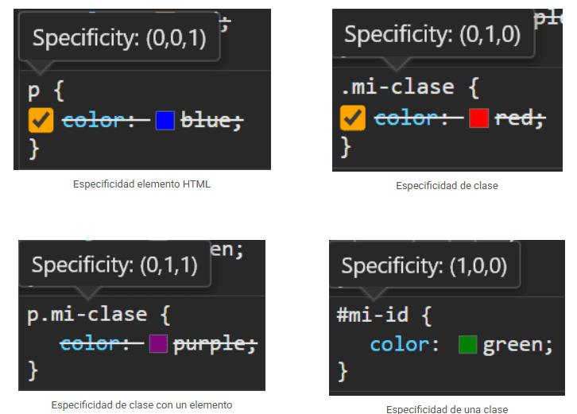

# Cascada en CSS

---

- [Herencia](#herencia)
- [Estructura](#estructura)
- [Especificidad](#especificidad)

---

### ¿Qué es la Cascada CSS?

Cuando hablamos de la Cascada CSS nos referimos al algoritmo (conjunto de reglas y normas) que tiene el navegador para aplicar estilos CSS a un elemento HTML. No es tan sencillo como se creee la mayoría cree, ya que pueden existir ambigüedades, y el navegador debe resolverlas para saber que estilo debe aplicar primero y cuál después.

En otras palabras la cascada es el orden como vamos a ver los estilos y como el navegador los aplica.


Unos de los confictos más comunes que nos encontraremos cuando apliquemos estilos es el siguiente:

```html
<p>Hola</p>
```

```css
p {
  color: #09f;
}

p {
  color: red; /* <- Al final este es el estilo que se aplica */
}
```

Para entender toda esta cantidad de información lo separaremos en varias categorías:

- **Herencia:** Los estilos CSS se pueden heredar y resetear.
- **Estructura:** Si hay un conflicto de estilos, depende mucho de la estructura CSS.
- **Especificidad:** Cuanto más específico un selector, mayor prioridad de aplicar estilos.
- **Alcance**: Podemos definir hasta donde queremos que se apliquen los estilos.

### Herencia

En CSS, el código que escribes y sus propiedades CSS se aplican al elemento que haces referencia en su selector. Sin embargo, existe un mecanismo denominado **Herencia** que permite que ciertas propiedades se puedan heredar de un elemento HTML hacia sus elementos HTML hijos.


Ten en cuenta la estructura del DOM (HTML) de la página. En CSS, si nosotros damos estilo a un elemento HTML, su hijo directo hereda el estilo del padre, salvo que le hayas indicado explícitamente otro estilo diferente. A continuación, ocurre lo mismo con el hijo del hijo, que hereda los estilos de su padre directo. Y así sucesivamente.

```html
html
  |
  +--- body
        |
        +--- .parent
                |
                +--- .child
```

#### Propiedades heredables

|Propiedad heredables|Descripción|
|--------------------|-----------|
|`color`|Establece el color de texto.|
|`font-family` `font-size` `font-style` `font-variant` `font-weight`|Establece el color de texto.|
|`text-align` `text-shadow` `text-overflow` `text-indent` `text-transform`|Propiedades relacionadas con el texto.|
|`word-spacing` `letter-spacing` `direction` `line-height` `white-space`|Propiedades especiales de texto.|
|`visibility`|Propiedad de visibilidad de un elemento.|
|`list-style-type`|Propiedad para viñetas de una lista.|


#### Forzar herencia

Por defecto algunas propiedades no se heredan como el border.

```html
<div class="container">
  Este el container
  <div class="child">Hola mundo</div>
</div>
```

```css
.container {
  color: #09f;
  font-size: 32px;
  border: 3px solid #09f;
}
```


Podemos forzar la herencia del elemento hijo con las siguientes valores:

|Valor |Descripción|
|--------------------|-----------|
|`initial`| Propiedad inicial, hereda todo.|
|`unset`| Resetea los valores, quita las propiedades heredables.|
|`revert`| Invierte los valores de la herencia.|
|`inherit`| Fuerza la herencia.|


```css
.container {
  color: #09f;
  font-size: 32px;
  border: 3px solid #09f;
}

.child {
  border: inherit;
  font-size: initial; /* unset, revert, inherit */
}
```


### Estructura

A la hora de escribir nuestro código CSS debemos tener claro que dicho código tiene una cierta estructura. Dependiendo de varios detalles de esa estructura, el código puede contener conflictos donde 2 o más elementos tienen estilos que se contradicen y el navegador debe saber resolver ese conflicto.


#### Conflictos de nombres CSS

#### Caso 1: Desde diferentes fuentes

Veamos el siguiente ejemplo. En él, podrás ver que se aplican estilos CSS al mismo elemento:

- 1️⃣ Aplicamos color azul desde el `<link>`
- 2️⃣ Aplicamos color rojo desde el `<style>`
- 3️⃣ Aplicamos color verde desde la propia etiqueta HTML mediante `style`.

```html
<html>
<head>
  <link rel="stylesheet" href="index.css">
  <!-- contiene un .text { background-color: blue; } -->
  <style>
    .text { background-color: red } /* estilo por el elemento style */
  </style>
</head>
<body>
  <div class="text" style="background-color: green"> <!-- estilo por el atributo style -->
    ¡Desde Manz.dev puedes ver mis streams!
  </div>
</body>
</html>
```

En este caso, tendría prioridad el estilo definido en la propia etiqueta HTML (estilo en línea), ya que el orden de prioridad es el siguiente:

1. 🟥 El atributo `style=""` del HTML (mayor prioridad).
2. 🟧 Bloque de estilos `<style>` en el HTML (prioridad intermedia).
3. 🟨 Archivo .css externo vía `<link rel="stylesheet">` (menor prioridad).

#### Caso 2: De fuentes del mismo tipo

Vamos con otro ejemplo. Supongamos ahora que nos encontramos en la misma fuente (por ejemplo, una hoja de estilos externa). Vamos a aplicar estilos a exactamente el mismo selector, en este caso, al elemento `.text`.

**Duda:** ¿Cuál de las dos propiedades `background-color` prevalece? Se refieren al mismo elemento por exactamente el mismo selector y están en la misma fuente de datos:

```html
<div class="text">Texto del elemento</div>
```

```css
.text {
  padding: 8px;
  background-color: red;
}

.text {
  background-color: grey;
  color: white;
}
```

**Respuesta:** Prevalece siempre la última regla definida (orden). Como el selector es exactamente el mismo, entonces el navegador mezcla los estilos de ambos bloques y se fusionan. El resultado final interpretado por el navegador (valor computado) sería el siguiente:

```css
.text {
  padding: 8px;             /* No hay conflicto, se añade */
  background-color: grey;   /* Hay conflicto: se sobreescribe la última */
  color: white;             /* No hay conflicto, se añade */
}
```

#### Caso 3: Diferente selector

Sin embargo, puede ocurrir que en determinados casos no esté tan claro cuál es el estilo que debería sobreescribir a los anteriores, porque tenemos selectores diferentes que se refieren al mismo elemento.

Por ejemplo, en este caso tenemos un elemento HTML con un `class` y con un `id`. Si a este código HTML le aplicamos el código CSS del bloque `<style>`, aunque los selectores sean diferentes, nos estamos refiriendo al mismo elemento, por lo que no resulta tan intuitivo como vimos al principio de este artículo:

```html
<div class="text" id="element">¡Hello from Manz.dev!</div>

<style>
#element {
  background: blue;
}

.text {
  background: red;
}
</style>
```

Aquí es cuando entra en juego el concepto de Especificidad CSS, en el que profundizaremos más adelante. Este concepto se encarga de eliminar la ambigüedad determinando cuál es el selector más específico que debería «vencer».

Para entenderlo mejor, veamos otro fragmento de CSS aplicado a la etiqueta HTML `<div>` anterior:

```html
<div id="element" class="text">Texto del elemento</div>

<style>
  div { background-color: red; }
  #element { background-color: steelblue; }
  .text { background-color: green; }
</style>
```

Si nos fijamos en el HTML, nuestro único `<div>` encaja con los tres selectores del CSS:

- 1️⃣ Es un `<div>` por lo que se le aplica el color rojo.
- 2️⃣ Tiene el `id` con valor `element`, por lo que se le aplica el color azul.
- 3️⃣ Tiene la `clase` con valor `text`, por lo que se le aplica el color verde.

Aunque puede que lo que nos resulte más natural es pensar que el estilo vencedor es el último definido, no funciona así.

El navegador analiza cuál es el selector más específico, para descubrir cuál es el vencedor:

- El selector `div` tiene especificidad **0,0,1** (es un elemento)
- El selector `#element` tiene especificidad **1,0,0** (es un id)
- El selector `.text` tiene especificidad **0,1,0** (es una class)

De estos tres selectores, el vencedor es el segundo (número más alto): el selector `#element`, ya que los elementos con `id` no se pueden repetir en un mismo documento, y son más específicos.

### Especificidad

La Especificidad CSS es una de las partes más importantes de la Cascada de CSS, y también de las más desconocidas. Aprender como el navegador calcula la especificidad y resuelve estos conflictos, te da la capacidad de entender como funciona CSS.


Además, estos conflictos son muy comunes en CSS, y existen formas mucho más limpias de resolverlos sin tener que recurrir a un `!important`, donde potencialmente añadimos problemas adicionales.

#### ¿Cómo se calcula la Especificidad?

Claro, aquí tienes un resumen del párrafo:

El navegador utiliza un sistema llamado **Especificidad CSS** para resolver conflictos entre reglas. Este sistema asigna un **valor numérico** a cada selector, siguiendo ciertas normas, y se representa con tres cifras: **A, B, C**. Cuanto mayor sea la especificidad, más prioridad tiene la regla.


|Valor|Descripción|
|-----|-----------|
|Valor **A** |Número de veces que aparece un `#id` en el selector.|
|Valor **B** |Número de veces que aparece una `.clase`, `[atributo]` o `:pseudoclase` en el selector.|
|Valor **C** |Número de veces que aparece un elemento o un `::pseudoelemento` en el selector.|


```code
!important          | 1, 0, 0, 0, 0
#ID                 | 0, 1, 0, 0, 0
Estilos en línea    | 0, 0, 1, 0, 0
.clases             | 0, 0, 0, 1, 0
Elementos           | 0, 0, 0, 0, 1
*Selector universal | 0, 0, 0, 0, 0
```

Al final, el selector con especificidad más alta es el que gana los selectores en conflicto que compite:

```css
div { ... }                   /* 0,0,1 (1 elemento HTML) */
div div { ... }               /* 0,0,2 (2 elementos HTML) */
#pagina div { ... }           /* 1,0,1 (1 id y 1 elemento HTML) */
#pagina div:hover { ... }     /* 1,1,1 (1 id, 1 pseudoclase y 1 elemento HTML) */
#pagina div:hover a { ... }   /* 1,1,2 (1 id, 1 pseudoclase y 2 elementos HTML) */
#pagina .sel:hover>a { ... }  /* 1,2,1 (1 id, 1 clase, 1 pseudoclase y 1 elemento HTML) */
```

> **Nota:** Si queremos saber más sobre que elemento o selector tiene mayor especificidad sobre otro podemos revisar la siguiente [Url](https://specificity.keegan.st/).


#### Excepciones de Especificidad CSS


|Excepción|Cómo se modifica la especificidad de su interior|
|---------|------------------------|
|Combinador **:is()**|Se suma la especificidad del selector más específico de la lista.|
|Combinador **:not()**|Usa la misma especificidad del selector que contiene.|
| Combinador **:has()**|Usa la especificidad base (10) más la del selector que contiene.|
|Combinador **:where()**|No importa el selector interno. Su especificidad siempre es 0.|

Veamos un fragmento de código para afianzar los conceptos de estos combinadores CSS :is(), :not(), :has() y :where() con los siguientes ejemplos:

```css
.container { }                       /* Especificidad: 0,1,0 */
.container .item { }                 /* Especificidad: 0,2,0 */

.container :is(.item, #unique) { }   /* 1,1,0 (#unique es el más específico) */
.container :not(.item) { }           /* 0,2,0 */
.container:has(.item) { }            /* 0,2,0 */
.container :where(.item) { }         /* 0,1,0 (solo cuenta el de fuera) */
```

### Ejemplo de especificidad

Aplicamos estilos al elemento `<p>` con diferentes selectores y como podemos ver, que existen elementos tachados cuyo estilos no se estan aplicando por la regla de la especificidad.



---