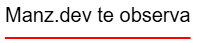
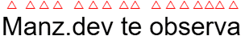

# Fuentes y tipografias

---

- [Bases de fuentes y tipografias](#bases-de-fuentes-y-tipografias)
- [Decoraciones de texto](#decoraciones-de-texto)
- [Distancia del trazo de decoración](#distancia-del-trazo-de-decoracion)
- [Transformaciones de texto](#transformaciones-de-texto)
- [Enfasis de texto](#enfasis-de-texto)
- [Contorno en tipografias](#contorno-en-tipografias)
- [Textos y alineaciones](#textos-y-alineaciones)
- [Espaciado de texto](#espaciado-de-texto)

---

Las tipografías (también denominadas fuentes) son una parte muy importante del mundo de CSS. De hecho, son uno de los pilares del diseño web. La elección de una tipografía adecuada, su tamaño, color, espacio entre letras, interlineado y otras características pueden dotar de una parte fundamental, de forma consciente o inconsciente, en la percepción en la que una persona interpreta o accede a los contenidos de una página.


### Serifas o sin serifas (decoraciones)

Las fuentes o tipografías que utilizan serifa o gracia, son aquellas que incorporan unos pequeños adornos o remates en los extremos de los bordes de las letras. Muchas de estas tipografías suelen terminar su nombre en «Serif» (con serifa).


### Tipografías monoespaciadas

Existe un estilo de tipografía denominada monoespaciada (mismo tamaño de espacio). Se basa en que cada una de sus letras tienen exactamente el mismo ancho. Se suelen utilizar para tareas de programación donde se muestra código o en emuladores de terminal, donde se lee mejor líneas con estas características, ya que queremos que ocupe el mismo espacio que la línea anterior, para que sea más fácil de leer y ubicar.


### Peso o grosor de tipografía

En algunos casos, nos interesará mostrar tipografías con diferentes grosores, ya sea porque ciertos fragmentos de texto queremos que aparezcan en negrita o porque simplemente se ve visualmente mejor. En CSS, esto se conoce como peso de una tipografía, y hablamos de una cantidad numérica (generalmente valores entre 100 y 900) que determina el grosor de la tipografía:


### Interlineado de texto

Otro detalle importante a la hora de utilizar una tipografía, es buscar y comprobar el tamaño perfecto de interlineado (espacio entre líneas del párrafo). Una tipografía se lee mejor si no está lo suficientemente junta, ni lo suficientemente separada. De la misma forma ocurre con el interletraje, es decir, el espacio entre letras:


En los siguientes artículos de este sitio, nos vamos a enfocarnos en las siguientes temáticas, relacionadas con las tipografías en una web mediante CSS:

| **Temáticas**                  | **Descripción**                                                         |
|---------------------------------|-------------------------------------------------------------------------|
| 🅰 Tipografías en CSS           | Propiedades básicas para establecer tipografías en CSS.                 |
| ⏩ La regla @font-face          | Precarga tipografías de repositorios o sitios externos.                 |
| 🎀 Tipografías de Google Fonts  | Precarga tipografías externas de Google Fonts.                          |
| 💪 Fuentes variables CSS        | Utilizar tipografías con múltiples pesos variables.                     |
| 📋 Textos y alineaciones        | Propiedades para realizar tareas relacionadas con textos.               |
| 🧶 Propiedades avanzadas        | Algunas propiedades avanzadas de tipografías.                            |
| 🎁 Características personalizadas | Características avanzadas de tipografías.                               |


### Bases de fuentes y tipografias

Existe un amplio abanico de propiedades CSS para modificar las características básicas de las tipografías a utilizar. Aunque existen muchas más, a continuación, veremos las propiedades CSS principales y más básicas para establecer en un texto:

| **Propiedad**     | **Valor**             | **Significado**                                                   |
|-------------------|-----------------------|-------------------------------------------------------------------|
| font-family       |`fontlist`               | Indica el nombre de la fuente (o una lista de ellas).             |
| font-size         |`size`                  | Indica el tamaño de la fuente.                                    |
| font-style        | normal \| italic \| oblique | Indica el estilo de la fuente. Por defecto, normal.              |
| font-weight       |`weight`                | Indica el peso (grosor) de la fuente. Por lo general, un valor entre 100-800. |

#### Propiedad `font-family`

Empezaremos por la más lógica y básica, la propiedad CSS para seleccionar una familia tipográfica concreta. Con esta propiedad, denominada font-family , podemos seleccionar una tipografía específica simplemente escribiendo su nombre:

```css
.container {
  font-family: Verdana;
  font-family: 'PT Sans';
}
```

#### Propiedad `font-size`

Otra de las propiedades más utilizadas con las tipografías es font-size, una tipografía que permite indicar el tamaño que tendrá la fuente que vamos a utilizar. El tamaño puede indicarse de 3 formas diferentes:

| **Tipo de valor**              | **Valor**                                       | **Tipo de medida**               |
|---------------------------------|-------------------------------------------------|----------------------------------|
|`abssize`| xx-small \| x-small \| small \| medium \| large \| x-large \| xx-large | Tamaño absoluto (predefinido)  |
|`relsize`| smaller \| larger               | Tamaño relativo (más pequeño/más grande)        |
|`size`| tamaño                          | Tamaño específico (tamaño exacto)               |


#### Propiedad `font-style`

Quizás recuerdes los botones para dar estilo de los procesadores de texto como Word o Google Docs. Estos botones permiten aplicar estilos como negrita o cursiva. Justamente esto es lo que realiza la propiedad font-style, que puede tomar los siguientes valores:

| **Valor** | **Significado**                                                                 |
|-----------|---------------------------------------------------------------------------------|
| `normal`    | Estilo normal. Sin cambios aparentes. Valor por defecto.                         |
| `italic`    | Cursiva. Estilo caracterizado por una ligera inclinación de las letras hacia la derecha. |
| `oblique`   | Oblícua. Idem al anterior, salvo que esta inclinación se realiza de forma artificial. |
| `blique`  `angle` | Idem al anterior, pero indicando los grados de inclinación de -90deg a 90deg. Por defecto, 14deg. |


#### Propiedad `font-weight`

Por otro lado, tenemos el peso de la tipografía, que no es más que el grosor de la misma. No todas las tipografías soportan todos los tipos de grosor. Hay tres formas de definir grosor de una tipografía:

| **Valor**                     | **Significado**                                                      |
|-------------------------------|----------------------------------------------------------------------|
| normal (400) \| bold (700)     | Peso absoluto (predefinido). El valor por defecto es normal.          |
| bolder \| lighter              | Peso relativo (más pequeño o más grande).                             |
| peso                          | Peso específico (número con el peso concreto).                        |


#### Atajo: la propiedad `font`

Todas las tipografías vistas en este artículo, y algunas otras que aún no hemos visto se pueden resumir en la siguiente tipografía de atajo:

```css
.container {
  /* font: <style> <variant> <weight> <stretch> <size/line-height> <family>; */
}
```

Ten en cuenta que los parámetros stretch y line-height son opcionales y pueden omitirse. Por ejemplo, utilizar la tipografía Arial, con la fuente alternativa Verdana o una fuente segura sin serifa, a un tamaño de 16px, un peso de 400, sin utilizar versalitas y con estilo cursiva:

```css
.container {
  /* Opción 1 */
  font: italic normal 400 16px Arial, Verdana, sans-serif;

  /* Opción 2 */
  font: italic normal 400 normal 16px/22px Arial, Verdana, sans-serif;
}
```

### Decoraciones de texto

Mediante las propiedades que veremos en este artículos podemos decorar o transformar nuestros textos. Se han dividido en 3 apartados:

1. **Decoraciones:** Añadir trazos para decorar el texto
2. **Transformaciones:** Realizar modificaciones a mayúsculas, minúsculas, etc...
3. **Énfasis:** Añadir carácteres para enfatizar el texto

Para establecer decoraciones en ciertos fragmentos de texto podemos utilizar las propiedades de la familia **text-decoration-***. Normalmente, esta propiedad se suele utilizar sobre los elementos `<a>` para modificar el subrayado por defecto que se establece en los enlaces.

| Propiedad                  | Valor                                                            | Significado                                                   |
|----------------------------|------------------------------------------------------------------|---------------------------------------------------------------|
| `text-decoration-line`     | none \ underline \ overline \ line-through                       | Indica el tipo de decoración de texto.                        |
| `text-decoration-style`    | solid \ double \ dotted \ dashed \ wavy                          | Trazo de la decoración.                                       |
| `text-decoration-color`    | currentcolor \ `color`                                           | Indica el color de la decoración.                             |
| `text-decoration-thickness`| auto \ from-font \ `size`                                        | Indica el grosor del trazo de la decoración.                  |
| `text-underline-position`  | auto \ from-font \ under                                         | Indica donde aparece el trazo del subrayado.                  |
| `text-underline-offset`    | auto \ `size`                                                    | Indica el desplazamiento del trazo del subrayado.             |
| `text-decoration`          | `line` `thickness` `style` `color`                               | Propiedad de atajo de las anteriores.                         |

crtl + j = abrir consola en vs code.

#### propiedad `text-decoration-line`

La propiedad text-decoration-line permite establecer o cambiar el tipo de decoración de texto, entre los que se encuentran los siguientes valores:

| Valor           | Descripción                                                |
|-----------------|------------------------------------------------------------|
| `none`          | Elimina cualquier tipo de decoración.                      |
| `underline`     | La línea de decoración se establece por abajo (subrayado). |
| `overline`      | La línea de decoración se establece por encima.            |
| `line-through`  | La línea de decoración es una línea tachada.               |


Esta propiedad se utiliza junto a otras propiedades para modificar el trazo de la decoración: 

#### propiedad `text-decoration-style `

Esta propiedad permite establecer el tipo de trazo, donde hay ciertos estilos similares a los que se aplican en los bordes CSS. Los valores son los siguientes:


| Valor   | Descripción                                              |
|---------|----------------------------------------------------------|
| solid   | Indica un trazo continuo.                                |
| double  | Indica un trazo doble, con líneas paralelas.             |
| dotted  | Indica un trazo discontinuo, con puntos.                 |
| dashed  | Indica un trazo discontinuo, con rayas.                  |
| wavy    | Indica un trazo ondulado.                                |

#### propiedad `text-decoration-color`

Permite indicar el color del trazo, independientemente del color del texto. Por defecto, el valor utilizado es `currentcolor`, que es el color actual del texto. 

#### propiedad `text-decoration-thickness` 

Esta propiedad permite establecer el grosor del trazo.

#### Atajo: `text-decoration` 

Es la propiedad de atajo que podemos utilizar para aplicar todas las propiedades anteriores en una sola:

```html
<p>hola mundo</p>
```

```css
p {
  /* text-decoration-line: overline;

  text-decoration-style: wavy;

  text-decoration-color: brown;

  text-decoration-thickness: 2px; */

  text-decoration: overline wavy 2px brown;
}
```


### Distancia del trazo de decoracion

Mediante las propiedades `text-underline-position` y `text-underline-offset` podemos establecer la distancia del trazo del subrayado respecto al texto, algo que podría ser interesante si el trazo está molestando o demasiado cerca del texto, dependiendo de la tipografía que se use.


```html
<div class="text-container">Manz.dev te observa</div>
```

```css
.text-container {
  text-decoration: 2px solid underline red;

  /* distancia de la decoración */
  text-underline-position: under;
  text-underline-offset: 10px;
}
```




Por ejemplo, en el ejemplo anterior, `text-underline-position` establece que el trazo debe aparecer por debajo del trazo habitual. Además, con la propiedad `text-underline-offset` puedes establecer una distancia de separación específica, que con valores negativo, puede incluso invertirse y dirigirse en dirección contraria.

> **Nota:** Para que estas propiedades funcionen, la propiedad `text-decoration-line` (o su atajo) debe estar fijada al valor `underline`.


### Transformaciones de texto

En CSS es posible realizar transformaciones a ciertos textos, donde a pesar de tener un texto original en el HTML, queremos mediante CSS realizar una transformación y ponerlo todo en mayúsculas, todo en minúsculas o transformaciones similares sin tener que modificar el contenido HTML.


#### Propiedad `text-transform`

Convierte un texto, transformándolo a una variación (minúsculas, mayúsculas, capitalizado, etc...)

| Valor       | Descripción                                                    |
|-------------|----------------------------------------------------------------|
| `none`        | No realiza ninguna transformación. Valor por defecto.          |
| `capitalize`  | Convierte a mayúsculas la primera letra de cada palabra.       |
| `uppercase`   | Convierte a mayúsculas todas las letras.                       |
| `owercase`   | Convierte a minúsculas todas las letras.                       |
| `full-width`  | Escribe letras en formato ancho, alineadas como ideogramas asiáticos. |


### Enfasis de texto

En ciertos idiomas, se suelen utilizar ciertos carácteres para enfatizar textos, generalmente colocados sobre las palabras. Las propiedades de la familia `text-emphasis-` sirven para este propósito:


| Propiedad                 | Valor                                                             | Significado                                              |
|---------------------------|-------------------------------------------------------------------|----------------------------------------------------------|
| text-emphasis-style       | none \ dot \ circle \ triangle \ double-circle \ sesame       | Indica un carácter para utilizar de énfasis.             |
| text-emphasis-style       | `string`                                                         | Indica el color de los caracteres de énfasis.            |
| text-emphasis-color       | `color`                                                         | Indica el color de los caracteres de énfasis.            |
| text-emphasis-position    | over right \ over left \ under right \ under left              | Indica la posición de los caracteres de énfasis.         |
| text-emphasis             | `style` `color`                                                   | Propiedad de atajo de las dos primeras.                  |


La propiedad `text-emphasis-style` permite establecer unos carácteres para enfatizar los textos, que por defecto se establecen sobre los mismos. Se pueden indicar los valores `dot`, `circle`, `double-circle`, `triangle` o `sesame`, los cuales pueden combinarse con las palabras clave `open` y `filled` si queremos que sean signos huecos o rellenos, respectivamente:


```html
<div class="text-container">Manz.dev te observa</div>
```

```css
.text-container {
  font-size: 2rem;

  /* Énfasis de texto */
  text-emphasis-style: open triangle;
  text-emphasis-color: red;
  text-emphasis-position: over right;
}
```




#### Propiedad `text-wrap`

La propiedad `text-wrap` nos permite ajustar el texto del elemento al que se lo aplicamos, adaptando la forma en la que se muestra el contenido. Los valores que soporta esta propiedad son los siguientes:


| Valor    | Descripción                                                                 |
|----------|-----------------------------------------------------------------------------|
| `wrap`     | El texto se ajusta para ocupar el ancho del contenedor, y se dividirá en varias líneas si es necesario. |
| `nowrap`   | El texto no se ajusta, por lo que sobresale del contenedor si es más largo que su ancho. |
| `balance`  | El texto se ajusta de forma uniforme, evitando líneas muy largas o muy cortas. Ideal para títulos. |
| `pretty`   | El texto se ajusta de forma uniforme, minimizando la diferencia de longitud de las líneas. Ideal para párrafos. |
| `stable`   | ⚠️ El texto se ajusta de forma uniforme, manteniendo los espacios entre palabras uniforme. |
| `auto`     | El navegador determina qué tipo de ajuste aplicar.                          |


### Contorno en tipografias

Puede que en ciertas ocasiones nos interese colocar un borde o contorno a los textos de nuestra página, ya sea por motivos estéticos o simplemente por mejorar legibilidad. Sin embargo, esta es una cuestión que en CSS no está clara aún y que, aunque hay formas de conseguirlo, todas tienen sus ventajas y desventajas.

#### Propiedad `-webkit-text-stroke`

Quizás, la forma ideal sería utilizar la propiedad `text-stroke`, que literalmente significa «trazo de texto», haciendo referencia al trazo del borde de la tipografía. Sin embargo, esta propiedad ha seguido un camino poco común, ya que no está estandarizada, sin embargo, está implementada en la mayoría de los navegadores, sólo que necesita el prefijo -webkit para utilizarse.


```html
<div class="text">Hola, esto es un texto con borde.</div>
```

```css
body {
  background: #111;
}

.text {
  font-family: sans-serif;
  font-weight: bold; /* texto más grueso para que se note el contorno */
  font-size: 3rem;
  color: black;
  -webkit-text-stroke: 1px white;
}
```


#### Propiedad `text-shadow`

Otra forma interesante que podríamos utilizar para crear un borde o contorno en un texto es la propiedad `text-shadow`, que se utiliza para sombras de texto. Podemos utilizar un truco, que es crear múltiples sombras (concretamente, cuatro sombras) y desplazarlas ligeramente hacia un lado, de modo que en conjunto creen una sombra exterior.


```html
<div class="text">Hola, esto es un texto con borde.</div>
```

```css
body {
  background: #111;
}

.text {
  font-family: sans-serif;
  font-weight: bold;
  font-size: 3rem;
  color: black;
  text-shadow:
    1px 0 0 white,    /* Desplaza a la derecha */
    -1px 0 0 white,   /* Desplaza a la izquierda */
    0 1px 0 white,    /* Desplaza abajo */
    0 -1px 0 white;   /* Desplaza arriba */
}
```


#### La función `drop-shadow()`

De forma muy similar a la anterior, puede servirnos también la función `drop-shadow()` de la propiedad `filter`, con la que también podemos crear múltiples sombras. Como hacerlo con un desplazamiento de `1px`, el resultado sería exactamente igual al anterior, en este caso, vamos a aumentar un poco el desplazamiento de las mismas y a separarlo en variables CSS para que sea más fácil de modificar y mantener (aunque sea un poco más complejo de leer):


#### Propiedad `-webkit-text-fill-color`

Hay que saber que el color: transparent con el background-clip: text puede que no funcione bien en algunos navegadores, por lo que suele ser más seguro utilizar la propiedad `-webkit-text-fill-color`.

Esta propiedad no es una propiedad estándar, sin embargo, está bien soportada en los navegadores actuales y se puede utilizar para conseguir el mismo efecto anterior, pero con mayor grado de compatibilidad.

Observa el siguiente ejemplo:


```html
<div class="text">Visita Manz.dev, tu streamer preferido.</div>
```

```css
body {
  background: #111;
}

.text {
  font-family: Jost, sans-serif;
  font-weight: bold;
  font-size: 3rem;
  background: linear-gradient(indigo 50%, hotpink 75%);
  background-clip: text;
  -webkit-text-fill-color: transparent;
}
```


### Textos y alineaciones

Hasta ahora hemos visto propiedades que se centran en modificar aspectos relacionados con las tipografías, pero CSS dispone de propiedades para modificar aspectos de textos, alejándose de criterios de tipografías, y centrándose más en objetivos de alineación, tratamiento de espaciados o detalles similares.

Dichas propiedades se centran en varios apartados:

- 1️⃣ Espacios en blanco
- 2️⃣ Límites de líneas y palabras
- 3️⃣ Alineaciones de texto
- 4️⃣ Espaciados de texto


#### Espacios en blanco

#### Propiedad `white-space`

Utilizando la propiedad `white-space`, podemos indicar el comportamiento que tendrán los espacios en blanco, que por defecto, como hemos visto, tienen el valor normal y no se muestra sino uno solo. Sin embargo, tiene otros valores disponibles:

| Valor       | Espacios en blanco consecutivos                                       | Contenido                     |
|-------------|-----------------------------------------------------------------------|-------------------------------|
| `normal`    | Los espacios consecutivos se transforman en uno solo.                 | Se ajusta al contenedor.      |
| `nowrap`    | Los espacios consecutivos se transforman en uno solo.                 | Ignora saltos de línea.       |
| `pre`       | Respeta y muestra literalmente los espacios.                          | Ignora saltos de línea.       |
| `pre-wrap`  | Respeta y muestra literalmente los espacios.                          | Se ajusta al contenedor.      |
| `pre-line`  | Respeta literalmente los espacios y suprime los espacios del final.   | Se ajusta al contenedor.      |


#### Propiedad `tab-size`

Por otro lado, tenemos la propiedad `tab-size` que permite establecer el número de espacios que se mostrarán en el cliente o navegador al representar el carácter de un (tabulador), que generalmente se convierten a espacios en blanco, sin embargo son visibles en elementos HTML como `<textarea>` o `<pre>`.

#### Límites de línea y palabras

Existen ciertas situaciones donde palabras o lineas de texto demasiado largas no caben en su contenedor, y se debe tomar una decisión de como se comportará el navegador al renderizar ese contenido: desbordar el contenedor, desplazar a un lugar donde haya más espacio o partir/dividir el contenido.

Estos cambios (y relacionados) se hacen a través de las siguientes propiedades CSS:


| Propiedad       | Valor                                                | Significado                                               |
|-----------------|------------------------------------------------------|-----------------------------------------------------------|
| `word-break`      | normal \ keep-all \ break-all \ break-word        | Indica si se pueden partir palabras de forma natural.     |
| `line-break`      | auto \ loose \ normal \ strict \ anywhere        | Determina cómo dividir líneas.                            |
| `hyphens`         | manual \ none \ auto                               | Indica si se debe dividir las palabras por guiones.       |
| `overflow-wrap`   | normal \ break-word \ anywhere                     | Indica si puede forzar partir palabras y evitar desbordamiento. |


#### Alineaciones de texto

Cuando estamos escribiendo mucho texto en nuestros elementos, es posible que necesitemos alinear los textos, para colocarlos de una forma específica: texto a la izquierda, texto a la derecha, texto centrado, etc... Para ello, utilizaremos las siguientes propiedades CSS:


| Propiedad            | Valor                                                           | Significado                                                |
|----------------------|-----------------------------------------------------------------|------------------------------------------------------------|
| `text-align`           | start \ end \ justify \ center \ match-parent \ justify-all | Alineación del texto.                                       |
| `text-align-last`      | auto \ start \ end \ justify \ center \ match-parent       | Alineación de la última línea del texto.                    |
| ⚠️ `text-justify`      | auto \ inter-word \ inter-character \ none                   | Método de justificación de textos en justify.               |
| `vertical-align`       | baseline \ sub \ super \ top \ middle \ bottom \ text-top \ text-bottom | Alineado de textos respecto a elementos.                    |


#### Propiedad `text-align` 

Sirve para alinear textos de forma horizontal. 


#### Propiedad `text-align-last`

Sirve para alinear la última línea del texto.


#### Propiedad `vertical-align`

Se encarga de la alineación vertical de un elemento. Puede ser muy interesante, por ejemplo, para alinear textos al lado de las imágenes.


### Espaciado de texto

Existen varias propiedades mediante las cuales podemos crear espacios en diferentes zonas, por ejemplo, entre líneas, letras o palabras. Estos espacios sirven para ajustar visualmente las tipografías y que se puedan leer de una forma mucho más agradable, no canse tanto la vista, y simplemente mejorar la experiencia del lector.


Las propiedades que tenemos para modificar estos detalles son las siguientes:


| Propiedad        | Valor         | Significado                                      |
|------------------|---------------|--------------------------------------------------|
| `letter-spacing`   | normal \ `size`       | Espacio entre letras (interletraje o tracking).  |
| `word-spacing`     | normal \ `size`       | Espacio entre palabras.                         |
| `line-height`      | normal \ `number` \ `size`      | Establece una altura de línea (interlineado).    |
| `text-indent`      | 0  \ `size`           | Indentación de texto (sangría).                  |


#### Propiedad `letter-spacing`

La propiedad `letter-spacing` , permite indicar el espacio de separación que hay entre cada letra de un texto, denominado comúnmente interletraje o tracking.

Si utilizamos valores negativos tendremos las letras más unidas, mientras que con valores positivos, las letras se encontrarán más separadas unas de otras.

#### Propiedad `line-height`

Por su parte, la propiedad `line-height` permite especificar la altura que tendrá cada línea de texto de un párrafo. Esto es una característica que puede facilitar muchísimo la lectura, puesto que un interlineado excesivo puede desorientar al lector, mientras que uno insuficiente puede hacer perder al visitante el foco en el texto.

#### Propiedad `word-spacing`

La propiedad `word-spacing` permite establecer el espacio que hay entre palabras en un texto determinado. Esto puede facilitar la legibilidad de los textos de una página web y da flexibilidad y control sobre ciertas tipografías que puede que no tengan suficiente espacio entre las palabras escribas, ya que sus espacios tienen un tamaño insuficiente.

#### Propiedad `text-indent`

Por último, la propiedad `text-indent` establece un tamaño de indentación, o lo que es lo mismo, hace un sangrado, en la primera línea del texto, desplazándolo la longitud especificada hacia la derecha (o izquierda en cantidades negativas).


```html
<div class="container">
  <h2>Tittle</h2>

  <p class="first">Lorem ipsum dolor, sit amet consectetur adipisicing elit. Sed impedit fuga cumque saepe reiciendis voluptate at modi, a eum eos. Quam earum ut libero minus sapiente, reprehenderit architecto quisquam quas. Sed impedit fuga cumque saepe reiciendis voluptate at modi, a eum eos.</p>
</div>
```

```css
*{
  outline: 1px solid red;
}

.container {
  width: 500px;
  min-height: max-content;
  padding: 5px;
}

h2 {
  text-align: center;
}

.first {
  white-space: pre-wrap;
  text-align: justify;
  text-align-last: center;
  letter-spacing: 5px;
  word-spacing: 7px;
  line-height: 30px;
}
```


---
