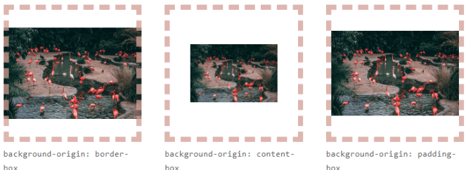
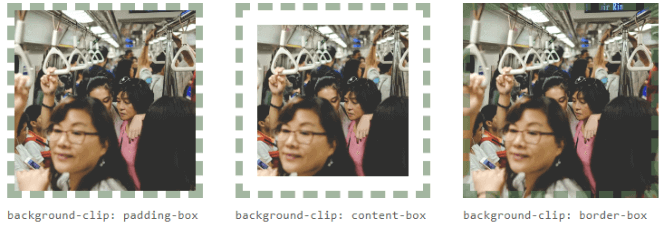

# Imagenes y fondos

---

- [Propiedad background-image](#propiedad-background-image)
- [Opciones de imagen de fondo](#opciones-de-imagen-de-fondo)
- [Fondos múltiples con background-image](#fondos-múltiples-con-background-image)

---

### Propiedad `background-image`

En el caso de querer utilizar imágenes de fondo, como ya hemos dicho, utilizaremos la propiedad background-image y en el valor, el nombre de la imagen (o la dirección URL donde está alojada), siempre rodeada del texto url().

|Valor|Significado|
|-----|-----------|
|`none`|No utiliza ninguna imagen de fondo.|
|url("imagen.jpg")|Usa la imagen indicada como fondo.|
|image-set(...)|Indica una imagen con fallbacks.|
|`gradient`|	Utiliza un gradiente de tipo lineal, radial o cónico.|

Para usar la propiedad de `background-image` tenemos usar un contenedor, ya que como su nombre indica estas imágenes se usan como fondos.

```html
<section class="box-img">
  ...
</section>
```

El contenedor tiene que tener medidas definidas.

```css
.box-img {
  width: 300px;
  height: 300px;
  background-image: url(img/asuka-img.webp);
  border: 5px solid red;
}
```


Podemos usar varias imágenes, siendo la primera la imágen que sale al frente y la la segunda la imágen de fondo.

```css
.box-img {
  background-image:
    url("/shared-assets/images/examples/lizard.png"), /* 1ra: imágen del frente */
    url("/shared-assets/images/examples/star.png");   /* 2da: imágen del fondo  */
}
```


Por último tambien podemos usar esta propiedad con gradientes.

```css
.box-img {
  background-image:
  linear-gradient(rgba(0, 0, 255, 0.5), rgba(255, 255, 0, 0.5)),
  url("/shared-assets/images/examples/lizard.png");
}
```


#### Diferencia entre usar la etiqueta `` en HTML y la propiedad `background-image` en CSS


| **Característica**              | **`` (HTML)**                                    | **`background-image` (CSS)**                        |
|----------------------------------|-------------------------------------------------------|----------------------------------------------------|
| **Propósito**                    | Incluir imágenes como parte del contenido.            | Usar imágenes como fondos decorativos.             |
| **Accesibilidad**                | Permite el atributo `alt`, importante para SEO y accesibilidad. | No es accesible a través de texto alternativo.      |
| **Impacto en el flujo del contenido** | Ocupa espacio en el diseño, afectando el layout.      | No afecta directamente el flujo del contenido.     |
| **Interactividad**               | Se puede hacer interactiva (ej. imágenes clicables).  | No es interactiva (solo decorativa).               |
| **Control de la imagen**         | Control de tamaño y visualización mediante atributos como `width`, `height`. | Control de visualización mediante `background-size`, `background-position`. |
| **Uso típico**                   | Imágenes que deben ser vistas y tener contexto.       | Fondos, patrones de fondo, imágenes de diseño.      |


#### ¿Cuándo usar cada uno?

- Usar ``: Cuando la imagen es parte del contenido principal, por ejemplo, en una galería, foto de perfil, logo o cualquier otra imagen que debe ser indexada o accesible.

- Usar `background-image`: Para imágenes que se usan como decorativas o para el fondo de un contenedor, como en el caso de un banner de fondo, patrones o efectos visuales.

### Opciones de imagen de fondo

Una vez establecida una imagen de fondo con `background-image`, se puede personalizar la forma en la que se mostrará dicha imagen mediante las siguientes propiedades:

|Propiedad|Descripción|
|---------|-----------|
|`background-repeat`|Establece el modo en el que se repite la imagen de fondo de ser muy pequeña.|
|`background-attachment`|Indica si la imagen de fondo permanece fija o se desplaza al hacer scroll.|
|`background-position`|Establece una posición para la imagen de fondo, de modo que podemos moverla de sitio.|
|`background-clip`|Modo de recorte de la imagen de fondo. (Ver modelo de cajas).|
|`background-origin`|	Modo de posicionamiento de la imagen de fondo.|
|`background-size`|Establece un tamaño diferente a la imagen de fondo.|


#### Propiedad `background-repeat`

La propiedad `background-repeat` especifica si la imagen se repetirá horizontalmente **(repeat-x)**, si se repetirá verticalmente **(repeat-y)**, si lo hará en ambas direcciones (repeat) o en ninguna (no-repeat). Por defecto, si no se indica nada, esta propiedad está ajustada en `repeat`.

|Valor|Significado|
|-----|-----------|
|`inherit` `initial` `unset`| Estos son valores iniciales, no hay cambio alguno entre ellos.|
|`repeat`|Repite la imagen de fondo horizontal y verticalmente.|
|`repeat-x`|Repite la imagen de fondo sólo horizontalmente (eje x).|
|`repeat-y`|Repite la imagen de fondo sólo verticalmente (eje y).|
|`space`|Repite la imagen y rellena con espacio los huecos.|
|`round`|Repite la imagen y amplia cada repetición para ajustar su tamaño al contenedor.|
|`no-repeat`|La imagen de fondo no se repite.|

Valores iniciales y por defecto:
- Si usamos valores iniciales (`inherit` `initial` `unset`) 
- Si no colocamos la propiedad `background-repeat` 
- Si usamos el valor `repeat`, obetenemos el siguiente resultado:

```css
.box-img {
  /* tamaño del contenedor */
  width: 400px;
  height: 400px;

  /* opciones de background */
  background-image: url(img/asuka-img.webp); /* agregamos la imágen */
  background-size: 40%; /* ajustamos el tamaño de la imágen al 40% */
  background-repeat: initial; /* inherit, initial, unset, repeat */

  border: 5px solid red;
}
```


#### Propiedad `background-attachment`

La propiedad background-attachment especificará si la imagen de fondo seguirá el desplazamiento del usuario al hacer scroll por la página, es decir, si el usuario al hacer scroll y bajar para ver el contenido de la página, la imagen de fondo de desplazará hacia arriba siguiendo el flujo normal de una página.

|Valor|Significado|
|-----|-----------|
|`scroll`|Cuando hacemos scroll la imagen de fondo se desplaza.|
|`fixed`|Cuando hacemos scroll, la imagen de fondo permanece fija.|

Veamos como funciona valor `fixed`.

```css
.box-img {
  background-image: url(img/asuka-img.webp);
  background-repeat: round;
  background-attachment: fixed;
}
```


#### Propiedad `background-position`

La propiedad background-position permite desplazar la imagen en la zona especificada por `posx` y por `posy`. 

Por defecto, esos valores son 0% 0%, y pueden especificarse tanto con unidades (porcentajes, píxels, etc...) como mediante palabras clave que representan zonas predefinidas (top, left, right, bottom y center).

|Valor|Significado|
|-----|-----------|
|`posx`|1 parámetro. Desplaza la imagen de fondo al punto (x, 50%).|
|`posx` `posy`|2 parámetros. Desplaza la imagen de fondo al punto (x, y).|

Veamos como aplicar los valores (x, y). 

- `background-position: top left`


- `background-position: top 20px left 20px`.


Todos los valores que nos proporciana la propiedad de `background-position`.


```css
/* Recomendaciones */
.element {
  /* OKAY */
  background-position: left 50%;
  background-position: top left;
  background-position: left top;

  /* NO RECOMENDADO */
  background-position: 50% left;
  background-position: left right;
}
```


#### Propiedad `background-size`

La propiedad `background-size` nos permite dar un tamaño a la imagen de fondo. Podemos ajustar tanto el tamaño de ancho como el de alto, e incluso tenemos algunas palabras clave predefinidas para obtener un resultado específico.

|Valor|Significado|
|-----|-----------|
|`size`|1 parámetro. Aplica un `size` de (ancho × auto) a la imagen de fondo. Mantiene la proporción.|
|`size` `size`|2 parámetros. Aplica un `size` de (ancho × alto) a la imagen de fondo. Hay que vigilar la proporción.|

Por defecto, una imagen de fondo toma **automáticamente el tamaño de la imagen** (que podría ser demasiado grande, por ejemplo). Para no tener que modificar la imagen original de forma manual con un editor de imágenes, podemos utilizar esta propiedad y ajustarla a nuestro agrado mediante CSS:

```css
.box-img {
  width: 350px;
  height: 400px;

  background-image: url(img/asuka-img.webp);
  background-size: 160px 160px; /* tamaño de la imágen */

  border: 5px solid red;
}
```


Con `background-size` puedomes utilizar los siguientes valores:

|Valor|Significado|
|-----|-----------|
|auto|No escala la imagen. Utiliza el tamaño original. Es el valor por defecto.|
|`size` unidad |Indicamos el tamaño específico que queremos usar (píxels o porcentaje, por ej.).|
|`cover`|Escala el ancho de la imagen de fondo al ancho del elemento.|
|`contain`|Escala el alto de la imagen de fondo al alto del elemento.|

Recomendaciones:

```css
.container {
  /* NO RECOMENDADO */
  background-size: 25px;
  background-size: 50%;
  background-size: auto 50px;
  background-size: auto 50%;

  /* OKAY */
  background-size: 25px 50px;
  background-size: 50% 50%;
}
```

>**Nota:** Los dos últimos valores, `cover` y `contain`, sólo pueden indicarse en el caso de que se especifique un sólo parámetro como valor en la propiedad `background-size`.

Ahora veamos como se aplican los diferentes valores de `background-size`:


#### La propiedad `background-clip` / `background-origin`

En CSS existen unas propiedades para indicar **como afectará** la imagen de fondo al elemento según su modelo de cajas. Es importantísimo que conozcas como funciona el **modelo de cajas** y concretamente la propiedad box-sizing para entender bien estas propiedades.

|Propiedad|Valor|Significado|
|---------|-----|-----------|
|`background-clip`|	`border-box` `padding-box` `content-box`|	Área externa afectada por el fondo|
|`background-origin`|`border-box` `padding-box` `content-box`|Área interna afectada por el fondo|

Ambas propiedades pueden tomar uno de los siguientes valores:

|Valor|Significado|
|-----|-----------|
|`padding-box`|La imagen o color de fondo cubrirá la zona del espaciado y contenido.|
|`border-box`|La imagen o color de fondo cubrirá la zona del borde, espaciado y contenido.|
|`content-box`|La imagen o color de fondo cubrirá sólo la zona del contenido.|

La propiedad `background-origin` te permite modificar el área de fondos asociados con un cuadro en particular.



La propiedad `background-clip` controla lo que se ve visualmente desde una capa en segundo plano, sin importar los límites que cree la propiedad background-origin.



La propiedad `background-clip` también acepta una palabra clave `text` que recorta el fondo para que no se extienda más allá del texto dentro del cuadro de contenido. Para que este efecto sea evidente en el texto real dentro de un cuadro de CSS, el texto debe ser parcialmente o completamente transparente.

Es una propiedad relativamente nueva. En el momento de escribir este artículo, Chrome y la mayoría de los navegadores requieren el prefijo `-webkit-` para usarla.

```html
<div class="text">Manz.dev</div>
```

```css
body {
  background: #111;
}

.text {
  font-family: Jost, sans-serif;
  font-weight: bold;
  font-size: 8rem;
  background-image: url("gato.jpg");
  background-size: 50%;
  background-position: 25% 15%;
  background-clip: text;
  -webkit-text-fill-color: transparent;
}
```


### Atajo: Propiedad `background`

Es posible establecer todas estas propiedades anteriores en una sola regla de CSS a modo de atajo, y así ahorrar mucho espacio en escribir las propiedades anteriores por separado. Si alguno de los valores no necesitamos indicarlo, simplemente lo omitimos.

Sin embargo es muy importante que se escriban en el siguiente orden:

|Atajo|Orden|
|-----|-----|
|`background`|`color` `image` `position` / `size` `repeat` `attachment` `origin` `clip`|

Ten en cuenta que el parámetro / `size` es opcional. De indicar el carácter /, la propiedad background se esperará el valor `background-size` a continuación.

```css
.element {
  /* Atajo simple */
  background: #fff url("imagen.jpg") top center repeat-x;

  /* Atajo completo */
  background: deeppink url("imagen.jpg") 0 0 / 150px space scroll padding-box padding-box;

  /* Atajo múltiple */
  background:
    url("primer-plano.jpg") center center / cover,
    deeppink url("imagen.jpg") 0 0 / 150px space scroll padding-box padding-box;
}
```


>**Nota:** Si quieres aprender más sobre como usar el atajo `background` revisar el siguiente [Link](https://ishadeed.com/article/css-multiple-backgrounds/).

### Fondos múltiples con `background-image`

La forma de añadir múltiples fondos a un mismo elemento mediante background-image es tan fácil como vemos en la tabla siguiente:

|Propiedad|Descripción|
|---------|-----------|
|`background-image:` `img1` `img2`...|Establece imágenes de fondo en un elemento.|

```css
.element {
  width: 800px;
  height: 400px;
  background-image: url("manzdev.png"), url("beach.jpg");
}
```


Ambas imágenes de fondo ocupan exactamente lo mismo, por lo que no tenemos problema. Pero vamos a utilizar ahora dos imágenes con diferentes tamaños:

```css
.element {
  width: 800px;
  height: 400px;
  background-image: url("manzdev-large.png"), url("beach.jpg");
  background-repeat: repeat;
}
```


Como puedes ver, el **manzdev-large.png** ahora es menos ancho y más alto y se repite múltiples veces. Esto ocurre porque tenemos el `background-repeat: repeat` y se aplica a ambos fondos. Vamos a modificar el ejemplo para añadir varias propiedades separadas cor coma y darle un valor a cada fondo:

```css
.element {
  width: 800px;
  height: 400px;
  background-image:
    url("manzdev-large.png"),
    url("beach.jpg");
  background-repeat: no-repeat;
  background-size: contain, cover;
}
```


Observa que en este caso hemos indicado dos fondos: **manzdev-large.png** y **beach.jpg**.

- El `background-repeat` solo tiene un valor, por lo que se aplica a todos los fondos.
- El `background-size` tiene dos valores, por lo que se aplica contain a manzdev-large.png y cover a beach.jpg.

Recuerda que `background-image` permite indicar todo lo que corresponda con una imagen, por lo tanto, puedes utilizar tanto imágenes como `gradient`, e incluso combinarlos, ya que ambos se identifican como imágenes.

```css
.element {
  width: 800px;
  height: 400px;
  background-image:
    url("manzdev-large.png"),
    radial-gradient(transparent, #000),
    url("beach.jpg");
  background-repeat: no-repeat;
  background-size: contain, contain, cover;
}
```


Observa el último ejemplo de la playa, utilizando la propiedad de atajo:

```css
.element {
  width: 800px;
  height: 400px;
  background:
    url("manzdev-large.png") no-repeat 0 0 / contain,
    radial-gradient(transparent, #000) no-repeat 0 0 / contain,
    url("beach.jpg") no-repeat 0 0 / cover;
}
```


Ejemplo 1 usando el atajo de `background` con múltiples imágenes:

```html
<section class="hero"></section>
```

```css
.hero {
  border: 5px solid red;
  height: 150px;
  width: 150px;
  
  background:
    url(img/background\ ejemplo\ 1.png) center/50px no-repeat,
    url(img/background\ ejemplo\ 2.png) center/cover no-repeat;
}
```


Ejemplo 2 usando el atajo de `background` con múltiples imágenes:

```html
<section class="grad">
  <h2>Asuka</h2>
</section>
```

```css
.grad {
  display: grid;
  place-content: center;

  width: 300px;
  height: 150px;
  border-radius: 10px;

  background:
    linear-gradient(rgba(0, 0, 0, 0.096), rgba(0, 0, 0, 0.123)),
    url(https://zerojustice315.wordpress.com/wp-content/uploads/2016/02/310510.png) center / cover;
}

.grad > h2 {
  font-size: 2em;
  color: whitesmoke;
  text-align: center;
  border: transparent;
}
```


---

Regresar al [README](../README.md)