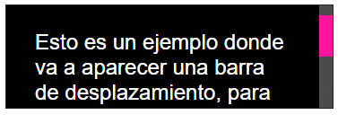

# Interacciones

---

- [Cursor del raton](#cursor-del-raton)
- [Barras de desplazamiento](#barras-de-desplazamiento)
- [Scroll suave](#scroll-suave)
- [Snap Scroll](#snap-scroll)

---

### Cursor del raton

#### Propiedad `cursor`

Para modificar el cursor del ratón solo tenemos que especificar la propiedad `cursor` dentro del elemento que busquemos, junto al valor del cursor deseado:


### Barras de desplazamiento

Para dar estilo a las barras de progreso tenemos las siguientes propiedades en el estándar:


| Propiedad         | Descripción                                                                 |
|-------------------|------------------------------------------------------------------------------|
| `scrollbar-color` | Le da color a la barra de desplazamiento. Primer parámetro a la barra y segundo al fondo. |
| `scrollbar-width` | Le da un tamaño a la barra de desplazamiento. Los valores soportados son `auto`, `thin` y `none`. |
| `scrollbar-gutter`| Reserva espacio (evita desplazamientos inesperados al mostrar/ocultar la barra). |


```html
<div class="container">
  <p>Esto es un ejemplo donde va a aparecer una barra de desplazamiento, para que podamos ver como se le puede dar estilo personalizado.</p>
</div>
```

```css
.container {
  width: 350px;
  height: 75px;
  background: #111;
  padding: 1rem;
  border: 4px solid black;
  color: #fff;
  overflow-y: scroll;

  scrollbar-color: deeppink #222;
  scrollbar-width: thin;
}
```


La palabra `gutter` hace referencia a un «canal», espacio o hueco que se puede configurar a la hora de crear barras de desplazamiento.


| Valor        | Descripción                                                                                                       |
|--------------|--------------------------------------------------------------------------------------------------------------------|
| `auto`       | La barra de desplazamiento ocupa un margen cuando `overflow` está en `auto` o `scroll` y el contenido se desborda. |
| `stable`     | Dicho margen también está presente cuando `overflow` es `hidden`. Ideal para evitar cambios en el diseño.         |
| `both-edges` | Reserva espacio también en el borde opuesto a la barra de desplazamiento. Ideal para mantener diseño simétrico.   |


#### Estilar barras de progreso


Aunque existen propiedades oficiales para estilar barras de desplazamiento, a menudo resultan limitadas en cuanto a personalización. Para una personalización más avanzada, se pueden usar pseudoelementos específicos de navegadores basados en WebKit o Blink (como Chrome, Edge y Safari). Estos permiten mayor control visual, pero no son estándares y no funcionan en navegadores como Firefox. Aun así, si se desea una mayor personalización, estos pseudoelementos `::-webkit-` pueden ser una opción viable, aunque más compleja.


#### Scrollbar con `::-webkit-scrollbar`

Comencemos con el pseudoelemento `::-webkit-scrollbar`, que nos permite dar estilo a la barra de desplazamiento en conjunto. Antes de comenzar, examina el código de .container y observa que estamos cambiando el tamaño del elemento e indicando un overflow-y: scroll para forzar a que haya barra de desplazamiento en el eje Y (vertical).


```html
<div class="container">
  <p>Esto es un ejemplo donde va a aparecer una barra de desplazamiento, para que podamos ver como se le puede dar estilo personalizado.</p>
</div>
```

```css
.container {
  width: 300px;
  max-height: 50px;
  border: 1px solid #222;
  font-size: 1.5rem;
  color: #fff;
  background: #000;
  padding: 2rem;
  overflow-y: scroll;
}

.container::-webkit-scrollbar {
  width: var(--width, 15px);
  background: indigo;
}
```


#### El fondo con `::-webkit-scrollbar-track`

Con el pseudoelemento `::-webkit-scrollbar-track` podemos cambiar el fondo por donde se desplaza la barra de desplazamiento. Ten en cuenta que existe tanto un track como un track-piece, donde este último es una región más interna por donde se puede mover la barra de desplazamiento:


```css
.container::-webkit-scrollbar-track {
  background: #444;
}

.container::-webkit-scrollbar-track-piece {
  background: #555;
}
```


#### La barra con `::-webkit-scrollbar-thumb`

Además, también tenemos el pseudoelemento `::-webkit-scrollbar-thumb` que aplica estilos a la barra de desplazamiento propiamente dicha. Probablemente, es el elemento más importante de los que hemos visto:


```css
.container {
  width: 300px;
  max-height: 50px;
  border: 1px solid #222;
  font-size: 1.5rem;
  color: #fff;
  background: #000;
  padding: 2rem;
  overflow-y: scroll;
}

.container::-webkit-scrollbar {
  width: var(--width, 15px);
  background: #333;
}

.container::-webkit-scrollbar-track {
  background: #444;
}

.container::-webkit-scrollbar-thumb {
  background: yellowgreen;
}

.container::-webkit-scrollbar-thumb:hover { background: lawngreen; }
.container::-webkit-scrollbar-thumb:active { background: deeppink; }
```




#### Los botones con `::-webkit-scrollbar-button`

Observa que hasta ahora puedes mover la barra de desplazamiento tanto arrastrando el thumb como pulsando en las zonas vacías del track. Sin embargo, es posible que quieras añadir los clásico botones de desplazamiento, si te parece más intuitivo.

Esto se hace con el pseudoelemento `::-webkit-scrollbar-button`, que se puede configurar bastante:


```css
.container::-webkit-scrollbar-button {
  background: #222;
}
```


### Scroll suave

En ciertas situaciones, al pulsar enlaces que llevan a un ancla (anchor) de una zona del documento, deseamos que el scroll se realice suavemente, en lugar de moverse directa e instantáneamente, que es el comportamiento por defecto del navegador.

#### Propiedad `scroll-behavior`

La propiedad `scroll-behavior` nos permite activar un desplazamiento suave (smooth scroll) al pulsar en un enlace de anclas `<a>`. Como hemos dicho, por defecto, al pulsar sobre estas anclas, nos desplazamos directa e instantáneamente a nuestro objetivo.


| Propiedad         | Valores         | Descripción                                                                   |
|-------------------|-----------------|-------------------------------------------------------------------------------|
| `scroll-behavior` | `auto` \| `smooth` | Aplicado sobre `<html>`, suaviza ciertos desplazamientos de scroll.           |

Por defecto, la propiedad indicada es auto. Sin embargo, estableciendo el valor smooth a esta propiedad en el elemento `<html>`, podemos suavizar este comportamiento, de modo que se realiza de forma progresiva, muy suave:


```css
html {
  scroll-behavior: smooth;
}
```

En el siguiente ejemplo tenemos 1 página que tiene 3 secciones a pantalla completa. El usuario puede desplazarse entre ellas con el scroll o usando enlaces de navegación ubicados en la parte superior derecha. Sin aplicar CSS, el comportamiento por defecto (`scroll-behavior: auto`) hace que al hacer clic en un enlace ancla, el navegador salte directamente a la sección de forma instantánea. ¿Te gustaría que resumiera también qué cambia si se aplica `scroll-behavior: smooth`?


```html
<nav>
  <a href="#slide-1">Slide 1</a> ·
  <a href="#slide-2">Slide 2</a> ·
  <a href="#slide-3">Slide 3</a>
</nav>

<div class="container">
  <div class="slide" id="slide-1">
    <h1>Slide 1</h1>
  </div>
  <div class="slide" id="slide-2">
    <h1>Slide 2</h1>
  </div>
  <div class="slide" id="slide-3">
    <h1>Slide 3</h1>
  </div>
</div>
```


```css
html {
  scroll-behavior: smooth;  /* defecto -> scroll-behavior: auto */
}

body, h1 {
  margin: 0;   /* Reset margins */
}

nav {
  position: fixed;
  top: 5px;
  right: 5px;
  background: white;
  padding: 5px 10px;
}

.container {
  height: 100vh;
}

.slide {
  height: 100%;
  background: var(--color, #aaa);
}

.slide:nth-child(2) { --color: steelblue; }
.slide:nth-child(3) { --color: tomato; }
```


### Snap Scroll


El estándar de CSS nos da la posibilidad de utilizar ciertas propiedades de ajuste tras un desplazamiento suave de ratón o con el dedo en dispositivos móviles. Con ello, podemos conseguir que un elemento se ajuste exactamente en el lugar correspondiente que nos interesa, justo al acabar el scroll.

Estas propiedades pertenecen a la familia de propiedades `scroll-snap`, entre las cuales se encuentran `scroll-snap-type` o `scroll-padding`, entre otras, que veremos a continuación. En principio, se dividen entre propiedades que utilizaremos en el contenedor padre, y propiedades que utilizaremos en los elementos hijos.

Para ello, utilizaremos el esquema del ejemplo base del artículo anterior, donde el elemento con clase `.container` es el elemento padre contenedor y los elementos con clase `.slide` son los elementos hijos:


```html
<div class="container">
  <div class="slide" id="slide-1">
    Elemento hijo
  </div>
  <div class="slide" id="slide-2">
    Elemento hijo
  </div>
  <div class="slide" id="slide-3">
    Elemento hijo
  </div>
</div>
```

### Propiedades para el contenedor

Así pues, dentro del estándar de CSS Scroll Snap, tenemos unas propiedades que afectan a nuestro elemento padre contenedor. Son las siguientes propiedades:


| Propiedad          | Valores        | Descripción                                                                 |
|--------------------|----------------|------------------------------------------------------------------------------|
| `scroll-snap-type` | `none` \| `snap-direction` `snap-type`   | Establece el tipo de desplazamiento de scroll y su dirección.               |
| `scroll-padding`   | `auto` \|  `size`    | Establece el relleno que tendrá el scroll.                                  |


#### Propiedad `scroll-snap-type`

La propiedad `scroll-snap-type` es la propiedad de control que establece el mecanismo de ajuste de scroll en el desplazamiento por parte del usuario. Para ello, tenemos que indicar dos valores:

| Categoría                           | Valor                                           | Descripción                                                               |
|-------------------------------------|-------------------------------------------------|---------------------------------------------------------------------------|
| `snap-direction`         | `x` \| `y` \| `block` \| `inline` \| `both`     | Indica en qué eje ajustará el desplazamiento del scroll.                 |
| `snap-type` | `mandatory` \| `proximity`                     | Indica el modo en el que se ajustará al finalizar el scroll del usuario. |


#### Propiedad `scroll-padding`

También tenemos disponible la propiedad `scroll-padding`, que permite indicar una separación de relleno entre el ajuste que encaja exactamente al terminar el desplazamiento y el límite de esa zona. Como la propiedad padding de CSS, `scroll-padding` también tiene sus propiedades individuales:


### Propiedades para los hijos

En las propiedades hijas de nuestro contenedor con CSS Scroll Snap (en nuestro caso .slide), tenemos las siguientes propiedades que nos permitirán configurar el ajuste de scroll:


| Propiedad             | Valor                             | Descripción                                                                 |
|------------------------|-----------------------------------|-----------------------------------------------------------------------------|
| `scroll-snap-align`   | `none` \| `start` \| `end` \| `center` | Define cómo se alinea el elemento dentro del contenedor de scroll.         |
| `scroll-snap-stop`    | `normal` \| `always`              | Indica si el scroll puede pasar por alto un punto de ajuste o no.          |
| `scroll-margin`       | `0` \| (valores de longitud)      | Añade una separación entre el elemento y el borde del contenedor al hacer scroll snap. |

#### Propiedad `scroll-snap-align`

La propiedad `scroll-snap-align` es una propiedad que permite indicar la posición de ajuste. Puede tomar los valores `start`, `end` y `center` y en el caso de indicarse dos parámetros, se aplica al eje horizontal (inline) y al eje vertical (block). Si sólo se indica un parámetro, se aplica el mismo valor a ambos.

Para entender esto con nuestro ejemplo, lo mejor es cambiar el height de .slide a un valor como 75% (por ejemplo). Ahora cada slide, ocupará el 75% de la pantalla, y por lo tanto si modificamos `scroll-snap-align` con el valor...

- ...`start`, el `.slide` ajustará su parte inicial en la parte superior del navegador.
- ...`end`, el `.slide` ajustará su parte final en la parte inferior del navegador.
- ...`center`, el `.slide` se ajustará de modo que esté centrado en el navegador.


#### Propiedad `scroll-snap-stop`

La propiedad `scroll-snap-stop` permite indicar los valores normal o always para permitir que el navegador «atrape» el desplazamiento y lo detenga si pasa por una zona sensible a ajustarse en ella. La diferencia es que el valor por defecto normal permite pasar por una de estas zonas, mientras que el valor always define que si pasa por una zona, se detenga en ella.


#### Propiedad `scroll-margin`

De forma análoga a scroll-padding, también tenemos una propiedad `scroll-margin` que podemos aplicar en nuestros elementos hijos. Esta propiedad permite indicar un margen externo al hijo, que permitirá que se vea el elemento anterior (o posterior, dependiendo donde ajustemos), ya que aplica un margen al scroll.

De la misma forma que el anterior, podemos utilizar sus propiedades individuales:


| Propiedad               | Descripción                                                                 |
|-------------------------|-----------------------------------------------------------------------------|
| `scroll-margin-top`     | Indica un margin de separación en la zona superior al detener el scroll.   |
| `scroll-margin-right`   | Idem en la zona derecha.                                                    |
| `scroll-margin-bottom`  | Idem en la zona inferior.                                                   |
| `scroll-margin-left`    | Idem en la zona izquierda.                                                  |
| `scroll-margin`         | Propiedad de atajo. 1, 2, 3 ó 4 parámetros (funciona igual que la propiedad `margin`). |


Ejemplo.

```html
<nav>
  <a href="#slide-1">Slide 1</a> ·
  <a href="#slide-2">Slide 2</a> ·
  <a href="#slide-3">Slide 3</a>
</nav>

<div class="container">
  <div class="slide" id="slide-1">
    <h1>Slide 1</h1>
  </div>
  <div class="slide" id="slide-2">
    <h1>Slide 2</h1>
  </div>
  <div class="slide" id="slide-3">
    <h1>Slide 3</h1>
  </div>
</div>
```

```css
body, h1 {
  margin: 0;    /* Reset margins */
}

nav {
  position: fixed;
  top: 5px;
  right: 5px;
  background: white;
  padding: 5px 10px;
}

.container {
  height: 100vh;
  overflow-y: scroll;
  scroll-snap-type: y mandatory;
  scroll-padding: 0;
}

.slide {
  height: 100%;
  background: var(--color, #aaa);
}

.slide:nth-child(2) { --color: steelblue; }
.slide:nth-child(3) { --color: tomato; }

/* Propiedades de elementos hijos */

.slide {
  scroll-snap-align: start;
  scroll-margin: 0;
}
```


- Con la propiedad `scroll-snap-align` indicamos donde debe detenerse el scroll. Recuerda modificar el tamaño de alto del slide si quieres verlo sobre este ejemplo.

- Aumentando la propiedad `scroll-margin` comprobarás que se establece un márgen que se aplica al scroll con ajuste que estamos realizando en este artículo.

Veamos un ejemplo haciendo un scroll horizontal:


```html
<div class="container">
  <div class="item">Item 1</div>
  <div class="item">Item 2</div>
  <div class="item">Item 3</div>
  <div class="item">Item 4</div>
  <div class="item">Item 5</div>
</div>
```

```css
.container {
  padding: 1em;
  background: lightgrey;
  display: grid;
  grid-template-columns: repeat(5, 1fr);
  width: 150px;
  gap: 30px;

  overflow-x: scroll;
  scroll-snap-type: x proximity;
}

.item {
  background: red;
  width: 150px;
  height: 50px;
  color: #fff;

  display: flex;
  justify-content: center;
  align-items: center;

  scroll-snap-align: start;
  scroll-margin: 15px;
}
```


Pasemos a otro ejemplo:

1. `scroll-snap-type` (en el contenedor)

Define cómo debe comportarse el scroll en cuanto a la alineación de los elementos hijos.

- `x` o `y`: eje horizontal o vertical.
- `mandatory`: el navegador debe forzar el snap.
- `proximity`: el navegador hace snap solo si estás cerca del punto de alineación.

2. `scroll-padding` (opcional, en el contenedor)

Sirve para crear "espacio interior" y que los puntos de snap respeten esa distancia.

3. `scroll-snap-align` (en los hijos)

Define dónde se alinea el elemento dentro del contenedor.

- `scroll-snap-align`: start; /* start | center | end */

4. Bonus: otras propiedades útiles

- `scroll-snap-stop`: normal o always. Controla si el scroll puede saltar snaps rápidamente o no.

- Funciona con `overflow`: scroll, auto, o hidden + `scroll-behavior: smooth` para un efecto más suave.


```html
<div class="container">
  <section class="slide">Slide 1</section>
  <section class="slide">Slide 2</section>
  <section class="slide">Slide 3</section>
</div>
```

```css
.container {
  display: flex;

  overflow-x: scroll;
  scroll-snap-type: x mandatory; /* Aplica scroll snap en el eje horizontal */
  scroll-padding: 0 20px; /* (opcional) añade relleno para el scroll */
}

.slide {
  flex: 0 0 100vw; /* Cada sección ocupa todo el ancho de la ventana */
  scroll-snap-align: start; /* Hace que el inicio del elemento se alinee al hacer scroll */

  height: 100vh;
  display: flex;
  align-items: center;
  justify-content: center;
  font-size: 2rem;
  background-color: lightgray;
  border: 1px solid #ccc;
}
```


---
