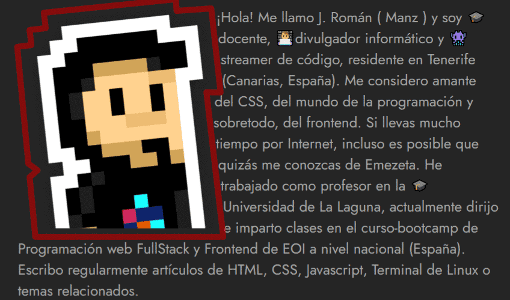
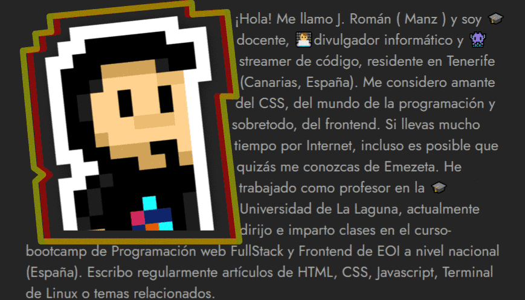
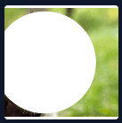
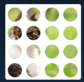
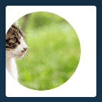

# Mascaras y recortes

---

- [Propiedad clip-path](#propiedad-clip-path)
- [Propiedad float](#propiedad-float)
- [Propiedad shape-outside](#propiedad-shape-outside)
- [Mascaras en css](#mascaras-en-css)

---

### Tipos de formas CSS

Por lo tanto, siempre que hagamos referencia a una forma  nos referimos a alguna de las funciones siguientes:


| Valor                        | Descripción                                                                 |
|------------------------------|-----------------------------------------------------------------------------|
| `inset(top right bottom left )`                    | Crea una forma rectangular "hacia dentro".                                  |
| `inset(top right bottom left ... round radius)`   | Igual a la anterior, pero con bordes redondeados del tamaño especificado.   |
| `xywh(x y width height)`                     | Crea una forma rectangular definiendo su desplazamiento y tamaño.          |
| `xywh(x y width height... round radius)`    | Igual a la anterior, pero con bordes redondeados del tamaño especificado.   |
| `circle(size at x y)`       | Crea una forma circular con tamaño y centro definidos.                      |
| `ellipse(sx sy at x y)`     | Igual a la anterior, pero con ancho y alto diferentes.                      |
| `polygon(x1 y1, x2 y2, ...)`| Crea una forma poligonal siguiendo las coordenadas indicadas.              |
| `path( coords )`          | Crea una forma basada en un trayecto SVG.                                   |


#### Función `rect()`

Con la función `rect()` podemos establecer un rectángulo en cualquier elemento y quedarnos con esa porción de elemento. En la función, los parámetros establecidos son rect(top right bottom left). Veamos un ejemplo:


```html
<div class="box">CSS</div>
```

```css
.box {
  width: 200px;
  height: 200px;
  background: indigo;
  border: 5px solid black;
  color: gold;
  font-size: 4rem;

  clip-path: rect(10px 125px 90px 0);
}
```

%201.png)


En este caso, estamos recortando un rectángulo utilizando estos cuatro puntos de referencia:

- Desde arriba `top`, marca donde empieza a recortar: `10px`
- Desde la izquierda `left`, marca hasta donde recorta: `125px`
- Desde arriba `top`, marca hasta donde recorta: `90px`
- Desde la izquierda `right`, marca donde empieza a recortar: `0`


#### Función `inset()`

En el caso de la función `inset()`, estamos estableciendo un cuadrado o rectángulo, donde cada parámetro (top, right, bottom, left) indicará un porcentaje que representa la distancia desde su punto concreto.

```html
<div class="box"></div>
```

```css
.box {
  border: 4px solid black;
  background: hotpink;
  width: 200px;
  height: 200px;
  
  clip-path: inset(0 0 50% 50%);
}
```

%201.png)

Así pues, inset(0% 0% 50% 50%) parte desde el 0% de la parte superior, desde el 0% de la parte derecha, desde la mitad (50%) de la parte inferior y desde la mitad (50%) de la parte izquierda:


También es posible redondear los bordes del cuadrado o rectángulo, indicando al final la palabra clave round junto al radio de borde que quieres especificar. Por ejemplo:


```css
.box {
  background: hotpink;
  width: 200px;
  height: 200px;
  clip-path: inset(50px round 20px);
}
```

%202.png)


#### Función `xywh()`

Con esta función podemos definir un recorte basado en una posición concreta x,y (los dos primeros parámetros) y un tamaño de ancho y de alto w,h (los dos últimos parámetros). Es muy sencilla de utilizar, como veremos a continuación:


```html
<div class="box"></div>
```

```css
.box {
  background: indigo;
  width: 200px;
  height: 200px;
  
  clip-path: xywh(25px 25px 150px 50px);
}
```

%201.png)

#### Función `circle()`

En el caso de la función `circle()`, vamos a establecer una forma circular en una porción del elemento, pudiendo recortar formas como círculos, medias lunas, etc. Veamos un ejemplo con un fragmento de código:


```html
<div class="box"></div>
```

```css
.box {
  background: hotpink;
  width: 200px;
  height: 200px;

  clip-path: circle(50% at 50% 0);
}
```

%201.png)


Así pues, en este caso, observa que indicamos circle(50% at 50% 0). El primer parámetro indica el tamaño de la forma geométrica circular (50%), y las coordenadas después de at es el punto central del círculo: 50% en x y 0% en y. Quedaría algo así:


#### Función `ellipse()`

El caso de la función `ellipse()` es exactamente igual que el de circle() sólo que en las formas elípticas podemos establecer un ancho y alto diferente, mientras que en las formas circulares sólo podemos establecer un tamaño de ancho y alto idéntico:


```html
<div class="box"></div>
```

```css
.box {
  background: hotpink;
  width: 200px;
  height: 200px;

  clip-path: ellipse(50% 25% at 50% 0);
}
```

%201.png)


Como ya hemos comentado, la diferencia respecto a ellipse() es que en el tamaño de la elipse le podemos indicar el tamaño de ancho y de alto, mientras que en el círculo este valor es el mismo en ambos y sólo se indica uno.


#### Función `polygon()`

Probablemente, el tipo de forma básica más potente y versátil sea crear una forma poligonal utilizando `polygon()`. Su funcionamiento es muy sencillo, pero a la vez muy flexible. Simplemente hay que indicar los puntos clave deseados e iremos creando la forma poco a poco:


```html
<div class="box"></div>
```

```css
.box {
  background: hotpink;
  width: 200px;
  height: 200px;
  clip-path: polygon(0 0, 100% 0, 50% 100%);
}
```

En este ejemplo, polygon() tiene 3 puntos clave separados por comas (cada uno con sus coordenadas en X e Y), formando un triángulo, pero se pueden indicar tantos puntos de corte como se quiera (incluso con valores negativos o superiores a 100%):


Recuerda que es posible crear polígonos mucho más complejos, con más puntos clave (o puntos de corte), consiguiendo polígonos con 3 puntos (triángulos), con 4 puntos (cuadrados o rectángulos), con 5 puntos (pentágonos), etc. La ventaja de las formas poligonales es que son mucho más personalizables.


#### Función `path()`

Si buscamos algo un poco más de flexiblilidad y potencia, podemos crear un trayecto personalizado mediante la función `path()`. Con ella podemos definir un trayecto SVG para crear una forma que puede ser mucho más complejas, imposibles (o muy difíciles) de conseguir utilizando sólo HTML/CSS.

En los parámetros de `path()` se pasa un  que es una serie de coordenadas de un trayecto SVG, o lo que es lo mismo, el atributo d (data) de un elemento `<path>` de SVG:


```html
<div class="box"></div>
```

```css
.box {
  width: 256px;
  height: 256px;
  background: url("manzdev.png") center / cover;

  clip-path:
    path("m4,87l93,0l29,-84l29,84l93,0l-76,52l29,84l-76,-52l-76,52l29,-84l-76,-52z");
}
```

%201.png)


### Propiedad `clip-path`

Esta propiedad permite realizar un recorte con una forma concreta, ocultando toda la región externa del recorte. Su utilización es muy sencilla y permite realizar formas muy flexibles y versátiles.


| Propiedad   | Valor                        | Descripción                                                                 |
|-------------|------------------------------|-----------------------------------------------------------------------------|
| clip-path   | none                         | Deja el elemento sin recorte o elimina el recorte aplicado previamente.     |
| clip-path   | `<forma geométrica>`         | Crea un recorte con una forma geométrica básica (como `circle()`, `polygon()`, etc.). |
| clip-path   | `url("file.svg#name")`       | Crea un recorte usando una forma definida por el elemento con ID "name" dentro de un archivo SVG externo. |

La propiedad clip-path en general puede tomar estos tres tipos de valores:

- `none`, el valor por defecto, donde no utilizamos ningún tipo de recorte (o lo desactivamos si lo había).
- `shape`, es decir, una forma básica específica
- `url()`, donde indicamos una imagen SVG para utilizar un recorte personalizado usado en su interior mediante `<clipPath>`.


#### Formas básicas de recorte

Con la propiedad `clip-path` podemos crear recortes con formas geométricas básicas, utilizando las siguientes funciones:

| Función CSS | Descripción                                                                 |
|-------------|------------------------------------------------------------------------------|
| `inset()`   | Rectángulos o cuadrados que se amplían hacia dentro.                        |
| `circle()`  | Formas circulares.                                                          |
| `ellipse()` | Elipses u óvalos. Igual que los círculos, pero con ancho y alto diferentes. |
| `polygon()` | Polígonos y formas con 3 o más vértices.                                    |
| `path()`    | Trayectos SVG específicos.                                                  |


Estas formas básicas de recorte nos permiten establecer unos parámetros para definir así la forma geométrica detalladamente. Por ejemplo, observa como utilizamos la propiedad polygon():

```html
<div class="box"></div>
```

```css
.box {
  background: hotpink;
  width: 200px;
  height: 200px;
  clip-path: polygon(0 0, 100% 0, 50% 100%);
}
```

%201.png)


### Propiedad float

Existe una propiedad denominada float que tiene un funcionamiento peculiar con el que cambiamos el flujo de ordenación de los elementos de una página.

>**Importante:** En el pasado, la propiedad `float` se usaba para maquetación y creación de layouts, cuando no había una necesidad prioritaria de crear layouts responsive u otras características relacionadas. Actualmente, `float` no debe utilizarse para maquetación, pero sigue siendo buena práctica para usar junto a propiedades como `shape-outside`.

Con la propiedad float podemos conseguir que un elemento «flote» a la izquierda o a la derecha de otro elemento. Para ello podemos utilizar las siguientes propiedades:


| Propiedad | Valor                         | Significado                                                                 |
|-----------|-------------------------------|-----------------------------------------------------------------------------|
| `float`   | `none` \| `left` \| `right`   | Cambia el flujo para que el elemento flote a la izquierda o derecha.       |
| `clear`   | `none` \| `left` \| `right` \| `both` | Impide que los elementos puedan flotar en la orientación indicada. |


### Propiedad `shape-outside`

En algunos casos puede interesarnos crear formas alrededor de imágenes para que el texto se adapte y se consiga una apariencia más bonita. Sin embargo, es un objetivo que en CSS puede ser bastante complejo de conseguir, salvo que se conozcan las siguientes propiedades:


| Propiedad               | Valor                         | Descripción                                                                 |
|-------------------------|-------------------------------|------------------------------------------------------------------------------|
| `shape-outside`         | `none`  `shape`                      | Desactiva el ajuste de texto alrededor de una forma.                        |
| `shape-outside`         | `shape` (imagen, gradiente) | Define una forma para ajustar el texto, como una imagen o gradiente.        |
| `shape-margin`          | `0` (o valores positivos)     | Margen adicional alrededor de la forma definida.                            |
| `shape-image-threshold` | `0` a `1`                     | Determina la sensibilidad a la transparencia para generar la forma desde una imagen. |


Antes de comenzar a explicar estas propiedades, partamos del siguiente ejemplo, donde utilizaremos la propiedad enemiga y archienemiga `float` para hacer flotar un elemento a la izquierda o a la derecha de un texto, en este caso, a la izquierda.

La propiedad `float` se usó en el pasado para crear layouts, algo que hoy en día ha sido completamente reemplazado por sistemas como `Flexbox` o `Grid`, pero que sin embargo, se puede utilizar hoy perfectamente para combinar con la propiedad `shape-outside` y realizar las formas flotantes que veremos a continuación.


```html
<div class="container">
  
  <p>
    ¡Hola! Me llamo J. Román ( Manz ) y soy 🎓docente, 👨‍💻divulgador informático
    y 👾streamer de código, residente en Tenerife (Canarias, España). Me considero
    amante del CSS, del mundo de la programación y sobretodo, del frontend. Si
    llevas mucho tiempo por Internet, incluso es posible que quizás me conozcas
    de Emezeta. He trabajado como profesor en la 🎓Universidad de La Laguna,
    actualmente dirijo e imparto clases en el curso-bootcamp de Programación web
    FullStack y Frontend de EOI a nivel nacional (España). Escribo regularmente
    artículos de HTML, CSS, Javascript, Terminal de Linux o temas relacionados.
  </p>
</div>
```

```css
body {
  background: #222;
  color: #999;
}

.container {
  font-family: Jost;
  font-size: 1.5rem;
  max-width: 800px;
  margin: auto;
}

.sticker {
  float: left;
}
```


Utilizando la propiedad `shape-outside` e indicando la misma imagen que hemos establecido en nuestro HTML, podemos indicarle al navegador, que debe ignorar la zona transparente de la imagen, de modo que cree una forma adaptada a la imagen, y por consecuencia, permita al texto que se encuentra alrededor acomodarse alrededor de la imagen:

El navegador utilizará la transparencia de la imagen para acomodarse automáticamente, sin necesidad de utilizar ninguna otra propiedad adicional salvo shape-outside y float. El código CSS sería el siguiente:


```css
.sticker {
  shape-outside: url("manzdev.png");
  float: left;
}
```



Mediante la propiedad `shape-margin` podemos definir la distancia de margen que queremos aplicar a la forma creada con `shape-outside`. Es posible que esta forma creada no sea lo suficientemente grande como para separar el texto de una forma visualmente aceptable:


```css
.sticker {
  shape-outside: url("manzdev.png");
  shape-margin: 1rem;
  float: left;
}
```




### Mascaras en css

Existe una familia de propiedades CSS poco conocidas que permiten crear máscaras de composición, mediante las cuales, utilizando imágenes o formas "compatibles", puedes establecer máscaras que recortarán o establecerán formas compuestas aplicadas a elementos de nuestro HTML.

Para crear estas máscaras utilizaremos las siguientes propiedades. Varias de ellas están basadas en las propiedades individuales de la familia de propiedades `background`. Por ejemplo, mask-repeat es similar a `background-repeat:`


| Propiedad           | Descripción                                                  | Similar a...         |
|---------------------|--------------------------------------------------------------|----------------------|
| `mask-image`        | Indica una imagen, gradiente o forma SVG para usar como máscara. | `background-image`   |
| `mask-mode`         | Indica si usar canales alfa o de luz como máscara.            | -                    |
| `mask-repeat`       | Indica cómo se repetirá una máscara con tamaño y posición.    | `background-repeat`  |
| `mask-position`     | Indica la posición donde debe empezar la máscara.             | `background-position`|
| `mask-clip`         | Indica el área al que afectará la máscara.                    | `background-clip`    |
| `mask-origin`       | Indica cómo posicionar el área que afectará a la máscara.     | `background-origin`  |
| `mask-size`         | Permite darle un tamaño específico a la máscara.              | `background-size`    |
| `mask-composition`  | Si hay múltiples máscaras, define cómo aplicar la composición. | -                    |
| `mask`              | Propiedad abreviada para todas las anteriores.                | `background`         |


#### Propiedad `mask-image`

La propiedad principal de las máscaras CSS es `mask-image`, la cuál se puede pensar en ella como un análogo a background-image con las imágenes de fondo. En su caso, `mask-image` establece una imagen a modo de máscara, y aunque hablamos de imagen, realmente nos referimos a varios tipos de elementos:

| Propiedad     | Valor                                  |
|---------------|----------------------------------------|
| `mask-image`  | `none` \| `gradient` \| `url(image)` \| `url(svgfile#id)` |


Como ves, tenemos varias opciones:

- 1️⃣ Utilizar none y no aplicar máscara. Valor por defecto.
- 2️⃣ Usar una imagen externa referenciada (JPEG, PNG, WEBP, etc...)
- 3️⃣ Usar un gradiente creado con CSS (linear, radial o conic)
- 4️⃣ Usar una referencia a una parte de un SVG mediante su id

Con la propiedad mask-image creamos una máscara negra basada en un gradiente como la de la imagen. Esta máscara se aplicará al elemento y su imagen de fondo, de modo que la parte en negro oculta y la parte transparente deja ver la imagen:


Esto es una fantástica forma de enmascarar nuestras imágenes y darle formas flexibles y potentes mediante código. Recuerda que puedes utilizar no sólo gradientes radiales, sino otro tipos de gradientes, imágenes con transparencia o formas personalizadas mediante SVG.


```html
<div class="element"></div>
```

```css
.element {
  width: 600px;
  height: 400px;
  background: url("gato.jpg") left / cover;
  mask-image: radial-gradient(circle 250px at 40% 50%, black 75%, transparent 76%);

  &:hover {
    mask-image: none;
  }
}
```

#### Propiedad `mask-mode`

Mediante la propiedad CSS `mask-mode` podemos cambiar el modo en el que se crea la máscara. La propiedad tiene los siguientes valores posibles:

| Propiedad   | Valor                            |
|-------------|----------------------------------|
| `mask-mode` | `match-source` \| `alpha` \| `luminance` |


En el caso de utilizar un modo alpha, la máscara utilizará los valores alfa de la máscara para utilizarlos como transparencia. Sin embargo, si configuramos el valor luminance utilizará los valores con más brillo para utilizarlos como transparencia. Esto nos podría servir por ejemplo, para invertir la máscara de forma rápida:


```html
<div class="element"></div>
```

```css
.element {
  width: 600px;
  height: 400px;
  background: url("gato.jpg") left / cover;
  mask-image: radial-gradient(circle 250px at 40% 50%, black 75%, white 76%);
  mask-mode: luminance;
}
```




#### Propiedad `mask-repeat`

La propiedad `mask-repeat` se entiende fácil si hacemos el simil con la propiedad background-repeat de la familia de propiedades de imágenes de fondo, ya que funciona exactamente igual. Los valores disponibles son los siguientes:


```html
<div class="element"></div>
```


```css
.element {
  width: 600px;
  height: 400px;
  background: url("gato.jpg") left / cover;
  mask-image: radial-gradient(circle 50px at 50px 50px, black 75%, transparent 78%);
  mask-repeat: repeat;
  mask-size: 100px 100px; /* Ver más adelante */
}
```




#### Propiedad `mask-position`

La propiedad `mask-position` permite colocar la máscara de imagen y desplazarla una cierta cantidad de espacio. Por defecto, el valor indicado es 0% 0%, por lo que se colocará lo más a la izquierda y arriba posible. Sin embargo, podemos cambiar los valores a:

- left, center o right para el eje x
- top, center o bottom para el eje y
- Valores de tamaño para ambos ejes


```html
<div class="element"></div>
```

```css
.element {
  width: 600px;
  height: 400px;
  background: url("gato.jpg") left / cover;
  mask-image: radial-gradient(circle 250px at 40% 50%, black 75%, transparent 76%);
  mask-position: 160px 0px;
}
```



---
