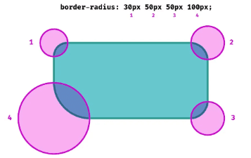
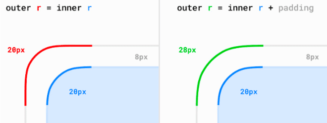
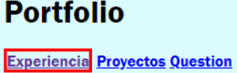
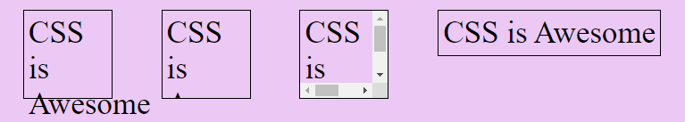
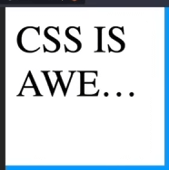

# Modelo de caja

---

- [Tipos de elementos](#tipos-de-elementos)
- [Propiedad border](#propiedad-border)
- [Propiedad border-radius](#propiedad-border-radius)
- [Bordes con gradientes](#bordes-con-gradientes)
- [Propiedad margin](#propiedad-margin)
- [Propiedad padding](#propiedad-padding)
- [Propiedad box-sizing](#propiedad-box-sizing)
- [Desbordamiento overflow](#desbordamiento-overflow)

---

Cuando hablamos del modelo de cajas en CSS, estamos haciendo referencia a un sistema que tiene el navegador de interpretar las diferentes partes de lo que solemos denominar **caja**: un elemento HTML con unas ciertas dimensiones.

### Propiedades del modelo de cajas

- **borde:** en negro, es el límite que separa el interior del exterior del elemento.
- **márgen:** naranja, es la parte exterior del elemento, por fuera del borde.
- **relleno o padding:** en verde, es la parte interior del elemento, entre el contenido y el borde.
- **contenido:** en azul, es la parte interior del elemento, excluyendo el relleno.


### Zonas de un elemento

En CSS existen ciertas palabras clave para hacer referencia a una zona u orientación concreta sobre un elemento.


### Tipos de elementos


### Propiedad `border`

En CSS es posible especificar el aspecto que tendrán los bordes de cualquier elemento HTML, pudiendo incluso, dar diferentes características a zonas particulares del borde, como por ejemplo, el borde superior, el borde izquierdo, el borde derecho o el borde inferior.

|Propiedad|Valor|Significado|
|---------|-----|-----------|
|`border-width`|thin / medium / thick|Especifica un tamaño predefinido para el grosor del borde.|
|`border-width`|`size`|Especifica un tamaño específico para el grosor del borde.|
|`border-style`|none `style`|	Define el estilo para el borde a utilizar (ver más adelante).|
|`border-color`|black `color`|Especifica el color que se utilizará en el borde.|
|`border`|`size` `style` `color`|Propiedad de atajo para simplificar valores.|

#### Atajo: Propiedad `border`

```css
.element {
  border-width: 1px;
  border-style: solid;
  border-color: #000000;

  /* Equivalente a... */
  border: 1px solid #000;
}
```

### Propiedad `border-radius`

Para agregar esquinas redondeadas a un cuadro, usa la propiedad `border-radius`.

|Propiedad|Valor|Significado|
|---------|-----|-----------|
|`border-radius`|`size`|1 parámetro. Aplica el radio a todas y cada una de las esquinas.|
||`size` `size`|2 parámetros: top-left + bottom-right y a top-right + bottom-left.|
||`size` `size` `size`|3 parámetros: top-left, a top-right y bottom-left y a bottom-right.|
||`size` `size` `size` `size`|	4 parámetros. Orden de las agujas del reloj, empezando por top-left.|

```css
.element {
  border-radius: 25px;              /* 1 parámetro */
  border-radius: 25% 50%;           /* 2 parámetros */
  border-radius: 50px 25px 10px;    /* 3 parámetros */
  border-radius: 25px 0 15px 50px;  /* 4 parámetros */
}
```



#### Esquinas redondeadas específicas

Al igual que con las otras propiedades del borde, puedes definir el radio del borde de cada lado con:

- `border-top-left-radius`
- `border-top-right-radius` 
- `border-bottom-right-radius`
- `border-bottom-left-radius`


#### Esquinas perfectas




#### Borde vs Outline

- `border`: Es el border del contenido, da salto porque modifica el contenido de la caja.
- `outline`: Dibuja un contorno encima del contenido, no da salto.

```css
a:hover {
  outline: 3px solid red;
}
```




>**Nota:** Si queremos usar un efecto `:hover` podemos usar `outline` en vez del border.

### Bordes con gradientes

Eliminamos el fondo con none y establecemos el color de texto a blanco. Ahora, vamos a añadir las propiedades de la técnica 9-slice, que es con las que podremos darle un gradiente:

- Con `border-image-source` se suele dar una imagen. Como CSS puede usar gradientes en donde se pueden usar imágenes, añadimos un gradiente lineal, con tres colores.
- Con `border-image-slice` se indica que el borde usará el gradiente completo. Se puede abreviar a 1.
- Con `border-image-width` se indica el tamaño del gradiente.

```html
<button>Texto del botón</button>
<button class="fill">Texto del botón (relleno)</button>
```

```css
body {
  background: #111;
}

button {
  font-family: Jost, sans-serif;
  font-size: 1rem;

  padding: 1rem 2rem;
  background: none;
  color: #fff;

  border-image-source: linear-gradient(indigo, purple, hotpink);
  border-image-slice: 1 1 1 1;
  border-image-width: 0.25rem;

  &.fill {
    border-image-slice: 1 1 1 1 fill;
  }
}
```


Observa que el segundo botón le hemos establecido un valor 1 1 1 1 fill, esto se comporta exactamente igual que 1 1 1 1, pero sin descartar el relleno, por lo que pinta también el interior.

>**Nota:** La propiedad `border-image-source` sólo soporta una imagen. No se le pueden establecer múltiples imágenes.

### Propiedad `margin`

El tamaño de dichos márgenes se puede alterar en conjunto (de forma general) o de forma específica a cada una de las zonas del elemento (izquierda, derecha, arriba o abajo). Veamos primero las propiedades específicas para cada zona:

|Propiedad|Valor|Significado|
|---------|-----|-----------|
|`margin-top`|auto / `size`|Establece un tamaño de margen superior.|
|`margin-left`|auto / `size`|Establece un tamaño de margen a la izquierda.|
|`margin-right`|auto / `size`|Establece un tamaño de margen a la derecha.|
|`margin-bottom`|auto / `size`|Establece un tamaño de margen inferior.|

Podemos aplicar diferentes márgenes a cada zona de un elemento utilizando cada una de estas propiedades, o dejando al nevegador que lo haga de forma automática indicando el valor auto.

>**Nota:** Hay que recordar diferenciar bien un `margin` de un `padding`, puesto que no son la misma cosa. Los rellenos (`padding`) son los espacios que hay entre los bordes del elemento en cuestión y el contenido del elemento (por la parte interior). Mientras que los márgenes (`margin`) son los espacios que hay entre los bordes del elemento en cuestión y los bordes de otros elementos (parte exterior).

#### El Margin Collapse

CSS tiene varios mecanismos de maquetación. Los más básicos son `inline` y `block`, y en ellos, ocurre la siguiente situación. Imaginemos que tenemos dos elementos adyacentes, y cada uno de ellos, tiene un margen de 20px definido.

Quizás, lo más intuitivo es pensar que que el elemento de la izquierda tiene 20px de margen derecho, mientras que el elemento de la derecha tiene 20px de margen izquierdo, que al sumarse, predecimos que resultará un tamaño de 40px. Sin embargo, la realidad es distinta:


### Propiedad `padding`

Al igual que con los márgenes, los padding tienen varias propiedades para indicar el relleno de cada zona:

|Propiedad|Valor|Significado|
|---------|-----|-----------|
|`padding-top`|0 / `size`|Aplica un relleno interior en el espacio superior de un elemento.|
|`padding-left`|0 / `size`|Aplica un relleno interior en el espacio izquierdo de un elemento.|
|`padding-right`|0 / `size`|Aplica un relleno interior en el espacio derecho de un elemento.|
|`padding-bottom`|0 / `size`|Aplica un relleno interior en el espacio inferior de un elemento.|

#### ¿Cómo usar el atajo en margin y padding?

Al igual que en otras propiedades de CSS, también existe una propiedad de atajo denominada `margin` y `padding`. Con estas propiedades evitamos tener que escribir los valores de cada parte (izquierda, derecha, arriba, abajo...), especialmente importante si es el mismo valor en las cuatro.

```css
.examples {
  margin: 15px;
  /* 
  1 parámetro. Aplica el mismo margen a todos los lados.
  Equivalente a margin: 15px 15px 15px 15px; 
  */

  margin: 20px 10px;
  /*
  2 parámetros. Aplica margen top/bottom y left/right.
  Equivalente a margin: 20px 10px 20px 10px; 
  */

  margin: 20px 10px 5px;
  /* 
  3 parámetros. Aplica margen top, left/right y bottom.
  Equivalente a margin: 20px 10px 5px 10px; 
  */

  margin: 20px 10px 5px 10px;
  /* 
  4 parámetros. Aplica margen top, right, bottom e left.
  Equivalente a margin: 20px 10px 5px 10px; 
  */
}
```

#### Ejemplo de padding y border

Veamos un ejemplo de como funciona el `padding` y `border` y como influye en el tamaño real de la caja.

```html
<section class="container">
  <p>hola</p>
</section>
```

```css
.container {
  width: 100px;
  height: 100px;
  background: white;
  padding: 20px 10px 5px;
  border: 10px solid;
}
```
El `padding` corresponde al color verde en la imágen:


Si vemos en las herramientas de desarrollo del navegador e inspeccionamos el elemento podemos ver como se aplican los valores del `padding` y el `border`.


Por último, del mismo modo podemos saber el tamaño real del elemento (caja) donde se suman el `padding` y el `border`.


>**Nota:** Si le colocamos valores al `margin` este **NO** influye en el tamaño de la caja.

### Propiedad `box-sizing`

Por defecto, el modelo de cajas de CSS sigue un esquema donde al dar un tamaño a un elemento, concretamente se le da tamaño a su contenido (rosa, en la imagen). Sin embargo, si además le añadimos un borde (border) y/o un relleno (padding), se sumará al tamaño del contenido.


En CSS, existe una propiedad denominada `box-sizing` que permite alterar esta versión del modelo de cajas. Lo explicado en el ejemplo anterior es el funcionamiento por defecto del modelo de cajas de CSS, donde la propiedad box-sizing tiene el valor content-box.

|Valor|Descripción|
|-----|-----------|
|`content-box`|Las propiedades width y height no incluyen borde, relleno y/o margen. Valor por defecto.|
|`border-box`|Las propiedades width y height incluyen el borde y relleno.|


>**Nota:** Se recomientda usar `box-sizing: border-box` para nuestra página web.

### Desbordamiento `overflow`

Cuando se fija un tamaño específico a un elemento que es más pequeño que su contenido, se produce un **desbordamiento en CSS**, ya que el contenido no tiene suficiente espacio para mostrarse por completo.


Para controlar estos casos, tenemos a nuestra disposición la propiedad overflow en CSS, donde podremos definir el comportamiento adecuado.

#### Valores de overflow

|Valor|Descripción|
|-----|-----------|
|`visible`|Se muestra el contenido que sobresale (comportamiento por defecto).|
|`hidden`|Se oculta el contenido que sobresale..|
|`scroll`|Se colocan barras de desplazamiento (horizontales y verticales).|
|`auto`|Se colocan barras de desplazamiento (sólo las necesarias).|
|`width/height: max-content`|Aajusta el ancho y el alto al tamaño del contenido.|

```css
.awesome {
  width: 100px;
  height: 100px;
  font-size: 35px;
  border: 1px solid;
  padding: 5px;
}

.awesome:nth-child(2){
  overflow: hidden; /* oculta el contenido */
}
.awesome:nth-child(3){
  overflow: scroll; /* crea scroll para ver el contenido */
}
.awesome:last-child{
  width: max-content; /* ajusta el ancho y el alto al tamaño del contenido */
  height: max-content; /* ajusta el ancho y el alto al tamaño del contenido */
}
```



Si tenemos contenido de solo texto como los anteriores ejemplos podemos usar la propiedad `text-overflow: ellipsis`

```css
.container {
  overflow: hidden;
  text-overflow: ellipsis;
}
```

Esta propiedad no corta de golpe el texto, si no que le da unos puntos suspensivo.



---
