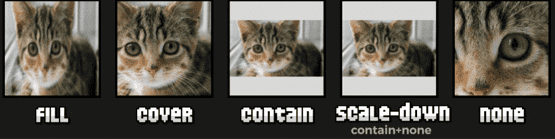

# Objetos en CSS

En CSS, se denominan objetos a imágenes a través de la etiqueta ``, elementos multimedia a través de `<video>` u otros elementos como `<textarea>` o `<input>`, por ejemplo. Dichos elementos tienen su propia forma de mostrarse en pantalla ya que tienen características ajenas a CSS.

### Propiedades para objetos

Existen algunas propiedades en CSS que nos permiten modificar ciertos aspectos de muchos de estos elementos, pudiendo darle estilo y adaptarlos.

|Propiedad|Valor|Significado|
|---------|---------|-----------|
|`object-fit`|`fill`  `contain`  `cover`  `none`  `scale-down`|Modo en que se adapta el elemento.|
|`object-position`|`percent` `percent`|Posición (x,y) del elemento.|
|`object-view-box`|`shape`|Región del elemento se visualizará.|

### Propiedad `object-fit`

La propiedad object-fit nos va a permitir cambiar el modo en el que se rellena o adapta una imagen `` (o cualquier otro objeto de representación externa a CSS) en su contenedor padre o en si mismo. Los valores que puede tomar dicha propiedad son los siguientes:

|Valor|Descripción|
|-----|-----------|
|`fill`|«Rellena» la imagen ocupando todo el espacio. Habitualmente, se produce un estiramiento de la imagen.|
|`cover`|Mantiene proporción, cubriendo lo máximo posible, sin que queden huecos sin cubrir. Suele ocultar partes.|
|`contain`|Mantiene proporción, conteniendo el máximo posible de la imagen. Suelen sobrar partes.|
|`none`|Mantiene el aspecto natural.|
|`scale-down`|Similar a contain, pero si la imagen es más pequeña, no la amplía.|

```html
<div class="parent">
  
  
  
  
  
</div>
```

```css
.parent {
  display: flex;
}
.item {
  margin: 10px;
  width: 150px;
  height: 150px;
  background: lightgrey;
}

.item-1 { object-fit: fill; } /* por defecto */
.item-2 { object-fit: cover; }
.item-3 { object-fit: contain; }
.item-4 { object-fit: scale-down; }
.item-5 { object-fit: none; }
```



Ejemplo rápido de una imágen responsive usando `aspect-ratio: 4 / 3;` con `object-fit: cover`.

```html
<div class="contenedor">
  
</div>
```

```css
.contenedor {
  width: 100%;
  max-width: 600px;
  margin: 0 auto;
}

.imagen-responsiva {
  width: 100%;
  /* 
  Proporciones más usadas:
    1:1 (aspect-ratio: 1 / 1): Cuadrados, avatares, tarjetas de productos, Instagram.

    4:3 (aspect-ratio: 4 / 3): Fotos tradicionales, TV antiguas, presentaciones.

    16:9 (aspect-ratio: 16 / 9): Videos HD, pantallas modernas, banners hero.
  */
  aspect-ratio: 4 / 3;
  object-fit: cover;
}
```

#### Tipos de `aspect-ratio`


### Propiedad `object-position`

Además, tenemos la propiedad `object-position` que nos sirve para utilizar junto a la propiedad `object-fit` y cambiar la posición donde aparece la imagen, especialmente cuando está recortada y sólo aparece un fragmento o parte de la imagen. La propiedad funciona de forma muy parecida a como lo hace la propiedad `background-position`:

|Valor|Descripción|
|-----|-----------|
|50% 50%|Por defecto, la imagen está centrada tanto en X como en Y.|
|`percent` `percent`|	Se puede indicar un porcentaje para colocarlo en el eje correspondiente.|

También se pueden indicar palabras clave como `top`, `left`, `righ`t, `bottom` o `center` para indicar en que zona quieres centrar la imagen, incluso, añadiendo un porcentaje tras ellos para ajustar más concretamente:

```html
<div class="container">
  
  
</div>
```

```css
.container {
  --size: 256px;

  display: flex;
  gap: 1rem;
}

img {
  width: var(--size);
  height: var(--size);
  object-fit: none;
}

.normal { object-position: 50% 50%; }
.positioned { object-position: left 50% top 0%; }
```


### Propiedad `object-view-box`

La propiedad `object-view-box` nos permite indicar al navegador la región visible de un elemento a visualizar, es decir, su `viewbox` (caja de visualización). Con esta herramienta a nuestra disposición, podremos mostrar sólo una parte de una imagen o video, o incluso hacer zoom con animaciones si activamos las transiciones.

Para ello, utilizaremos por ejemplo, la función `inset()` para determinar la región que recortaremos. Esta función trabaja exactamente de la misma forma que explicamos en el apartado recortes con clip-path.

```html
<div class="container">
  
</div>
```

```css
.container img {
  width: 256px;
  height: 256px;
  transition: all 0.5s;
  object-view-box: inset(0% 0% 0% 0%);
}

/* Al mover el ratón por encima... */
.container img:hover {
  object-view-box: inset(20% 20% 20% 20%);
}
```

Al pasar el puntero del ratón por encima hace zoom a la imágen.


---

Regresar al [README](../README.md)