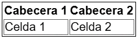
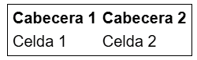
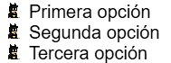
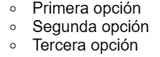

# Representacion de datos

---

- [Tablas](#tablas)
- [Listas](#listas)

---

### Tablas

Las tablas deben utilizarse para su finalidad: mostrar datos de forma organizada y legible. Para ello, recordemos que las tablas tienen varias etiquetas importantes.

| Etiqueta HTML | Descripción                                              |
|---------------|----------------------------------------------------------|
| `<table>`     | Etiqueta que contiene todo el contenido de la tabla.     |
| `<tr>`        | Representa una fila de una tabla.                       |
| `<th>`        | Representa la cabecera o título de una columna.         |
| `<td>`        | Representa una celda de una columna.                    |


Para dar estilo a la tabla o sus filas o columnas, podemos utilizar propiedades CSS genéricas que conocemos como `border`, `background`, `color`, `font-family`, `padding`, `margin`, entre otras. Sin embargo, también existen varias propiedades CSS específicas para alterar o modificar el comportamiento de ciertas características de una tabla HTML. Veamos cuales son esas propiedades:

| Propiedad         | Valor                | Significado                                                          |
|-------------------|----------------------|----------------------------------------------------------------------|
| border-collapse   | separate \ collapse  | Aplicado sobre la tabla, elimina el espacio de relleno entre celdas. |
| border-spacing    | 0 \ `size`           | Amplía el espacio de relleno entre tabla y celdas.                   |
| caption-side      | top \ bottom         | Mueve el elemento `<caption>` del interior de una tabla.             |
| empty-cells       | show \ hide          | Hace desaparecer visualmente una celda vacía (sin contenido).        |
| table-layout      | auto \ fixed         | Indica si las celdas deben ajustarse o tener un tamaño fijo.         |


#### Propiedad `border-collapse`

La propiedad `border-collapse` permite especificar si los bordes de una tabla y sus celdas deben estar unidos (valor collapse) o separados (valor separate). El valor por defecto de esta propiedad es separate.


```html
<table>
  <tr>
    <th>Cabecera 1</th>
    <th>Cabecera 2</th>
  </tr>
  <tr>
    <td>Celda 1</td>
    <td>Celda 2</td>
  </tr>
</table>
```

```css
table {
  border: 1px solid #000;
  border-collapse: separate;
}

td {
  border: 1px solid #555;
}
```




#### Propiedad `border-spacing`

En el caso que la propiedad anterior border-collapse esté establecida a separate, se puede también aplicar la propiedad `border-spacing`, que especifica el tamaño que medirán los espacios exteriores entre celdas.


```html
<table>
  <tr>
    <th>Cabecera 1</th>
    <th>Cabecera 2</th>
  </tr>
  <tr>
    <td>Celda 1</td>
    <td>Celda 2</td>
  </tr>
</table>
```

```css
table {
  border: 1px solid #000;
  border-collapse: separate;
  border-spacing: 5px;
}
```




#### Propiedad  `caption-side`

La propiedad caption-side permite especificar donde se colocará el título o leyenda de la tabla. Este título o leyenda se crea dentro de una etiqueta `<table>`, mediante la etiqueta `<caption>`. Por defecto, esta leyenda aparece en la parte superior de la tabla, sin embargo, utilizando el valor bottom, podemos ubicarla en la parte inferior de la tabla, aunque esté colocado en otra zona.

#### Propiedad `empty-cells`

La propiedad empty-cells se puede utilizar en una tabla para establecer si se debe mostrar o no una celda que no tiene contenido textual en su interior, es decir, si una etiqueta `<td>` o `<th>` sin contenido, debería mostrar sus bordes o simplemente ocultarlos. Por defecto, siempre se mostrarán (valor show), sin embargo, podemos utilizar el valor hide para ocultarlo en ese caso.

#### Propiedad  `table-layout`

Por último, disponemos de una propiedad denominada table-layout. Esta propiedad permite especificar si el navegador debería crear una versión de la tabla en la que se adapte el tamaño de las celdas automáticamente (valor auto) o, por el contrario, queremos que establezca un tamaño fijo (valor fixed).

En la mayoría de los casos, no necesitamos esta propiedad, pero podría ser especialmente útil cuando queremos que las tablas tengan un tamaño muy específico al generarse.


### Listas

Al crear listas HTML mediante las etiquetas `<ol>` o `<ul>`, dichas etiquetas poseen propiedades CSS específicas para alterar el estilo o características de las marcas o viñetas que se crean a la izquierda de los items de la lista, mediante la etiqueta HTML `<li>`.


Por ejemplo, a continuación tenemos las propiedades principales de las listas:


| Propiedad           | Valor                          | Significado                                              |
|---------------------|--------------------------------|----------------------------------------------------------|
| `list-style-image`    | none \ url(image.png)         | Indica una imagen para usar como viñeta de ítem.        |
| `list-style-position` | inside \ outside              | Establece o elimina indentación de ítems sobre la lista. |
| `list-style-type`     | disc \ decimal \ type \ none | Establece el tipo de viñeta que se va a utilizar.        |


#### Propiedad `list-style-image`

A través de la propiedad `list-style-image` podemos indicar la URL de una imagen para utilizarla a modo de icono o viñeta en cada ítem de la lista, es decir, en cada ítem `<li>`. Esta propiedad, por defecto, tiene el valor none, o lo que es lo mismo, no establece ninguna imagen por cada ítem de la lista.


```html
<ul>
  <li>Primera opción</li>
  <li>Segunda opción</li>
  <li>Tercera opción</li>
</ul>
```

```css
li {
  list-style-image: url("https://manz.dev/assets/stickers/batmanz.png");
}
```




#### Propiedad `list-style-position`

Por otro lado, la propiedad `list-style-position` permite establecer una indentación a todos los ítems de la lista, estableciendolos desplazados a la derecha (inside), el lado interior de la lista, o sin desplazar (outside), el lado exterior de la lista, opción por defecto.


```html
<ul>
  <li>Primera opción</li>
  <li>Segunda opción</li>
  <li>Tercera opción</li>
</ul>
```

```css
ul {
  list-style-image: url("https://manz.dev/assets/stickers/batmanz.png");
  list-style-position: inside;
}
```


#### Propiedad `list-style-type`

La tercera propiedad, `list-style-type` nos permite indicar que tipo de viñetas tendrán las listas (en el caso de no estar utilizando ningun imagen). Se establecen varios grupos que veremos en el siguiente apartado. Cada uno de ellos se puede utilizar con cualquier tipo de lista, pero generalmente, se recomienda tener en cuenta el tipo de lista. Por ejemplo, si tenemos una lista `<ul>` (no ordenada), aunque es posible, quizás una viñeta numerada no tenga mucho sentido.

Por defecto, las listas `<ul>` (no numeradas) utilizan la opción disc por defecto, mientras que las listas `<ol>` (numeradas) utilizan la opción decimal por defecto, mostrando una lista numérica decimal.

#### Listas con símbolos

Este primer grupo, especialmente indicado para listas sin orden `<ul>`, por ejemplo, donde se utilizará un símbolo como viñeta que no representa ningún orden específico:


Si lo que queremos es establecer una lista numerada `<ol>`, los valores recomendados deberían ser uno de los siguientes:


Al utilizar listas, puedes utilizar el pseudoelemento `::marker` para hacer referencia a la viñeta en cuestión. De esta forma, podrás cambiar los estilos de dicha viñeta o retocarlos.

```html
<ul>
  <li>Primera opción</li>
  <li>Segunda opción</li>
  <li>Tercera opción</li>
</ul>
```

```css
ul {
  list-style-type: upper-roman;
}

li::marker {
  color: red;
}
```


#### Atajo: Propiedad `list-style`

Como en la mayoría de propiedades de CSS, existe una propiedad "shorthand" de atajo que nos permite indicar los valores anteriores en una sola propiedad. Para ello, utilizaremos `list-style` con el orden aconsejado siguiente:

```html
<ul>
  <li>Primera opción</li>
  <li>Segunda opción</li>
  <li>Tercera opción</li>
</ul>
```

```css
li {
    /* list-style: <type> <position> <image> */
    list-style: circle inside none;
}
```



---
