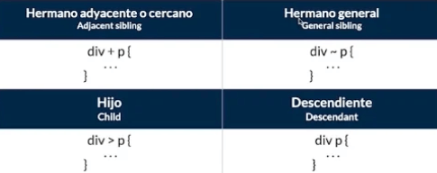
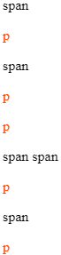
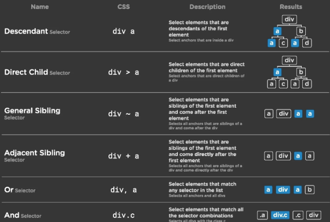

# Selectores combinados 

---

- [Hermano adyacente o cercano +](#hermano-adyacente-o-cercano)
- [Hermano general ~](#hermano-general)
- [Hijo directo >](#hijo-directo)
- [Descendiente](#descendiente)
- [Combinadores lógicos](#combinadores-logicos)

---

Los selectores combinados nos permiten usar múltiples selectores y crear una mayor especificidad.



### Hermano adyacente o cercano

Aplica estilos solo a los elementos `<span>` que esten inmediatamente despúes del elemento `<p>`.

```html
<span>span</span>

<p>p</p>

<span>span</span> <!-- rojo -->

<p>p</p>

<footer>
  <p>p</p>
  <span>span</span> <!-- rojo -->
  <span>span</span>
  <p>p</p>
</footer>

<p>p</p>
```

```css
p + span {
  color: red;
}
```


```css
div.post span + span {
  background-color: gold;
}
```


### Hermano general

Aplica estilos a todos los elementos `<span>` que este despúes del elemento `<p>`.

```html
<span>span</span>

<p>p</p>

<span>span</span> <!-- azul -->

<p>p</p>

<footer>
  <p>p</p>
  <span>span</span> <!-- azul -->
  <span>span</span> <!-- azul -->
  <p>p</p>
</footer>

<span>span</span> <!-- azul -->

<p>p</p>
```

```css
p ~ span {
  color: blue;
}
```


```css
div.post strong ~ strong {
  background-color: gold;
}
```


### Hijo directo

Aplica estilos a todos elementos `<p>` que son hijos directo del elemento `<article>`.

```html
<article>

  <span>span</span>

  <p>p</p> <!-- verde -->

  <span>span</span>

  <p>p</p> <!-- verde -->

  <footer>
    <p>p</p>
    <span>span</span>
    <span>span</span>
    <p>p</p>
  </footer>

  <span>span</span>

  <p>p</p> <!-- verde -->

</article>
```

```css
article > p {
  color: green;
}
```


```css
#page > div {
  background-color: gold;
}
```


### Descendiente

Aplica estilos a todos los elementos `<p>` que esten dentro del elemento `<article>`.

```html
<article>

  <span>span</span>

  <p>p</p> <!-- naranja -->

  <span>span</span>

  <p>p</p> <!-- naranja -->

  <footer>
    <p>p</p> <!-- naranja -->
    <span>span</span>
    <span>span</span>
    <p>p</p> <!-- naranja -->
  </footer>

  <span>span</span>

  <p>p</p> <!-- naranja -->

</article>
```

```css
article p {
  color: orangered;
}
```



```css
div#page div {
  background-color: gold;
}
```


### Combinadores logicos

En ciertas situaciones, es posible que queramos crear grupos con diferentes selectores con el objetivo de escribir menos código, o reutilizar bloques de código CSS en más situaciones, de forma que sean más potentes y flexibles.

La forma más sencilla de conseguir esto, es crear agrupaciones con diferentes selectores separando por **comas**.

#### Agrupación de selectores

Imagina una situación en la que varios bloques de código CSS contienen las mismas propiedades con los mismos valores. Generalmente, escribir cada bloque de forma individual no es apropiado, ya que duplica un código que es exactamente igual:

```css
.container-logo {
  border-color: red;
  background: white;
}

.container-alert {
  border-color: red;
  background: white;
}

.container-warning {
  border-color: red;
  background: white;
}
```

Si esto ocurre a menudo, el tamaño del documento CSS será más grande y tardará más en descargarse. Una buena práctica para evitarlo es ahorrar texto y simplificar nuestro documento CSS lo máximo posible, por lo que podemos hacer uso de la agrupación CSS utilizando el símbolo de la coma.

```css
.container-logo, .container-alert, .container-warning {
  border-color: white;
  background: red;
}
```

>**Nota:** Existen más tipos de combinadores lógicos, pero estos entra en la categoría de `:pseudoclases` que veremos más adelante.

### Resumen de los selectores combinados



---
